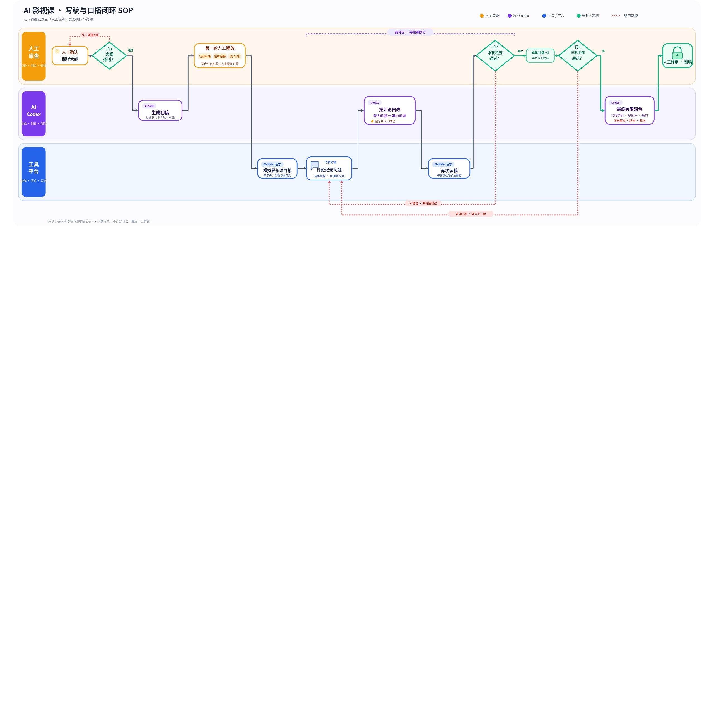

> 来源：[飞书原文](https://hcnbsg6ttb3t.feishu.cn/docx/RWqPdzqjnoeIKwx1HIKctPPwnqg)  
> 同步时间：2026-08-16T09:01:04.604Z  
> 文档标识：RWqPdzqjnoeIKwx1HIKctPPwnqg

# LibTV × 罗永浩「AI 影视课」写稿与口播脚本 SOP（V1.1）

> **提示**
>
这份文档按实际执行顺序编写。执行层完成每一步并交付结果，黄白负责判断是否通过，杨成佳、张燕峰负责最终审稿。

# 一、负责人分工

| 层级 | 负责人 | 具体负责什么 | 需要留下什么 |
|-|-|-|-|
| **终审层** | 杨成佳、张燕峰等 | 审最终稿；确认内容可以交付；遇到重大问题，决定退回哪个节点重做 | 最终通过或退回意见 |
| **判断层** | 黄白 | 确认大纲；判断功能、逻辑和口播是否通过；决定评论怎么改；确认三轮审稿结果 | 修改方向、每轮通过记录 |
| **执行层** | 张洋港、何奇泽、王暖晴、刘正源 | 整理资料、运行 AI、检查功能、修改初稿、生成试听、按评论回改、维护版本 | 脚本文档、试听音频、评论回复、版本号 |

## 协作方式

- 执行层遇到事实不确定、意见冲突或不知道怎么改时，直接交给黄白判断，不自行猜。
- 黄白每次给出“通过”或“退回”，同时写清需要修改的节点。
- 只有最终稿才交给杨成佳、张燕峰；中间稿不占用终审层时间。
- 终审提出功能、结构或案例方面的大改时，必须退回对应节点，并重新生成试听。

# 二、总体流程图

# 三、步骤 1：确认课程大纲

## 负责人

**执行：**张洋港、何奇泽、王暖晴、刘正源。**判断：**黄白。

## 具体怎么做

1. 把课程大纲放进该节课的飞书主文档。
2. 补齐五项信息：这节课讲什么、给谁讲、演示哪些 LibTV 功能、使用什么案例、预计多长时间。
3. 把相关 LibTV 官方文档链接放在大纲下面；涉及具体功能时，执行层先打开当前产品或用 LibTV CLI 确认功能确实存在。
4. 不确定的地方统一标注【待确认】，集中交给黄白判断。
5. 黄白确认后，在大纲顶部写“已确认”、确认人和日期。

## 要注意

- 大纲没确认之前，不开始写完整脚本。
- 大纲中的功能名称、按钮名称和操作结果不能靠记忆填写。
- 如果官方文档和当前产品不一致，保留截图或操作记录，交给黄白决定用哪个口径。

## 工具与 Skill 状态

- **已完成：**LibTV CLI Skill，可用于画布、项目、节点、模型和素材的命令侧操作与核验。
- **待办：**课程大纲检查 Skill。

## 本节点交付

《已确认课程大纲》＋官方资料链接＋待确认问题的处理结果。

---

# 四、步骤 2：用 AI 写出初稿

## 负责人

**执行：**张洋港、何奇泽、王暖晴、刘正源。

## 具体怎么做

1. 准备四类输入：已确认大纲、LibTV 官方资料、已经优化过的优秀脚本、正式写作规范。
2. 让 AI 先按大纲列出每一段要解决的问题，再生成完整口播稿。
3. 初稿至少分成三部分：口播正文、画面或操作注释、待人工核实的问题。
4. 可以使用“先给案例—再讲操作—解释为什么—最后总结”的教学方法，但不要复制影视飓风的句子、个人表达和大纲结构。
5. 生成后先检查大纲中的必讲点有没有遗漏，再交给下一步。

## 要注意

- AI 不知道的功能必须写【待核实】，不能补成确定事实。
- 竞对原稿不要整篇放进写稿上下文，只放已经整理好的通用讲解方法。
- 资料说明和来源不要混入口播正文。

## 工具与 Skill 状态

- **工具可用：**Codex。
- **待办：**AI 影视课写稿 Skill、LibTV 官方文档知识库、优秀脚本检索模块、正式写作规范模块。

## 本节点交付

《脚本 V0.1》＋操作注释＋待核实问题清单。

---

# 五、步骤 3：第一轮人工精改

## 负责人

**执行：**张洋港、何奇泽、王暖晴、刘正源。**判断：**黄白。

## 具体怎么做

1. **先查功能：**按照脚本从头操作一遍，核对入口、按钮、顺序、结果和限制。发现不一致，直接改稿并留下依据。
2. **再查逻辑：**检查每一步是否承接上一步，前置条件有没有先说明，案例和总结是否讲的是同一个问题。
3. **最后去 AI 味：**删除无用开场、重复总结、过度排比和生硬转折；重点检查“不是……而是……”“不仅……更……”等机械表达。
4. 把长句拆成能自然读完的短句；产品名和专业词全篇保持同一种叫法。
5. 黄白查看修改后的稿件，给出“进入试听”或“继续修改”。

## 要注意

- 功能错误优先于文风问题。操作不对时，不先花时间改漂亮句子。
- 执行层需要直接修改明显问题，不把未经判断的整篇初稿原样交给黄白。
- 仍然存在【待核实】的问题时，不能进入试听。

## 工具与 Skill 状态

- **已完成：**LibTV CLI Skill，可辅助复现和核验部分 LibTV 操作。
- **待办：**功能准确性检查 Skill、脚本逻辑检查 Skill、去 AI 味检查 Skill。

## 本节点交付

《脚本 V1.0》；功能问题已核实；黄白确认可以进入试听。

---

# 六、步骤 4：生成 AI 试听并在飞书批注

## 负责人

**执行：**张洋港、何奇泽、王暖晴、刘正源。**判断：**黄白处理疑难问题。

## 具体怎么做

1. 确认当前文字版本号，用 MiniMax 模拟罗永浩语气生成试听。
2. 试听文件名写清课程、章节、脚本版本和轮次，例如：课程01_第03节_脚本V1.0_试听R1。
3. 执行层完整听一遍，不能只听修改过的片段。
4. 问题直接评论在对应句子上，统一使用【功能】【逻辑】【口播】【AI 味】四种标签。
5. 一条评论只写一个问题，并写清“哪里有问题、为什么、希望怎么改”。

## 要注意

- 文字修改后必须重新生成音频，旧音频不能代表新稿。
- 语音模拟只能帮助发现口播问题，不能证明脚本内容是对的。
- 模拟音频仅供内部审稿，按授权范围使用，不对外发布。

## 工具与 Skill 状态

- **现有工具：**MiniMax 语音模型、飞书评论。
- **待办：**MiniMax 自动读稿模块、文字版本与音频版本绑定模块、评论分类 Skill。

## 本节点交付

当前脚本对应的试听音频＋飞书中的完整批注。

---

# 七、步骤 5：用 Codex 按评论修改

## 负责人

**执行：**张洋港、何奇泽、王暖晴、刘正源。**判断：**黄白处理冲突评论和重要取舍。

## 具体怎么做

1. 先把飞书评论汇总给 Codex，重复评论合并处理。
2. 先改功能、事实、整段逻辑和案例问题；这些问题稳定后，再改口播、措辞和标点。
3. 每条评论都要回复：改了什么；如果没改，要写清原因。
4. 评论互相冲突或信息不足时，交给黄白判断，不让 Codex 自己选。
5. 修改完成后由执行层人工通读，确认没有因为局部修改造成上下文不连贯。

## 要注意

- 不要让 Codex 在没有评论和修改边界的情况下重写整篇。
- 评论提出者或黄白确认问题解决后，再关闭评论。
- 修改过正文后，必须回到步骤 4 重新生成试听。

## 工具与 Skill 状态

- **工具可用：**Codex、飞书评论。
- **待办：**飞书评论读取与回改 Skill、评论冲突检查模块。

## 本节点交付

修改后的新版本脚本＋评论回复＋尚未解决的问题清单。

---

# 八、步骤 6：完成第二轮、第三轮试听与审稿

## 负责人

**执行：**张洋港、何奇泽、王暖晴、刘正源。**每轮判断：**黄白。

## 每轮固定动作

1. 用当前文字版本重新生成试听。
2. 执行层完整听稿并在飞书评论。
3. Codex 先改大问题，再改小问题。
4. 执行层做最后的人工微调。
5. 黄白确认本轮“通过”或“退回”，并写明轮次和版本号。

## 轮次怎么计算

- 必须有当前文字版本、对应试听、完整听审、评论处理和黄白的通过记录，才算完成一轮。
- 只看文字、只听局部、复用旧音频，都不算一轮。
- 三轮均通过后，才能进入最终润色。

## 工具与 Skill 状态

- **工具可用：**Codex、MiniMax、飞书评论。
- **待办：**三轮审稿记录模板、文字与试听版本自动校验模块。

## 本节点交付

三轮通过的脚本版本＋三份对应试听＋三条黄白通过记录。

---

# 九、步骤 7：最终润色、终审与锁稿

## 负责人

**执行：**张洋港、何奇泽、王暖晴、刘正源。**润色范围确认：**黄白。**最终审稿：**杨成佳、张燕峰。

## 具体怎么做

1. 三轮通过后，把脚本交给 Codex 做最后一次润色。
2. 只允许修正错别字、语病、病句和不改变原意的轻微口语问题。
3. 输出修改清单，逐条写原句、改后句和修改原因。
4. 黄白检查是否有事实、结构、案例、数据、操作步骤或观点变化；有任何越界修改就撤回或退回前面的节点。
5. 对润色后的版本再生成一次最终试听。
6. 杨成佳、张燕峰审最终文字和试听，给出通过或退回意见。

## 要注意

- 最终润色阶段不再为了“更像罗永浩”加入新口头禅、段子、案例或观点。
- 终审提出功能或结构大改时，退回步骤 3 或更早节点，改完后重新试听。
- 终审通过后锁定版本；后续再改必须升版本号。

## 工具与 Skill 状态

- **工具可用：**Codex、MiniMax、飞书文档。
- **待办：**罗永浩风格插件、终稿差异检查 Skill。

## 本节点交付

最终文字稿＋最终试听＋修改清单＋杨成佳、张燕峰的终审结论。

---

# 十、Skill 建设状态与待办

| Skill / 模块 | 状态 | 对应节点 | 完成后要能做什么 |
|-|-|-|-|
| **LibTV CLI Skill** | **已完成** | 步骤 1、步骤 3 | 操作画布、项目、节点、模型和素材，辅助复现与核验 |
| **LibTV 官方文档知识库** | **待办** | 步骤 1、步骤 2、步骤 3 | 检索最新功能说明，并返回来源和适用版本 |
| **AI 影视课写稿 Skill** | **待办** | 步骤 2 | 根据确认大纲生成正文、操作注释和待核实清单 |
| **功能、逻辑、去 AI 味检查** | **待办** | 步骤 3 | 分开检查功能事实、课程逻辑和机械表达 |
| **MiniMax 自动读稿模块** | **待办** | 步骤 4、步骤 6、步骤 7 | 按文字版本生成试听并自动命名、登记 |
| **飞书评论回改 Skill** | **待办** | 步骤 5 | 读取评论、分类、调用 Codex 修改并回复处理结果 |
| **罗永浩风格插件** | **待办** | 步骤 7 | 在不改事实和结构的前提下处理个人表达习惯 |
| **终稿差异检查 Skill** | **待办** | 步骤 7 | 拦截事实、结构、案例、数据和步骤的越界变化 |

## 本地素材清单

- [飞书画板](./assets/Njd8wAaNHhOQjtbIDoCcS8pDnQh.jpg)（whiteboard，179440 字节）
