> 来源：[飞书原文](https://resonate.feishu.cn/wiki/Loxfw6XHziYRk0kKzdjcFfp9nhb)  
> 同步时间：2026-08-16T09:01:04.604Z  
> 文档标识：IZk9dLx0goM05zxabfPcfyMCnZe

# LibTV使用指南

> **提示**
>
<b>LibTV 官网直达：</b><b>https://www.liblib.tv/</b><b>（推荐使用Chrome/Edge浏览器，更稳定）</b>

<b>LibTV CLI直达：</b><b>https://www.liblib.tv/cli</b>

<b>最新CLI指南：</b><b>[LibTV CLI 使用指南](https://resonate.feishu.cn/wiki/RjelwT2UoidnTMka2nCc2chGnud)</b>

> **提示**
>
**最新功能直达：**
**1、**[**人像质感调节**](https://resonate.feishu.cn/wiki/Loxfw6XHziYRk0kKzdjcFfp9nhb#share-GDjzdkpnXoWR3SxeOrxcvzWvn3f)**&**[**情绪调节**](https://resonate.feishu.cn/wiki/Loxfw6XHziYRk0kKzdjcFfp9nhb#share-LYKjdvBvUos2y9xbXjRcNKZkn7b)
**2、**[**故事板**](https://resonate.feishu.cn/wiki/Loxfw6XHziYRk0kKzdjcFfp9nhb#share-CNd8dB3CooqebIxyuNscMc3Onbe)
**3、**[**导演台**](https://resonate.feishu.cn/wiki/Loxfw6XHziYRk0kKzdjcFfp9nhb?contentTheme=DARK&last_doc_message_id=7643755893938638037&preview_comment_id=7643756057088658618&sourceType=feed&theme=light#share-C1uWdwrWvo3ksmxzxlhc0KcBnef)

## **📌 更新公告：**

> 飞书内嵌内容，请在来源文档中查看。

欢迎使用 **LibTV**！

LibTV 是 LiblibAI 推出的**首款专业 AI 视频创作产品**，也是目前**唯一一个同时为人类创作者和 Agent 设计的视频创作系统**。

作为一款诞生在 2026 年的产品，LibTV 理所当然地拥有两个同样重要的入口：

- **对创作者来说**，它是一套专业的视频创作工具，足以容纳整个 AI 视频创作流程，你可以在无限画布上搭建剧本、分镜、镜头和剪辑流程，像排练电影一样组织整个创作项目。
- **对于 Agent 来说**，它是很多打包好的、可以直接调用的专业创作能力，通过 Skill 接口理解任务、调用模型、编排工作流并自动完成创作。

是的，**你和你的 Agent 现在都可以 solo filming 了！**

> 飞书内嵌内容，请在来源文档中查看。

## 📖 指南目录（点击标题可直接跳转到对应内容）

> 飞书内嵌内容，请在来源文档中查看。

## 无限画布

### 新建画布

- 进入LibTV首页，在【最新项目】中点击「开始创作」，进入无限画布操作界面
- 【全部项目】入口

  1. 官方首页-最近项目-右侧「全部项目」图标
  2. 项目画布-左上角项目菜单栏-「全部项目」

### 五大基础节点 🔥

无限画布是我们创作的主战场，我们可以进行：

- **新建节点：**支持**文本、图片、视频、音频、脚本** 5 种基本节点
- **节点编辑：**对节点进行修改、删除、复用，以及不同节点的联系

#### 新建节点

**在画布空白处双击**，即可快速新建节点。

- 目前 LibTV 支持 **文本、图片、视频、音频、脚本** 5 种基本节点
- 我们可以直接将图片、视频、音频文件拖入画布

  

#### 文本节点 📝

**功能：用于承载、展示文本信息，来源可以是用户手动输入、模型生成**

**两种不同的文本输入方式**

**1️⃣ 手动输入**：选择「自己编写内容」，然后在节点框内手动输入或粘贴文本内容

2️⃣ **语言大模型生成**：

- 文本生成器接入了三大顶尖**大语言模型**，我们可以**输入自然语言需求或结构化提示词**，让语言模型完成对应的文本生成任务，
- 生成结果会展示在「**文本节点框**」中

[附件：文本模型3.mp4.MP4](./assets/OqMcbLigGowxEgx1uf8cq28RnWe.mp4)

#### 图片节点 🖼️

**功能**：用于承载、展示单张图片，来源可以是用户上传、图像模型生成。

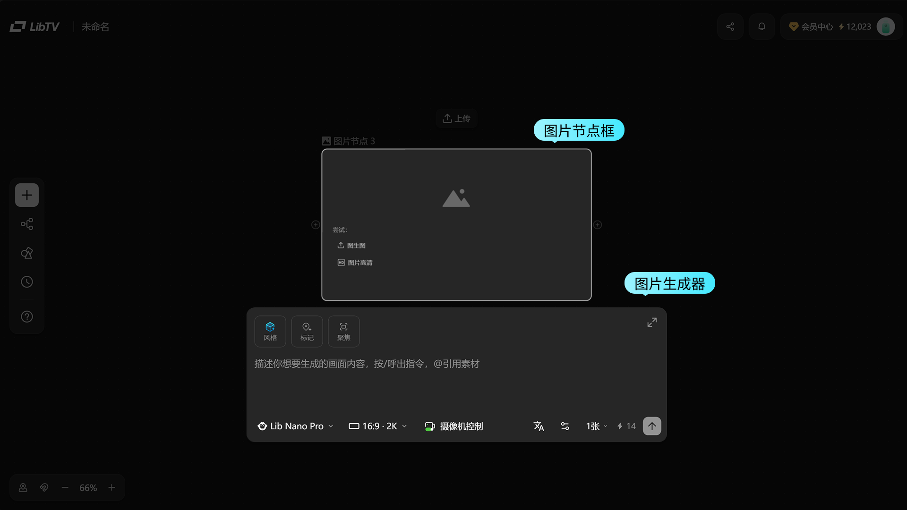

**两种不同的图片输入方式：**

1️⃣ **用户直接上传：**可以直接从画布外拖入图像，或者在画布空白处点击鼠标右键，选择「上传」

**2️⃣ 图像模型生成**：

- 图片生成器中接入了**全能图片模型V2、Seedream5.0/4.5、Qwen image、Z image** 等大模型
- 支持各种文生、图生、多图参考融合、图像编辑任务
- 生成结果会展示在**「图片节点框」**中

[附件：文生图 .mp4.MP4](./assets/WtPebVGyComJd6x3OHccDkE3npg.mp4)

#### 视频节点 🎥

**功能**：用于承载、展示单个视频，来源可以是用户上传、视频模型生成。

**两种不同的视频输入方式：**

1️⃣ **用户直接上传**：可以直接从画布外拖入视频，或者在画布空白处点击鼠标右键选择「上传」。

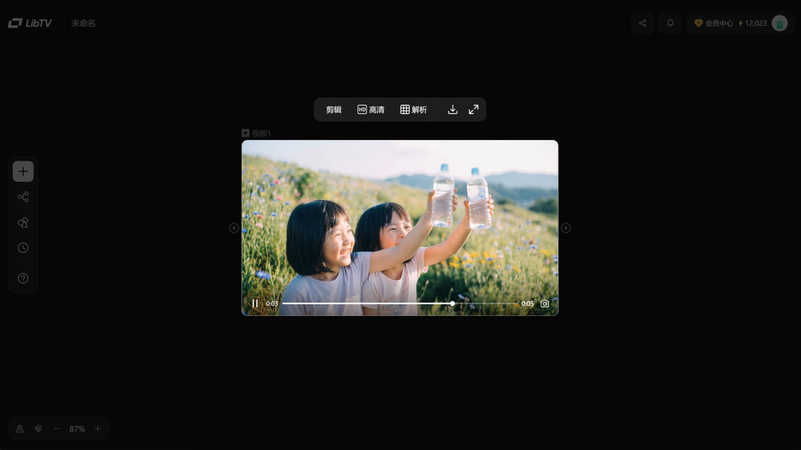

 2️⃣ **视频模型生成：**

- 视频生成器中接入了 **可灵 3.0 & O3、Wan 2.6、Shot V2 ☁️、Video 3.1🍌** 等顶级视频模型
- 支持各种文生、图生、首尾帧、**多模态参考生成视频**，以及视频编辑、视频延展等操作
- 生成结果会展示在**「视频节点框」**中

[附件：一图生视频.mp4.MP4](./assets/YU5wbufd9od2fexeYj4coVP2nHc.mp4)

[附件：两图生视频.mp4](./assets/Lr7tbMaA6oIS6gxPZLUcr0GqnPe.mp4)

#### 音频节点 🎵

**功能**：用于承载、展示单个音频，来源可以是用户上传、音频模型生成。

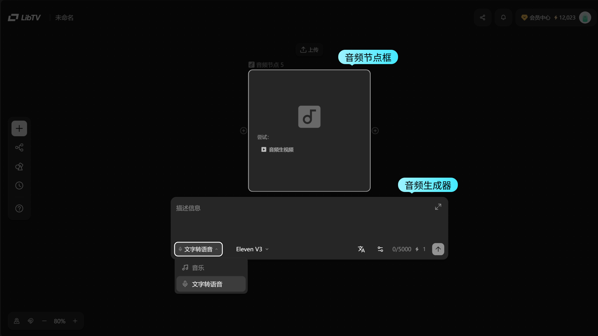

**两种不同的音频输入方式：**

1️⃣ **用户直接上传**：可以直接从画布外拖入音频，或者在画布空白处点击鼠标右键，选择「上传」

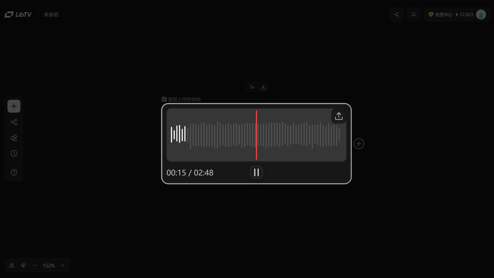

**2️⃣ 音频模型生成：**

- 支持文本生成生成音乐、音效，以及文字转语音

[附件：音频模型.MP4](./assets/SuZ0bRIdNomS8oxkroKc0dbhnZf.mp4)

#### 脚本节点 🎬

##### 🚩脚本功能全新升级

- **功能概述：从“基础脚本工具”升级到“分镜故事板脚本工具”。**

  - 新版脚本不只是把剧本拆成表格，而是把剧本拆解、剧本资产管理、分镜头调整、提示词合成、批量生图、批量生视频串成一条完整流程。
  - 适合流水漫、AI 短剧、动画短片、故事分镜等内容创作场景，可以更快完成：剧本拆解 → 角色/场景/道具资产提取 → 分镜脚本调整 → 批量生成分镜图 → 批量生成视频片段。

- 对比脚本旧版 解决的问题

针对收集的用户问题，新版脚本方案围绕四个关键词展开：**资产化、可编辑、可批量、灵活修改**

- **资产化**：将脚本从“纯文本表格”升级为“内容 + 资产”结构，风格、角色、场景、道具等资产与脚本绑定并可被提示词引用；
- **可编辑**：脚本的每一行、每一个字段、每一个资产都可以被用户修改，修改后能同步更新对应的提示词；脚本中的分镜支持新增、删除、调整顺序。
- **可批量**：用户可批量执行分镜图和分镜视频的生成。可自由选择生成范围（单个/部分/全部）、生成类型（批量生图、批量生视频）、以及批量执行的模型类型。
- **灵活修改：**新版脚本可以在批量生成前直接补充和调整，用户可在真正批量生图、生视频前，把角色、场景、提示词、参考图都修改补充到比较稳的状态，再进入生产。

- 三、使用方式功能介绍

  - **第 1 步：添加脚本节点**
  
    - **可通过两种方式**添加脚本节点：
    
      - 第一种，双击画布，或者打开底部的 “+”，选择「脚本 new」。
      - 第二种，先把剧本文本输入到一个文本节点里，再从文本节点拉出一条线，选择「脚本 new」。
    - 脚本节点的**前置输入**可以是一段**剧本文本**，也可以同时接入一些**参考图**，比如角色图、场景图、风格图等。
    
      - 如果只是想快速拆分镜，输入剧本文本就可以开始。
      - 如果希望后续生成的角色、画风、场景更稳定，建议在一开始就把关键参考图接进去，这样脚本节点在拆解时也可以更好地理解整体风格和角色设定。

- **第 2 步：开始生成**

将文本、图片节点与脚本节点连接后**，**或者直接在脚本节点的生成器输入框内输入剧本内容，选择合适的脚本拆解模型，**点击生成。**

- **模型的选择**：推荐优先选择CVLM5.5 或 GVLM 3.1 
- 生成后，脚本节点会自动完成几件事：

  -  把剧本文本拆成结构化 shot； 
  -  提取关键角色、场景、道具； 
  -  整理每个 shot 对应的画面信息； 
  -  为后续生图、生视频准备基础提示词。 

这一步相当于先把一段完整剧本拆成一份可编辑的分镜故事板。

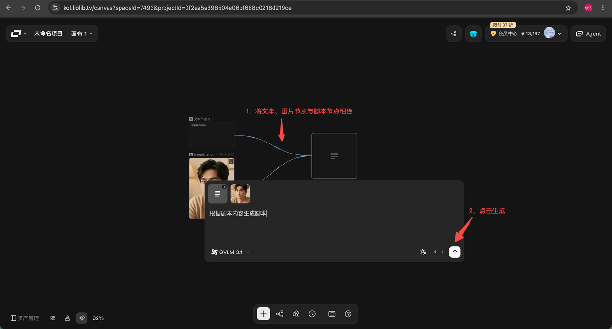

- **第 3 步：编辑脚本节点**

**这一步是后续生成是否准确的关键。**

脚本节点生成出来后，**不建议直接批量生图/视频**。更好的方式是先检查 shot 信息，管理好角色、场景、道具等资产，再进入后面的批量生成。

因为后续所有分镜图和视频片段，都会基于这里的信息继续生成。如果这里的角色描述不准、场景不清楚、镜头动作太弱，后面批量生成就会把这些问题放大。

<table><colgroup><col/><col/></colgroup><tbody><tr><td>生成脚本</td><td>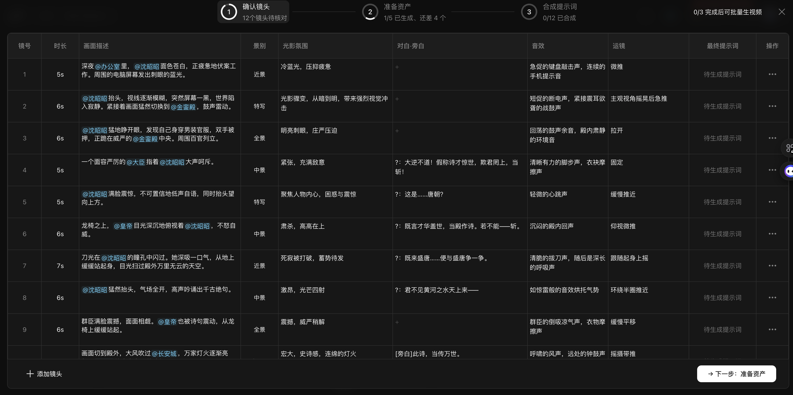<ol><li seq="1">在脚本中需要先后完成三件事情，顶部工具栏也有提示：确认镜头信息，整理资产，合成最终提示词。</li><li>只有把这三件事情都完成以后，才能进行下一步。</li></ol></td></tr><tr><td>编辑shot信息</td><td>

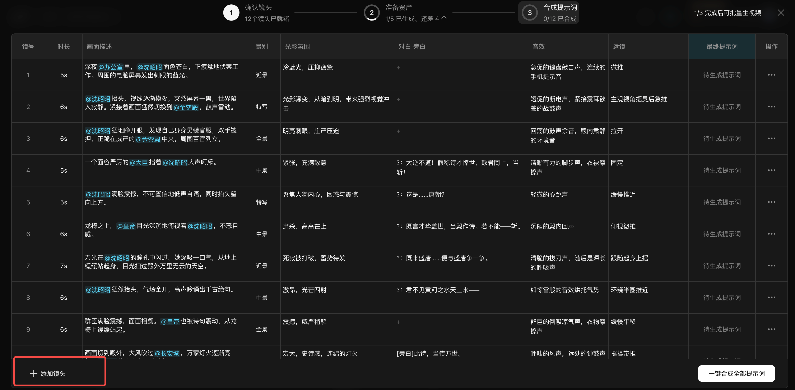

<ol><li seq="1">每个单元格都可以直接编辑。<ol><li seq="1">可以修改角色动作、镜头景别、人物状态、画面氛围、对白/旁白、提示词等内容。</li><li>如果要使用资产卡片中的角色、场景、道具，可以直接@进行唤起，这样在后续的生成中，会自动识别资产卡片，并自动连线。</li></ol></li><li>支持的整行操作包括：<ol><li seq="1"> 调整顺序：可以根据故事节奏重新排列 shot，不需要重新生成整份脚本。 </li><li> 新增 shot： 如果发现某段剧情转场太快，可以手动补一个过渡镜头。 </li><li> 删除 shot： 如果某些镜头重复、无效，或者不打算生成，可以直接删除。 </li><li> 标记颜色
可以把同一个场景、同一组剧情、同一类镜头标成同一种颜色，方便管理。 比如把“客厅场景”的 shot 标成一种颜色，把“街道追逐”的 shot 标成另一种颜色，后续检查时会更直观。
</li></ol></li></ol></td></tr><tr><td>编辑角色/场景图</td><td>

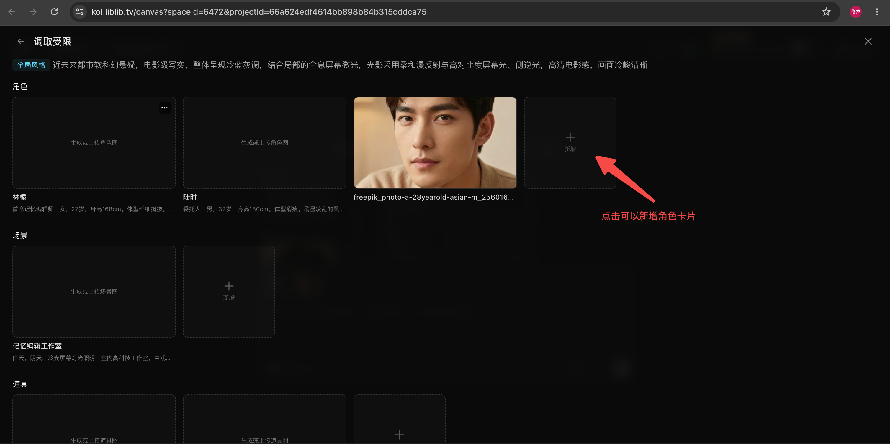

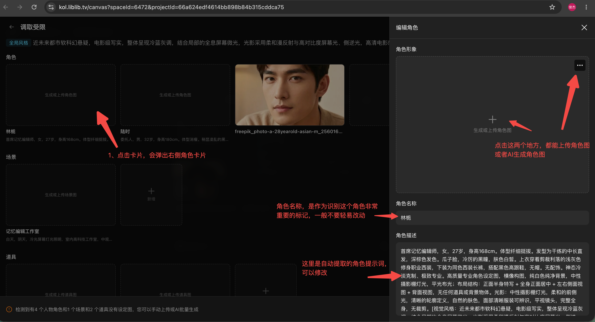

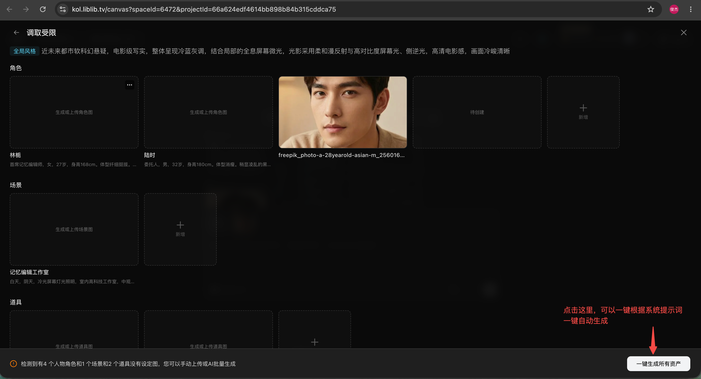

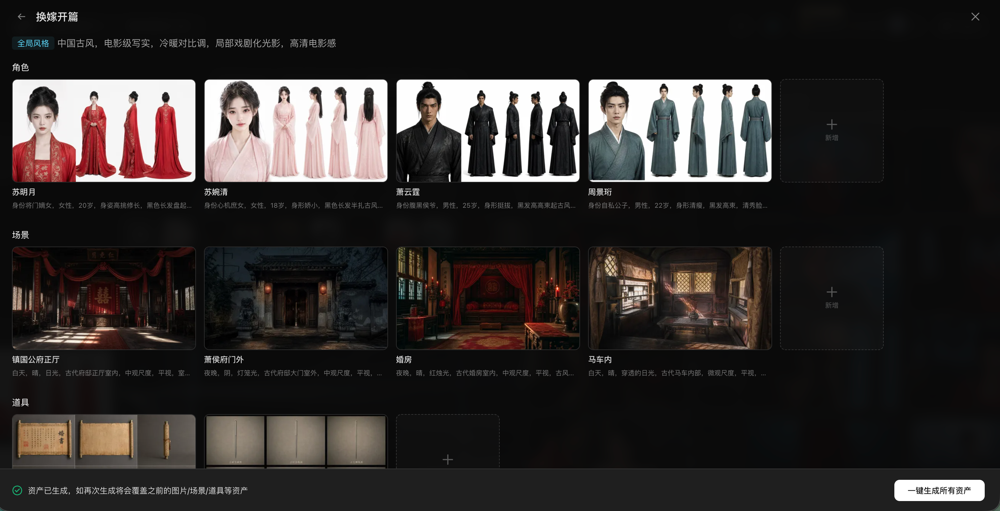

<ol><li seq="1">点击对应的资产卡片，在右侧会弹出一个卡片抽屉。可以在卡片抽屉中进行资产的管理。</li><li>角色、场景、道具生成：<ol><li seq="1">若未上传任何参考图，脚本会自动根据剧本抽取出主要角色，并将生成角色的提示词准备好。可直接使用准备好的提示词进行生成。</li><li>若已经上传了参考图，会默认填入对应的资产卡片中。</li><li>同时也支持用户自主上传已有角色，或者直接从画布选择。</li></ol></li><li>提示词：<ol><li seq="1">卡片抽屉里会默认展示脚本抽取角色带的默认提示词，用户也可自主修改。</li><li>此处的提示词，在点击下载脚本的时候会保存到表格中。</li></ol></li></ol></td></tr><tr><td>合成最终提示词</td><td>

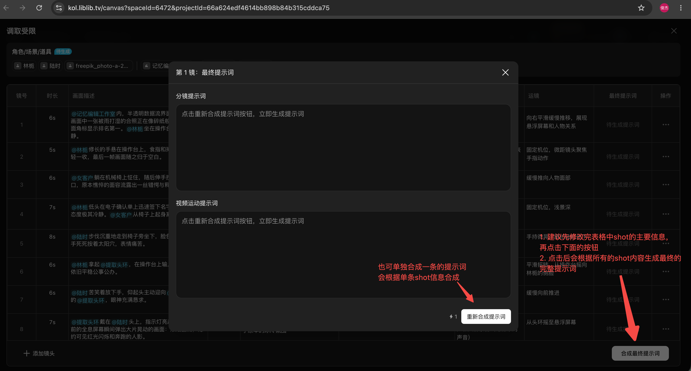

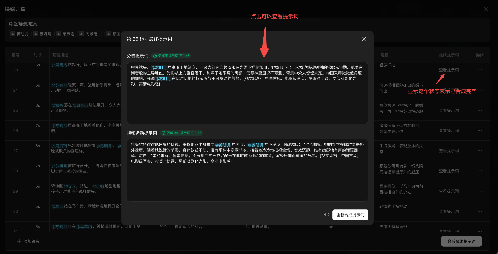

<ol><li seq="1">当 shot 信息和资产信息都调整好之后，可以合成最终提示词。</li><li>最终提示词不是简单复制某一行脚本，而是会综合以下信息综合生成：<ul><li>当前 shot 的画面内容； </li><li> 当前 shot 关联的角色、场景、道具；  </li><li> 整体风格设定。</li></ul></li><li>在这里合成的是一份更完整的画面和视频的提示词。</li><li>如果发现某个镜头画面不够明确，可以在下一步点击批量生成的时候，这部分的词会贯入到生成器中，可以在生成器信息确认环节进行手动修改。<b>本期暂不支持在这里修改。</b></li></ol></td></tr></tbody></table>

- 第 5 步：批量生分镜图

  1. 等上一步镜头资产和最终提示词信息确认完毕之后，就可以选择批量生成分镜或者是批量生成视频了。
  2. 选择对应的镜头和对应的模型后，点击【确认并创建生成器组】，会在画布上创建一组生成器组。
  3. 注意：这里面不是空的生成器，这是一个将资产连线、脚本中的提示词、对应选择的生成器参数（模型、尺寸、分辨率等）都带过来的生成器。**点击选中对应的生成器即可查看。**
  4. 在这一步，用户可以自主补充更多的参考图信息，调整单独分镜的生成器参数，微调提示词信息等。
  5. 若**解组不会让生成器中的信息消失，**这是一个普通的组。
  6. 信息的流动是从脚本到分镜组的，如果在生成器内修改了信息，是**不会向上传递**给上游的脚本传递的。

对于短剧、漫剧、动画短片来说，这条链路可以减少很多重复操作：不用每个镜头都手动复制提示词，也不用在多个节点之间来回找角色和场景信息。

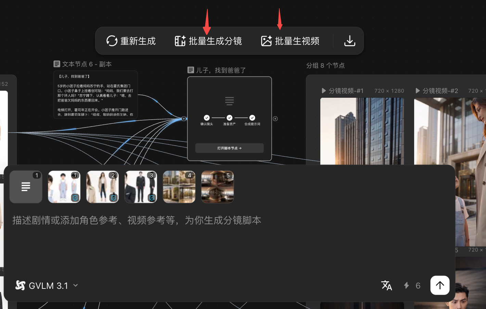

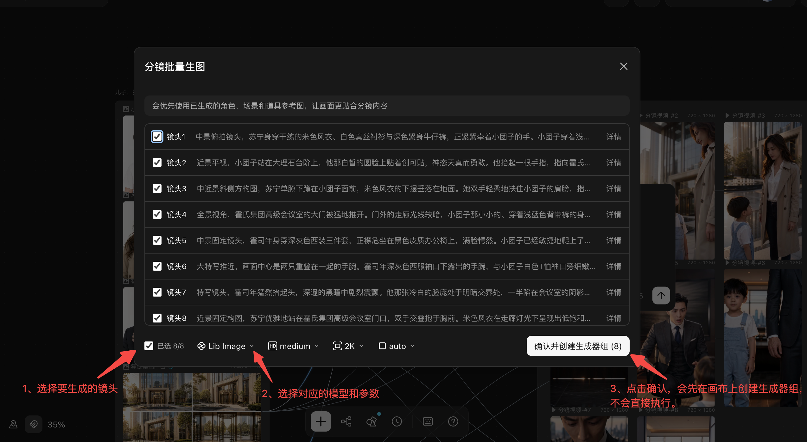

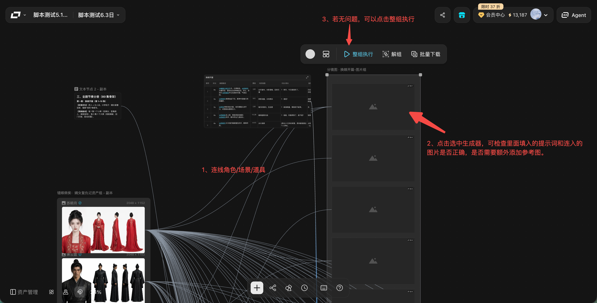

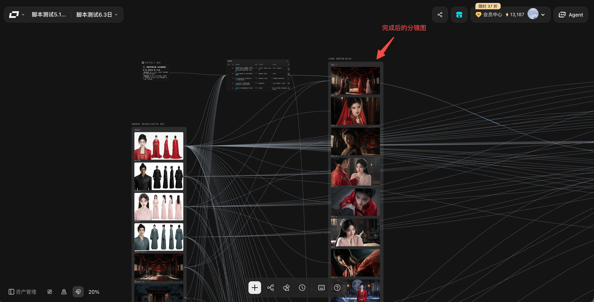

- 第 6 步：批量生视频

  1. 批量生成视频与批量生分镜图的步骤一样。
  2. 本期没有直接从分镜图生成视频的链路。但可以将生成好的分镜图对应连接到分镜视频中，作为参考图传递给分镜视频，这样效果的准确度会更好。
  3. 视频生成完成后，可以继续把片段合成为完整视频。

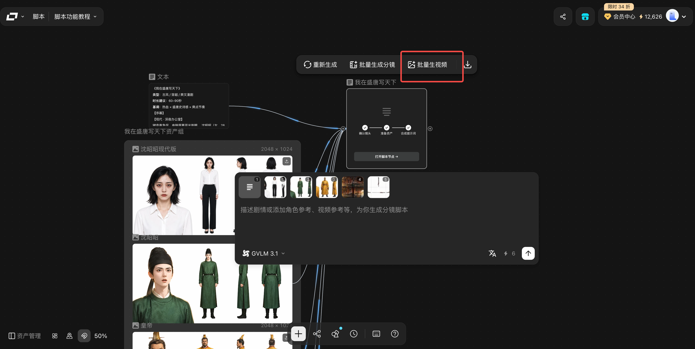

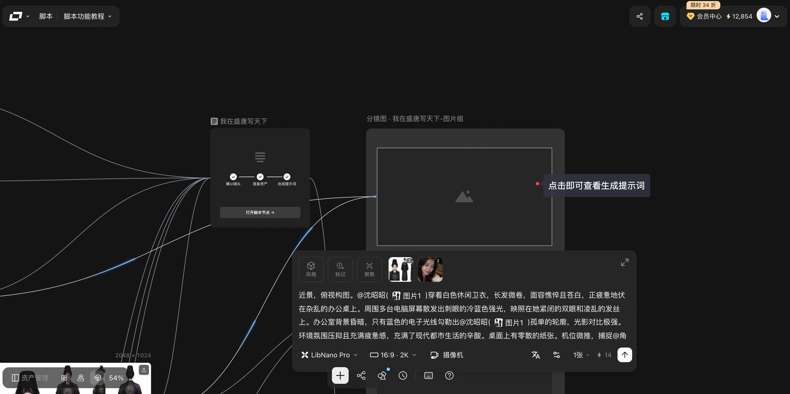

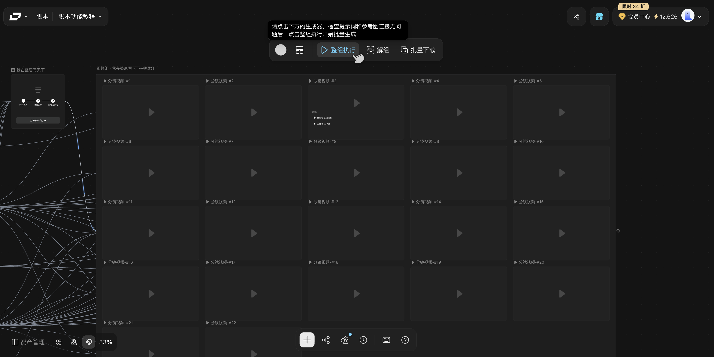

四、核心亮点

亮点 1：自动生成 角色、场景、道具，一致性调用

过去 AI 生成的脚本是"一锤子买卖"——不满意只能重新生成。现在不一样：

- 脚本里的**角色、场景、道具**都被拆成独立“资产”，可以单独修改、替换、复用
- 改一处，自动同步到所有相关画面
- **角色、风格、场景、道具**等在每个分镜里**保持一致，**不会“换个镜头换张脸”

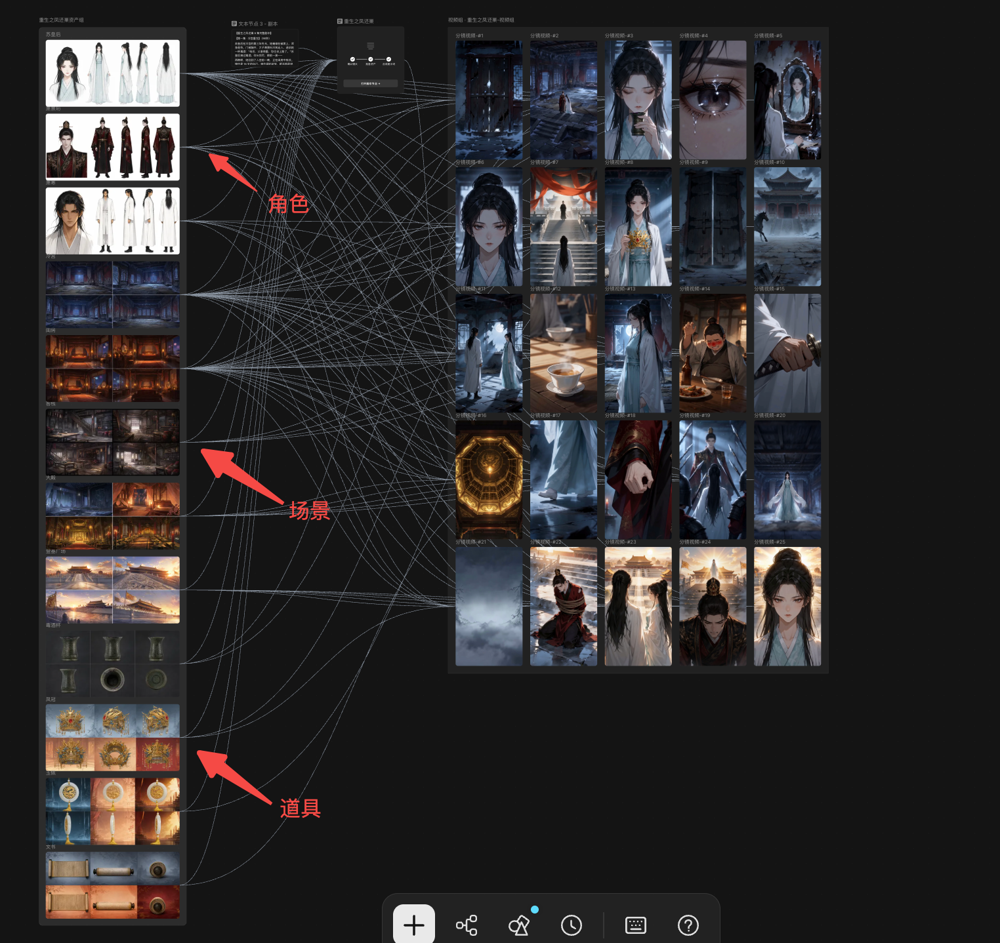

亮点 2：风格参考全局统一

- 整部片子锁定**统一视觉风格**(真人 / 二次元 / 3D / 水彩等)
- 角色、场景、道具全部继承同一套风格基调
- 画面之间衔接自然，不会一个镜头一个画风

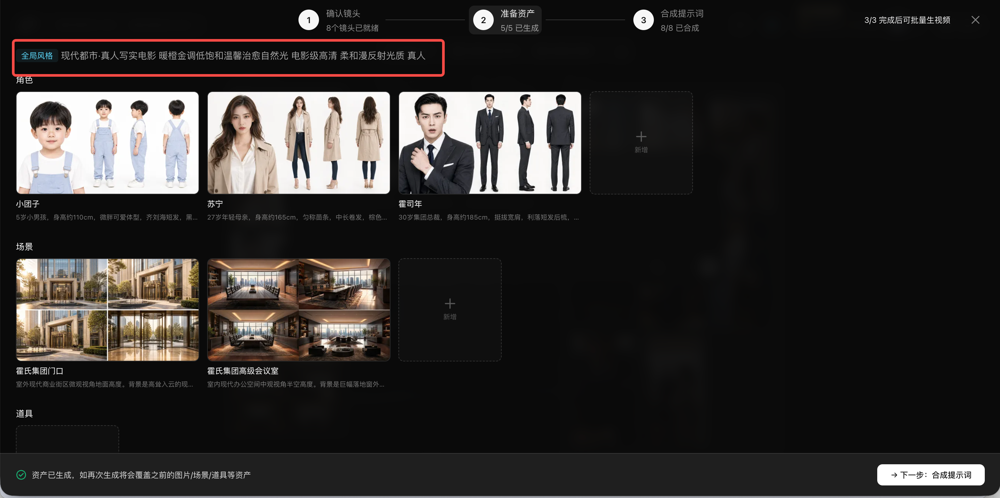

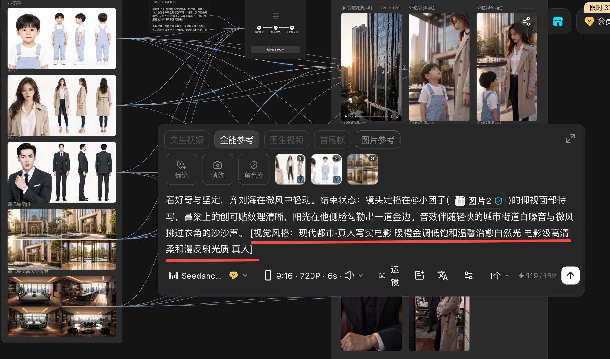

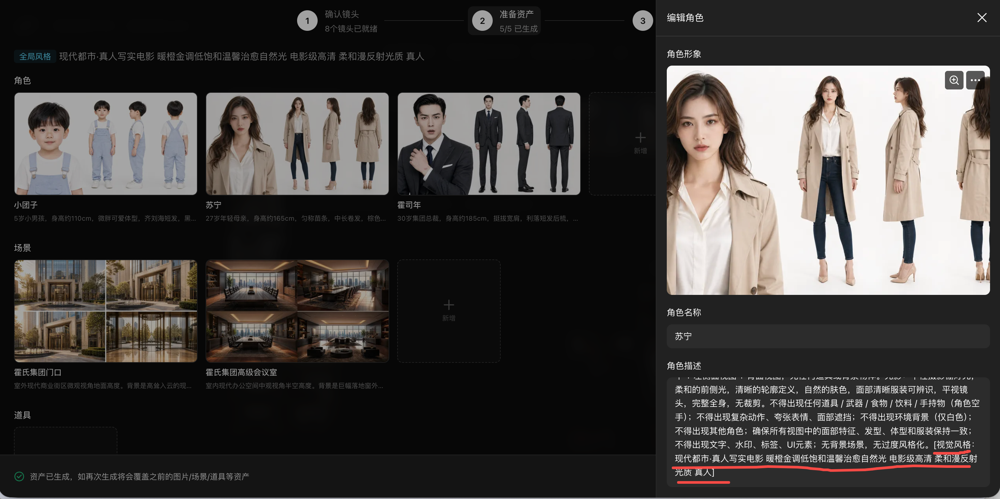

亮点 3：先精细调整再批量，结果更可控

- 新版脚本不是直接让用户“一键到底”，而是在批量生成前留了一个检查和修正环节。
- 用户可以先看脚本拆得是否正确，角色提取得是否准确，场景有没有漏，提示词是否完整。
- 发现问题可以直接在脚本节点里修：

  -  缺角色/场景/道具图，可随时补充和添加； 
  -  镜头不顺，直接调整顺序； 
  -  分镜少了，新增 shot； 
  -  分镜多了，删除 shot； 
  -  风格不对，可在生成时加风格图或风格词进行修改。 
- 修完之后再批量生成，会比直接一键生成更可控。
- 整体逻辑更符合创作者实际工作方式：先出草稿，再人工调整，最后批量生产。

亮点 4：一个故事，从文字到成片，全程不用跳出平台

- 输入剧本 / 想法 / 参考图  → 自动生成结构化分镜脚本
- 一键**批量生成**所有分镜图、所有视频片段
- 将生成的视频片段合成为完整视频

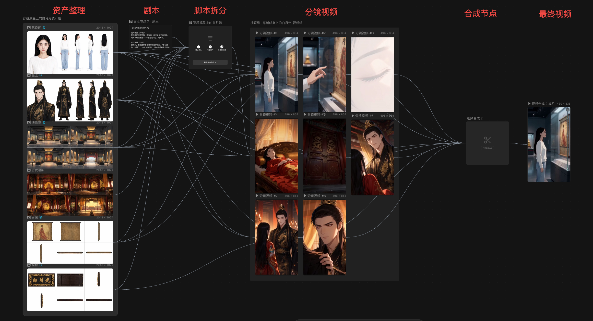

亮点 5：更适合短剧、漫剧、AI 影视的批量生产

新版脚本不是只服务单张图或视频片段，而是更适合一整段故事的生产。

尤其是短剧和漫剧，经常会有这些需求：

-  一集里有大量重复角色； 
-  同一个场景会反复出现； 
-  需要快速拆分镜； 
-  需要批量生成素材； 
-  需要先测试几条，再批量跑全量； 
-  需要在成本和质量之间做控制。 

新版脚本可以把这些重复性的内容资产化，把每个镜头的生产变成可管理、可批量的流程。

它不是完全替代创作者判断，而是把创作者从大量重复整理提示词、复制角色信息、逐条生成的工作里解放出来。

五、创作者测评

> **提示**
>
新版脚本更适合的场景是：
1. AI影视/动画短片的灵感泛化、资产拆解、分镜生成
2. 短剧漫剧的剧集单集资产拆解、素材生产  
**一些局限**：
1. 无法做到精品短片一键直出，导演思维、时长的判断、镜头与镜头的衔接还是会有瑕疵。
2. 针对TVC场景的产品一致性会有不稳定的情况。

1. **新版脚本比较适合的场景主要有两类。**

   1. AI 影视 / 动画短片
   
      1. 适合做灵感泛化、剧本拆解、资产整理和分镜生成。
      2. 如果只是有一个故事想法，可以先让脚本节点拆成分镜，再看每个 shot 是否合理。
      3. 如果已经有比较完整的剧本，也可以直接用它来提取角色、场景、道具，快速生成一版故事板。
      4. 对早期创意验证来说，这个流程会比较高效。
   2. 短剧 / 漫剧单集素材生产
   
      1. 短剧和漫剧更依赖批量生产，一集里面经常有几十个镜头，而且角色和场景会反复出现。
      2. 新版脚本在这种场景下比较有优势：
      
         1. 可以快速拆单集分镜； 
         2. 可以统一管理角色和场景； 
         3. 可以批量生成分镜图； 
         4. 可以继续批量生成视频； 
         5. 可以先局部测试，再批量跑全量。 
      3. 对于流水线生产来说，它能减少很多重复操作。

1. **当前还存在的边界**

   1. 新版脚本目前还不是“精品短片一键直出”。
   
      1. 导演思维、镜头节奏、时长判断、镜头与镜头之间的衔接，还是需要人工介入。
      2. 尤其是精品 TVC 这类对产品一致性、镜头设计、品牌质感要求特别高的场景，当前生成稳定性还会有一些不确定性。
   2. 但整体来看，相比旧版，V2 的生产逻辑更完整，生成链路也更顺。对于需要快速拆剧本、搭故事板、批量出素材的创作者来说，新版脚本会比旧版更实用。

##### 脚本Beta🚮（旧版）

- **功能简述：**支持用户通过描述剧情、或**上传剧本/角色图像/参考视频**，直接生成脚本。并通过脚本直接批量生成对应的分镜图像以及视频。

  - **上传剧本：点击后，复制文本信息到文本框，生成脚本**
  - **角色图像：点击后，上传角色图像+描述故事剧情，生成脚本**
  - **参考视频：上传参考视频，描述新需求，生成新脚本**

**1️⃣ 脚本生成**

在画布上点击右键，选择【添加节点-脚本节点】，选择「通过角色生成分镜脚本」。

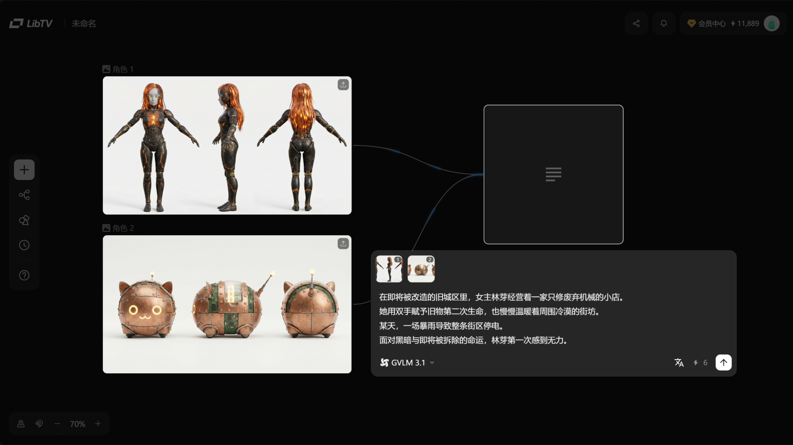

然后修改角色图、脚本生成提示词，点击生成，就能得到对应剧情的「分镜脚本」。

点击脚本右上角「全屏」按钮，可以浏览全部详细的脚本信息，支持**修改文本信息、更换参考图像。**

点击脚本右上角「视图」按钮，可以切换为 **卡片式** 展示方式。

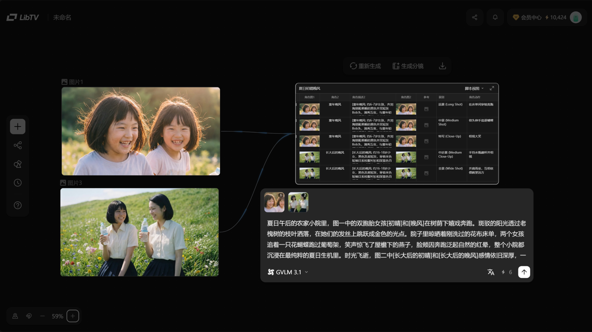

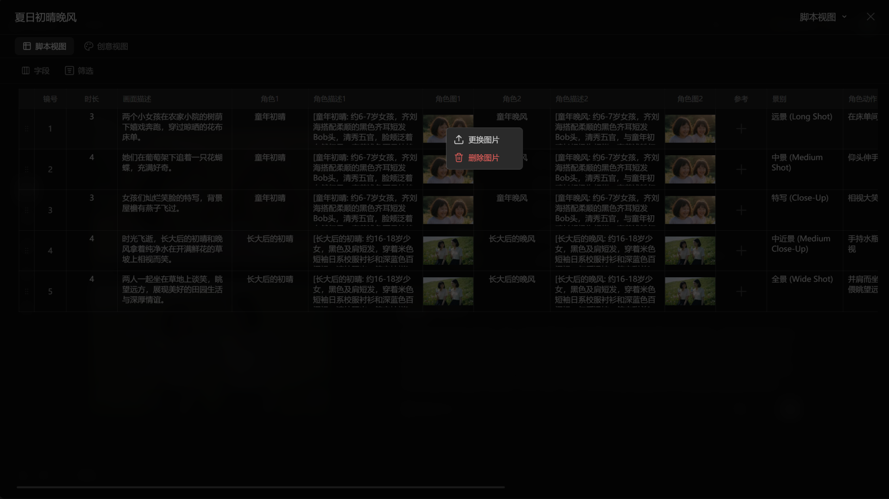

 **脚本内容修改（全屏视图） ❤️：**

双击表格可修改内容

支持上传**角色图、风格参考（右键替换/删除）**

**自定义列表**：可以通过自定义**「调整字段可见性」**以及**「筛选画面」**隐藏不必要的内容，让脚本更加直观简洁。

[附件：脚本展开示例.mp4](./assets/WCfNbl7hooTvMexl49wcsZvknef.mp4)

2️⃣ **分镜图片生成**

脚本生成后，点击顶部【生成分镜】选项，系统会会基于脚本信息，直接生成对应的分镜图片

支持单条或批量脚本转图片：可以在脚本列表第一列进行勾选操作

支持在底部生成器中，设置分镜图像的风格、生成模型、画幅比和分辨率，最后点击生成

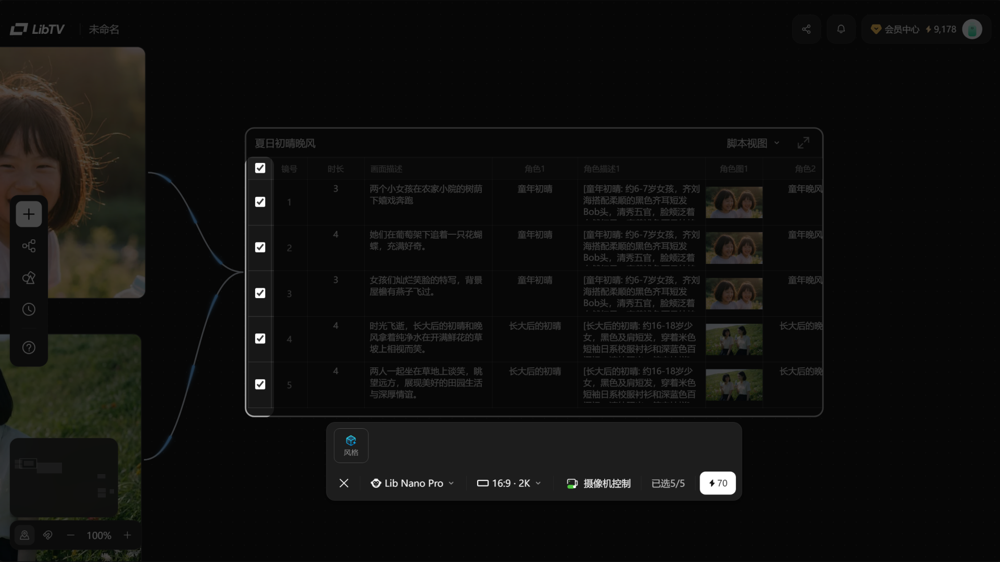

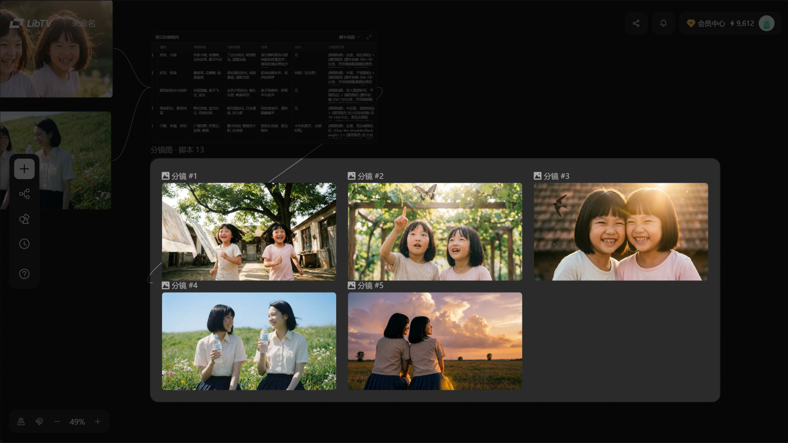

**3️⃣ 分镜图片转视频**

分镜图像生成后，可以继续连接视频节点，将图像转为视频

或者点击顶部【批量生成视频】选项，系统可以基于脚本信息，自动将图像转换合适的视频

底部生成器支持设置视频生成模型、时长，最后点击生成。

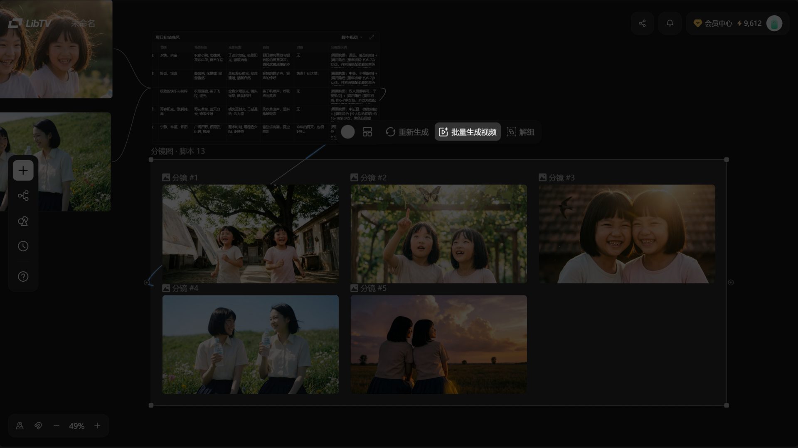

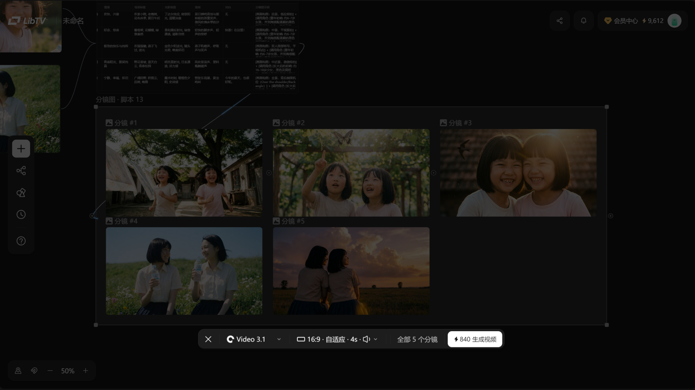

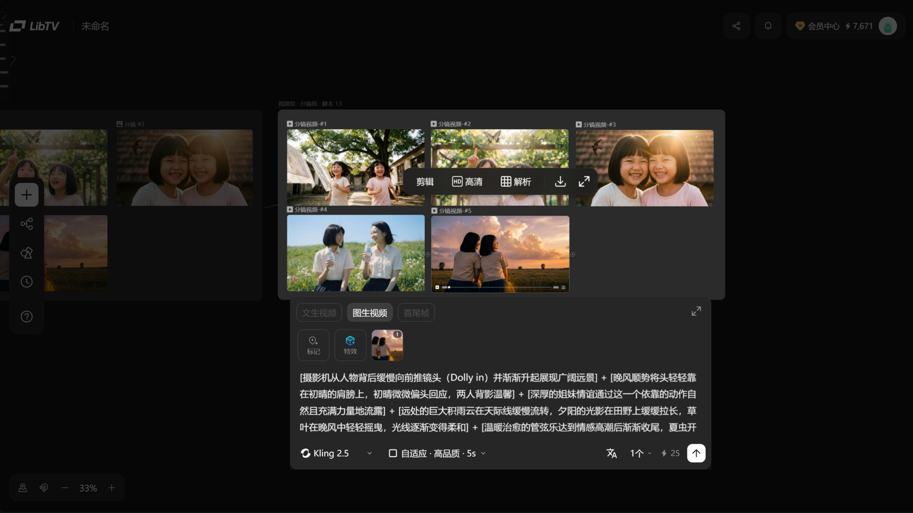

#### 常用节点操作 

选中某个节点后，点击右键可以对当前节点进行复制、复用、删除、创建资产等操作

- **创建资产**点击后对当前节点资源**进行命名、分类并保存为「资产」**；之后可以在画布左侧栏[「我的资产」](https://liblibai.feishu.cn/wiki/Loxfw6XHziYRk0kKzdjcFfp9nhb?contentTheme=DARK&last_doc_message_id=7610813486005177522&preview_comment_id=7610814670785481684&sourceType=feed&theme=light#share-UAMgdhEQkoViEXxM6b7cWxjanae)中随时查看、调用
- **复制&粘贴**通过 「Ctrl/Cmd+C」 「Ctrl/Cmd+V」 快速复制使用单个节点，**不保留**节点已有的连线信息
- **副本**快速复用当前节点，**保留**节点已有的连线信息当需要基于同一组参考素材生成多个不同结果时，使用副本功能可以一次性产出多个版本，不用手动重复连线配置
- **删除**支持通过 Delete 键快速删除当前节点，可通过 Command+Z 撤销删除操作

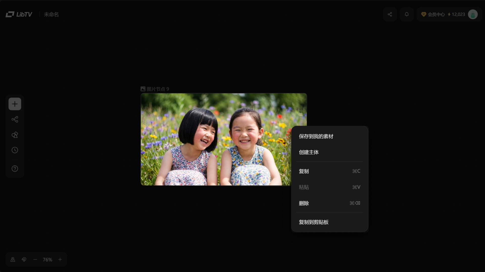

### 工作流搭建 🔥

基于已有的**文本、图像、视频、音频 4 类节点**，我们可以**通过连线**的方式，自由搭建出所需要的「任务工作流」，方便之后快速进行复杂任务**一键自动执行**或者**分发**。

#### 基础工作流 Showcase

以下是一个简单的「参考生图→图转视频」工作流

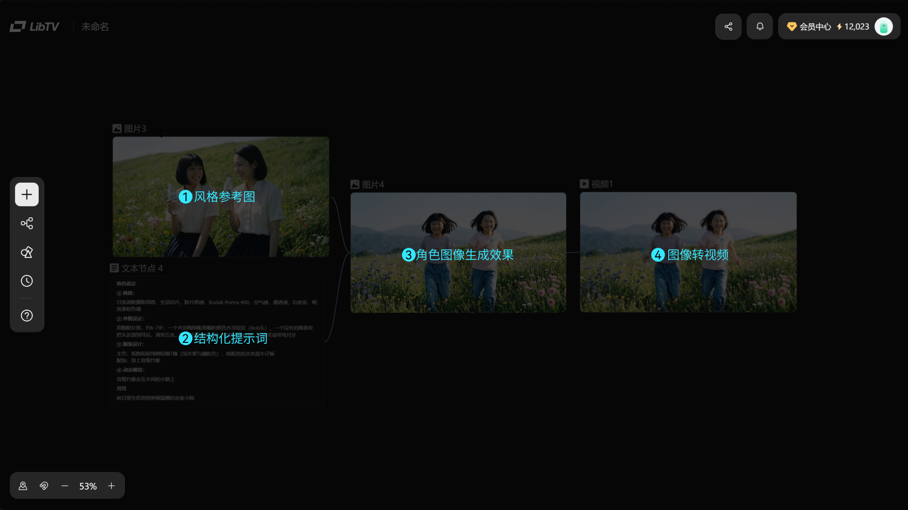

[附件：基础工作流.mp4](./assets/STHpbCAz1oHChpx1EH7cLJmSnSh.mp4)

**搭建步骤**

1. **风格参考图上传**

从「风格参考图」右侧节点拉线，新建一个「图片节点」，参考图会自动上传至新节点的生成器中。

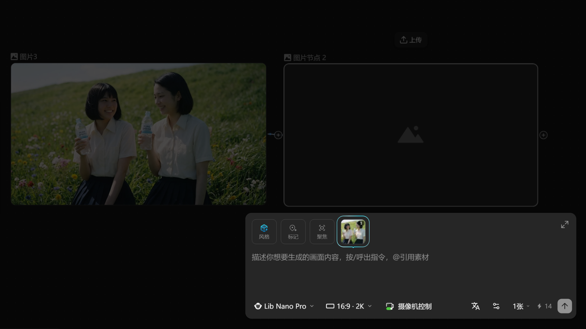

---

1. **角色设定接入**

将准备好的角色设定信息填入一个文本节点，然后将其连接至上一步的新节点，表示**该信息会作为生成器提示词的一部分。**

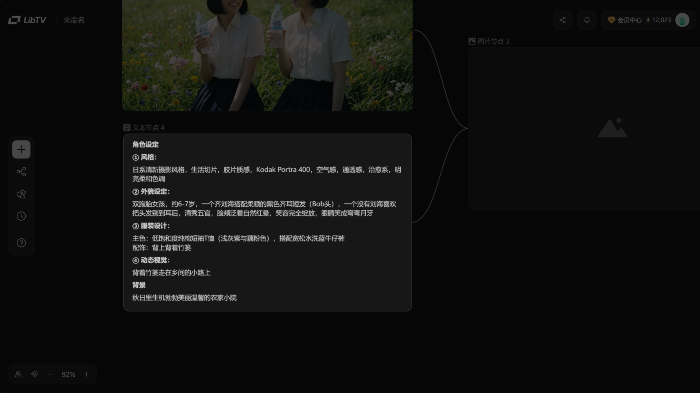

---

1. **图像生成**

在图像生成器中，输入生成需求「参考图1的画面风格，生成一张图片」，选择生图模型、设置图像比例、张数，最后点击生成。

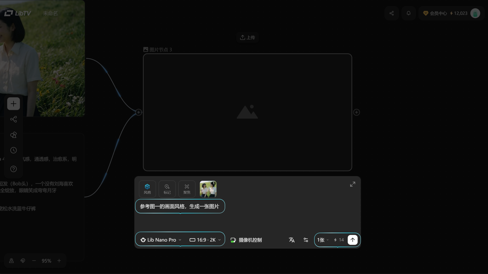

生成的图像会展示在当前图片节点

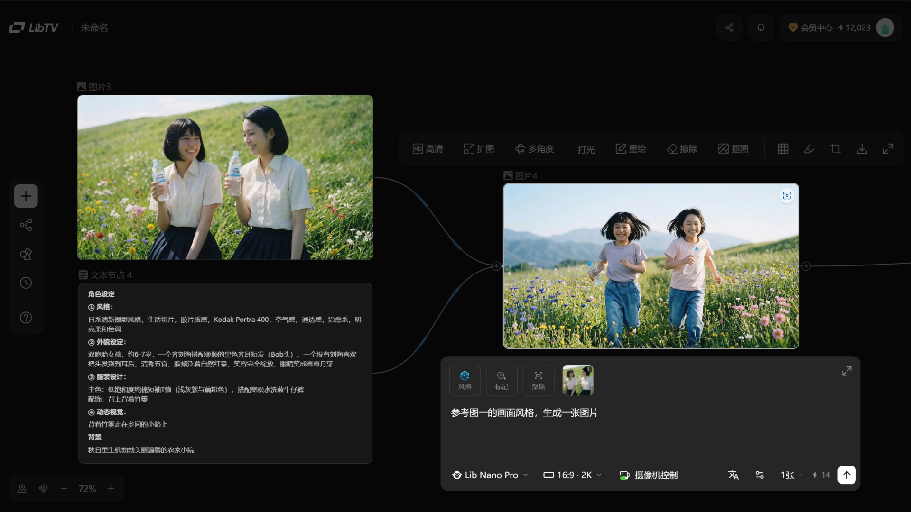

---

1. **视频生成**

从生成好的图片右侧拉线，新建一个「视频节点」，输入画面动态提示词。选择视频生成模型、设置视频比例、个数，最后点击生成

生成的视频会展示在当前视频节点中

---

#### 工作流操作

<table><colgroup><col/><col/><col/></colgroup><thead><tr><th>功能</th><th>简述</th><th>截图</th></tr></thead><tbody><tr><td><b>打组</b></td><td><ul><li>对于搭建好的工作流，可全选后点击右键进行打组。打组后可进行整体拖动</li><li>打组快捷键 Ctrl/Cmd+G</li><li>若框选过程中<b>选到了分镜表，无法触发</b>打组功能按钮。</li></ul></td><td>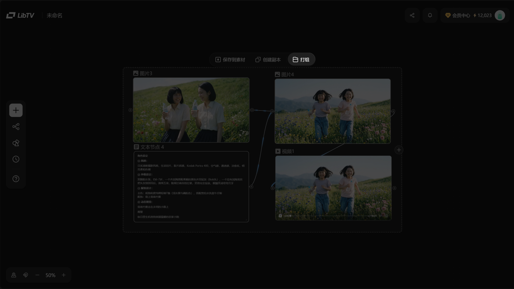</td></tr><tr><td><b>创建</b> <b>工作流</b></td><td><ul><li>对于<b>已打组的工作流，</b>可以点击<b>「创建工作流」将其保存起来</b></li><li>保存好的工作流，可在画布左侧栏的<a href="https://liblibai.feishu.cn/wiki/Loxfw6XHziYRk0kKzdjcFfp9nhb?contentTheme=DARK&amp;last_doc_message_id=7610813486005177522&amp;preview_comment_id=7610814670785481684&amp;sourceType=feed&amp;theme=light#share-YrxzdelmjoIVL2xqwdiciCg2njg">「打开工作流」</a>中查看、调用（点击发送到画布）</li><li>不支持对<b>分镜表节点</b>进行该操作</li></ul></td><td>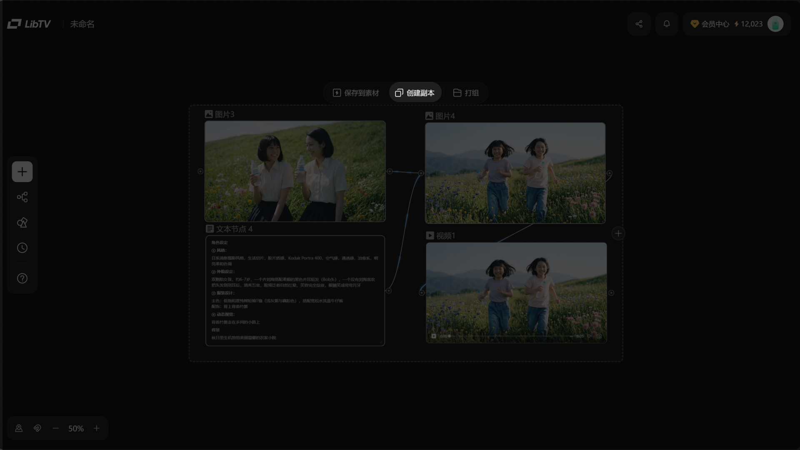</td></tr><tr><td><b>整组执行</b></td><td><ul><li>对已打组的、且具备前后逻辑关系的工作流，点击后可以进行全部的重新执行。</li></ul></td><td>修改角色设定与视频动态提示词后，整组自动执行效果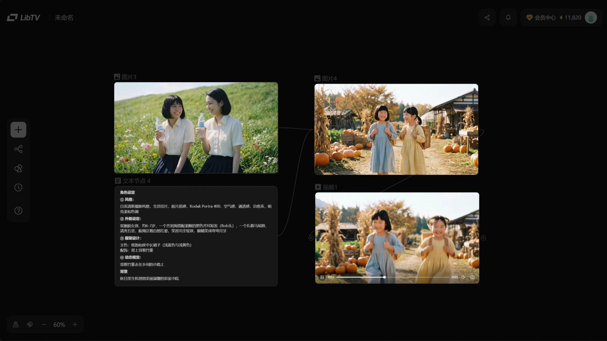</td></tr></tbody></table>

### 四大画布功能

无限画布上有4大功能模块：**「项目菜单栏」「画布左侧栏」「个人中心」和「小地图导航」**

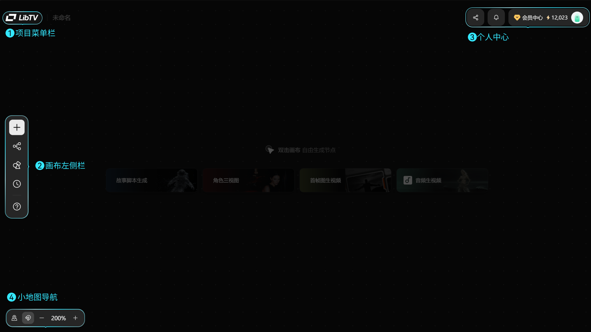

#### 项目菜单栏

**一个无限画布就是一个项目**，点击画布左上角的 Logo 会弹出**「项目菜单栏」**可以对项目进行管理。

<table><colgroup><col/><col/></colgroup><thead><tr><th><b>功能简介</b></th><th><b>功能截图</b></th></tr></thead><tbody><tr><td><ul><li><b>回到主页  </b>点击后返回LibTV首页</li><li><b>全部项目</b>
进入进入项目库，浏览、管理自己的所有项目
</li><li><b>创建新项目</b>
在当前标签页新建一个空白画布

之前的项目可以在「项目库」中查看
</li><li><b>删除项目</b>
弹出删除确认弹窗，确认后当前项目被永久删除

当前页面会返回LibTV首页
</li></ul>
<ul><li>双击画布名称，可以进行画布重命名</li></ul></td><td></td></tr></tbody></table>

#### 画布左侧栏

画布左侧栏设有**「添加」「工作流」「资产」「历史记录」「教程」**5大功能

<table><colgroup><col/><col/></colgroup><thead><tr><th>功能简介</th><th>功能截图</th></tr></thead><tbody><tr><td><ol><li seq="1"><b>添加</b><ol><li seq="1"><b>添加节点</b>：支持直接新建<b> 文本/图片/视频/音频/脚本</b> 节点</li><li><b>添加资源</b>：将本地的图片/视频/音频资源上传到画布中，支持多选上传</li></ol></li></ol></td><td></td></tr><tr><td><ol><li seq="2"><b>我的</b><b>工具箱</b><ul><li><a href="https://liblibai.feishu.cn/wiki/Loxfw6XHziYRk0kKzdjcFfp9nhb#share-WKFXdzfg6oS1WixUFDscjk43n1c"><b>已创建为资产的工作流</b></a><b> </b>可以在这里查看</li><li>点击卡片可以将对应的整套工作流发送到当前画布</li></ul>

</li></ol></td><td>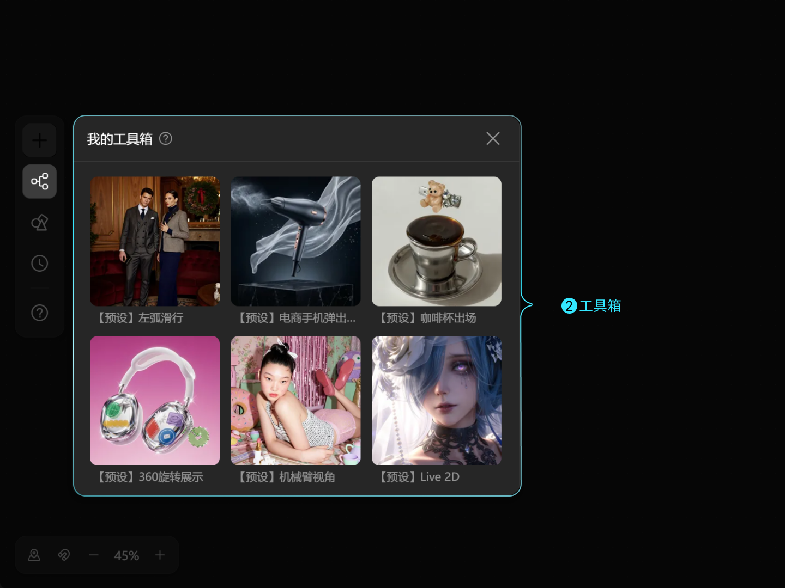</td></tr><tr><td><ol><li seq="3"><b>我的资产</b><ol><li seq="1"><b>我的资产</b> <ul><li><a href="https://liblibai.feishu.cn/wiki/Loxfw6XHziYRk0kKzdjcFfp9nhb#share-SCr3dlCknoXlqLxFZTRcLRs5nmb"><b>已创建为资产的资源</b></a>可以在这里查看</li><li>鼠标悬浮在卡片上，可以对资产进行查看、删除、使用（发布送到当前画布）</li></ul></li><li><b>我的主体库（待完善）</b><ul><li>针对<b>可灵、vidu 等模型开放的主体库</b>，系统会对主体进行特殊处理，在生成视频的。 后调用主体库的内容，保证生视频的时候有较好的一致性。</li><li>可以将已经生成好的人物、物体等图片/视频资源放到一个文件夹组中进行管理，在需要使用的时候，整体进行调用。</li><li>点击某个资产文件夹，可以将文件夹中的所有内容都加载到画布上。例如，创建一个香水文件夹，可以将这个香水不同视图的图，全部加载到画布上，这样就方便参考不同视角的图，生成一致性比较好的视频了。</li></ul></li></ol></li></ol></td><td>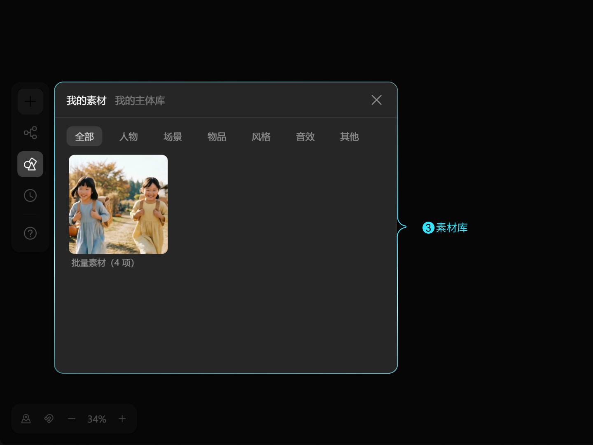</td></tr><tr><td><ol><li seq="4"><b>历史记录</b><ol><li seq="1">在 LibTV 内生成的所有的图片、视频、音频均会展示在历史记录</li><li>历史记录里的资源可以进行<b>查看和使用（发布送到当前画布）</b></li><li>画布的历史记录支持批量下载、批量删除、批量使用（最多使用10个）</li></ol>
2. 支持记录历史记录浏览位置
</li></ol></td><td>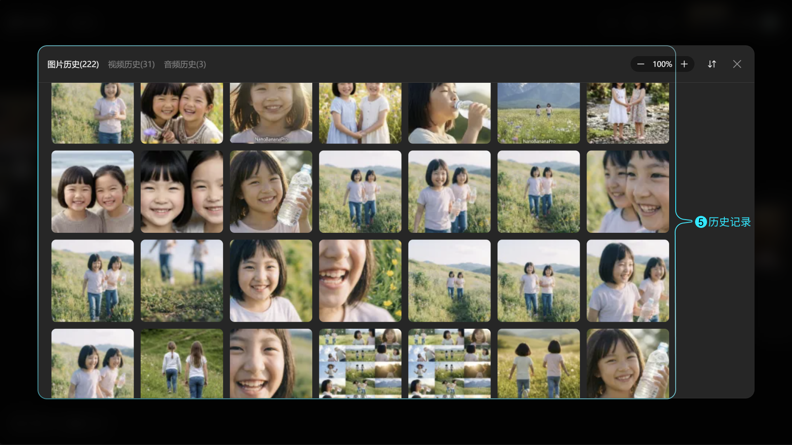</td></tr><tr><td><ol><li seq="5"><b>使用教程</b>
没错就是你现在现在在看的这个文档！

有任何疑问欢迎评论or留言 😘
</li></ol></td><td></td></tr></tbody></table>

#### 个人中心

画布右上角是用户相关功能，包括**「发布&分享」「通知」「会员中心」「积分消耗」「个人中心」**

<table><colgroup><col/><col/></colgroup><thead><tr><th>功能简介</th><th>功能截图</th></tr></thead><tbody><tr><td><ol><li seq="1"><b>分享/发布</b><ol><li seq="1"><b>分享</b>：可以将当前的画布分享给其他人，对方可以看见当前画布以及后续在画布上操作的所有内容</li><li><b>发布</b>：可以将当前画布以及对应的视频作品发布到LibTV社区首页，发布且通过审核后，会在首页曝光展示。</li></ol></li></ol></td><td>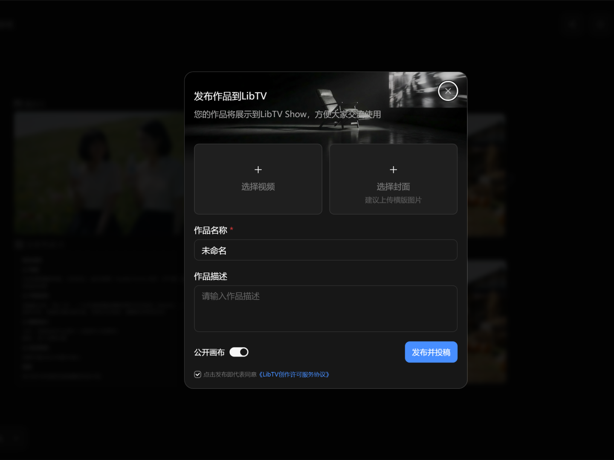</td></tr><tr><td><ol><li seq="2"><b>消息中心</b>
查看系统通知，以及作品的点赞、评论等互动信息
</li></ol></td><td>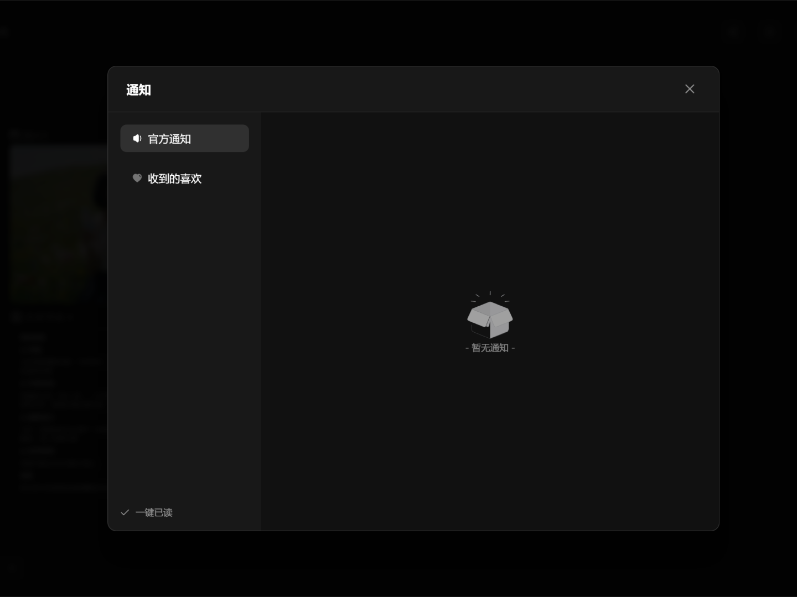</td></tr><tr><td><ol><li seq="3"><b>会员中心</b><ul><li>查看会员购买信息</li><li>了解促销优惠</li></ul></li></ol></td><td></td></tr><tr><td><ol><li seq="4"><b>积分消耗</b><ul><li>查看积分余额、会员有效期</li><li>单独购买算力</li></ul></li></ol></td><td>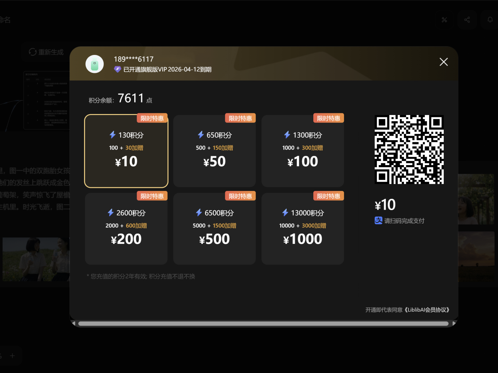</td></tr><tr><td><ol><li seq="5"><b>个人中心</b><ul><li>展示账号信息、会员等级、积分余额等</li><li>可一键复制用户uuid</li><li>查看购买记录、会员订阅计划、开票</li><li>进行生成水印设置</li></ul></li></ol></td><td>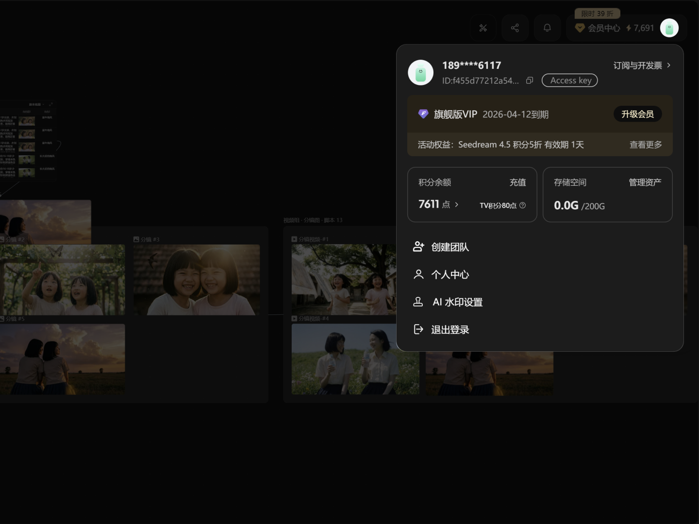</td></tr></tbody></table>

#### 小地图导航

<table><colgroup><col/><col/></colgroup><thead><tr><th>功能简介</th><th>功能截图</th></tr></thead><tbody><tr><td><ol><li seq="1"><b>小地图</b><ul><li>当画布内容较多时，点击画布左下角的地图图标，在弹出的「小地图」中查看当前画布节点的全局分布情况</li><li>鼠标拖动「小地图」中的高亮框，可快速让画布视图聚焦在对应位置</li></ul></li><li><b>画布缩放数字</b><ul><li>通过百分比数值了解当前画布缩放比例</li><li>滚动鼠标滑轮可调整画布放大/缩小，最低10%</li></ul></li></ol></td><td></td></tr></tbody></table>

## 画布实用工具 🔥

LibTV 提供了一系列实用&功能，方便大家快速进行图像、视频的编辑处理。

### Slash 快捷功能 🔥全面升级🚩

**能力升级**：

- **升级1：入口升级**

**图片节点**，支持「输入框输入 "/" 」+「点击生成器下方预设」快速调起


- **升级2：能力升级**

多数能力支持输入「文本」/「文本+图片」/「图片」，让生成更可控

#### 多机位九宫格 💖


#### 剧情推演四宫格 💖


#### 25宫格连贯分镜  💖


#### 电影级光影矫正


#### 角色三视图生成 💖


#### 画面推演-3秒后 


#### 画面推演-5秒前


#### 角色设定图🆕🌟


#### 🔥故事板

**能力介绍：**

把一段 10-15 秒的剧情，整理成适合视频生成的连续分镜

它会重点拆解人物怎么演、动作怎么发生、镜头怎么拍、前后画面怎么衔接，适合用来做短剧、漫剧、广告片、产品剧情片、角色动作片段等视频前期规划


#### 🔥调度故事板

**能力介绍**

把一段 10-15 秒的剧情，整理成带动作线、视线、运镜和衔接提示的中文手绘分镜


“视频生成前的导演分镜蓝图”，在连续分镜基础上，补充动作拆解、人物走位、镜头机位、调度线和镜头衔接，让视频模型更清楚理解“怎么演、怎么动、怎么拍”


#### 人像调节🤩

**核心能力：**

1. **降低 AI 感**  
优化过度磨皮、塑料感皮肤、五官边缘过硬、纹理过假等问题，让人物看起来更像真实照片
2. **优化人像质感**  
支持对皮肤质感、画面纹理、清晰度进行调节，保留自然肤质、毛发细节和真实的面部层次
3. **提升人景融合**  
让人物与背景在色温、噪声、清晰度、边缘过渡上更统一，减少“人物像贴上去”的感觉
4. **优化光影融合**  
根据场景光源调整脸部和身体光影，让人物受光、阴影、氛围与背景更一致

> 让面部反光更适配环境特征，优化面部细节，保留真实肌肤纹理与微小瑕疵，告别‘塑料感’

> **「文生图」--效果对比**
> 
> 
> 
> **「图片编辑」---效果展现**
> 
> 

#### **「情绪调节」**

在多人图中支持选择指定人物进行表情调节，单次仅支持单人

最终输出仍保留完整原图，只改变目标人物表情，其他人物和画面内容不变

当前支持25 个表情

> 情绪调节核心优势：在保留人物身份、五官特征和原图构图的基础上，精准控制眼神、眉眼、嘴角、脸颊等关键面部细节，让情绪变化符合真实面部肌肉运动，呈现自然、不突兀的表情效果
> 
> 
> 
> 

### 图像工具

位于图像节点顶部菜单栏，选中图像会自动弹出。新版菜单栏对功能进行了重新分组和排序，新增了部分功能。以下按最新布局依次介绍。


#### **2.2.1 全景720°🔥**

> **提示**
>
**使用须知：**
**1️⃣** AI 在生成**空旷的、无明确建筑、物体、空间做为参考的户外场景**（如草原、沙漠、大海）时，会存在全景特征不明显的问题。
**2️⃣ AI 生成存在随机性** 
① 偶然会出现全景图特征不明显的情况，一般再生成1-2次就能解决；
② 接缝无法无痕闭合、空间轻微扭曲等问题无法完全避免，但对图像/视频参考生成来说影响不大；
③ 可在截图后，考虑用 LibNavo 模型进行二次修复处理。
3️⃣ 对于Midjourney**高度个性化的风格特征**，风格一致性无法100%保持一致

1. **功能简述：**支持通过文本/参考图生成可实时预览的720°全景图，支持快速场景截图，让场景一致性控制更准确、简单。

[附件：教程全景展示.mp4](./assets/YnA4biYzooRmLQxoMXjc5NyMnFe.mp4)

1. **三大使用入口：点击图像节点顶部菜单栏【全景】：**

   - 直接基于基于当前场景创建720°全景图，**不支持提示词微调。**
   - 生成的全景图与原图空间特征、细节基本一致

   

   1. **图像节点生成器【全景模式】：**通过文本生成720°全景图，支持上传场景参考图
   
      

      

      **1️⃣ 纯文本提示词**：比如「一间温馨的儿童房，蓝色和白色的主题色，海洋主题」
      

      

      
      

      

   
      

      

      **2️⃣ 参考图+文字描述：**
      
      - 比如「基于参考图生成720°全景图，场景是XXXX」
      - 此方式生成的全景图在风格、空间主题上与参考图高度相似，但是细节并不一致。
      

      

      
      

      

**3️⃣ 图像节点-右键【进入全景预览】**

- 适用于 标准720°全景图，可直接进入实时预览模式


1. **全景功能：**

- 点击**[进入全景]**后，支持自由旋转并**基于当前视角截图**


- **4大视角截图**：基于上传的全景图每90°截图一次，自动生成环境前方、后方、左侧、右侧的截图。


- **12大视角截图**：基于上传的全景图每30°截图一次，自动截取当前环境的12个角度


- **重置视角**：回到全景图初始角度


- **构图参考线**：用于辅助构图


#### **2.2.2 多角度** 

- **功能简述：**可基于当前图像生成多个不同的拍摄视角的图像，支持8个水平环绕点位、4个垂直俯仰点位和3个景别缩放点位


- **相机视角设置：**支持左侧**「三维网格坐标球」**或右侧**「数值滑块」2** 种调节方式

  

  

  - **三维网格坐标球：** 支持鼠标按住相机图标拖动调节，或者通过坐标球周围的4个箭头图标进行调节
  - **数值滑块：**用鼠标拖动滑块调节
  

  

  
  

  

- **额外提示词：**高级功能，**开启后支持额外输入「中文/英文提示词」**，强化或优化视角生成效果

  - 开启「提示词」按钮：输入“极度特写镜头，广角镜头，边缘带有鱼眼畸变效果”，可以在指定拍摄视角之外添加“鱼眼镜头”效果


- **预设视角：一键直出同款视角**

  

  

  - 编辑器顶部有6项视角预设选项，点击后可一键加载对应的相机参数，点击生成即可
  

  

  
  

  

#### **2.2.3 打光** 

- **功能简述：**支持**调节一张图像的打光角度、光源颜色、画面亮度和增加轮廓光，**此外还有「智能模式」，我们可以通过**简单描述**想要的打光效果、情绪氛围、色调或**提供打光参考图**，直接得到想要的打光氛围。


- **左侧「三维坐标球」：**可设置26个主光点位和9个轮廓光点位

  

  

  1. 支持通过**鼠标拖动**设置打光角度，支持26个主光点位和9个轮廓光点位（轮廓光需要手动开启）
  2. 面板开启后，默认主光角度（前方）不生效。鼠标点击或拖动光源后**灯光亮起，才表示打光角度生效**
  3. 轮廓光开启后，主光不支持设置在轮廓光支持的9个背光点范围内，否则轮廓光会自动关闭或无法开启
  4. 右侧有6种**主光角度预设**，可点击直接使用
  

  

  
  **打光示例：主光源：左上角；轮廓光：正后方**
  

  

- **亮度：**调节画面整体亮度，有5档可以调节

  

  

  - 默认亮度为50%，未设置时进度条为灰色。**鼠标点击或拖动滑块后变成蓝色，才表示生效**
  - 最低档10%可营造暗调氛围，最高档100%将形成过曝效果
  

  

  
  **打光示例：亮度设置为10%**
  

  

- **颜色：**通过调色板选色，用于控制**主光源颜色**

  

  

  - 默认无色值，可点击调出调色板，进行颜色设置
  

  

  
  

  

- **智能模式：需要手动开启**，支持**通过提示词或参考图**快速实现想要的打光效果

  

  

  - **提示词：**我们可简述想要的打光效果、情绪氛围或者画面色调，即可得到对应的打光效果
  
    > “让画面的光影氛围变成黄金时刻（Golden Hour）”
    > 
    > 输入“让画面拥有《赛博朋克2077》同款**打光方式**和**画面质感**”
    > 
    > 输入“让画面氛围变得更加绝望、压抑”
  - **参考图**：支持上传一张打光参考图，无需提示词，可以直接得到想要的打光氛围。
  - **打光预设**：官方提供6种打光预设，点击后会加载对应的参数，直接点击生成即可
  

  

  - 纯提示词生成效果
  
  - 打光预设【蓝色逆光】
  
    
  

  

#### 2.2.4  九宫格

功能简述：提供多种智能分镜生成模式，包括：剧情推演四宫格、25宫格连贯分镜、电影级光影校正、角色三视图生成、画面推演-3秒后、画面推演-5秒前, 使用详情直达：[LibTV使用指南](https://resonate.feishu.cn/wiki/Loxfw6XHziYRk0kKzdjcFfp9nhb)

#### 2.2.5 图像基础编辑

功能简述：点击**[高清]**，下拉菜单中包括高清、扩图、重绘、擦除、抠图、剪裁六项图像基础编辑功能

| **功能名称** | **功能简述** |
|-|-|
| 高清放大 | 对图像进行2/4/6倍高清放大处理，支持通用、低分辨率、3D动画、高保真、文本优化5种模式。 |
| 扩图 | 基于当前图像向外扩展，支持6种画幅比；可自定图像分辨率（1K/2K/6K）和生成张数（1-4张）。 |
| 重绘 | 通过画笔涂抹或选取图像中需要修改的部分，使用提示词进行修改。 |
| 擦除 | 用户可通过画笔框选，选取图片特定部位加以擦除。 |
| 抠图 | 自动去除图片背景，保留主体。 |
| 裁剪 | 可以自由或选取特定比例对图像进行裁切。 |

#### 2.2.6  宫格切分 

- **功能简述**：**专门针对「9宫格」「25宫格」等多宫格图像**推出的拆分功能，拆分后用户可以指定提取对应的分镜切片，然后进行重新渲染或高清放大操作

1️⃣ 上传宫格图像后，点击顶部菜单栏的「宫格拆分」按钮，并按需要选择对应的宫格数量


2️⃣  画布进入沉浸模式，按指引点击选择需要提取的分镜切片，然后点击「发送到生成器」


3️⃣  系统会自动将对应的切片发送到新的图片节点并进行打组，我们可进行重新渲染或高清放大操作


#### 2.2.7 标注

- 功能描述：支持**涂鸦笔**或**框选工具**在图像上圈定具体区域，可直接在该区域内**添加文字**。
- 保存标注信息，生成时无需添加复杂的描述即可按照圈定的位置和文字内容重新生成。

  - **注意⚠️：如果是通过标记功能，删除/修改画面中的某些内容，则**
  
    1. 优先使用最新图像模型：比如 LibNavo 或者 Lib Image
    2. 推荐在提示词中添加**“修后不可以留下任何标注痕迹”**


#### **2.2.8 旋转与镜像**

- 功能说明：支持在画布内对图片进行镜像翻转、旋转（含90°/180°/270°、任意角度可选）

1. **旋转**
支持三种旋转方式：固定角度（每次顺时针旋转90°）、自定义角度、手动拖拽。
①固定角度旋转：点击以下按钮，图片会每次顺时针旋转90°
②自定义角度：点击角度输入框,直接输入 0～360 之间的整数（顺时针角度），图片会实时旋转到该角度。
③手动旋转：直接拖动，即可任意旋转图片。


**2、镜像（左右/上下）**
- 水平镜像：点击“左右镜像”按钮，图片左右翻转。
- 垂直镜像：点击“垂直镜像”按钮，图片上下翻转。


#### **2.2.9 分镜组 🔥**

1. **功能简述**：分镜组指出将多张图片节点整合到一个规整的**宫格布局**中，进行统一查看、排序和管理。每个宫格的位置支持智能排序，且数量和画幅比都是支持自定义，形成整齐划一的视觉效果。**适用场景：**电影分镜组、故事板/情绪板

   
[附件：PixPin_2026-05-08_15-13-49.mp4](./assets/Pe4kbreZKo30NhxKuEIcfvkonfb.mp4)

2. **使用入口：**

   

   

   **1️⃣ 多选图像节点创建**
   1. 在画布上**框选**多张图片节点
   2. 点击顶部工具栏「打组」**，选择**「合并分镜组」
   3. 系统会根据你选择的图片数量，自动生成合适的宫格布局
   

   

   
   

   

   

   

   2️⃣ 将已有普通组转换为分镜组
   1. 选中画布上一个**只包含图像节点**的普通组。
   2. 在顶部工具栏会出现「转分镜组」的选项，点击即可。
   ---
   分镜组快捷键:
    **Command + Option + G** (Mac) 
    **Ctrl + Alt + G** (Windows)
   

   

   
   

   

   

   

   **3️⃣ 从「宫格切分」工具创建**
   1. 使用「宫格切分」功能切分完成后，点击「创建分镜组」
   

   

   
   

   

3. **「分镜组」工具栏顶bar&右键功能**

   

   

   - 工具栏顶bar
   
   

   

   - 右键
   
   

   

   <table><colgroup><col/><col/></colgroup><thead><tr><th><b>功能</b></th><th><b>作用</b></th></tr></thead><tbody><tr><td><b>比例切换</b></td><td><ul><li>修改每个宫格的画幅比</li><li>支持<b>21:9、16:9、9:16、3:4、4:3、1:1</b> </li></ul></td></tr><tr><td><b>宫格数量</b></td><td><ul><li>修改组内宫格的行列布局</li><li>支持 <b>2x2, 3x3, 4x4, 5x5</b> 预设及自定义</li><li><b>减少宫格时</b>，超出的图像会自动解组并排列在分镜组右侧</li></ul></td></tr><tr><td><b>拼接</b></td><td><ul><li>将分镜组内所有图像<b>合并为一张新的2K或4K大图</b></li><li>注意⚠️：如果分镜组内图像宽度不足<b>2K或4K，则导出时会被强制放大，而非自动高清</b></li></ul></td></tr><tr><td><b>序号</b></td><td><ul><li>为每个宫格添加数字序号</li><li>启用后，拼接图像序号会显示在分镜右下角</li></ul></td></tr><tr><td><b>清空</b></td><td><ul><li>一键移除分镜组内的<b>所有图像</b></li><li>会删除节点及其连线。此操作有二次确认提示，请谨慎使用</li></ul></td></tr><tr><td><b>转普通组</b></td><td><ul><li>将分镜组转换回一个普通组</li><li>组内图片会按宫格顺序自动排列并打组</li></ul></td></tr><tr><td><b>解组</b></td><td><ul><li>彻底解散分镜组，所有图像恢复为完全独立的节点</li></ul></td></tr><tr><td><b>右键功能</b></td><td><ul><li>支持<b>创建副本</b>（保留所有内部连线）</li><li>支持复制、粘贴、删除等常规操作</li></ul></td></tr></tbody></table>

### 视频工具

视频节点目前支持「高清」和「解析」两项功能


#### 视频高清

- **功能简述：**对当前画布的单个视频进行高清放大（2/4/6倍）及帧率提升（30/60/90fps）。减速强度可用于控制慢动作（Slow Motion）效果的参数。数值越高，动作越慢。


#### 视频解析

- **功能简述：**对当前画布的单个视频进行**分镜拆解分析**，分析结果**以表格的形式**呈现

  
- 点击解析表右上角的全屏按钮，可以查看完整的解析结果，包括画面内容、景别、图像提示词、运镜提示词、起始节点、时长、音乐节奏、人声等。

#### 视频剪辑

- **功能简介：**支持对画布上的**单个视频进行基础剪辑操作，**目前支持**视频片段裁取**
- **支持对象**：视频时长≤10min， 分辨率≤ 1080P，格式 Mp4 


- 支持键盘快捷键操作

  - 移动选区**`键盘 ←/→`**：裁取片段的长度不变，在时间轴上的位置左右移动
  - 扩展/搜索选区**`键盘↑/↓`**：以 0.1s 为单位，调整片段长度
  - 精确模式**`键盘Shift键`**：以 0.01s 为单位，调整片段长度
  - 设置出点入点**` 字母 I/O `**：设置截取的起点和终点

  

  #### 视频合成

  1. **功能介绍：**能够把多个视频片段拼接成一个完整视频，在**一个画布内完成完整视频创作闭环**。
  
     1. **支持多片段顺序拼接**：自动统一素材差异，无缝拼接多段视频；支持视频原声 + 独立音频轨（BGM/配音）混合，一键静音/开音。
     2. **时间轴编辑（拖动、裁剪、删除）**：拖拽调整片段顺序，裁剪起止点，选中按 Delete 删除；编辑过程中随时播放当前时间轴，空格键控制播放/暂停。
     3. **实时播放预览**：预览画面与时间轴双向联动，点击时间轴跳转对应画面，支持暂停、快进、逐帧查看及全屏模式，实时模拟最终效果。
     4. **20min长视频合成**：完整支持音视频组合创作，长视频无压力导出。

  
[附件：7553750366022355112.mp4](./assets/KEBSbsdJvoFn7KxBOeXcDoqlnkf.mp4)

  1. **使用方法：**
  2. Step 1：在画布中连接 ≥2 个视频节点（或视频+音频），一起向右侧拖动连线，选择「视频合成」

  

  1. Step 2：点击节点中的「打开视频合成」按钮，调出底部「时间轴编辑面板」

  ![图片展示的是LibTV视频剪辑中视频合成的操作界面。画面左侧有多个视频片段，右侧有一个剪刀图标和“打开视频合成”按钮，下方提示“点击\[打开视频合成\]进入剪辑模式”。该图片与文档中“视频剪辑”部分的“视频合成”操作步骤相关，直观呈现了点击“打开视频合成”按钮后的时间轴编辑面板界面，帮助用户了解视频合成操作的入口位置。](https://feishu.cn/file/QPTubSvfRoROMRxK65Jcpq8znKh)

  

  1. **Step 3：随时添加、删减视频**
  2. 点击右下角**收起按钮**，可进入**半屏剪辑模式**，在画布上实时进行视频的添加和删除。
  3. **半屏剪辑模式下**，可直接一键拖动本地视频到视频轨道，不用重复上传

  

  1. **Step 4：预览并生成成片**

  

  

  1. 点击播放 → 查看完整视频效果
  
     
  

  

  1. 点击合成 → 生成合成结果，点击下载 → 导出最终视频
  
  

  

  #### 人声/背景音分离

  - **功能简述**：支持从视频中分离出干净的人声或者背景声。
  - **入口：**在画布上选中一个视频片段，选择顶部工具栏中的「人声分离」，选择**分离人声**或者**分离背景声**。

  

  

  #### 分离音视频

  - **功能简述：**将视频画面与音频分离
  - **入口：**在画布上选中一个视频片段，选择顶部工具栏中的「分离音视频」

  

### LibTV 导演台🔥

> **提示**
>
如遇无法打开导演台节点的情况，请进入浏览器-系统，打开「使用图形加速功能」设置

#### 功能简述

LibTV 导演台是一个的轻量级 3D 构图节点，帮助用户用摆积木的方式搭建故事空间，通过多视角截图，快速得到可被 AI 图像/视频模型准确理解的构图参考。

👉 立即体验：https://www.liblib.tv/canvas/share?shareId=n69CS8i3W


#### 基础使用路径

<table><colgroup><col/><col/><col/></colgroup><thead><tr><th>步骤</th><th>操作</th><th>Tips</th></tr></thead><tbody><tr><td><b>Step 1：</b> 双击画布空白处，新建「导演台」节点 <b>Step 2：</b> 点击「打开导演台」进入3D空间</td><td>


</td><td></td></tr><tr><td><b>Step 3：</b> 添加模型，支持4种类型<ol><li seq="1">人体素模</li><li>基础几何模型</li><li>群众阵列</li><li>从本地上传</li></ol></td><td>
[附件：PixPin_2026-05-22_23-07-51.mp4](./assets/XhcJbk04Woi33zx3hJrcMlVDnUh.mp4)
</td><td><ol><li seq="1">左侧栏：<ul><li>3D空间内所有元素的清单</li><li>可以进行删除、重命名、打组/解组、隐藏/显示等操作</li></ul></li><li>右侧栏<ul><li>查看&amp;管理所选对象的属性，共4种<ol><li seq="1">3D场景（整体空间）</li><li>角色（人体素模）</li><li>元素（基础形状）</li><li>摄像机（机位）</li></ol></li></ul></li></ol></td></tr><tr><td><b>Step 3：调整画布元素站位</b> 有三种画布元素操作模式：<ol><li seq="1">移动元素位置（快捷键：V）</li><li>旋转元素（快捷键：R）</li><li>缩放元素体积(快捷键：S)<ul><li>按住shift键，可以等比缩放</li></ul></li></ol></td><td>
[附件：PixPin_2026-05-22_23-17-43.mp4](./assets/RG7obG6HPoeLKSxjKstcYCjAnF1.mp4)
</td><td><ol><li seq="1">选中3D模型，可以在「右侧栏-属性」中，调整模型的颜色</li></ol></td></tr><tr><td><b>Step 4：调整相机机位&amp;截图</b><ol><li seq="1">相机位置可以调整</li><li>调整完成后，在顶部切换至「机位视角」，可以实时查看机位内容预览</li><li>「导演视角」下，可以自由调整视角，点击「截图」，可一键基于当前视角新增拍摄机位&amp;自动截图</li><li>支持不同比例截图</li><li>所有截图，可在「摄像机」右侧栏中查看所有截图<ol><li seq="1">支持发送到画布、删除等操作</li></ol></li></ol></td><td><ul><li><b>「机位视角」</b></li></ul>
[附件：PixPin_2026-05-22_23-58-13.mp4](./assets/H96ubHVwdoVpvoxr1V8chH1PnUf.mp4)
<ul><li>截图</li></ul>
[附件：PixPin_2026-05-23_00-03-00.mp4](./assets/WM63b3uNcounTjxZ8IbcQFBNn0b.mp4)
<ul><li><b>「导演视角」，一键创建当前视角机位+截图</b></li></ul>
[附件：PixPin_2026-05-23_00-08-26.mp4](./assets/IO28b283moY513x6B6ucirumnte.mp4)
</td><td><ul><li>机位预览图</li></ul><ul><li>「机位视角」下，可以在右侧栏「摄像机属性-FOV」中，调整摄像机焦距</li><li>在「摄像机属性-注视目标」中，将焦点绑定在某个角色身上，可以让镜头实现自动跟随</li></ul></td></tr><tr><td><b>Step 5：</b>发送到画布，作为参考图生成</td><td>
[附件：PixPin_2026-05-23_00-15-05.mp4](./assets/MvqCbv7fLo517fxnyQpcmP4DnZc.mp4)
</td><td></td></tr></tbody></table>

#### 进阶用法

<table><colgroup><col/><col/><col/></colgroup><tbody><tr><td><b>进阶功能① 角色模型姿势控制</b> 选中一个角色模型后，可以在右侧栏「姿势」中，调整人物姿势</td><td>
[附件：PixPin_2026-05-23_00-41-17.mp4](./assets/PNMubJtPGoAdBDxHN6KcyVJinbf.mp4)
</td><td></td></tr><tr><td><b>进阶功能② 全景图设置</b> 上传方式：<ol><li seq="1">本地上传</li><li>生成历史选择</li><li>普通场景图一键转全景图</li></ol></td><td>
[附件：PixPin_2026-05-23_00-49-11.mp4](./assets/MPVsbFRy5oVt3MxSZKoclWranLf.mp4)
</td><td></td></tr></tbody></table>

#### 使用示例

<table><colgroup><col/><col/><col/></colgroup><tbody><tr><td><b>使用演示①：</b> 复杂站位、视角控制</td><td></td><td></td></tr><tr><td><b>使用演示②：</b> 准确场景&amp;角色站位控制</td><td></td><td></td></tr><tr><td><b>使用演示③：</b> 复杂站位、视角控制</td><td></td><td>
[附件：视频节点 8.mp4](./assets/Uhn5b4c2Go7y5mxyCUJcvJganfd.mp4)
</td></tr></tbody></table>

#### 运动运镜轨迹

##### 「角色运动轨迹」

**「创建运动」---操作演示（适合想让角色在 3D 场景中按指定路线移动）**

操作路径：

1. 用户在左侧对象树选中角色
2. 右侧出现「创建运动」入口
3. 点击后，系统自动生成一条默认运动路径
4. 用户可以选择直线、圆形、矩形等路径模板
5. 用户点击路径上的某一点，可以调整左右位置 X、前后位置 Y、高度 Z
6. 调整后，时间轴自动记录对应关键帧。
7. 点击播放后，角色沿路径运动

**适合场景**：

- 角色从门口走到房间中间。
- 角色绕商品或道具走一圈。
- 角色走上台阶、走下坡、穿过场景。
- 短剧人物走位、漫剧角色调度、电商广告人物展示

##### 「摄像机运镜轨迹」

是否有快捷键（Keyboard Shortcut）：暂无

- 「创建运镜」---操作演示（适合想让摄像机做推、拉、摇、移、环绕、升降等镜头运动）

操作路径：

1. 用户在左侧对象树选中摄像机。
2. 右侧出现「创建运镜」入口。
3. 点击后，系统展示运镜模板。
4. 用户选择推近、拉远、横移、环绕、升镜、俯冲等模板。
5. 系统自动生成摄像机运镜路径、摄像机高度、注视目标和关键帧。
6. 用户可以选择注视角色、注视物体，或手动指定目标点。
7. 点击播放后，可以在导演视角看完整路径，也可以切到机位视角看实际拍摄画面。

适合场景：

- 镜头慢慢推近角色，突出人物登场
- 镜头拉远展示完整场景
- 镜头横移展示空间层次
- 镜头环绕商品或角色，做广告展示
- 镜头从低机位升到高机位，做空间展示

##### 「镜头+路径」组合

**一键跟随拍摄**

> 「一键跟随拍摄」---操作演示（适合想让镜头自动跟随角色移动，但不想手动设置复杂绑定关系）

操作路径：

1. 用户选中角色。
2. 右侧点击「跟随对象和跟随视角」
3. 用户只需要调整跟随距离、摄像机高度、拍摄角度、镜头范围。
4. 点击播放后，角色沿自己的路径运动，摄像机会保持距离和高度跟随拍摄。

这里需要特别注意：

1. 角色运动轨迹和摄像机运镜轨迹不是同一条线。
2. 角色路径可以贴地，摄像机不能直接吃角色的贴地路径。
3. 一键跟随的本质是“打成镜头组”，由系统自动维护摄像机和角色之间的距离、高度和注视关系。

适合场景：

1. 第三人称跟拍角色走路。
2. 短剧角色在房间里移动，镜头跟随拍摄。
3. 虚拟人介绍商品，镜头始终跟住人物。
4. 角色边走边讲解场景或道具。

#### 快捷键

<table><colgroup><col/><col/><col/><col/></colgroup><tbody><tr><td><b>操作快捷键</b></td><td><b>模式切换</b><ol><li seq="1">移动 V</li><li>旋转 R</li><li>缩放 S</li><li>网格吸附 X</li></ol></td><td><b>视角切换</b><ol><li seq="1">俯视视角T</li><li>正面视角Y</li><li>重置视角 Q</li></ol></td><td><b>基础操作</b><ol><li seq="1">打组 ctrl+g</li><li>解组 ctrl+shfit+g</li><li>撤销 ctrl+z</li><li>删除 delete</li></ol></td></tr></tbody></table>

### 音频工具

#### 音频截取

**功能简述**：支持音频片段精准裁剪，保留最精彩的声音

**入口：**在画布上选中一个音频片段，选择顶部工具栏中的「截取」


#### 音频变速

**功能简述**：支持声音快慢调节，完美匹配视频节奏

**入口：**在画布上选中一个音频片段，选择顶部工具栏中的「变速」


## 图像生成器

### 风格

- **功能简述：**风格功能提供了丰富的风格模板库，涵盖多种视觉表现类型，选择任意风格后，生成的作品将自动应用该风格模板。
- **适用模型：Lib Navo pro、Lib Navo2、Seeddream5.0 lite、Seeddream4.5、Z-image Turbo 、Seeddream4.0**
- **使用方法：**

  1. 新建图片节点，在底部生成器中点击**「风格」图标，**进入风格库
  2.  风格库支持分类浏览与关键词搜索,包括**摄影写真**、**电商营销**、**动漫游戏**、**风格插画**等分类

  

  

  1. 点击选择想要的风格，同时风格标签会被加载到生成器中，按需要完善画面提示词，最后点击生成图像即可。

  

**2.自定义风格模板**

- 功能简述：支持通过添加5-20张同风格的图片，快速学会风格特征，发布为模板后可以快捷调用
- 适用模型**：Lib Navo pro（全能模型pro）、Lib Navo2（全能模型2）、Seeddream5.0 lite、Seeddream4.5**
- 定制方式：

  1. 前往 LiblibAI 自定义风格模板： https://www.liblib.art/ai-tool/upload-template

  

  1. 发布通过审核后即可在风格库用搜索调用，使用时按需要完善画面提示词，最后点击生成图像即可。


### 焦点编辑

- **功能简述：**「焦点编辑」支持从当前画布中的**任意一张或多张图像**中，提取元素进行组合使用
- **使用方法：**

  - 新建图片节点，在底部生成器中点击**「焦点编辑」图标，**画布进入沉浸模式（按esc可退出）
  - 此时在画布的其他图片上点击需要提取的元素，系统自动进行识别。识别完成后元素会被白框框定，同时元素名称标签会被加载到生成器中
  - 元素选择完毕后，按需要完善画面提示词，最后点击生成图像即可。

  

### 镜头聚焦

- **功能简述：**支持通过在单张图像上进行框选，快速生成该画面的细节特写分镜。自带**特写意图推理功能**，框选确认后可直接生成，同时支持提示词优化。
- **使用方法：**

  - 新建图片节点，在底部生成器中点击**「镜头聚焦」图标，**画布进入沉浸模式（按esc可退出）
  - 在画布上选择一张图片，框选需要聚焦的画面细节，点击确认
  - 确认后，可直接点击生成细节特写，或者输入简单提示词优化特写效果，比如人物的表情、动作、元素细节或者拍摄角度
  
    

    

    
    

    

    
    

    

### 摄像机控制

- **功能简述：**生成写实风格图像时，启用此功能，可以支持设置相机型号、镜头、焦距和光圈，让“摄影效果”更符合自己的需要

[附件：摄像机功能.mp4](./assets/EaSvb2Ke3ogSinxGmZWc5xpWned.mp4)

- **使用方法：**

  - 进入图片节点生成器，输入生图提示词，然后开启底部的「摄像机控制」按钮（开启后会变成绿色）
  - 点击按钮，调出控制面板，在其中设置自己需要的相机、镜头、焦距和光圈，最后点击「使用」
  - 最后点击「生成」按钮生成图像
- **参数效果showcase**

  - **生图模型：**全能图片模型V2 Flash
  - **生图提示词：**专业人像摄影，一个美丽的中国女孩，她穿着黑色无袖上衣，长发披肩，头顶戴黑色墨镜，面带微笑。背景是沿海大道，天气晴朗。

<table><colgroup><col/><col/><col/><col/></colgroup><thead><tr><th>摄像机参数</th><th>焦距 125mm  光圈 f/11</th><th>焦距 125mm  光圈 f/4</th><th>焦距 35mm 光圈 f/4</th></tr></thead><tbody><tr><td vertical-align="middle">相机： Sony Venic 镜头： Helios</td><td vertical-align="middle"></td><td vertical-align="middle"></td><td vertical-align="middle"></td></tr></tbody></table>

## 视频生成器

### **视频主体库**

适用模型：**KlingO1和KlingO3模型**

**功能简述：**允许用户通过「多张图片」或「单段视频」创建一个可复用的主体身份，用于后续在支持的生成模型中调用，实现角色/商品/宠物/人物的跨次生成一致性。

**1.图片创建模式**

图片创建模式**支持角色/商品/宠物/人物的主体**创建

- 右键图片/视频节点选择**「创建主体」**


- 支持**[智能补全]**添加2-3张主体的其他视角图


- 填写**主体名称，**为主体**添加音色**，支持本地上传/历史生成5-30s的音频及视频并自动生成音色，**点击创建**
- 支持**一键智能生成**主体描述，字段不会只作为备注，而是参与生成，系统会把描述转为模型提示词增强，自动拼接到模型 prompt 中


**2.视频创建模式**

视频创建模式**仅支持角色/人物**的主体创建

- 右键图片节点，选择**「创建主体」**


- 添加2-3张主体的**其他视角图**或添加3-60s**单一连续镜头的视频**

  

- 填写**主体名称**，为主体**添加音色**，支持本地上传/历史生成5-30s的音频及视频并自动生成音色，**点击创建**
- 支持**一键智能生成**主体描述，字段不会只作为备注，**而是参与生成**，系统会把描述转为模型提示词增强，自动拼接到模型 prompt 中

- 创建好的主体可以在**视频节点**中的**「主体」**中调用，输入提示词点击生成即可

[附件：主体应用例子.mp4](./assets/RsRrblFQrorWnox6Wg4cG7lqnEe.mp4)

**功能：**提供 **20+** 运镜方式预设，高效、便捷、专业的运镜控制方式。


**1.预设收藏**

- 对于官方预设和用户自定义预设，支持收藏，方便用户快捷选用
- 鼠标悬停在预设上，点击「★」即可收藏当前预设，再次点击可取消，收藏的预设会保存在【我的收藏】

**2.自定义运镜**

- 可以输入运镜提示词自定义运镜


**运镜控制使用小技巧：**

1. **Kling 3.0** 对「镜头左右移」提示的相应响应不准，对左右上下摇动偶尔不准确（已反馈给可灵官方，等待反馈）。**这种情况可以通过切换其他模型或者方式处理**
2. 不同的视角有不同的应用场景**，如果分镜应用不当，会导致失效的情况。**

> 比如「高空航拍」运镜会和画面中的「近距离、特写」等描述发生冲突

1. 另外为了适应不同的模型和场景**，预设提示词会显得比较简单和宽泛**，因此：

   1. 不同模型对相同预设的响应情况不同，属于正常现象
   2. 当画面主体较多、画面内容复杂、或者**主体本身有大幅度动作时，运镜效果很容易受到干扰**（可灵3.0的表现尤为明显）

   - **解决方案：**
   
     - 在运镜预设之外，额外添加镜头与主体、环境的关系描述
     - 若提示中涉及多种物体动作或运镜，**建议用「首先、然后、最后」等词语**来有秩序地描述物体动作和运镜的关系，模型处理效果会更好

## LibTV模型清单

### 图像模型

<table><colgroup><col/><col/></colgroup><thead><tr><th>模型名称</th><th>功能简述</th></tr></thead><tbody><tr><td>Lib Image 🔥</td><td><ul><li>最新最强的图像生成/编辑模型，整体能力远超 LibNavo Pro</li></ul> ✅ 跨时代的图像模型能力，真实感、物理逻辑、提示词理解、一致性保持能力全面跃升 ✅  顶级中文字符渲染能力，超长文本、超小字体稳定渲染 ✅ 版式设计 TOP 1，专业级海报、表格、PPT、 详情页轻松出 ✅ 支持4张参考图，超强一致性</td></tr><tr><td>LibNavo 2🍌</td><td><ul><li>全球顶尖的图像生成、编辑模型</li><li>与 LibNavo Pro 相比<ul><li>生成速度更快</li><li>支持 1:4 / 4:1 /  1:8 /  8:1 等极端画幅比</li><li>文本（中文）渲染更准确稳定</li><li>对物理空间信息理解更准确</li></ul></li></ul></td></tr><tr><td>LibNavo Pro 🍌</td><td><ul><li>全球顶尖的图像生成、编辑模型</li><li>支持自然语言指令，可精准完成图像增/改/删、主体/风格/场景/多角度一致性保持、细节修复、多图融合等复杂编辑任务</li><li>支持 2K/4K 高清图像直出，支持单个指令生成多张组图；支持复杂逻辑理解</li><li>画面质感自然逼真，极少出现人体细节扭曲崩坏</li></ul></td></tr><tr><td>Seedream 5.0 Lite</td><td><ul><li>与 Seedream 4.5 相比<ul><li>角色一致性更稳定</li><li>在电商、设计领域生成效果有显著优化</li><li>在空间布局推理、物理规律模拟、逻辑推演、领域知识上表现更优秀</li><li>信息可视化增强：PPT风格幻灯片、图表、菜单、数据可视化表现更好</li></ul></li></ul></td></tr><tr><td>Seedream 4.5</td><td rowspan="2"><ul><li>国产模型，对<b>中国本土</b>文化、审美、人文内容相应准确</li><li>支持自然语言指令，可精准完成图像增/改/删、<b>中文文字编辑</b>、主体/风格一致性保持、细节修复、多图融合等复杂编辑任务</li><li>支持<b>中/英文文本渲染&amp;编辑</b>，可直出海报/封面等带文字版式的图像，可响应多种艺术风格</li><li>支持 2K/4K 高清图像直出，支持单个指令生成多张组图；支持复杂逻辑理解</li><li><b>注意</b>：Seedream 4.0 有单图/组图2种模式，在出系列套图（多个表情包/Logo延展/多尺寸套图）时推荐使用组图模型，<b>其他时候推荐使用单图模式</b>。</li></ul></td></tr><tr><td>Seedream 4.0</td></tr><tr><td>Midjourney V7</td><td><ul><li>全球顶尖综合美学风格模型，海量优质艺术风格随意探索</li><li>支持 --serf 风格代码</li></ul></td></tr><tr><td>Midjourney Niji 7</td><td><ul><li>动漫/日系/东亚插画美学模型</li></ul></td></tr><tr><td>Z Image Turbo</td><td><ul><li>摄影级真实感： 擅长处理逼真的光影纹理细节，人像皮肤、光影、材质细节非常优秀，亚洲人审美特别友好</li><li>对复杂中文、文化元素、成语、诗意描述理解极强；中英文混排、复杂排版、海报文字准确率极高</li><li>智能图像编辑：能理解并精确执行复杂的语言指令，能在指定位置修改文本，并在图像大范围变换时保持字符一致性</li></ul></td></tr><tr><td>LibNavo </td><td><ul><li>支持自然语言指令，可精准完成图像增/改/删、中文文字编辑、主体/风格一致性保持、细节修复、多图融合等复杂编辑任务</li><li>支持英文文本渲染&amp;编辑，可直出海报/封面等带文字版式的图像，可响应多种艺术风格</li></ul></td></tr><tr><td>Qwen lmage</td><td><ul><li>能精准渲染<b>超长中/英文文本</b>，支持文本版式设计，可直出海报/封面等</li><li><b>Lib 独家风格库</b>，优质<u>文本渲染效果</u>稳定复现（适用范围运营海报/字体/Logo设计等）</li></ul></td></tr><tr><td>Qwen lmage Edit</td><td><ul><li>支持自然语言指令，可精准完成图像增/改/删、主体一致性保持、细节修复等任务</li><li><b>Lib 独家风格库</b></li></ul></td></tr><tr><td colspan="2">更多模型即将上线……</td></tr></tbody></table>

### 视频模型

#### 🔥 Seedance 2.0 使用须知：

> **提示**
>
**Seedance 2.0 VIP & 2.0 Fast VIP** 视频模型**已支持真人素材生成！**

##### **1️⃣ 审核标准**

1. 正常的个人、原创的影视角色素材（图片/音频/视频）都可以，在通过**合规校验后即可正常使用**
2. **版权内容、明星、公众人物之类的素材**有严格的限制，一般在审核阶段就会被拦截
3. **新增「人像授权」能力**，通过检测后可加入角色库，随时复用。

**2️⃣ 场景示意**

<table><colgroup><col/><col/></colgroup><tbody><tr><td><b>场景</b></td><td><b>示意</b></td></tr><tr><td>AI演员出境</td><td>

AI角色

出镜AI视频

[附件：视频节点 6.mp4](./assets/C9yAbLek2oLzwNxY36QcRRbhnfe.mp4)

[附件：视频.mp4](./assets/Bf7hbJpGWoqWXhxBJVtcZGDFnEd.mp4)

</td></tr><tr><td>虚拟主播讲解</td><td>输入：把 @视频1 中 播报的男生换成  @图片1 中的女生

图片1

视频1

[附件：视频节点 4.mp4](./assets/LwvLbbwNio8dXvxAlWAcpvgbnXf.mp4)

 结果：
[附件：视频节点 6 (1).mp4](./assets/NTKcbMoD8ojmucx26I5cCGO9n0V.mp4)
</td></tr><tr><td>数字分身创作</td><td>需对角色 完成 <b>角色人脸授权</b>，创建为<b>数字分身后，可作为角色创建视频</b>

[附件：视频节点 4 (1).mp4](./assets/NjcQbJHkfoCgElxHv2hc8vYXn0b.mp4)

[附件：视频节点 2 (4).mp4](./assets/G9MSbhIB7omS9SxueKVcDjlNnic.mp4)
</td></tr></tbody></table>

##### **2️⃣ 2种合规校验方式**

1. **「单素材」校验**

- **上传或生成**文字/图片/视频/音频素材后，点击**「Seedance 2.0合规校验」**等待审核完成，即可使用Seedance 2.0生成写实真人视频内容


- 校验通过后，会有专属标识


1. **「角色库」批量添加**① 视频生成器中选择 Seedance 2.0模型，**点击顶部「角色库」功能，进入素材库**

   

②可批量上传素材进行核验，支持**本地上传/历史图库**上传，支持音频、视频和图像。


**💡真人人像授权**

     **①** 在视频生成中，点击角色库，选择真人资产录入，或者点击真人人像，在真人人像中添加


     **②**手机扫码，需要真人完成识别检测进行授权，授权完成后角色创建。创建时注意要填写文件名称


     **③在创建好的真人文件夹中**，去上传对应真人的不同妆造图或者三视图。  

- **注意💡：**上传完毕后，后台会进行图片和真人活体检测的比对，若比对结果是同一个人，则审核成功；通过后图片上方有合规的标记
- 若不是同一个人，或者图片中出现了两个人，则审核不通过，仍然无法使用此张图片生视频。
- 按照同样的方式，可以创建多个真人资产文件夹，邀请多个真人朋友出境做视频。注意一定要写清楚文件夹的名称，不然容易找不到！


##### 3️⃣Seedance2.0模型提示词优化功能

**功能详情**：把用户的提示词按官优化改写为 Seedance 2.0 更容易执行的结构化 提示词，从而降低“模型不听指令”的概率

> 1. 此功能仅在seedance2.0系列模型生效
> 2. 对于角色**指代较为复杂的提示词场景，效果较好，建议使用**
> 3. 对于视频时长较短的场景，由于提示词会扩充很多，可能出现时长过短，无法完全执行完提示词指令的情况可适度选择

**入口：**视频节点下方，提示词输入框 **（本功能仅支持seedance2.0）**

**使用教程**

1. 输入提示词


1. 点击提示词优化按钮


1. 再次点击提示词优化按钮，出现优化后提示词，点击「填充到输入框」


#### 🧭 视频模型能力清单

<table><colgroup><col/><col/></colgroup><thead><tr><th>模型名称</th><th>能力简介</th></tr></thead><tbody><tr><td>Seedance 2.0🔥</td><td><b>1.模型优势</b><ul><li><b>多模态全能参考</b>：文本、图像、视频、音频<b>混合输入</b>单次最多 12 个参考文件（图像≤9 张、视频≤3 段、音频≤3 段）</li></ul><ul><li><b>智能分镜与影视级运镜</b>：可像专业导演一样自动调度画面,完成景别规划、视角切换与镜头运动设计，同步匹配音效与音乐，直出专业级视听效果</li><li><b>视频智能复刻:</b>还原参考视频或音频中的 人物动作、角色走位、分镜运镜、视觉特效与音乐风格，无论是大片级镜头语言，还是爆款运镜节奏，都能高效复现。</li><li><b>视频编辑：</b>支持元素增删改换、背景替换，以及风格、天气、颜色、材质、景别视角调整，</li><li><b>视频延展：</b>无限延展续拍与多段智能衔接</li><li>角色、场景、产品画面稳定统一，细小文字清晰呈现</li><li>物理更合理、动作更自然、理解更精准，复杂场景稳定输出</li></ul>
 <b>2.使用方法</b> Lib视频生成器： 使用方法：进入后，再做左下角切换模型能力<ul><li>Seedance 2.0 支持<u>「首尾帧」</u>和<u>「全能参考」</u>入口，智能多帧和主体参考无法选中。若你只上传首帧图 + prompt，可走首尾帧入口；<b>如需多模态（图、视频、音频、文本）组合输入，则需进入全能参考入口</b></li><li>当前支持的交互方式是通过“<b>@素材名</b>”来指定每个图片、视频、音频的用途，例如：<b>@图片1 作为首帧，@视频1 参考镜头语言，@音频1 用于配乐</b></li></ul><ol><li seq="3"><b>合规须知</b></li></ol> 目前Seedance 2.0的人像素材需要进行合规校验，审核方式见<a href="https://liblibai.feishu.cn/wiki/Loxfw6XHziYRk0kKzdjcFfp9nhb?contentTheme=DARK&amp;last_doc_message_id=7623398663818333145&amp;preview_comment_id=7623399264634276804&amp;sourceType=feed&amp;theme=light#share-FUd8dk3dFoMNIoxG2TicinKgn6b"><b>这里</b></a><b>。</b><ol><li><b>上传参考须知</b></li><li seq="1">图生视频-首帧、图生视频-首尾帧、多模态参考生视频(包括参考图、视频、音频)为3种互斥场景,不可混用。</li><li><b>多模态参考生视频，</b>可通过提示词指定参考图片作为首帧/尾帧,间接实现"首尾帧+多模态参考"效果。若需严格保障首尾帧和指定图片一致,优先使用图生视频-首尾帧功能</li></ol></td></tr><tr><td>HappyHorse 1.0 </td><td><b>模型能力：</b><ol><li seq="1"><b>4大模式</b>：文生、图生、参考图生成视频；视频编辑<ol><li seq="1">参考图生成视频：支持最多9张图像参考</li><li>视频编辑：包括局部编辑、风格转换等。除了文本指令，另外支持上传 1-5 张图像作为参考</li></ol></li><li><b>时长：</b>3-15s；<b>分辨率：</b>720｜1080P</li><li><b>电影级画面质感</b>：接近实拍电影级效果，尤其擅长大光圈、浅景深、强氛围感的中近景镜头，适配广告、短视频、社媒营销等专业场景。</li><li><b>智能叙事与分镜</b>：具备出色的语义理解和指令遵循能力，自动完成多镜头调度与分镜编排，切镜时机与运镜方式符合叙事逻辑。</li><li><b>强人物表现力</b>：在动作自然度、微表情刻画、对白真实感三方面显著提升。情绪递进细腻，多角色对话衔接流畅。</li><li><b>音画同步生成</b>：支持台词交锋、环境音效等音频环节前置到生成阶段，实现音画同步。</li><li><b>多风格轻松还原</b>：覆盖港风电影、复古胶片、水墨工笔、折纸、粘土定格动画等多种风格</li></ol></td></tr><tr><td>Kling O3 🔥</td><td><ul><li>支持<b>全能参考生成</b>、视频编辑任务</li><li>视频编辑：元素或背景的增加、删除和修改，以及修改视频的风格、天气、颜色、材质、景别视角等</li><li>支持视频、音频、图像混合参考生成</li></ul></td></tr><tr><td>Kling 3.0 🔥</td><td><ul><li>适用于文生、图生和首尾帧生视频任务</li><li>原生音画同步、自定义多分镜叙</li><li>提示词控制<b>说话、音效、BGM</b>等不同类型的音频效果</li></ul></td></tr><tr><td>Kling 3.0 动作迁移 🔥</td><td><ul><li>一键复刻参考图像/视频中的人物表情、口型、动作、姿势</li></ul></td></tr><tr><td>Kling O1</td><td><ul><li>多图参考生成，最多7张</li><li>视频编辑：元素或背景的增加、删除和修改，以及修改视频的风格、天气、颜色、材质、景别视角等</li></ul></td></tr><tr><td>Kling 2.6</td><td><ul><li>支持文生、图生视频、音画同步</li></ul></td></tr><tr><td>Kling 2.5</td><td><ul><li>支持文生、图生、首尾帧生视频</li></ul></td></tr><tr><td>Kling 2.1</td><td><ul><li>支持文生、图生、首尾帧生视频</li></ul></td></tr><tr><td>Shot V2 ☁️</td><td><ul><li>支持文生、图生、参考生视频；</li><li>支持上传参考图、可音画同步、智能多分镜</li><li>分辨率 720p，最长 12s</li></ul></td></tr><tr><td>Shot V2 Pro ☁️ </td><td><ul><li>分辨率 1080p，更逼真的物理运动效果</li></ul></td></tr><tr><td>Video 3.1 🍌</td><td><ul><li>支持文生、图生、首尾帧生视频；</li><li>音画同步，原生音效</li><li>智能多镜头叙事</li></ul></td></tr><tr><td>Video 3.1 Fast 🍌</td><td><ul><li>生成速度更快，成本更低</li></ul></td></tr><tr><td>Video 3 🍌</td><td><ul><li>支持文生、图生视频；基础原生音频同步</li></ul></td></tr><tr><td>Video 3 Fast 🍌</td><td><ul><li>生成速度更快，成本更低</li></ul></td></tr><tr><td>Wan 2.6</td><td><ul><li>支持文生、图生视频</li><li>支持智能多镜头、支持上传视频参考（角色&amp;语音）、音画同步、多角色对话</li></ul></td></tr><tr><td>Wan 2.5</td><td><ul><li>支持文生、图生视频</li><li>引入原生音频生成能力，支持自动配音</li></ul></td></tr><tr><td>Wan 2.2</td><td><ul><li>支持文生、图生视频</li></ul></td></tr><tr><td>Seedance1.5 Pro</td><td><ul><li>支持文生、图生、首尾帧生视频</li><li>支持音画高精同步、多人多语言对白、影视级叙事节奏</li></ul></td></tr><tr><td>Seedance 1.0 Pro</td><td><ul><li>支持文生、图生、首尾帧生视频</li></ul></td></tr><tr><td>Seedance 1.0 Lite</td><td><ul><li>生成速度快</li></ul></td></tr><tr><td>Hailuo 2.3</td><td><ul><li>支持文生、图生视频</li><li>支持动漫、插画、水墨等风格化效果</li></ul></td></tr><tr><td>Hailuo 2.3 Fast</td><td><ul><li>生成速度更快，成本更低</li></ul></td></tr><tr><td>Hailuo 02</td><td><ul><li>支持文生、图生、尾帧生视频</li></ul></td></tr><tr><td>Vidu Q3 Pro</td><td><ul><li>支持文生、图生视频，时长1-16s</li><li>支持多图参考生视频</li></ul></td></tr><tr><td>Vidu Q2 Pro</td><td><ul><li>支持文生、图生、首尾帧生视频，时长2-8s</li></ul></td></tr><tr><td>Vidu Q2 Turbo</td><td><ul><li>速度快，成本低，适合迭代测试</li></ul></td></tr><tr><td>Vidu Q2</td><td><ul><li>极速生成，最低成本</li></ul></td></tr><tr><td>Pixverse V5.5</td><td><ul><li>支持文生、图生、首尾帧生视频</li><li>支持音画同出、智能多镜头</li></ul></td></tr><tr><td>Pixverse V5</td><td><ul><li>支持文生、图生、首尾帧生视频</li></ul></td></tr><tr><td>OmniHuman 1.5</td><td><ul><li>数字人视频模型。支持根据音频，将静态人物图像变为动态数字人说话视频，可生成自然全身动作</li></ul></td></tr><tr><td>MJ Video ⛵️</td><td><ul><li>仅支持图生视频，支持生成循环动图</li><li>动态表现连贯</li></ul></td></tr></tbody></table>

### 语言大模型

<table><colgroup><col/><col/></colgroup><thead><tr><th>模型名称</th><th>功能简介</th></tr></thead><tbody><tr><td> CVLM5.5</td><td><ul><li>最新最强的大语言模型</li><li>支持文本、图像的解析处理</li><li>可用于生成提示词、反推提示词、生成/完善/完善故事剧情、脚本或角色设定</li></ul></td></tr><tr><td>GVLM 3.1</td><td><ul><li>多模态语言模型，支持根据文本、图像、视频、音频指令生成文本内容，适合深度推理、复杂生成人物</li><li>可用于生成提示词、反推提示词、生成/完善/完善故事剧情、脚本或角色设定</li></ul></td></tr><tr><td>GVLM 3.1 Flash</td><td><ul><li>生成速度比 Pro 更快，成本更低，适合处理简单、轻量级任务</li></ul></td></tr><tr><td>Qwen3 VL Flash</td><td><ul><li>视觉理解模型</li><li>图像理解：物体识别、场景描述、图表解析、OCR 文字识别</li><li>视频理解：支持长达 20 分钟的视频内容理解，可精确定位到秒级时刻</li><li>2D/3D 定位：具备视觉空间感知能力，可判断物体方位、视角变化、遮挡关系</li></ul></td></tr></tbody></table>

### 音频模型

#### 音色克隆

1. **功能简述**录制对应的声音样本，就能创建专属音色。后续输入文本，即可用这个音色持续生成新的配音内容。
2. **使用方法**1️⃣ 新建「音频」节点，模型选择 Minimax Speech。进入高级设置，选择切换音色。2️⃣ 进入音色库，选择「我的音色」，然后点击顶部「克隆新音色」

   

   

   
   

   

   
   

   

3. **克隆流程1️⃣ 朗读音频**建议在相对安静的环境下,进行清晰、语速适中的朗读,尽量读115s以上,这样克隆出的音色结果才更准确。如果希望有某些对应的情绪,可以在朗读的时候加上,这样使用该音色的的时候,也会带上对应的情绪。**2️⃣ 生成并试听音色**音色生成成功后,先用一段短文本试听。试听时重点检查:3️⃣ **填写音色相关的信息,进行音色信息登录**登录相关音色信息,完成后即可完成克隆音色的创建。4️⃣ 使用克隆音色生成语音音色克隆成功后,**在语音生成页面选择该音色,再输入文本生成语音。**注意:如果创建音色后,7天内未使用,会被minimax官方api清除(受内存限制,有实效性),所以建议创建完立刻使用一次,这样就会一直保存在自己的音色库中。

   1. 相似度：是否接近原声音色
   2. 清晰度：是否有杂音、糊音、爆音
   3. 稳定性：是否忽高忽低、忽快忽慢
   4. 自然度：是否像真人说话
   5. 情绪表达：是否符合文本内容

#### 声音模型能力清单

<table><colgroup><col/><col/></colgroup><thead><tr><th>模型名称</th><th>功能简介</th></tr></thead><tbody><tr><td>Eleven V3</td><td><ul><li>文本转语音</li></ul></td></tr><tr><td>Mureka V8 </td><td><ul><li>通过文本生成歌曲或纯音乐</li></ul></td></tr><tr><td>Minimax 2.8</td><td>[LibTV中MiniMax-Speech 2.8使用说明](https://resonate.feishu.cn/wiki/DyQFddWftoEoOIxNcGrcTx7HnXe) Minimax Speech 2.8 hd和2.8turbo是 MiniMax 推出的新一代高表现力语音合成模型，核心优势集中在<b>极致情感表达、海量精品音色、高保真音质、强可控</b>性四大维度，全面贴近真人语音质感 。<ol><li seq="1"><b>海量精品音色</b>：内置300+专业音色，覆盖多语种、男女老少及各类风格，还支持声音克隆，满足多元配音需求。</li><li><b>丰富情绪表达：</b>可精准还原开心、温柔、严肃等多种情绪，自带呼吸、停顿、语气起伏等人声细节，真实自然。</li><li><b>高保真与强可控：</b>音质清晰细腻，支持语速、音高等细粒度调节，适配虚拟人、智能交互、内容创作等场景。</li><li><b>支持音色克隆：</b>录制对应的声音样本，就能创建专属音色。后续输入文本，即可用这个音色持续生成新的配音内容。</li></ol></td></tr></tbody></table>

## 快捷键操作

快捷键入口：项目菜单栏处可打开快捷键面板


<table><colgroup><col/><col/></colgroup><thead><tr><th colspan="2"><ul><li>以下快捷键为 Windows 版本，Mac 用户可将 <code>Ctrl</code> 替换为 <code>Cmd</code>。</li><li>快捷键可以组合使用，比如快速复制后立即拖动，效率更高。</li><li>💡LibTV支持跨画布复制功能，能够将不同画布的内容相互复制粘贴，并且复制粘贴时会带上连线</li></ul></th></tr></thead><tbody><tr><td><b>创作</b></td><td><b>缩放</b></td></tr><tr><td></td><td></td></tr><tr><td><b>移动画布</b></td><td><b>其他</b></td></tr><tr><td></td><td></td></tr></tbody></table>

## 本地素材清单

- [XolObq1mTo8GJZx65RbcNsscnNe](./assets/XolObq1mTo8GJZx65RbcNsscnNe.png)（media，173621 字节）
- [QvN7b8K4AoG8vwxsdQhcqqslnFh](./assets/QvN7b8K4AoG8vwxsdQhcqqslnFh.png)（media，72263 字节）
- [N7tcblrI2oRIxqxqXS6cFOcxnws](./assets/N7tcblrI2oRIxqxqXS6cFOcxnws.png)（media，119041 字节）
- [XQVPbknOfoOmLCxApWvc5eD3n0b](./assets/XQVPbknOfoOmLCxApWvc5eD3n0b.png)（media，138981 字节）
- [BnAebcQ04oguIYxeMSNc11qXncb](./assets/BnAebcQ04oguIYxeMSNc11qXncb.png)（media，134801 字节）
- [VMkrbAoSYomNU8xyvp8cePern9y](./assets/VMkrbAoSYomNU8xyvp8cePern9y.png)（media，393466 字节）
- [CTQZbjjhFot4uWxv77lcO1AQnUV](./assets/CTQZbjjhFot4uWxv77lcO1AQnUV.png)（media，118859 字节）
- [MMUmbk4bSoP2LnxOwUvcKW4Snpi](./assets/MMUmbk4bSoP2LnxOwUvcKW4Snpi.png)（media，592296 字节）
- [VxPJbPCZKoVFvOxoWuMcFLonnGh](./assets/VxPJbPCZKoVFvOxoWuMcFLonnGh.png)（media，110985 字节）
- [PDXTbZcA1oIK0cxLd0ncLZ5AnVe](./assets/PDXTbZcA1oIK0cxLd0ncLZ5AnVe.png)（media，74251 字节）
- [McGAbXiZToGJlTx50s1cvTiOnlb](./assets/McGAbXiZToGJlTx50s1cvTiOnlb.png)（media，213671 字节）
- [VD6IbWAwsoXXA8xVuJ2cmZ3cncb](./assets/VD6IbWAwsoXXA8xVuJ2cmZ3cncb.png)（media，167049 字节）
- [OiFXb0NIsou5DpxvIGAcHZZInjc](./assets/OiFXb0NIsou5DpxvIGAcHZZInjc.png)（media，122814 字节）
- [M3RXbZQsSoPLwrxCtkRcgWzin6d](./assets/M3RXbZQsSoPLwrxCtkRcgWzin6d.png)（media，475988 字节）
- [COKvbR9DOo7z4sxINArctr4wnob](./assets/COKvbR9DOo7z4sxINArctr4wnob.png)（media，1279115 字节）
- [PiyQbrT6OoRXIkxlzWAcTCOcnK1](./assets/PiyQbrT6OoRXIkxlzWAcTCOcnK1.png)（media，802572 字节）
- [F56Ob2WKFoRqcjxKp0kc8gohnHU](./assets/F56Ob2WKFoRqcjxKp0kc8gohnHU.png)（media，1464531 字节）
- [KMREburlOo5Eo0xftU1cETfOnQn](./assets/KMREburlOo5Eo0xftU1cETfOnQn.png)（media，1149336 字节）
- [U1SMbvuzeo29Vzxa6Racb1xynqc](./assets/U1SMbvuzeo29Vzxa6Racb1xynqc.png)（media，699248 字节）
- [ZIzDb46zEov8U9xqjh4ckcjCnXc](./assets/ZIzDb46zEov8U9xqjh4ckcjCnXc.png)（media，511244 字节）
- [K4pRba4fdogO6GxKOAbcHZ2Unjf](./assets/K4pRba4fdogO6GxKOAbcHZ2Unjf.png)（media，1846241 字节）
- [DP8PbcfAgoIwZWxZHkScxv5Pnhd](./assets/DP8PbcfAgoIwZWxZHkScxv5Pnhd.png)（media，1715501 字节）
- [F6sLbN4qkosQvfxnghVcutmRnQd](./assets/F6sLbN4qkosQvfxnghVcutmRnQd.png)（media，1385607 字节）
- [CN2Wb6IZXo8X7xxA5uFczx8UnsF](./assets/CN2Wb6IZXo8X7xxA5uFczx8UnsF.png)（media，2198318 字节）
- [Q8PqbKgCxoBYbHx8zDwcgEynntg](./assets/Q8PqbKgCxoBYbHx8zDwcgEynntg.png)（media，1622162 字节）
- [SpFebajcAo30J8xYExncUFWbnMh](./assets/SpFebajcAo30J8xYExncUFWbnMh.png)（media，108511 字节）
- [HDiLbKSzFoR1n9x7wOxcBn6inIe](./assets/HDiLbKSzFoR1n9x7wOxcBn6inIe.png)（media，722297 字节）
- [BQfxbnax9owbFCxq8IYcinhGn3d](./assets/BQfxbnax9owbFCxq8IYcinhGn3d.png)（media，875390 字节）
- [WTqobcDcNoAY7nxzSGicKAvInHg](./assets/WTqobcDcNoAY7nxzSGicKAvInHg.png)（media，403050 字节）
- [UOQvbs8iVo9z0WxF1XQcohmFndb](./assets/UOQvbs8iVo9z0WxF1XQcohmFndb.png)（media，475562 字节）
- [JmwhbwkIEoiikxx604ocpsXTn4f](./assets/JmwhbwkIEoiikxx604ocpsXTn4f.png)（media，322031 字节）
- [VfrfbhcWzozEjixCchFcTKuEnFb](./assets/VfrfbhcWzozEjixCchFcTKuEnFb.png)（media，1259944 字节）
- [CRKVbVow3ot3NfxSAtSc1ARWnWb](./assets/CRKVbVow3ot3NfxSAtSc1ARWnWb.png)（media，931919 字节）
- [CKuob2zPKoGD0wx1MFNc1JH2njq](./assets/CKuob2zPKoGD0wx1MFNc1JH2njq.png)（media，885667 字节）
- [Kr9Wb1QnmoxisGxi2yUc5fYdnze](./assets/Kr9Wb1QnmoxisGxi2yUc5fYdnze.png)（media，765935 字节）
- [UHpvbmSAxoO0oMxJnCAcU7P2n8f](./assets/UHpvbmSAxoO0oMxJnCAcU7P2n8f.png)（media，552302 字节）
- [WkPPbfw6to24e6xJwAcckGgAnse](./assets/WkPPbfw6to24e6xJwAcckGgAnse.png)（media，564059 字节）
- [YjuPbjvk4oQ83hx05fNcBorTnNb](./assets/YjuPbjvk4oQ83hx05fNcBorTnNb.png)（media，524743 字节）
- [UZglbDQH4oOZ8ExlRK0cGUdynzd](./assets/UZglbDQH4oOZ8ExlRK0cGUdynzd.png)（media，484942 字节）
- [PFyYbxglBoP59pxF75gcPhrLn2c](./assets/PFyYbxglBoP59pxF75gcPhrLn2c.png)（media，330226 字节）
- [IZ9mbzs03ojCrJxe2JJcOlzJnDe](./assets/IZ9mbzs03ojCrJxe2JJcOlzJnDe.png)（media，1012897 字节）
- [SDCFb1qLuosGfuxHLWLcu2bgn9c](./assets/SDCFb1qLuosGfuxHLWLcu2bgn9c.png)（media，397638 字节）
- [Q8fcbrJ30oLA3TxsEo8cPktpnsg](./assets/Q8fcbrJ30oLA3TxsEo8cPktpnsg.png)（media，858907 字节）
- [IhCabXWBToD6xrxySFJckps3nkg](./assets/IhCabXWBToD6xrxySFJckps3nkg.png)（media，142620 字节）
- [NoVIbB4gXoMa3axyiwFc9Dainu9](./assets/NoVIbB4gXoMa3axyiwFc9Dainu9.png)（media，349149 字节）
- [Nh5jbGySCow2ccx1BRXcI7Gsn2d](./assets/Nh5jbGySCow2ccx1BRXcI7Gsn2d.png)（media，1203952 字节）
- [CmO2bqp9aokD5qx0QuYcbdcInZc](./assets/CmO2bqp9aokD5qx0QuYcbdcInZc.png)（media，1165031 字节）
- [Ma17byimnoQSSexelVsc9rzJnto](./assets/Ma17byimnoQSSexelVsc9rzJnto.png)（media，1160394 字节）
- [Kkiubh0TPoq6dNxoKLCcfITEnNo](./assets/Kkiubh0TPoq6dNxoKLCcfITEnNo.png)（media，1002704 字节）
- [KZ1rbKegpoDu1HxML6VcEBD9nSf](./assets/KZ1rbKegpoDu1HxML6VcEBD9nSf.png)（media，688701 字节）
- [Rc33bGYxaoXchjxOzc3cJ2tCnvh](./assets/Rc33bGYxaoXchjxOzc3cJ2tCnvh.png)（media，983304 字节）
- [LV0ubgiL2oilkoxPNdgcxSSWnhe](./assets/LV0ubgiL2oilkoxPNdgcxSSWnhe.png)（media，1042985 字节）
- [I62ZbgtmDoQL11x3Ez9cR5Utndf](./assets/I62ZbgtmDoQL11x3Ez9cR5Utndf.png)（media，2074905 字节）
- [J0ESbTzQPoSF1hxi6Z5ch2ePnSf](./assets/J0ESbTzQPoSF1hxi6Z5ch2ePnSf.png)（media，1817766 字节）
- [AZo3btEQvokCKZxV6wnchC6znBe](./assets/AZo3btEQvokCKZxV6wnchC6znBe.png)（media，2012959 字节）
- [CkDqbRiRvo05vNxRK73cGxDInRe](./assets/CkDqbRiRvo05vNxRK73cGxDInRe.png)（media，2310297 字节）
- [AyTIbUnPeoVoIoxgl72cr7ZTnGg](./assets/AyTIbUnPeoVoIoxgl72cr7ZTnGg.png)（media，2976642 字节）
- [SuxPbiPfmoLDApxWSrKckVQInAe](./assets/SuxPbiPfmoLDApxWSrKckVQInAe.png)（media，2019334 字节）
- [SqWTb6XZGopoitxiEULcKXVxnZS](./assets/SqWTb6XZGopoitxiEULcKXVxnZS.png)（media，3202026 字节）
- [LWZ9biVWuolHCjx6Xm0cPrEunfh](./assets/LWZ9biVWuolHCjx6Xm0cPrEunfh.png)（media，379874 字节）
- [JGUBblwjWoUCSgxqSKpcWxSqnUd](./assets/JGUBblwjWoUCSgxqSKpcWxSqnUd.png)（media，627950 字节）
- [TAjDbSfuWo62n7xRlyscJR0ingb](./assets/TAjDbSfuWo62n7xRlyscJR0ingb.png)（media，571605 字节）
- [JgiObXAwBotpmcxv3EWcg8BGnUd](./assets/JgiObXAwBotpmcxv3EWcg8BGnUd.png)（media，732551 字节）
- [KE6DbOyAwoTcgWxbx4AcwnNpnCg](./assets/KE6DbOyAwoTcgWxbx4AcwnNpnCg.png)（media，674522 字节）
- [SBqMbU1FMoIIH0x2WeecramBnVd](./assets/SBqMbU1FMoIIH0x2WeecramBnVd.png)（media，862508 字节）
- [ZzXybkBu0oV3S8xFFT0cRroMnVh](./assets/ZzXybkBu0oV3S8xFFT0cRroMnVh.png)（media，1213506 字节）
- [DdFnbiK2QoqVpKxz93bcMrJ6n5f](./assets/DdFnbiK2QoqVpKxz93bcMrJ6n5f.png)（media，1332906 字节）
- [UNcab7rj9oWu3WxOPypchWyfnMc](./assets/UNcab7rj9oWu3WxOPypchWyfnMc.png)（media，988094 字节）
- [DtnQbCOVeovyrYxpq4gcyb29nYb](./assets/DtnQbCOVeovyrYxpq4gcyb29nYb.png)（media，1084998 字节）
- [MHu8bLFLPog7GOxCWfRcOZH6nKi](./assets/MHu8bLFLPog7GOxCWfRcOZH6nKi.png)（media，351212 字节）
- [GZcEblCMgoqZNdxE8ADcLbwsn7c](./assets/GZcEblCMgoqZNdxE8ADcLbwsn7c.png)（media，842786 字节）
- [BfWqb2V2koCBj2xuoPNcW4MEnrt](./assets/BfWqb2V2koCBj2xuoPNcW4MEnrt.png)（media，859723 字节）
- [DKYhbeLdNo1ElXxxvz1ctIZqnif](./assets/DKYhbeLdNo1ElXxxvz1ctIZqnif.png)（media，806464 字节）
- [OgqobI1GjoeRAoxihrgcKAjgnth](./assets/OgqobI1GjoeRAoxihrgcKAjgnth.png)（media，444294 字节）
- [SPajbcsVConOUHxerywcN3tCnAh](./assets/SPajbcsVConOUHxerywcN3tCnAh.png)（media，698936 字节）
- [D5iYbT9Muoz7gXx8EIlck8cHnMf](./assets/D5iYbT9Muoz7gXx8EIlck8cHnMf.png)（media，678638 字节）
- [Wdujb11YeovLzNxb7mycuo8enGf](./assets/Wdujb11YeovLzNxb7mycuo8enGf.png)（media，787315 字节）
- [TMBBbZWp5ogLTTxlk6ycNd6Cn4f](./assets/TMBBbZWp5ogLTTxlk6ycNd6Cn4f.png)（media，758459 字节）
- [WhI0bRTxXos7EBx4y3VcAgbxnke](./assets/WhI0bRTxXos7EBx4y3VcAgbxnke.png)（media，777903 字节）
- [Gl9cb85BlolcZax2y3Sc1sZAnud](./assets/Gl9cb85BlolcZax2y3Sc1sZAnud.png)（media，481474 字节）
- [JexzbKlQGoc98qxTdfmcMA7en5d](./assets/JexzbKlQGoc98qxTdfmcMA7en5d.png)（media，753318 字节）
- [BlCrbTdowoConMx3ciscOrv9nlc](./assets/BlCrbTdowoConMx3ciscOrv9nlc.png)（media，1072061 字节）
- [VzePb6pTcojAPix3rFfclvrynxs](./assets/VzePb6pTcojAPix3rFfclvrynxs.png)（media，624254 字节）
- [G0j0bMCu1otyvExyXrCcy8BknnJ](./assets/G0j0bMCu1otyvExyXrCcy8BknnJ.png)（media，600253 字节）
- [EXXTb9ZOzoHu9wxI8zGcCQn5nme](./assets/EXXTb9ZOzoHu9wxI8zGcCQn5nme.png)（media，528375 字节）
- [WZRwb1D54oBRoXx9gqKcbtmrnKd](./assets/WZRwb1D54oBRoXx9gqKcbtmrnKd.png)（media，644146 字节）
- [G6m2blZcBobP4HxL2f9cMmAJntb](./assets/G6m2blZcBobP4HxL2f9cMmAJntb.png)（media，1147214 字节）
- [WmLdboJeeot5SWxFU5DcB0idnCg](./assets/WmLdboJeeot5SWxFU5DcB0idnCg.png)（media，1179764 字节）
- [M7LTbDRLDoMJnsxqLv6cL8Mqnug](./assets/M7LTbDRLDoMJnsxqLv6cL8Mqnug.png)（media，2558507 字节）
- [O372bbNsZoyZhixjSgbcLeVPnBd](./assets/O372bbNsZoyZhixjSgbcLeVPnBd.png)（media，1231292 字节）
- [KvfhbGQpcoJ9Y4x91v1cL2lFnYg](./assets/KvfhbGQpcoJ9Y4x91v1cL2lFnYg.png)（media，181557 字节）
- [U0ePbt0WaoIoIsxBAmscBpUNnkb](./assets/U0ePbt0WaoIoIsxBAmscBpUNnkb.png)（media，729849 字节）
- [FZiSbOmxJoTnrsxfEd7cM0GrnDv](./assets/FZiSbOmxJoTnrsxfEd7cM0GrnDv.png)（media，431896 字节）
- [T7Albz6NgoARcJxJkMPc5kcLn8e](./assets/T7Albz6NgoARcJxJkMPc5kcLn8e.png)（media，409414 字节）
- [Nz6RbMfU1otSlyxE9vFcELkfnJB](./assets/Nz6RbMfU1otSlyxE9vFcELkfnJB.png)（media，139670 字节）
- [AdCqbT0quoXbx5xsNd2c1YGYnue](./assets/AdCqbT0quoXbx5xsNd2c1YGYnue.png)（media，828732 字节）
- [LwcmbCliOoUzexxontIckyUlnvd](./assets/LwcmbCliOoUzexxontIckyUlnvd.png)（media，186900 字节）
- [Vmr6bKGBKocz2MxX6HmcKwa8nQb](./assets/Vmr6bKGBKocz2MxX6HmcKwa8nQb.png)（media，712878 字节）
- [QPTubSvfRoROMRxK65Jcpq8znKh](./assets/QPTubSvfRoROMRxK65Jcpq8znKh.png)（media，743214 字节）
- [A0DNbdsijoyG33xNQfwc8pr6n9g](./assets/A0DNbdsijoyG33xNQfwc8pr6n9g.png)（media，1265401 字节）
- [HJpzb4U99okGBqxWOfCcBsovnZf](./assets/HJpzb4U99okGBqxWOfCcBsovnZf.png)（media，930367 字节）
- [Qd6Eb1lssoOvunxBPh3cQSeun9b](./assets/Qd6Eb1lssoOvunxBPh3cQSeun9b.png)（media，999891 字节）
- [CCMWbJCnyoiMl1x7MrIcsDQcncc](./assets/CCMWbJCnyoiMl1x7MrIcsDQcncc.png)（media，830803 字节）
- [Z9tdbgxAGofrfQxfCS1cxQP8nFf](./assets/Z9tdbgxAGofrfQxfCS1cxQP8nFf.png)（media，1166881 字节）
- [WHK2b6L2hoHCrBxJHP4caBgCn2e](./assets/WHK2b6L2hoHCrBxJHP4caBgCn2e.png)（media，1450046 字节）
- [VyZ4bGShtooreExXHVac1WR5nxg](./assets/VyZ4bGShtooreExXHVac1WR5nxg.png)（media，1654091 字节）
- [JyeFbNdcwoyVq7xK6LscULuMnfS](./assets/JyeFbNdcwoyVq7xK6LscULuMnfS.png)（media，1878178 字节）
- [Z22ObR2Lsogb4qxmbhzcRsiIn6e](./assets/Z22ObR2Lsogb4qxmbhzcRsiIn6e.gif)（media，5929555 字节）
- [Kg9YbOkOfokotCxTiqvcdYUmnoc](./assets/Kg9YbOkOfokotCxTiqvcdYUmnoc.gif)（media，4765165 字节）
- [DLDtbKi1WoumJlxkiOHcy9npnZb](./assets/DLDtbKi1WoumJlxkiOHcy9npnZb.gif)（media，4306585 字节）
- [UI5AbbAAuohwf6xhe6KciEufnSc](./assets/UI5AbbAAuohwf6xhe6KciEufnSc.png)（media，412798 字节）
- [JEZrbEVvLoNklBxaAFlchlUCnie](./assets/JEZrbEVvLoNklBxaAFlchlUCnie.png)（media，364771 字节）
- [VHu6bakojokFxBxzdQ6c9qInnQe](./assets/VHu6bakojokFxBxzdQ6c9qInnQe.png)（media，1255334 字节）
- [WrQSbRVMqoHKwhxNm9Gca85cnRf](./assets/WrQSbRVMqoHKwhxNm9Gca85cnRf.png)（media，1427770 字节）
- [T0A6bwBYzoJbwAxC36PcxPksnYe](./assets/T0A6bwBYzoJbwAxC36PcxPksnYe.png)（media，366902 字节）
- [E9MpbUTFUo7dG6xDpt1cSy44nuf](./assets/E9MpbUTFUo7dG6xDpt1cSy44nuf.png)（media，443003 字节）
- [EqcabNFxFoYVCPxuD3QcnYTonNb](./assets/EqcabNFxFoYVCPxuD3QcnYTonNb.png)（media，1103381 字节）
- [VSAobDkFKoV5slxErh4chasxnuh](./assets/VSAobDkFKoV5slxErh4chasxnuh.png)（media，664037 字节）
- [QoPkbpdbwoxaupx3uPlcE5O0ndd](./assets/QoPkbpdbwoxaupx3uPlcE5O0ndd.png)（media，432506 字节）
- [UkD1b1dJLoB7Fqx7MdOc2q9Gn1b](./assets/UkD1b1dJLoB7Fqx7MdOc2q9Gn1b.png)（media，470270 字节）
- [WwDDbvd93o9Ctuxttd7cfOpAnsd](./assets/WwDDbvd93o9Ctuxttd7cfOpAnsd.png)（media，393302 字节）
- [PFvXbBZxooLiMsxMaytchWISnC4](./assets/PFvXbBZxooLiMsxMaytchWISnC4.png)（media，198466 字节）
- [LAIXb6L0hoJdKXxp4IXc20jZnFe](./assets/LAIXb6L0hoJdKXxp4IXc20jZnFe.png)（media，458340 字节）
- [PfS1bltxgoKvIqxMuuBcN1Zsn5e](./assets/PfS1bltxgoKvIqxMuuBcN1Zsn5e.png)（media，442938 字节）
- [OIzCbOnbio8vw7x2jkXcGqTunqW](./assets/OIzCbOnbio8vw7x2jkXcGqTunqW.png)（media，96432 字节）
- [VI4Rb2KaWo6hOfxJPDDc5eTnnTd](./assets/VI4Rb2KaWo6hOfxJPDDc5eTnnTd.png)（media，346516 字节）
- [QjMtbaKpro6Z9Sx8HfocFSzknBd](./assets/QjMtbaKpro6Z9Sx8HfocFSzknBd.png)（media，963559 字节）
- [UAy5b7VEpoBXYKxhK8WcwQ0Yncg](./assets/UAy5b7VEpoBXYKxhK8WcwQ0Yncg.png)（media，208026 字节）
- [BEXVbKb1wojUWaxGOqncoeFKn8f](./assets/BEXVbKb1wojUWaxGOqncoeFKn8f.png)（media，425186 字节）
- [D9ZRbw3KroZ14sxp5L2cx11InlI](./assets/D9ZRbw3KroZ14sxp5L2cx11InlI.png)（media，50120 字节）
- [CrfNbu5vDocrXGxVouQcqTSRnnc](./assets/CrfNbu5vDocrXGxVouQcqTSRnnc.png)（media，597440 字节）
- [WGE3b2Plyoc6ofxfqWacTWpunSh](./assets/WGE3b2Plyoc6ofxfqWacTWpunSh.png)（media，275483 字节）
- [ZMj8bXu0vow3BZxYRDhcQdgdnNh](./assets/ZMj8bXu0vow3BZxYRDhcQdgdnNh.png)（media，140527 字节）
- [EThZbGvECokaerxAs37c4Nlsnch](./assets/EThZbGvECokaerxAs37c4Nlsnch.png)（media，138814 字节）
- [VVJ4bRpZ3oLaXtxmHLmcv6BEnvf](./assets/VVJ4bRpZ3oLaXtxmHLmcv6BEnvf.png)（media，123636 字节）
- [FRk7bLNiioKtGNxKy5FcqKgRnng](./assets/FRk7bLNiioKtGNxKy5FcqKgRnng.png)（media，1867674 字节）
- [EdVybhhMmoDf7exGMkQcn0Pgneg](./assets/EdVybhhMmoDf7exGMkQcn0Pgneg.png)（media，1799907 字节）
- [W7nUbg8NpoMMnsxdm0bcqIHvnVg](./assets/W7nUbg8NpoMMnsxdm0bcqIHvnVg.png)（media，1828370 字节）
- [B9zjbA4pzoFOwbxJlfNcuvSQnNh](./assets/B9zjbA4pzoFOwbxJlfNcuvSQnNh.png)（media，1112104 字节）
- [Pk02b7TsPo8bXxxlTQ2caAagnhc](./assets/Pk02b7TsPo8bXxxlTQ2caAagnhc.png)（media，1852962 字节）
- [J9WmbWwTNo0qFExeQr1cTxzVn0g](./assets/J9WmbWwTNo0qFExeQr1cTxzVn0g.png)（media，182108 字节）
- [Os6KbWfhxo2JZrxpgTsc1UOTnsg](./assets/Os6KbWfhxo2JZrxpgTsc1UOTnsg.png)（media，168612 字节）
- [YPbVbNrsBo0G0axbHnic3LcFnjf](./assets/YPbVbNrsBo0G0axbHnic3LcFnjf.png)（media，412298 字节）
- [截屏2026-06-11 22.25.27.png](./assets/EIbDbBdk4ow2FrxpSDfcrRpCn8g.png)（media，874009 字节）
- [image.png](./assets/V7tib8JuRo2sIIxj2FrcJ16xn2d.png)（media，769726 字节）
- [6月11日 (2)(1).gif](./assets/JfezbdekSoguNkxU32gcSPnOnsd.gif)（media，3094335 字节）
- [image.png](./assets/AlapbDv3hoaVlGxt2qpcG4ienHh.png)（media，505266 字节）
- [image.png](./assets/WVMRbGKv1oAFL5xgeKiclfpmnab.png)（media，704363 字节）
- [image.png](./assets/R2jgbaXY2oLfvwxXmCVcc9NcnTb.png)（media，558091 字节）
- [image.png](./assets/BxojbnYk2ogn6UxIZGOcf9H4n3c.png)（media，2545549 字节）
- [image.png](./assets/Qm4mbND3YoWOWVxgk9WcJSRUnre.png)（media，529871 字节）
- [image.png](./assets/OFCvb0QdzoAWD7xHLR5cJhF5n0e.png)（media，592238 字节）
- [教程1.3.2①.png](./assets/SG5ObuWPRoRcVkx0nyccIZO2nfc.png)（media，531617 字节）
- [教程1.3.2②.png](./assets/GpsvbjFTboTUVgxz3rWcqrJ1n9d.png)（media，532320 字节）
- [教程1.3.2③.png](./assets/UQoAbbRXOoCwnKxMu4ScVFepnmd.png)（media，977645 字节）
- [image.png](./assets/OQh2bxTZUoj8xYxrE96cs3funbh.png)（media，54407 字节）
- [教程1.4.2①.png](./assets/EdlHbfc2dojutoxHrzhcYDmvnpc.png)（media，78669 字节）
- [教程1.4.2②.png](./assets/MKAebNPq2oI6ILxjUwpcVHV0nfb.png)（media，592213 字节）
- [教程1.4.2③.png](./assets/RunhbJ03KoZafRxHqCBcvZ4Sn8f.png)（media，179939 字节）
- [教程1.4.2④.png](./assets/D9CHbzAHOoyVPRxtRUxcIMasn6s.png)（media，179632 字节）
- [教程1.4.2⑤.png](./assets/JBEtbw4LeoaAfyxZVpScUHwbnk1.png)（media，1635509 字节）
- [教程1.4.3①.png](./assets/SFzBb3t1GoddJjxxO0KcXAjHnNh.png)（media，268283 字节）
- [教程1.4.3②.png](./assets/TSkLb0C7eoiA7nxVLsKcyfLFnue.png)（media，53353 字节）
- [教程1.4.3③.png](./assets/W2tMbTwHpo9uKNxgiLTcvDpNn9f.png)（media，458443 字节）
- [教程1.4.3④.png](./assets/NtrXb1RNSoo4VVxY0YRcdm0InS7.png)（media，344441 字节）
- [教程1.4.3⑤.png](./assets/KZrcbHanKo69uYx1B9KcsiUSnAd.png)（media，423193 字节）
- [教程1.4.4.png](./assets/AhJwbhHEaoXaiCxIayycdIuGnqf.png)（media，517591 字节）
- [image.png](./assets/Q2mgbpuaCoGkzSxuSAMcmOsCnxf.png)（media，78757 字节）
- [image.png](./assets/KYMPbTBMDouPwwxqJEFcZTLunKf.png)（media，64438 字节）
- [image.png](./assets/K0spbBU6HoEFGlxvVqgc50vxnpc.png)（media，231128 字节）
- [image.png](./assets/E57Fb6fU7onwt3xCj4NcsGEQnQl.png)（media，359990 字节）
- [image.png](./assets/CuLGb33hAojirexeb2bczcvAnMe.png)（media，1526629 字节）
- [image.png](./assets/QAbQbXUsmozBiGxzTEJcp39Un8g.png)（media，870448 字节）
- [image.png](./assets/AhpJbFgpboDyd7x7Z1fcLEiNnNc.png)（media，4683887 字节）
- [image.png](./assets/I0dnbYnBioWMQNx9ERacAsoNn3b.png)（media，2755817 字节）
- [image.png](./assets/FZ2MburapoY095xpCCQcEvNpnzg.png)（media，2940533 字节）
- [image.png](./assets/Zo1zbAbCnocivqxSZzqcr10Pnzc.png)（media，8204545 字节）
- [image.png](./assets/B4vObLnHVoo0yQxL7Cnci8Y8nTe.png)（media，2514443 字节）
- [125mm-f:11.png](./assets/Au1xbuia6oJF5MxoTwBcznD8nNg.png)（media，5724280 字节）
- [125mm.png](./assets/Ds5ebJDlRoDsxmx2Wzxc7BpanDe.png)（media，5560429 字节）
- [35mm.png](./assets/RWDMbuHYMoblkZxYBm5c09UYnWd.png)（media，6131822 字节）
- [图片节点 2.png](./assets/I6YObJmlqocPWUx9bv5cQjmjn1d.png)（media，10908719 字节）
- [图片.png](./assets/KgMrb4BPGoZQ18x3LKTcePnvnLf.png)（media，8965591 字节）
- [图片节点 3.png](./assets/Kw8wbmoSAo8a4RxEHI1cAv77n9f.png)（media，5491060 字节）
- [图片13.png](./assets/HGgEbooE4oXoS6x66vUcIEzDnrf.png)（media，5767664 字节）
- [image.png](./assets/Pd0kbZzdLo5KK8xckvrcrJOBn1c.png)（media，56365 字节）
- [image.png](./assets/NRFJb9yzWoAWK9xr9CPcJZbAnrm.png)（media，245063 字节）
- [image.png](./assets/Ekf1b5RLwoFDOaxWMv9cjn1dnme.png)（media，29163 字节）
- [教程快捷键1.png](./assets/SQTHbDvp1oVEnExpnQMcnX9BnKh.png)（media，85483 字节）
- [教程快捷键2.png](./assets/HJmnbGfVJorpTTxVxkbcjzwNnDe.png)（media，55379 字节）
- [教程快捷键3.png](./assets/GC3YbPp6EoWP55xKiaxcAgncnWb.png)（media，58712 字节）
- [教程快捷键4.png](./assets/WgJGbIxqzosLw3x5ytVcY8K4n8e.png)（media，52910 字节）
- [文本模型3.mp4.MP4](./assets/OqMcbLigGowxEgx1uf8cq28RnWe.mp4)（media，2737501 字节）
- [文生图 .mp4.MP4](./assets/WtPebVGyComJd6x3OHccDkE3npg.mp4)（media，3997663 字节）
- [一图生视频.mp4.MP4](./assets/YU5wbufd9od2fexeYj4coVP2nHc.mp4)（media，6059058 字节）
- [两图生视频.mp4](./assets/Lr7tbMaA6oIS6gxPZLUcr0GqnPe.mp4)（media，2499812 字节）
- [音频模型.MP4](./assets/SuZ0bRIdNomS8oxkroKc0dbhnZf.mp4)（media，1309160 字节）
- [脚本展开示例.mp4](./assets/WCfNbl7hooTvMexl49wcsZvknef.mp4)（media，10536687 字节）
- [基础工作流.mp4](./assets/STHpbCAz1oHChpx1EH7cLJmSnSh.mp4)（media，6004531 字节）
- [教程全景展示.mp4](./assets/YnA4biYzooRmLQxoMXjc5NyMnFe.mp4)（media，8606831 字节）
- [PixPin_2026-05-08_15-13-49.mp4](./assets/Pe4kbreZKo30NhxKuEIcfvkonfb.mp4)（media，1793167 字节）
- [7553750366022355112.mp4](./assets/KEBSbsdJvoFn7KxBOeXcDoqlnkf.mp4)（media，74451187 字节）
- [PixPin_2026-05-22_23-07-51.mp4](./assets/XhcJbk04Woi33zx3hJrcMlVDnUh.mp4)（media，380336 字节）
- [PixPin_2026-05-22_23-17-43.mp4](./assets/RG7obG6HPoeLKSxjKstcYCjAnF1.mp4)（media，864399 字节）
- [PixPin_2026-05-22_23-58-13.mp4](./assets/H96ubHVwdoVpvoxr1V8chH1PnUf.mp4)（media，1382785 字节）
- [PixPin_2026-05-23_00-03-00.mp4](./assets/WM63b3uNcounTjxZ8IbcQFBNn0b.mp4)（media，186431 字节）
- [PixPin_2026-05-23_00-08-26.mp4](./assets/IO28b283moY513x6B6ucirumnte.mp4)（media，2543744 字节）
- [PixPin_2026-05-23_00-15-05.mp4](./assets/MvqCbv7fLo517fxnyQpcmP4DnZc.mp4)（media，312949 字节）
- [PixPin_2026-05-23_00-41-17.mp4](./assets/PNMubJtPGoAdBDxHN6KcyVJinbf.mp4)（media，239580 字节）
- [PixPin_2026-05-23_00-49-11.mp4](./assets/MPVsbFRy5oVt3MxSZKoclWranLf.mp4)（media，2953774 字节）
- [视频节点 8.mp4](./assets/Uhn5b4c2Go7y5mxyCUJcvJganfd.mp4)（media，3435779 字节）
- [摄像机功能.mp4](./assets/EaSvb2Ke3ogSinxGmZWc5xpWned.mp4)（media，1992240 字节）
- [主体应用例子.mp4](./assets/RsRrblFQrorWnox6Wg4cG7lqnEe.mp4)（media，4004111 字节）
- [视频节点 6.mp4](./assets/C9yAbLek2oLzwNxY36QcRRbhnfe.mp4)（media，987265 字节）
- [视频.mp4](./assets/Bf7hbJpGWoqWXhxBJVtcZGDFnEd.mp4)（media，1136664 字节）
- [视频节点 4.mp4](./assets/LwvLbbwNio8dXvxAlWAcpvgbnXf.mp4)（media，2973517 字节）
- [视频节点 6 (1).mp4](./assets/NTKcbMoD8ojmucx26I5cCGO9n0V.mp4)（media，1889072 字节）
- [视频节点 4 (1).mp4](./assets/NjcQbJHkfoCgElxHv2hc8vYXn0b.mp4)（media，5717384 字节）
- [视频节点 2 (4).mp4](./assets/G9MSbhIB7omS9SxueKVcDjlNnic.mp4)（media，7465934 字节）
