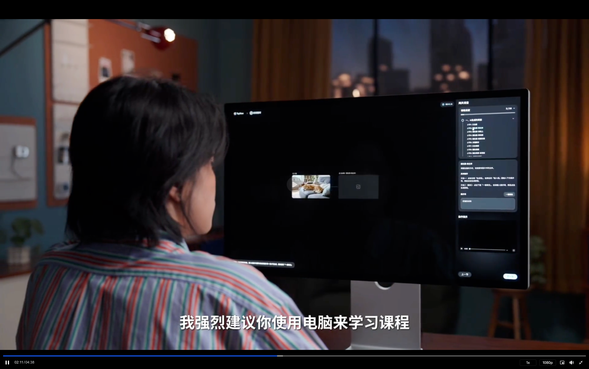
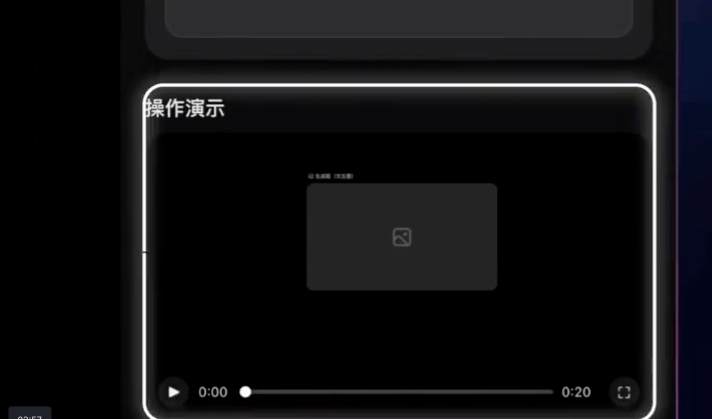

> 来源：[飞书原文](https://hcnbsg6ttb3t.feishu.cn/wiki/P4COwvRmhiqwWTkKIsOcrGclnsd)  
> 同步时间：2026-08-16T09:01:04.604Z  
> 文档标识：EPhXd1td5oSo4WxgQbjcXn0Jnx3

# ✅细化脚本

从完整成片出发，理解 AI 影视的能力边界与全流程，完成第一份可继续创作的任务书

| **授课人** | 罗永浩 |
|-|-|
| **目标时长** | 约 5—10 分钟（含 60 秒成片、案例拆解与课程地图） |
| **适合人群** | 办公人群、影音创作者、自媒体创作者，以及希望从零了解 AIGC 视频制作流程的学习者 |
| **文档用途** | 讲师逐句口播、导演分镜、录屏、动画、素材准备与后期制作执行稿 |

一、课程目标与节奏

| **学习结果** | 学完后，学员能解释 AI 影视的能力与边界，复述一支短片的完整制作流程，区分人和 AI 的工作，并完成一页可用于下一节的创作任务书。 |
|-|-|
| **教学节奏** | 成片冷开场 → 定义 AI 影视 → 五类能力 → 四类边界 → 九步流程 → 案例任务书 → 五段脚本 → 分镜转场 → 素材与版本 → 声音剪辑 → 人机复盘 → 课程地图 → 作业。 |
| **讲解原则** | 先给结果，再拆过程；不神化模型，也不把失败当笑料。所有结论回到具体任务、可见版本和明确验收标准。 |
| **成片结构** | A-roll 约 45%，成片、流程图、故事板、LibTV 画布、节点版本、时间轴和课程地图 B-roll 约 55%；开场 30—45 秒无口播。 |

# **01｜导学课**

<table><colgroup><col/><col/><col/><col/><col/><col/><col/><col/><col/><col/></colgroup><thead><tr><th vertical-align="top"><b>阶段</b></th><th vertical-align="top">大纲</th><th vertical-align="top">大纲</th><th>阶段</th><th>口播初稿</th><th>调整后口播</th><th>Broll</th><th>剪辑效果参考</th><th vertical-align="top">截图</th><th vertical-align="top">备注</th></tr></thead><tbody><tr><td vertical-align="top">开场</td><td rowspan="5" vertical-align="top">AI 成片开场</td><td rowspan="5" vertical-align="top"><ul><li><b>开场成片</b><ul><li>直接播放一段 30–60 秒的精彩成片</li><li>暂定《罗老师用 AI 的奇妙一天》：使用 Seedance 2.0 制作罗老师一天中经历的一连串超现实事件，重点展示混合参考、智能分镜、复杂运镜，以及视频编辑与延展能力。</li></ul></li><li><b>课程承接</b><ul><li>成片结束后，罗老师丝滑转场出场。</li><li>说明 AI 影视近年的进步，以及很多人仍不了解它能做什么、该怎么开始。</li></ul></li></ul></td><td rowspan="5"><b>01｜成片冷开场：先别听概念，先看 AI 影视已经能做到什么</b></td><td>【 无口播，直接播放《罗老师用 AI 的奇妙一天》成片。】</td><td></td><td>播放片子</td><td></td><td vertical-align="top">开场成片关键帧或播放画面</td><td vertical-align="top">开场不设口播；成片结束后自然切到罗老师出场。</td></tr><tr><td></td><td>大家好，我是罗永浩</td><td></td><td>成片结束后，讲师自然出场；镜头转为正面中景，画面叠加“先导课｜先了解全貌，再进入实操”</td><td></td><td></td><td></td></tr><tr><td></td><td>刚才这段片子，如果放在几年前，制作起来要找演员、找场地，还要搭景、做特效。 成本很高，普通人几乎不可能完成。</td><td>刚才这段片子，如果放在几年前，是一个我根本不会考虑的项目。倒不是技术上做不出来，是账算不过来——写脚本、找导演、找场地、搭景、做特效，而且对表演还有很高要求，不知道要花多少时间和精力。</td><td>讲师口播</td><td></td><td></td><td></td></tr><tr><td></td><td>但现在，只要学会使用 AI，普通人也能做到。 特效、短片，甚至剧集，都可以用 AI 来制作。</td><td>但现在，这件事变了。不是"做得更快了"这么简单，是我们做事的思维从"你有没有资源、有没有时间"，变成了"你有没有一个真正想表达的东西"。</td><td>讲师口播＋ 优秀案例播放</td><td></td><td></td><td></td></tr><tr><td></td><td>AI 视频正在走出专业团队。 越来越多人可以把自己的想法变成画面。 </td><td>先纠正一个特别普遍的误解。 很多人一说 AI 视频，脑子里浮现的是那种一眼假的画面：人物油得发光、表情僵硬、镜头飘来飘去。然后就得出结论——哦，AI 视频就是那个样子的。 <b>但我想说的是，AI 视频不是一种画风，它是一种生产方式。</b> 那些看着假的东西，不是 AI 只能做成那样，是做的人只走到了那一步。今天，AI的能力已经足够强大，但它还不是一个好用到不用学的状态。所以在这个阶段，你越强它就越强，你越会用AI，他给你的反馈就越接近你的想象。 这也是我们做这套课的原因。</td><td>画面延续上一条画布录屏，随后切回讲师</td><td></td><td></td><td></td></tr><tr><td rowspan="21" vertical-align="top">主要内容</td><td vertical-align="top">从成片进入课堂</td><td rowspan="5" vertical-align="top"><ul><li><b>课程定位</b><ul><li>通过工具讲解和案例跟练，带观众完成从素材准备到成片交付的完整过程。</li><li>课程重点是让观众会做、能练，并最终完成自己的作品。</li></ul></li></ul><ul><li><b>学习成果</b><ul><li>小到完成一条自己愿意发到朋友圈的视频。</li><li>大到完成一件可用于求职、接单或作品集展示的完整作品。</li></ul></li></ul></td><td rowspan="5"><b>02｜先把话说准确：AI 影视不是一种画风，而是一种生产方式</b></td><td>我们希望更多人能系统掌握 AI 视频制作。 因此，团队打造了这节《AI 视频全流程实战课程》。</td><td>我和团队一起，做了这套《AI 视频全流程实战课程》。</td><td rowspan="2">讲师口播</td><td></td><td vertical-align="top">罗老师正面口播画面</td><td vertical-align="top">讲清楚课程解决什么问题，不展开工具细节。</td></tr><tr><td></td><td>这套课程面向所有对 AI 视频感兴趣的朋友。 零基础可以从头开始。 有经验的朋友也可以继续提升。</td><td>它要解决的是另一个问题：<b>你知道 AI 能做视频，但你不知道从哪儿下手。</b></td><td></td><td></td><td></td></tr><tr><td></td><td>接下来的 13 节课，会先讲清基本原理。 工具怎么操作，也会一步步演示。 我们还会通过 5 个完整案例，串起整个制作流程。 创意、脚本和分镜，都会讲到。 素材生成和剪辑成片，也会完整练习。</td><td>接下来的 13 节课，我们会先讲原理，让你明白每一步在干什么、为什么是这个顺序；再讲工具怎么操作，一步步演示；最后用完整案例，把整条制作流程串起来——创意、脚本、分镜、素材生成、剪辑成片，从头走到尾。</td><td>讲师口播切LibTB里的课程展示再快速过一下完整案例的画布各个细节</td><td></td><td></td><td></td></tr><tr><td></td><td vertical-align="top">我们的目标不只是让你听懂。 更重要的是，让你真正上手实践。 最后完成属于自己的作品。</td><td>这套课的实操比重很高。我的目标不是让你听懂——<b>听懂是最容易的事，也是最没用的事。</b> 你听完觉得"哦，原来是这样"，然后关掉视频，三天后什么都不剩。更重要的是，让你真正上手实践，完成属于自己的作品。</td><td>画布各个细节展示完成之后，接 开始AI 生成的录屏，即点击生成按钮、生成进行中，以及生成出优秀素材的过程。</td><td></td><td></td><td></td></tr><tr><td></td><td>完成整套课程后，你会拥有自己的成片。 它可以是一条你愿意分享的视频。</td><td>在整套课程结束后，你大概率会得到一条你愿意分享的视频。</td><td>鼠标点击播放+部分素材的剪影</td><td></td><td></td><td></td></tr><tr><td rowspan="7" vertical-align="top">适用人群与学习成果</td><td rowspan="6" vertical-align="top"><ul><li><b>适用人群</b><ul><li>办公人群：制作汇报、活动宣传、内部培训和产品介绍视频。</li><li>影音创作者：补充分镜、素材生成、镜头设计和后期制作能力。</li><li>自媒体创作者：制作短视频、广告、短剧和 MV 等内容。</li><li>任何想要了解AIGC的人：从基础跟练开始，逐步完成可展示的个人作品。</li></ul></li></ul></td><td rowspan="6"><b>｜适用人群、学习成果与第一份作业</b></td><td>接下来，我们看看这套课程适合哪些人。</td><td></td><td>讲师出镜</td><td></td><td></td><td></td></tr><tr><td>它并不只面向专业创作者。</td><td></td><td>四类人群卡片依次出现：办公人群、影音创作者、自媒体创作者、零基础学习者</td><td></td><td></td><td></td></tr><tr><td>举例来说，办公人群可以用 AI 制作汇报和培训视频。 产品介绍也能做得更直观。</td><td><b>办公人群</b>，做汇报、做培训视频、做产品介绍。说实话，PPT 讲一屏参数，不如三秒画面来得直接。</td><td>办公场景的视频（模特坐在电脑桌前，电脑屏幕是AI制作的汇报）</td><td></td><td></td><td></td></tr><tr><td>影视创作者可以用它辅助分镜和生成素材。 也可以更快验证创意。</td><td><b>影音创作者</b>，用它补分镜、生成素材、验证创意。以前一个想法值不值得拍，你得先花钱拍出来才知道；现在可以先做出来看看，不行就换。</td><td>专业影视创作的场景视频（例如高端的AI影视制作屏幕特写，画面分别放大强调分镜和素材）</td><td></td><td></td><td></td></tr><tr><td>自媒体创作者可以用它制作短视频和广告。 短剧和 MV 也能完成。</td><td><b>自媒体创作者</b>，短视频、广告、短剧、MV 都能做。</td><td>自媒体的场景视频</td><td></td><td></td><td></td></tr><tr><td>就算没有拍摄和剪辑基础，也不用担心。 你可以从跟练开始，慢慢做出自己的作品。</td><td></td><td>切导师</td><td></td><td></td><td></td></tr><tr><td vertical-align="top"></td><td></td><td>也可以是一件用于求职、接单或作品集展示的完整作品。</td><td>总之，你可以获得小到一条你自己愿意发朋友圈的视频。大到一件能拿去求职、接单、放进作品集的完整作品。</td><td>快速蒙太奇展示：可分享的短片、广告或短剧成片、MV 片段、作品集页面</td><td></td><td></td><td></td></tr><tr><td rowspan="9" vertical-align="top">课程路线与学习方式</td><td rowspan="2" vertical-align="top"><ul><li><b>课程路线</b><ul><li>课程分为四个单元，共 13 节：课程引入、工具讲解、案例演示和结课作业。</li><li>从基础操作开始，逐步完成广告、短视频、短剧和 MV 等案例。</li></ul></li></ul></td><td rowspan="2"><b>课程路线</b></td><td>为了实现这些学习目标，我们设计了 13 节正式课程。 课程分为四个部分。 分别是课程引入、工具讲解、案例实战和结课作业。</td><td></td><td>课程路线图：13 节课分为课程引入、工具讲解、案例实战、结课作业四部分</td><td></td><td vertical-align="top">课程目录及四个单元结构</td><td vertical-align="top">简要介绍学习顺序，不逐节展开。</td></tr><tr><td>第一部分，建立全局认识，也就是你现在看到的先导课。 第二部分，学习AI工具的画布、节点、模型、提示词和智能功能。 第三部分，完成广告、短视频、短剧和 MV 等案例。 第四部分，独立完成并提交一支原创成片。</td><td></td><td>录制 LibTV 课程的课程表，到每一部分时，分别框出这些部分的课程，做一个强调，在强调的动效时刻进行讲解</td><td></td><td></td><td></td></tr><tr><td rowspan="3" vertical-align="top"><ul><li><b>LibTV 合作</b><ul><li>本课程与 LibTV 合作，主要练习在 LibTV 中完成。</li><li>LibTV 将图片、视频、音频生成和画布工作流集中在一个工具中，便于组织素材、生成镜头和完成制作。</li><li>课程将同步上线 LibTV 专属课堂，提供课程画布、源文件和练习入口。</li></ul></li></ul></td><td rowspan="3"><b>课程合作</b></td><td>这套课程实操比重很高。 所以，我和 LibTV 进行了深度合作。 图片、视频和音频，都能在 LibTV 里生成。 画布工作流也能在这里完成。 你可以在同一张画布上整理素材。 生成镜头和完成制作，也能接着进行。 不用再在多个软件之间反复切换。</td><td>这套课程实操比重很高。 图片、视频和音频，都能在 LibTV 里生成。 画布工作流也能在这里完成。 你可以在同一张画布上整理素材、生成镜头和完成制作。 不用再在多个软件之间反复切换。</td><td>是 LibTV 的主页面与无限画布工作流的页面，镜头做一个推进，到关键点位时，用亮色来进行环绕动效来强化</td><td></td><td vertical-align="top">LibTV 专属课堂课程页面参考图</td><td vertical-align="top">配合实际课程页面说明看课与进入练习的方式。</td></tr><tr><td rowspan="2">我们还为课程开发了专属线上课堂。 看课、练习和调用素材，都能顺畅衔接。 每节课都配有课程画布、源文件和练习入口。 看完演示，就可以直接进入练习。 不用再从零搭建。</td><td rowspan="2">我们还为课程开发了专属线上课堂。每节课都配有课程画布、源文件和练习入口——看完演示，就可以直接点进去练，不用从零搭建。</td><td rowspan="2">切换到 LibTV 专属线上课堂页面，依次标注课程画布、源文件和练习入口</td><td></td><td></td><td></td></tr><tr><td></td><td></td><td></td></tr><tr><td rowspan="3"><ul><li><b>两种跟练方式</b><ul><li>模拟跟练：按课程提示完成指定操作，熟悉每一步的用法。</li><li>自由跟练：在课程画布和源文件基础上自主修改，完成自己的版本。</li></ul></li></ul></td><td rowspan="3"><b>跟练方式</b></td><td>跟练分成两种。 第一种是模拟跟练。 按照课程提示完成指定操作。 先熟悉每一步怎么用。</td><td>跟练分两种。 <b>模拟跟练</b>，按课程提示完成指定操作，先熟悉每一步怎么用。</td><td rowspan="2">左右分屏展示模拟跟练与自由跟练：左侧按提示操作，右侧基于源文件修改的动效</td><td></td><td></td><td></td></tr><tr><td>第二种是自由跟练。 你可以继续修改课程画布和源文件。 最后做出自己的版本。</td><td><b>自由跟练</b>，在课程画布和源文件的基础上自己改，做出你自己的版本。</td><td></td><td></td><td></td></tr><tr><td>零基础可以先做模拟跟练。 熟悉之后，再进入自由创作。</td><td></td><td>模拟跟练的分屏先放大后缩小，自由创作的分屏，先缩小后放大，做一个强调的动作</td><td></td><td vertical-align="top">LibTV 跟练模式与自由练习页面参考图</td><td vertical-align="top">讲解时配合实际课堂界面，说明两种跟练方式的区别。</td></tr><tr><td rowspan="2" vertical-align="top"><ul><li><b>学员专属礼包</b><ul><li>如有更多创作积分或会员能力需求，学员可以自愿购买“罗永浩 × LibTV 学员专属礼包”。</li><li>礼包为单独购买项目，不影响使用课程已包含的练习权益完成学习。</li></ul></li></ul></td><td rowspan="2"></td><td>另外，我们还准备了一份学员专属礼包。 它就是“罗永浩 × LibTV 学员专属礼包”。 课程学员在活动期间购买，可享受 X 折优惠。</td><td></td><td>画面转为讲师口播，口播页面做礼包的动效，并弹出字幕“罗永浩 × LibTV 学员专属礼包”</td><td></td><td vertical-align="top">罗永浩 × LibTV 学员专属礼包页面参考图</td><td vertical-align="top">明确为自愿购买，具体内容和价格以购买页面为准。</td></tr><tr><td></td><td></td><td>礼包属于自愿购买。 不购买也不影响使用课程自带的练习权益。 大家仍然可以正常完成学习。</td><td>礼包属于自愿购买，不买完全不影响你学完这套课，课程自带的练习权益足够你走完全部内容。</td><td>字幕和礼包动效消失，转为讲师口播</td><td></td><td></td><td></td></tr><tr><td></td><td></td><td rowspan="3"></td><td rowspan="3"><b>结束</b></td><td>这节先导课，先带大家认识了整套课程。 课程内容和学习方式，也已经讲清楚了。 下一节，我们会正式进入 LibTV 实操。 先从画布和基础节点开始。 一起完成第一个 AI 镜头。</td><td>这节先导课，带大家认识了整套课程的内容和学习方式。 下一节，我们正式进入 LibTV 实操，从画布和基础节点开始，一起完成第一个 AI 镜头。</td><td>下一节预告动画：LibTV 画布 → 基础节点 → 第一个 AI 镜头</td><td></td><td></td><td></td></tr><tr><td></td><td></td><td>课后可以先打开课堂里的练习入口。 提前熟悉一下操作界面。</td><td></td><td rowspan="2">预告动画转导师口播，最后做一个结束的动效</td><td></td><td></td><td></td></tr><tr><td></td><td></td><td>期待大家跟着整套课程一步步学习。 最终做出自己的 AI 作品。 我们下一节见。</td><td></td><td></td><td></td><td></td></tr></tbody></table>

## 需要的案例

以下案例待提供

| 案例名称 | 数量 | 具体要求 | 交付内容 |
|-|-|-|-|
| Seedance 2.0 开场成片：《罗老师用 AI 的奇妙一天》（暂定） | 1 条 | 时长 30–60 秒。使用 Seedance 2.0，围绕罗老师一天中的奇妙经历展开，以连续、完成度高的片段展示混合参考、智能分镜、运镜复刻，以及视频编辑与延展能力。只需明确整体设定，不在本节展开详细剧情。 | 16:9、1080P 的 MP4 成片；无字幕版和带字幕版各 1 条；5–8 张关键帧；一句话案例介绍。 |
| LibTV 专属课堂界面素材 | 1 组 | 清楚展示课程画布、源文件和练习入口，并分别标出“模拟跟练”和“自由跟练”，便于观众理解两种方式的区别。 | 完整界面截图 1 张；模拟跟练入口截图 1 张；自由跟练入口截图 1 张；必要的局部放大图。 |

### 配套动画（暂定）

| 动画名称 | 数量 | 具体要求 | 交付内容 |
|-|-|-|-|
| AI 影视完整制作流程动画 | 1 段 | 时长约 10—15 秒；依次呈现创意、脚本、分镜、素材准备、图片生成、视频生成、声音、剪辑和成片，帮助观众建立完整流程认知。 | 16:9、1080P 成片；可编辑工程文件；使用到的图标与字体；无字幕版和带文字示意版。 |

## 参考案例

[附件：7月14日 (1)(1).mp4](./assets/OkKybwJvhoQJWXxF6EqcBoawnHc.mp4)

## 本地素材清单

- [image.png](./assets/NiZsbctUXoX1lFxiTZ9c8mKTnee.png)（media，3294128 字节）
- [image.png](./assets/RWbhbukxCoueVqxsh59cG6LynYb.png)（media，41169 字节）
- [course_1.png](./assets/MCZAbnjjZougjJxlcNBcx0tonge.png)（media，1068123 字节）
- [practice_1.png](./assets/SxMBbjeb3oDujDxu6zbcunjenId.png)（media，546837 字节）
- [package.png](./assets/APMIbyr4aoT0f8xqPXkc8BTonHg.png)（media，1537493 字节）
- [7月14日 (1)(1).mp4](./assets/OkKybwJvhoQJWXxF6EqcBoawnHc.mp4)（media，290153948 字节）
