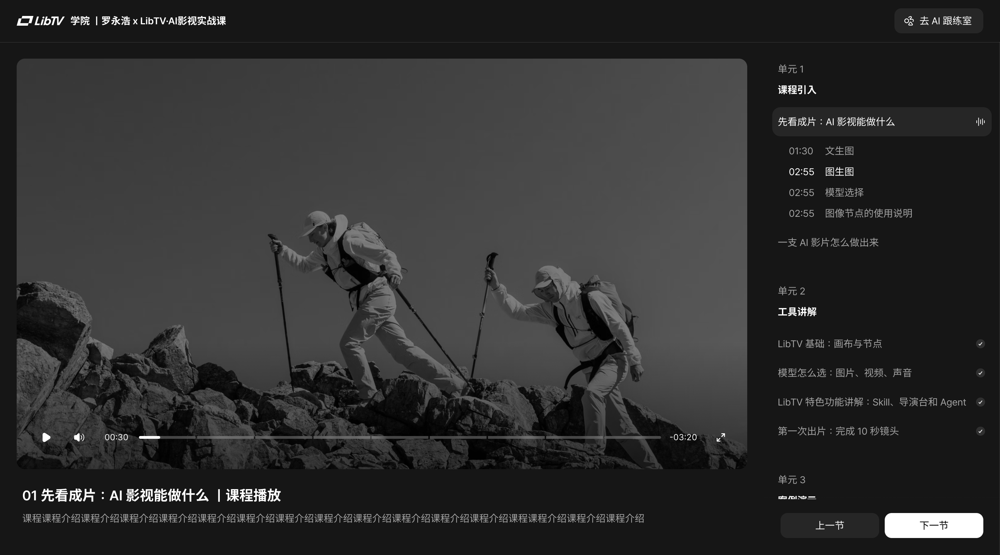
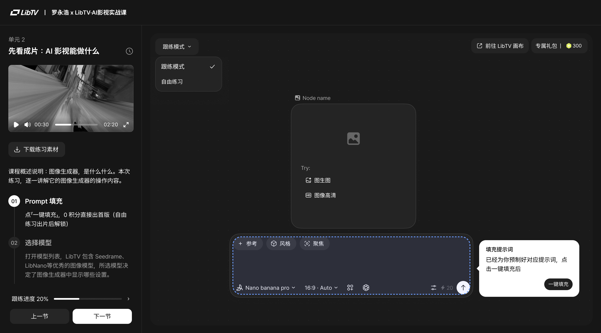
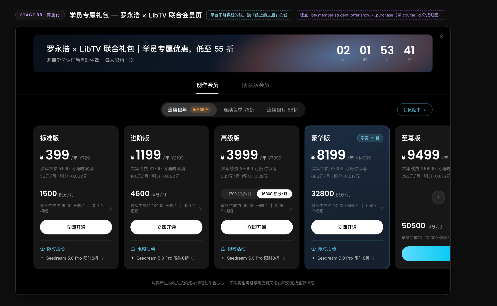

> 来源：[飞书原文](https://hcnbsg6ttb3t.feishu.cn/wiki/GmXOwSwpqikwBBkvGH2c4yIwnbg)  
> 同步时间：2026-08-16T09:01:04.604Z  
> 文档标识：YvjddNmG0oXYutxSL28cDMhmn0c

# 第一节：导学课：AI 影视能做什么

> **提示**
>
**引入｜这节课会讲什么**
本节以 30–60 秒 AI 成片开场。随后选取约 15 秒内容，拆解一支 AI 片子从想法到成片的完整流程，并带过必要的影视基础名词。最后介绍课程适用人群、学习成果、课程安排和 LibTV 跟练方式。
- **核心内容：**Seedance 2.0 开场成片《罗老师用 AI 的奇妙一天》（暂定）、AI 视频完整制作流程与基础名词、课程定位、适用人群、学习成果和跟练方式。
- **学完你会：**知道一支 AI 片子从想法到成片要经历哪些步骤，并明确从课堂跟练到完成个人作品的学习路径。

# **01｜先看成片：AI 影视能做什么**

<table><colgroup><col/><col/><col/><col/><col/></colgroup><thead><tr><th vertical-align="top"><b>阶段</b></th><th vertical-align="top">大纲</th><th vertical-align="top">内容</th><th vertical-align="top">截图</th><th vertical-align="top">备注</th></tr></thead><tbody><tr><td vertical-align="top">开场</td><td vertical-align="top">AI 成片开场</td><td vertical-align="top"><ul><li><b>开场成片</b><ul><li>直接播放一段 30–60 秒的精彩成片</li><li>暂定《罗老师用 AI 的奇妙一天》：使用 Seedance 2.0 制作罗老师一天中经历的一连串超现实事件，重点展示混合参考、智能分镜、复杂运镜，以及视频编辑与延展能力。</li></ul></li></ul></td><td vertical-align="top">开场成片关键帧或播放画面</td><td vertical-align="top">开场不设口播；成片结束后自然切到罗老师出场。</td></tr><tr><td rowspan="8" vertical-align="top">主要内容</td><td rowspan="2" vertical-align="top">从成片进入课堂</td><td vertical-align="top"><ul><li><b>课程承接</b><ul><li>成片结束后，罗老师丝滑转场出场。</li><li>说明 AI 影视近年的进步，以及很多人仍不了解它能做什么、该怎么开始。</li></ul></li></ul></td><td vertical-align="top">成片结尾切换到罗老师出场的画面</td><td vertical-align="top">转场要自然，不再单独设置“欢迎来到课程”的开场引入。</td></tr><tr><td vertical-align="top"><ul><li><b>课程定位</b><ul><li>通过工具讲解和案例跟练，带观众完成从素材准备到成片交付的完整过程。</li><li>课程重点是让观众会做、能练，并最终完成自己的作品。</li></ul></li><li><b>一支 AI 视频如何完成</b><ul><li>以约 15 秒片段为例：想法与目标 → 脚本 → 分镜 → 素材准备 → 画面生成 → 配音与音乐 → 剪辑 → 成片。</li></ul></li></ul></td><td vertical-align="top">罗老师正面口播画面</td><td vertical-align="top">讲清楚课程解决什么问题，不展开工具细节。</td></tr><tr><td rowspan="2" vertical-align="top">适用人群与学习成果</td><td vertical-align="top"><ul><li><b>适用人群</b><ul><li>办公人群：制作汇报、活动宣传、内部培训和产品介绍视频。</li><li>影音创作者：补充分镜、素材生成、镜头设计和后期制作能力。</li><li>自媒体创作者：制作短视频、广告、短剧和 MV 等内容。</li><li>任何想要了解AIGC的人：从基础跟练开始，逐步完成可展示的个人作品。</li></ul></li></ul></td><td vertical-align="top">办公、自媒体、影音创作和新手学习场景示意</td><td vertical-align="top">按人群说明能解决的问题，不只强调“对新手友好”。</td></tr><tr><td vertical-align="top"><ul><li><b>学习成果</b><ul><li>小到完成一条自己愿意发到朋友圈的视频。</li><li>大到完成一件可用于求职、接单或作品集展示的完整作品。</li></ul></li></ul></td><td vertical-align="top">朋友圈视频与作品集案例示意</td><td vertical-align="top">避免承诺就业或收入，重点说明作品可达到的完成度。</td></tr><tr><td rowspan="4" vertical-align="top">课程路线与学习方式</td><td vertical-align="top"><ul><li><b>课程路线</b><ul><li>课程分为四个单元，共 13 节：课程引入、工具讲解、案例演示和结课作业。</li><li>从基础操作开始，逐步完成广告、短视频、短剧和 MV 等案例。</li></ul></li></ul></td><td vertical-align="top">课程目录及四个单元结构</td><td vertical-align="top">简要介绍学习顺序，不逐节展开。</td></tr><tr><td vertical-align="top"><ul><li><b>LibTV 合作</b><ul><li>本课程与 LibTV 合作，主要练习在 LibTV 中完成。</li><li>LibTV 将图片、视频、音频生成和画布工作流集中在一个工具中，便于组织素材、生成镜头和完成制作。</li><li>课程将同步上线 LibTV 专属课堂，提供课程画布、源文件和练习入口。</li></ul></li></ul></td><td vertical-align="top">LibTV 专属课堂课程页面参考图</td><td vertical-align="top">配合实际课程页面说明看课与进入练习的方式。</td></tr><tr><td vertical-align="top"><ul><li><b>两种跟练方式</b><ul><li>模拟跟练：按课程提示完成指定操作，熟悉每一步的用法。</li><li>自由跟练：在课程画布和源文件基础上自主修改，完成自己的版本。</li></ul></li></ul></td><td vertical-align="top">LibTV 跟练模式与自由练习页面参考图</td><td vertical-align="top">讲解时配合实际课堂界面，说明两种跟练方式的区别。</td></tr><tr><td vertical-align="top"><ul><li><b>学员专属礼包</b><ul><li>如有更多创作积分或会员能力需求，学员可以自愿购买“罗永浩 × LibTV 学员专属礼包”。</li><li>礼包为单独购买项目，不影响使用课程已包含的练习权益完成学习。</li></ul></li></ul></td><td vertical-align="top">罗永浩 × LibTV 学员专属礼包页面参考图</td><td vertical-align="top">明确为自愿购买，具体内容和价格以购买页面为准。</td></tr></tbody></table>

## 需要的案例

以下案例待提供

| 案例名称 | 数量 | 具体要求 | 交付内容 |
|-|-|-|-|
| Seedance 2.0 开场成片：《罗老师用 AI 的奇妙一天》（暂定） | 1 条 | 时长 30–60 秒。使用 Seedance 2.0，围绕罗老师一天中的奇妙经历展开，以连续、完成度高的片段展示混合参考、智能分镜、运镜复刻，以及视频编辑与延展能力。只需明确整体设定，不在本节展开详细剧情。 | 16:9、1080P 的 MP4 成片；无字幕版和带字幕版各 1 条；5–8 张关键帧；一句话案例介绍。 |
| LibTV 专属课堂界面素材 | 1 组 | 清楚展示课程画布、源文件和练习入口，并分别标出“模拟跟练”和“自由跟练”，便于观众理解两种方式的区别。 | 完整界面截图 1 张；模拟跟练入口截图 1 张；自由跟练入口截图 1 张；必要的局部放大图。 |

### 配套动画（暂定）

| 动画名称 | 数量 | 具体要求 | 交付内容 |
|-|-|-|-|
| AI 影视完整制作流程动画 | 1 段 | 时长约 10—15 秒；依次呈现创意、脚本、分镜、素材准备、图片生成、视频生成、声音、剪辑和成片，帮助观众建立完整流程认知。 | 16:9、1080P 成片；可编辑工程文件；使用到的图标与字体；无字幕版和带文字示意版。 |

## 参考案例

[附件：7月14日 (1)(1).mp4](./assets/Ss3mbt2v0oSei3xIDiocSnYgn6g.mp4)

13 【尤栗为理想L9 Livis幕后作曲 - Yuri尤栗 | 小红书 - 你的生活兴趣社区】 😆 9yVqekwqfmydCLW 😆 https://www.xiaohongshu.com/discovery/item/69e5ae74000000002301dbec?source=webshare&xhsshare=pc_web&xsec_token=ABuRJJU109T2WDr2gaDmwnJPkYUp3AWmo57Rq90FXoaBE=&xsec_source=pc_share

1. 瞬息全宇宙——罗老师视频开场https://www.douyin.com/video/7208075460016721212https://v.douyin.com/DvfOjKlOkhg/ 
2. AI航拍视角[只需一条线，就能生成第一视角航拍视频！ #aigc #ai新星计划  #ai提示词 #fpv - 抖音](https://v.douyin.com/AweEAhQaDqA/)
3. AI真实感人脸[《如何让人脸生成更加真实？别追求完美！》 - 小红书](https://www.xiaohongshu.com/explore/6a1d035e0000000008025873?xsec_token=AB7ORAyoLcGFI-QEMOBB7kERE3IDyfAVYFGzh3v2L0Cis=&xsec_source=pc_search)
4. 陶陶阿狗君抛手机转场 [偷偷告诉你！AI视频的新流量密码… - 小红书](https://www.xiaohongshu.com/explore/699e8869000000001b01498a?xsec_token=ABlLkCp8eUyIrCpg6R45ITpAPv2E5iNSDiDZICfv-Le18=&xsec_source=pc_search&source=web_explore_feed)
5. AI空间导演台 http://xhslink.cn/o/AQgwrZ7NB6z
6. AI编辑视频效果😆 [一个让我害怕的 AI 视频模型... - 小红书](https://www.xiaohongshu.com/discovery/item/6a1ebc210000000036019ee9?source=webshare&xhsshare=pc_web&xsec_token=ABVgFJpM9CphqdumOxYeRGWvyc7rLx1oYGbkkMANxlidM=&xsec_source=pc_share)
7. AI特效成片😆 [成片+教程|影视Agent做短片如此简单！！ - 小红书](https://www.xiaohongshu.com/discovery/item/6a63226c00000000010316ba?source=webshare&xhsshare=pc_web&xsec_token=AB8NRVQBKR7CAJ7ZA2nnYdu5EpX9_FJbU3jfftaz4FyaQ=&xsec_source=pc_share)

## 本地素材清单

- [course_1.png](./assets/UEJJbp3tIoRFTHxAOsHcAIw3n6f.png)（media，1068123 字节）
- [practice_1.png](./assets/FoWKbxuiwokiBnxMyrQcYbjKnvR.png)（media，546837 字节）
- [package.png](./assets/WNwmb9XAwoDDAux6RLnczOobn2g.png)（media，1537493 字节）
- [7月14日 (1)(1).mp4](./assets/Ss3mbt2v0oSei3xIDiocSnYgn6g.mp4)（media，290153948 字节）
