> 来源：[飞书原文](https://hcnbsg6ttb3t.feishu.cn/wiki/DaTWwT5ayirwxKkzAY6cmPLznZg)  
> 同步时间：2026-08-16T09:01:04.604Z  
> 文档标识：KfOSdGIVCoC43qxp5sNcJ6rendc

# ✅细化脚本

从文字节点到图片、视频节点，跑通第一条 AI 视频工作流

| **授课人** | 罗永浩 |
|-|-|
| **目标时长** | 约 10 分钟（正常语速，含录屏操作与结果停留） |
| **适合人群** | 第一次接触 LibTV 的零基础学习者 |
| **案例主线** | 人像图生成 → 街舞短片 → 版本确认与导出 |
| **文档用途** | 讲师逐句口播、导演分镜、录屏与后期制作执行稿 |

| **这节课的核心承诺**   不把所有按钮讲一遍，只让学员真正跑通一次：文字负责想清楚，图片负责定形象，视频负责让形象动起来。 |
|-|

 

# 一、课程目标与节奏

| **学习结果** | 学完后，学员能看懂画布、节点和连接线；能创建文字、图片、视频节点；能完成一条可复用的基础工作流。 |
|-|-|
| **教学节奏** | 先看最终结果 → 认识画布 → 文字节点 → 图片节点 → 视频节点 → 查看版本与导出 → 总结。 |
| **讲解原则** | 每讲一个概念，立刻用同一个案例验证；画面能说明的，不让讲师重复描述。 |
| **成片结构** | A-roll 约 35%，录屏与结果 B-roll 约 65%；重点步骤采用局部放大、鼠标高亮和前后对比。 |

<table><colgroup><col/><col/><col/><col/><col/><col/><col/><col/><col/><col/></colgroup><thead><tr><th vertical-align="top"><b>阶段</b></th><th vertical-align="top">大纲</th><th vertical-align="top">内容</th><th>阶段</th><th>初版口播飞书引用</th><th>调整后口播飞书引用</th><th vertical-align="top">Broll（录屏、解说动画、其他拍摄需求）</th><th>剪辑效果参考</th><th vertical-align="top">截图</th><th vertical-align="top">备注</th></tr></thead><tbody><tr><td></td><td></td><td rowspan="7">刚进入 LibTV，画布、节点和各种按钮可能看起来有点多。这一节我们只做一件事：从文字节点开始，依次完成图片和视频节点，先把最基础的一条工作流跑通。</td><td rowspan="7"><b>01｜结果先行：让观众先看到这节课能做什么</b></td><td>前面的课程中，我们介绍了AI影视能够做什么，那么从本节课开始，我们将从基础功能到具体案例，正式学习LibTV的操作。</td><td></td><td>讲师出镜</td><td></td><td></td><td></td></tr><tr><td rowspan="6">课程开始</td><td rowspan="6">引入</td><td>屏幕上这张，是我们用 LibTV 做出来的人物正面图。</td><td>我先把这节课的结果放给你看。 屏幕上这张，是用 LibTV 做出来的人物正面图。</td><td>放正面图可以生成一个小男孩或者小女孩）</td><td></td><td></td><td></td></tr><tr><td>接下来这段，是基于我的人物形象生成的街舞视频。</td><td>接下来这一段，是基于这张图生成的街舞视频。</td><td>播放最有冲击力的3秒动作。
[附件：视频节点 2.mp4](./assets/VrXybTrKdo7TJ8xZTFKc3xmYnQc.mp4)
</td><td></td><td></td><td></td></tr><tr><td>从一段文字，到一张角色设定图，再到一段能播放、能导出的视频，整个过程都在同一张画布里完成。</td><td>从一句话，到一张图，再到一段能播放、能导出的视频——整个过程都在同一张画布里完成，中间没有换过任何软件。</td><td>动画效果： 放提示词 ➡️ 放角色设定 ➡️ 放完整视频 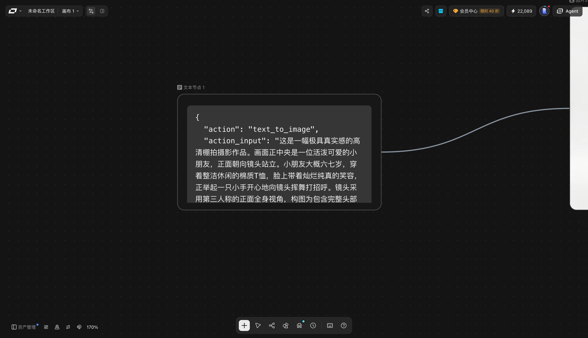
[附件：视频节点 2.mp4](./assets/J5QcbW4KGoDGLmxmaY6cSwfInNe.mp4)
</td><td></td><td></td><td></td></tr><tr><td>大家好，我是罗永浩。</td><td></td><td rowspan="3">讲师出镜对着讲的画面 加讲师动作端着字幕： 文本节点 图片节点 视频节点  </td><td></td><td></td><td></td></tr><tr><td>今天这节课我们只做一件事：从文本节点开始，依次完成图片节点和视频节点，亲手跑通一条最基础、也是最常用的 AI 视频工作流。</td><td>你现在知道我们会达成一个什么样的结果，接下来我们只做一件事：从文本节点开始，依次完成图片节点和视频节点，这是最常用的 AI 视频工作流。但你需要亲手把这条链跑通一遍。</td><td>效果参考
[附件：8月8日(9)-1.mp4](./assets/NHtVbGVRloti4QxnUUdcf7Zcncc.mp4)
</td><td></td><td></td></tr><tr><td>这条链路是 LibTV 所有创作的基础，后面再做复杂组合，都会轻松很多。话不多说，我们直接进行实操。</td><td>这条链看着简单，但后面所有复杂的东西，都是它的排列组合。所以基础要打牢。 话不多说，我们直接进行实操。</td><td>效果参考
[附件：8月8日(12)-1.mp4](./assets/T48HbiUWEo53HdxAwaFcyKC4nct.mp4)
</td><td></td><td></td></tr><tr><td></td><td rowspan="17">打开项目并认识画布</td><td rowspan="17"><ul><li><b>进入项目</b><ul><li>从首页搜索或浏览创作者项目。</li><li>点击“查看制作过程”，进入项目画布。</li></ul></li><li><b>认识画布</b><ul><li>查看画布区域、节点、连接线和基础工具。</li><li>了解如何新建项目、移动画布和查看节点关系。</li></ul></li></ul></td><td>开场章节动画</td><td></td><td></td><td>需要做一段开场动画</td><td>开场动画效果参考
[附件：8月8日(7)-1.mp4](./assets/AbX2bk864oM0y6xryX5cFHt3n1e.mp4)
</td><td></td><td></td></tr><tr><td></td><td rowspan="15"><b>02｜建立界面认知：</b></td><td>首先，我们打开 LibTV 首页，<del>最先看到的就是页面左侧的</del><b><del>导航栏</del></b><del>，</del>这是整个创作流程的功能总入口，所有核心功能都集中在这里。</td><td>打开 LibTV 首页，左边这一条是导航栏，所有核心功能的总入口都在这儿——新建项目、回到首页、Skills、创作者挑战赛，还有你自己的项目管理。</td><td>出镜+左侧导航栏的效果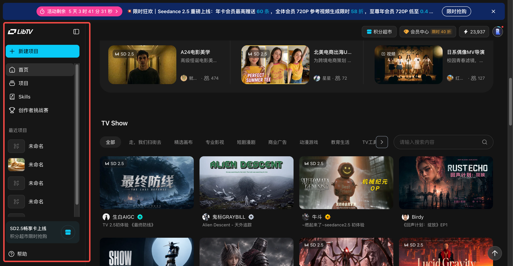</td><td></td><td></td><td></td></tr><tr><td></td><td><del>导航栏集成了三大重点区域：新建项目、回到首页、Skills、创作者挑战赛和项目管理区域。</del></td><td></td><td>动画效果</td><td>文字：导航栏 -- 新建项目、首页、项目、Skills、创作者挑战赛
[附件：8月8日(5)-1.mp4](./assets/H1Gcb3jL1o6ZnLxYcWDcyVE7n6d.mp4)
</td><td></td><td></td></tr><tr><td></td><td><del>看完左侧导航栏，我们把视线移到</del> 首先是页面最核心的位置，也就是页面居中的<b>画布区域</b>，这是 LibTV 的创作核心板块。</td><td>页面中间这块是画布区域，LibTV 的创作核心板块。</td><td>录屏+人物小窗
[附件：录屏2026-08-09 16.04.24.mov](./assets/OfVGbHru6o7oCtxAdwmcxbBwnbe.mov)
</td><td>样式参考
[附件：8月8日(13)-1.mp4](./assets/WmsHb3RHXoS9Vkxw151cniTynMg.mp4)
</td><td></td><td></td></tr><tr><td></td><td>所有视频制作和流程搭建都在这里完成。这也是我们本节课的重点。</td><td>所有视频制作和流程搭建都在这里完成，也是我们这节课的重点。</td><td>讲师出镜对着讲的画面</td><td></td><td></td><td></td></tr><tr><td></td><td>第二个区域是LibTV活动区，热门作品榜单、新模型上线和赛事活动都会在这里更新。</td><td>再往下，是活动区，热门作品、新模型上线、赛事都在这儿更新。</td><td>录屏+人物小窗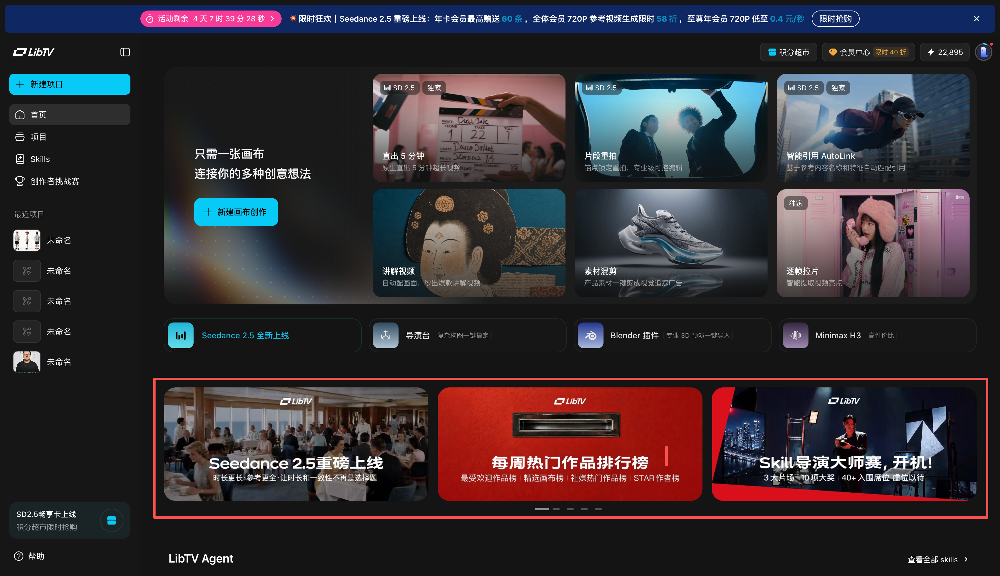</td><td>样式参考
[附件：8月8日(13)-1.mp4](./assets/WznZb3VhIop11gxeP6icHmd2nSe.mp4)
</td><td></td><td></td></tr><tr><td></td><td>再往下是LibTV Agent板块，我们将在后续课程中重点介绍。</td><td></td><td>录屏+人物小窗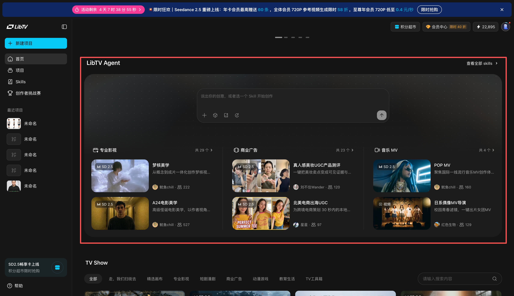</td><td></td><td></td><td></td></tr><tr><td></td><td>紧接着是 TV show，这里汇集了很多优质创作者的作品，也可以看到这些作品的创作过程。</td><td>然后是 TV show，汇集了很多创作者的作品。</td><td>录屏+人物小窗
[附件：录屏2026-08-09 16.21.50.mov](./assets/W77obQfqTox9XExLniHcuDC5nmf.mov)
</td><td></td><td></td><td></td></tr><tr><td></td><td>找到一个你感兴趣的作品，点击“查看制作过程”，就会进入它的项目画布。</td><td>TV show 这块我要多说一句。你在这儿找到任何一个感兴趣的作品，点"查看制作过程"，就能直接进到它的项目画布里去。 这件事在传统影视行业基本不可能。 你看到一支很牛的片子，你只能看到成片，没人会把工程文件摊开给你看。但在这里，结果和过程是放在一起的——你不光能看见人家做出了什么，还能看见人家是怎么一步步做出来的。</td><td>录屏+人物小窗
[附件：录屏2026-08-09 16.23.49.mov](./assets/Ib4CbfvVDobG83xEAKKcMt9RnVc.mov)
</td><td></td><td></td><td></td></tr><tr><td></td><td> 你可以直接新建项目，也可以先浏览平台上的创作者作品。对新手来说，我更建议先看一个已经做完的项目，因为最终结果和制作过程可以放在一起对照。</td><td>所以我给新手的建议是：先别急着新建项目，先去拆两个别人已经做完的项目。把最终结果和制作过程可以放在一起对照。这就像想学会一个魔术，最有效的方法不是看魔术表演，是看解密视频。</td><td>讲师对着讲</td><td></td><td></td><td></td></tr><tr><td></td><td>第一次进入时，点击“新建画布创作”，就会来到 LibTV 自由画布区域。</td><td>好，看完别人的，我们自己来。点击"新建画布创作"，进入自由画布。</td><td>讲师出镜对着讲的画面</td><td></td><td></td><td></td></tr><tr><td></td><td>双击画布，准备新建并开始创作时，大家可能会有一个很自然的反应：添加节点栏按钮怎么这么多，节点之间怎么连起来，我到底应该从哪里开始？</td><td>双击画布，准备开始的时候，大部分人会有一个很自然的反应：这么多按钮，节点之间怎么连，我到底该从哪儿下手？</td><td>讲师出镜对着讲的画面+字幕效果 字幕：节点之间怎么连？如何开始？
[附件：录屏2026-08-09 18.20.17.mov](./assets/QVcCbZDDDoikZWxkXqKcj1Innpb.mov)
</td><td>放参考素材</td><td></td><td></td></tr><tr><td></td><td>其实先不要管具体按钮。你只需要在 LibTV 里，一个节点，就是创作流程里的一道工序。</td><td>先不用管具体按钮。你只要记住一句话：在 LibTV 里，一个节点，就是创作流程里的一道工序。</td><td>讲师右手抓‘节点’两字，左手抓‘工序’两字</td><td>放参考素材</td><td></td><td></td></tr><tr><td></td><td>文字节点负责把想法说清楚； 图片节点负责把画面定下来； 视频节点负责让画面动起来。         </td><td></td><td></td><td>配一个类似这样的动画
[附件：8月8日(2)-1.mp4](./assets/A1DTb0zMdoEEXexAtoUcF4cinVh.mp4)
</td><td></td><td></td></tr><tr><td></td><td>节点之间由连接线串联起来，这代表上一道工序的结果会交给下一道工序继续使用。 节点之间的线，是上下游关系。判断流程时，沿着连接线看一遍，就知道素材从哪里来、最后去了哪里。</td><td>节点之间用连接线串起来，代表上一道工序的结果，交给下一道工序继续用。判断一个流程，沿着连接线走一遍，就知道素材从哪儿来、最后去了哪儿。 那为什么要做成画布，不做成一个对话框，你说一句它出一句？ 因为<b>创作往往不是线性的</b>。你很可能会反复回到某一步去改。在对话框里改，前面的东西你想找回来得在聊天记录里往上翻半天；而在画布上，每一步都还在原地待着，你改了哪一步、会影响到哪一个结果，一眼就看得见。</td><td>录屏：
[附件：8月8日(4)-1.mp4](./assets/ISLNbEs3UooP9uxKaP8cxxndnwc.mp4)

[附件：录屏2026-08-09 18.21.29.mov](./assets/QlU4bR76docMlyxgC3JcL24PnHf.mov)
</td><td></td><td></td><td></td></tr><tr><td rowspan="2" vertical-align="top">准备</td><td>所以你看到的不是一堆散乱的工具，而是一条能看见、能修改、也能复用的制作流程。今天我们就用三个节点，把这件事跑一遍。</td><td>所以现在你看到的不是一堆散乱的工具，是一条能看见、能修改、也能复用的制作流程。</td><td>做个动画效果： 能看见、能修改、能复用，这三个词依次点亮</td><td>
[附件：8月8日(10)-1.mp4](./assets/SdkrbvQqQos0JrxaPavca9u3nBc.mp4)
</td><td vertical-align="top">LibTV 首页、查看制作过程和画布界面

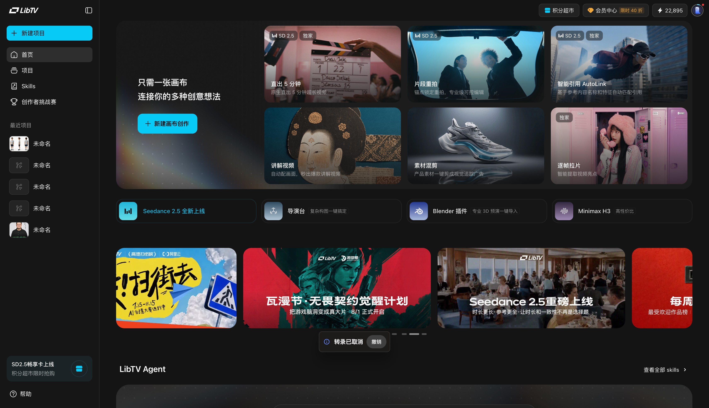

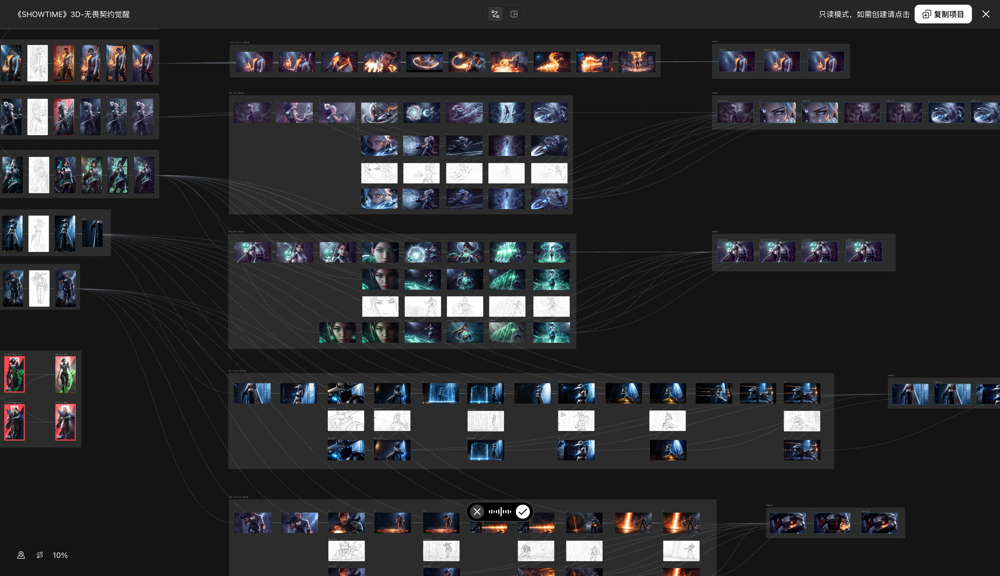

</td><td vertical-align="top">可沿用现有首页与画布截图。</td></tr><tr><td></td><td>新手阶段我们不需要记每个菜单的位置最重要的是要明白：我现在在哪一步，这一步需要什么输入，会产生什么结果。</td><td>新手阶段真的不需要背菜单在哪儿。你只要随时能回答三个问题：<b>我现在在哪一步，这一步需要输入什么，它会产出什么。</b> 今天我们就用三个节点，把这件事跑一遍。</td><td>讲师出镜   做个动画效果： 从哪一步开始      产生什么结果</td><td></td><td></td><td></td></tr><tr><td rowspan="15" vertical-align="top">核心步骤</td><td rowspan="6" vertical-align="top">步骤一｜文字节点</td><td rowspan="5" vertical-align="top"><ul><li><b>基础讲解</b><ul><li><b>输入与编辑：</b>手动输入、修改和整理文字内容。</li><li><b>AI 辅助：</b>根据任务生成或补充提示词、故事和剧本。</li><li><b>图片反推提示词：</b>上传参考图，提取画面元素并生成文字描述。</li><li><b>文字生音乐：</b>通过提示词生成基础音乐素材。</li></ul></li></ul></td><td rowspan="5"><b>文字节点：把模糊想法变成可执行指令</b></td><td>下面开始第一步，双击画布创建文本节点。</td><td>第一步，双击画布，创建文本节点。</td><td rowspan="2">录屏
[附件：录屏2026-08-09 18.33.03.mov](./assets/DqUrbz4Doo22YbxkwlKckHQbnnd.mov)
</td><td></td><td vertical-align="top">文字节点功能界面</td><td vertical-align="top">先讲清楚文字节点能输入什么、能生成什么。</td></tr><tr><td>很多人会把文字节点理解成一个记事本。它当然可以手动输入、修改和整理文字，但它的作用不只是输入文字。</td><td>很多人会把它理解成一个记事本。它当然可以手动输入、修改和整理文字，但它的作用远不止这个。</td><td></td><td></td><td></td></tr><tr><td>还可以让 AI 帮你扩写提示词、整理故事和剧本； 也可以上传一张参考图，让它反推出画面描述；甚至可以根据文字生成基础音乐素材。</td><td>你还可以让 AI 帮你扩写提示词、整理故事和剧本；也可以上传一张参考图，让它反推出画面描述；甚至可以根据文字直接生成基础音乐素材。 这个反推功能我要单独提一下，它其实是给一类人准备的——<b>"我说不清楚，但我看见了就知道对不对"</b>。这个很正常，因为审美和表达本来就是两种能力。你把喜欢的图丢进去，让它替你把话说出来，你再在它的基础上改，比你对着空白框硬憋要快得多。</td><td>录屏</td><td></td><td></td><td></td></tr><tr><td>这些功能看起来很多，但它们本质上都在解决同一个问题：在生成图片或视频之前，先把你真正想要的东西说清楚。</td><td>这些功能看着杂，但它们本质上都在解决同一个问题：<b>在生成图片或视频之前，先把你到底想要什么说清楚。</b></td><td>讲师出镜</td><td></td><td></td><td></td></tr><tr><td>今天我们用一个具体案例进行演示：先生成一张正在挥手的小男孩正面图，再用这张图生成一段跳舞视频。</td><td></td><td>放正面图 放演示动画：素材--一张图到一个视频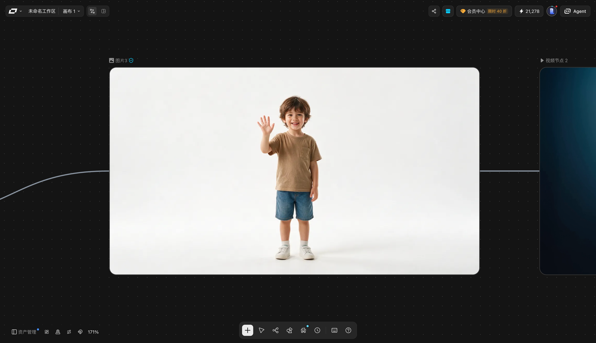</td><td></td><td></td><td></td></tr><tr><td rowspan="2" vertical-align="top"><ul><li><b>案例演示</b><ul><li>创建文字节点，输入“罗永浩老师三视图”的基础要求。</li><li>补充正面、侧面、背面、服装一致和简洁背景等信息。</li><li>现场生成并确认一版可直接交给图片节点使用的提示词。</li></ul></li></ul></td><td rowspan="2"></td><td>这里我输入最基础的提示词：“生成一张正在挥手的小朋友，写实正面视角，白色背景”。然后，点击发送。</td><td></td><td>录屏 
[附件：录屏2026-08-10 13.56.00.mov](./assets/PSWnbb2Ijo1ZFRxUSmEc5rYOnXd.mov)
</td><td></td><td vertical-align="top">正面图提示词生成过程</td><td vertical-align="top">生成结果直接进入下一步，不单独放到课程末尾。</td></tr><tr><td></td><td>AI会自动生成更详细的提示词，包含 小男孩的外观、正面视角、挥手动作、背景和光线等。 你只需要核对是否符合你的需求或者略作修改即可。</td><td></td><td rowspan="2">录屏
[附件：录屏2026-08-09 22.25.59.mov](./assets/NkKqbIpb1olAAnxbNHTciPGZnpd.mov)
</td><td></td><td></td><td></td></tr><tr><td rowspan="4" vertical-align="top">步骤二｜图片节点</td><td rowspan="3" vertical-align="top"><ul><li><b>基础讲解</b><ul><li><b>生成方式：</b>文生图、图生图和添加参考图。</li><li><b>模型选择：</b>在这里可以选择图片模型；具体的模型类型会在下一节详细讲解。</li><li><b>基础参数：</b>设置画面比例、画质和生成数量。</li><li><b>常用设置：</b>比例可选 3:4、16:9、9:16；画质可选标准或 2K；数量可选 1 张、2 张、4 张。</li></ul></li></ul></td><td rowspan="3"><b>图片节点：知道三种输入方式和三个基础参数</b></td><td>现在文字已经准备好了，下一步就进入图片节点。确认没有问题后，点击文字节点右侧的“+”号，就可以新建图片节点。</td><td></td><td></td><td vertical-align="top">图片节点与参数设置界面

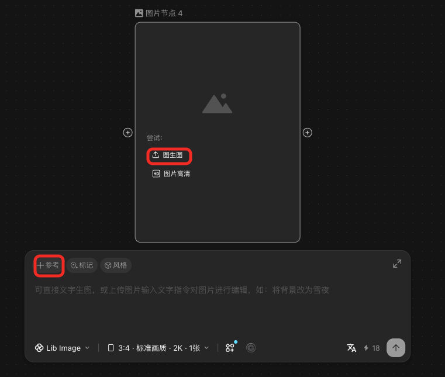

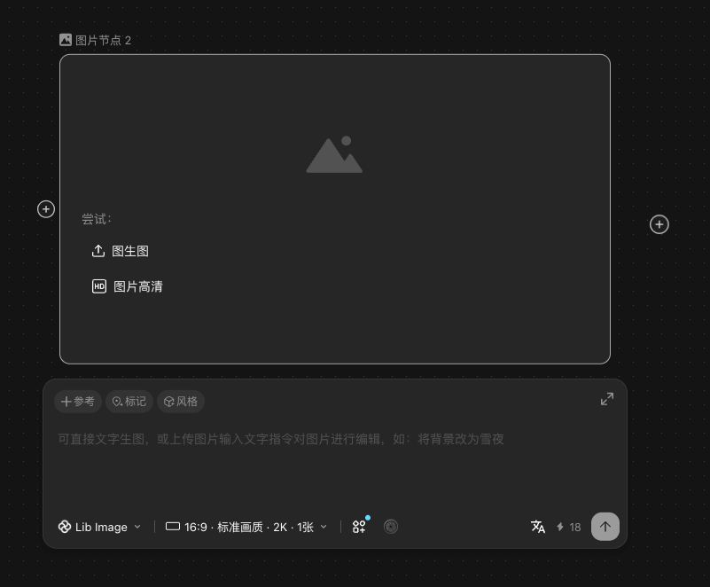

</td><td vertical-align="top">本节只说明模型入口和基本设置，不展开模型对比。</td></tr><tr><td>图片节点最常见的两种用法是： 文生图和图生图 文生图是只用文字生成图片 而图生图是用已有图片进行参考，让结果更接近你的目标。</td><td>图片节点最常见的是两种用法：文生图和图生图。 文生图是只用文字生成；图生图是拿一张已有的图当参考，让结果更接近你的目标。一个像口述，一个像临摹。 你手里有参照物的时候，结果会更接近你的目标。</td><td>动画效果</td><td>视频效果参考： 文字 ：左边文生图、右边图生图
[附件：8月8日(11)-1.mp4](./assets/W9KgbA3HqoHjzExmF6Bcve8Wn5g.mp4)
</td><td></td><td></td></tr><tr><td>这次我们不需要上传人物参考图，直接使用文字提示词来生成小男孩的正面图。</td><td></td><td>讲师出镜 </td><td></td><td></td><td></td></tr><tr><td rowspan="2" vertical-align="top"><ul><li><b>案例演示</b><ul><li>连接上一步的文字节点，并添加罗永浩老师参考图。</li><li>选择图片模型、比例、画质和生成数量。</li><li>生成罗永浩老师正面、侧面、背面三视图。</li><li>检查人物外观和服装是否一致，选出一组结果供视频节点使用。</li></ul></li></ul></td><td rowspan="2"><b>08｜连接文字与图片节点，生成并筛选结果</b></td><td>可以看到文字节点已经自动连接到图片节点，作为这次图片生成的文字输入。 这条连接线很重要。它意味着提示词不会在复制粘贴以后就失去关联，而是会明确成为图片生成的上游输入。以后修改文字时，你也能很快找到它会影响哪一个结果。</td><td>可以看到，文字节点已经自动连到了图片节点上，作为这次生成的文字输入。 这条线意味着提示词和结果之间的关系被记下来了。 你回想一下自己的文件夹——一堆图，你早就想不起来哪张是用哪句话生成的了，想复现只能重新试。有了这条线，以后你改文字的时候，也能很快知道它会影响哪一个结果。</td><td>录屏
[附件：录屏2026-08-09 22.27.22.mov](./assets/XqzEbiwKbojzBoxYDNIcNnjtn0c.mov)
</td><td></td><td vertical-align="top"></td><td vertical-align="top">图片结果在本步骤直接展示并确认。</td></tr><tr><td></td><td>可以看到底部输入框会有一排参数按钮  常用按钮是选择模型、画质、清晰度、比例、生成数量。 模型在后面的课程中我们还会详细讲解，而画质等于画面的好看清晰程度。画质越高，画面越清楚。 下面的比例便是生成内容的尺寸，在这里我们将比例设置成16：9。如果你希望画面是适用于竖屏短视频的感觉也可以选择9:16 数量先生成 1 张。点击发送，开始生成。 等待片刻 我们的图片就生成好啦</td><td>底部输入框这一排是参数按钮，常用的是模型、画质、比例、生成数量。 模型的区别我们后面的课程会专门展开，今天先跳过。画质好理解，越高画面越清楚。 比例是生成内容的尺寸，这里我们设成 16:9。比例这个参数，我建议你在动手之前先确定好。你是要发横屏还是发竖屏短视频，这直接决定你画面怎么构图。如果生成完了再改的话，会很麻烦。 数量我们先生成 1 张。 这里也有个小经验：很多人上来就一次生四张，等着挑。但第一版的真正用途，往往不是让你挑，是让你发现自己的提示词哪句没写清楚。先出一张看方向，方向对了再批量。 点击发送，等待片刻，图片就生成好了。</td><td>录屏
[附件：录屏2026-08-09 22.54.04.mov](./assets/ESLKbEU33oIUulxLfxwc6z1Knqc.mov)
</td><td></td><td></td><td></td></tr><tr><td rowspan="3" vertical-align="top">步骤三｜视频节点</td><td rowspan="2" vertical-align="top"><ul><li><b>基础讲解</b><ul><li><b>文生视频：</b>根据文字描述生成视频。</li><li><b>图生视频：</b>使用首帧或首尾帧生成视频。</li><li><b>全能参考：</b>使用图片、视频等素材控制人物、动作或镜头。</li><li><b>模型选择：</b>在这里可以选择视频模型；具体的视频模型类型会在第四节详细讲解。</li></ul></li></ul></td><td rowspan="2"><b>09｜视频节点：三种生成方式怎么选</b></td><td>紧接着来到视频节点  视频节点也有三种常见方式，我们先记住这三种。 第一，文生视频，完全根据文字描述生成，适合还没有固定首帧、先探索创意的情况。 第二，图生视频，用一张首帧，或者一组首尾帧生成，适合人物形象和起始画面已经确定的情况。 第三，全能参考，把图片、视频等素材作为人物、动作或镜头的参考，适合控制要求更复杂的任务。</td><td></td><td>讲师出镜</td><td></td><td vertical-align="top">视频节点功能界面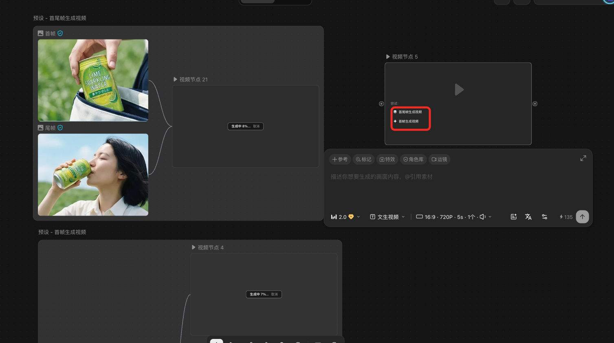</td><td vertical-align="top">先说明三种生成方式及其适用素材。</td></tr><tr><td>既然图片已经定下来，那么下面就让它动起来。 目前我们已经有了选定的小男孩正面图，所以这次使用图生视频。这样可以尽量保留上一阶段已经确认的小男孩形象。</td><td>既然图片已经定下来了，就交给 AI 当参考，不要让它重新生成，以免跑偏。 我们现在已经有了选定的小男孩正面图，所以这次用图生视频，尽量把上一步确认过的形象保留下来。</td><td>讲师出镜</td><td></td><td></td><td></td></tr><tr><td rowspan="3" vertical-align="top"><ul><li><b>案例演示</b><ul><li>引用上一步选定的罗永浩老师角色图。</li><li>输入街舞动作和镜头要求，生成一段 10–15 秒视频。</li><li>画面包含站定、街舞动作和收尾定格。</li><li>生成后立即查看版本并选择结果。</li></ul></li></ul></td><td rowspan="3"><b>10案例实操：生成 10—15 秒街舞短片</b></td><td>首先点击小男孩正面图右侧的“+”号，选择视频节点，然后输入动作提示词。 这里我希望小男孩在舞台跳街舞。 底部的参数按钮和图片节点类似 时长设置为 5秒，然后点击开始生成按钮。</td><td>点击小男孩正面图右侧的"+"号，选择视频节点，然后输入动作提示词。这里我希望他在舞台上跳街舞。 底部的参数按钮和图片节点类似。时长我们设成 5 秒。然后点击开始生成按钮。 时长这块顺便说一句：尽量别一上来就拉满<b>。</b> 现在的模型，视频越长越容易崩，动作失控的风险就高。</td><td>录屏 重录飞书引用✅
[附件：录屏2026-08-10 14.48.14.mov](./assets/R3ZtbRDs4ouS3uxfJ90cqkqKnMe.mov)
</td><td></td><td vertical-align="top">街舞短片生成结果</td><td vertical-align="top">视频结果在本步骤直接展示并确认。</td></tr><tr><td></td><td></td><td>参数栏中模型的详细区别，我们会在后续的课程中专门展开。 这次先选一个支持当前输入方式的模型，把流程跑通。 生成结果出来以后，可以先检查一下，小男孩的形象有没有保持一致，动作是不是连贯。</td><td>模型的详细区别后面专门讲，这次先选一个支持当前输入方式的，把流程跑通。 结果出来以后，重点检查两件事：小男孩的形象有没有保持一致，动作是不是连贯。</td><td>讲师出镜</td><td></td><td></td><td></td></tr><tr><td></td><td></td><td>现在把我们刚刚生成的视频完整播放一次。</td><td></td><td>播放视频
[附件：视频节点 2.mp4](./assets/MfnhbBYmBoDikWxBBeFcxziNnyd.mp4)
</td><td></td><td></td><td></td></tr><tr><td vertical-align="top">收尾</td><td vertical-align="top">查看版本与导出</td><td rowspan="2" vertical-align="top"><ul><li><b>版本查看</b><ul><li>查看图片和视频节点的历史结果。</li><li>在不同版本之间切换并确认最终结果。</li></ul></li><li><b>导出</b><ul><li>检查节点连接和最终画面。</li><li>下载或导出视频文件。</li></ul></li></ul></td><td rowspan="2"><b>11｜版本管理：别把“再生成一次”当成工作流</b></td><td>如果首次生成的效果不太满意，我们也可以调整提示词 重新抽卡。 做到这里，我们已经有了图片和视频的多个版本。在底部按钮里，可以选择“历史记录”来查看多个结果。</td><td>如果第一次生成的效果不太满意，我们可以调整提示词重新生成。 做到这里，图片和视频都已经有了多个版本。在底部按钮里选择"历史记录"，就能看到所有结果，在不同版本之间切换、确认最终结果。</td><td>录屏</td><td></td><td vertical-align="top">版本查看与导出界面</td><td vertical-align="top">只做版本确认和导出。</td></tr><tr><td></td><td></td><td>版本管理的意义，不只是方便找回旧文件。它能让你知道：哪一个变化带来了更好的结果。下一次做类似项目时，这些经验可以直接复用，而不是重新从零试错。</td><td>关于这个功能，我想多讲两句， 很多人用 AI 的方式，本质上是抽卡。不满意就再来一次，再不满意再来一次，抽到一张好的就收工。可问题是你抽了一百次抽出一张好的，你还是不知道它为什么好。下次做同类的东西，你还得再抽一百次。 版本记录的意义，不是方便你找回旧文件，是让你能对照着看：<b>我改了哪一句，结果发生了什么变化。</b> 这样经验才能沉淀下来，下一次做类似项目，你是带着方法过去的，不是从零开始碰运气。</td><td>讲师出镜</td><td></td><td></td><td></td></tr><tr><td></td><td></td><td></td><td rowspan="2"><b>12｜导出：完成第一条可复用的工作流</b></td><td>最后一步，点击下载按钮导出视频。</td><td></td><td>录屏
[附件：录屏2026-08-10 14.55.02.mov](./assets/IZ7xbc0dxoBNmTxgRcFcTgFGnXe.mov)
</td><td></td><td>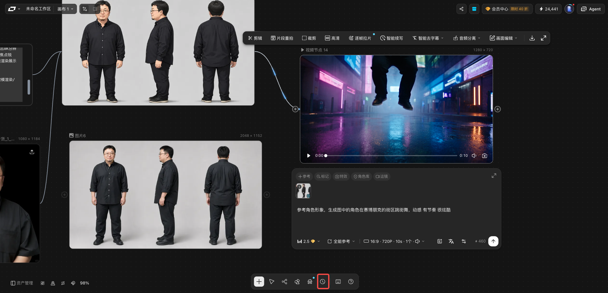</td><td></td></tr><tr><td></td><td></td><td></td><td>到这里，我们已经完成了从文字、到图片、再到视频的第一条 LibTV基础节点搭建 。</td><td></td><td>讲师出镜</td><td></td><td></td><td></td></tr><tr><td></td><td></td><td></td><td rowspan="7"><b>13｜总结：真正要记住的是结构，不是按钮</b></td><td>最后，我们把今天的内容总结一下。 首先是了解了Lib TV的首页界面，分为左侧导航栏区域和右侧内容模块呈现区域。</td><td></td><td>讲师出镜</td><td></td><td></td><td></td></tr><tr><td></td><td></td><td></td><td>第二，了解了最基础的三个节点。文字节点负责把需求说清楚，图片节点负责确定人物和画面，视频节点负责让已经确定的画面动起来。节点与节点之间通过连线串起工作流程。</td><td>第二，我们搞清楚了三个最基础的节点——文字节点负责把需求说清楚，图片节点负责把人物和画面定下来，视频节点负责让确定的画面动起来，节点之间靠连线串成工作流程。</td><td>动画效果</td><td></td><td></td><td></td></tr><tr><td></td><td></td><td></td><td>第三，我们一起创作了一个跳街舞的小男孩 对本节课程做了简单的回顾练习</td><td>第三，我们一起做了一个跳街舞的小男孩。</td><td>动画效果</td><td></td><td></td><td></td></tr><tr><td></td><td></td><td></td><td>如果你现在回到空白画布，能独立完成“创建文本节点、撰写提示词、创建图片节点和视频节点”这一整条链路，那这节课的目标就达到了。</td><td>如果你现在回到一张空白画布，能独立完成"创建文本节点、写提示词、创建图片节点、创建视频节点"这一整条链路，那这节课的目标就达到了。 最重要的不是记住按钮长什么样，模块在什么位置，而是你把这个生成视频的工作流和结构记住，换个软件你也能轻松上手。</td><td>动画效果</td><td></td><td></td><td></td></tr><tr><td></td><td></td><td></td><td>课后可以在Lib TV进行 课堂跟练练习，重点不是做得多复杂，而是完成三大节点的操作。</td><td></td><td>讲师出镜+录屏 在LibTV进行跟练和练习

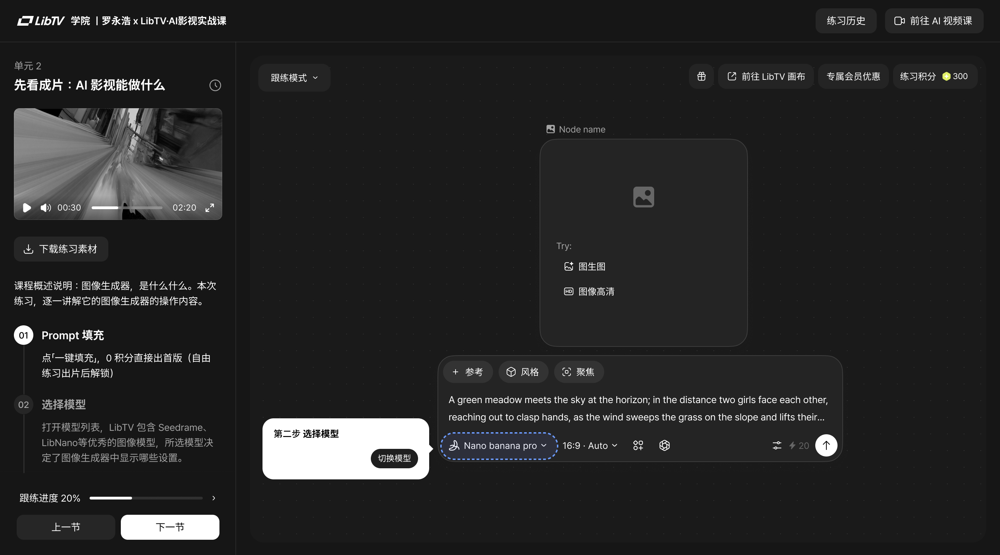

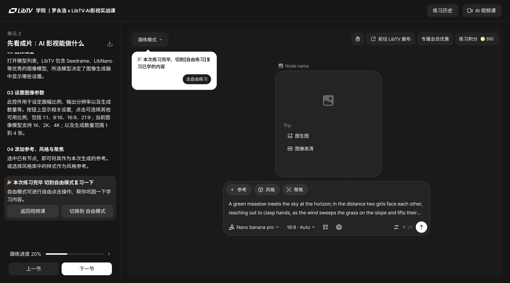

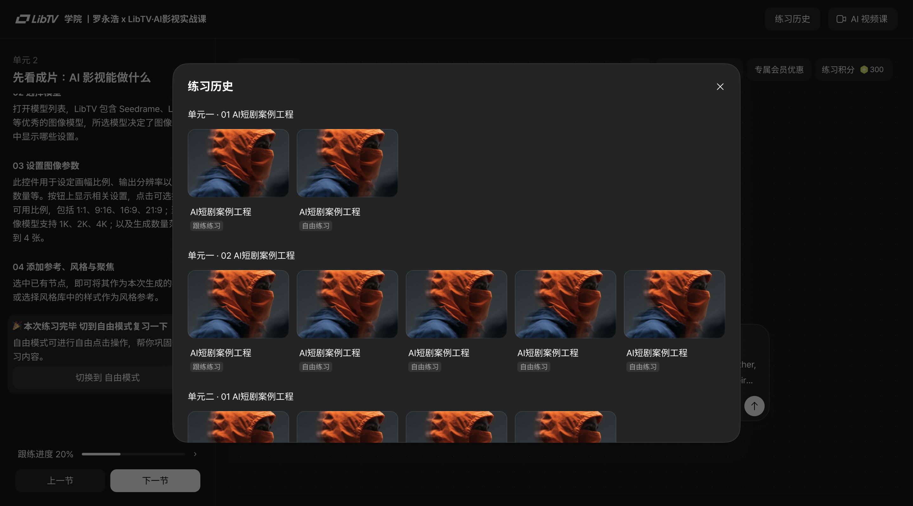

</td><td></td><td></td><td></td></tr><tr><td></td><td></td><td></td><td>下一节，我们会专门讲图片生成和提示词的具体写法，包括不同生成方式，以及怎样用更准确的描述控制最终画面。</td><td></td><td>讲师出镜</td><td></td><td></td><td></td></tr><tr><td></td><td></td><td></td><td>我们下一节课见。</td><td></td><td>讲师出镜</td><td></td><td></td><td></td></tr></tbody></table>

https://www.liblib.tv/canvas/share?spaceId=4911339&projectId=452a52865d784ee5bd061c3504063d9e

https://www.liblib.tv/canvas?spaceId=4966036&projectId=2d58bfa46be24966817f9ddd2f9fe57c黄绍泰画版（）

提到跟练课堂

[附录：课程跟练全流程交互演示](https://hcnbsg6ttb3t.feishu.cn/wiki/G8I8wJEfhiPIVMkFIfycbRLunte)

## 本地素材清单

- [image.png](./assets/UwKLb80Feoet5Ox448Fc0XjVnjt.png)（media，2028261 字节）
- [image.png](./assets/S1NZb32Klo8qkjxrysYcAV1En5V.png)（media，346380 字节）
- [image.png](./assets/UkYNbXGJlo2O5qxmxTOcA5xInNc.png)（media，2028261 字节）
- [image.png](./assets/BAtPbdIkqouUg9xj5WYcN9fbn7Z.png)（media，2601364 字节）
- [image.png](./assets/BQo5bYV4GolKuDxLReQcaHIfnhh.png)（media，3771571 字节）
- [image.png](./assets/IlywbgD9noyiHcxWp43cD5b7noh.png)（media，1853022 字节）
- [image.png](./assets/Y0Pib49P5oKYYCxIg7LcC4wPnCe.png)（media，4156512 字节）
- [image.png](./assets/V6XobmrSToeZWBxslfecquAKnYc.png)（media，3209810 字节）
- [image.png](./assets/SsQbbHgowo4E8Xxj5fSchdqUnAg.png)（media，4920245 字节）
- [image.png](./assets/YtVab1rYQoCjDRxEFcsctOUynNc.png)（media，241115 字节）
- [image.png](./assets/IeIUb8uAWodBw9xJ1UVcQK3Knrf.png)（media，2028261 字节）
- [image.png](./assets/JdIubrLUmoIOpoxAqqqccwX8nnd.png)（media，872114 字节）
- [image.png](./assets/HJo3b1XVBoXiDcxPleac1s0bnOe.png)（media，42702 字节）
- [image.png](./assets/C2VNbhqvkou6q7xrlLScIQYDneb.png)（media，36613 字节）
- [image.png](./assets/KaEfbSXTVoIT0XxmuGXcV8ernWe.png)（media，104260 字节）
- [image.png](./assets/RQUWbBWR6oul61xsZBbcu2Ion7b.png)（media，281226 字节）
- [image.png](./assets/Pig7bJi76oBj4lxgokIc79OLnzg.png)（media，360796 字节）
- [image.png](./assets/QKp9byCSho48D1xJqlzcjZiInpe.png)（media，937021 字节）
- [image.png](./assets/BbdSb4WqmowsG0xIOcncH7vnn2d.png)（media，546837 字节）
- [image.png](./assets/KaFgbXRgBoGdCmxJU0qckB4qnhd.png)（media，543973 字节）
- [image.png](./assets/BNiTbvhioooRLoxlieIcNVwKnPe.png)（media，391555 字节）
- [image.png](./assets/RW5Wbb2JXoSw5tx2qqBcjFzjn8g.png)（media，714839 字节）
- [视频节点 2.mp4](./assets/VrXybTrKdo7TJ8xZTFKc3xmYnQc.mp4)（media，4553074 字节）
- [视频节点 2.mp4](./assets/J5QcbW4KGoDGLmxmaY6cSwfInNe.mp4)（media，4553074 字节）
- [8月8日(9)-1.mp4](./assets/NHtVbGVRloti4QxnUUdcf7Zcncc.mp4)（media，3191807 字节）
- [8月8日(12)-1.mp4](./assets/T48HbiUWEo53HdxAwaFcyKC4nct.mp4)（media，10669432 字节）
- [8月8日(7)-1.mp4](./assets/AbX2bk864oM0y6xryX5cFHt3n1e.mp4)（media，30797505 字节）
- [8月8日(5)-1.mp4](./assets/H1Gcb3jL1o6ZnLxYcWDcyVE7n6d.mp4)（media，6885300 字节）
- [录屏2026-08-09 16.04.24.mov](./assets/OfVGbHru6o7oCtxAdwmcxbBwnbe.mov)（media，56352539 字节）
- [8月8日(13)-1.mp4](./assets/WmsHb3RHXoS9Vkxw151cniTynMg.mp4)（media，4404584 字节）
- [8月8日(13)-1.mp4](./assets/WznZb3VhIop11gxeP6icHmd2nSe.mp4)（media，4404584 字节）
- [录屏2026-08-09 16.21.50.mov](./assets/W77obQfqTox9XExLniHcuDC5nmf.mov)（media，51322680 字节）
- [录屏2026-08-09 16.23.49.mov](./assets/Ib4CbfvVDobG83xEAKKcMt9RnVc.mov)（media，24335026 字节）
- [录屏2026-08-09 18.20.17.mov](./assets/QVcCbZDDDoikZWxkXqKcj1Innpb.mov)（media，3276911 字节）
- [8月8日(2)-1.mp4](./assets/A1DTb0zMdoEEXexAtoUcF4cinVh.mp4)（media，12025597 字节）
- [8月8日(4)-1.mp4](./assets/ISLNbEs3UooP9uxKaP8cxxndnwc.mp4)（media，1823409 字节）
- [录屏2026-08-09 18.21.29.mov](./assets/QlU4bR76docMlyxgC3JcL24PnHf.mov)（media，6808030 字节）
- [8月8日(10)-1.mp4](./assets/SdkrbvQqQos0JrxaPavca9u3nBc.mp4)（media，12025596 字节）
- [录屏2026-08-09 18.33.03.mov](./assets/DqUrbz4Doo22YbxkwlKckHQbnnd.mov)（media，1863056 字节）
- [录屏2026-08-10 13.56.00.mov](./assets/PSWnbb2Ijo1ZFRxUSmEc5rYOnXd.mov)（media，8683858 字节）
- [录屏2026-08-09 22.25.59.mov](./assets/NkKqbIpb1olAAnxbNHTciPGZnpd.mov)（media，9937629 字节）
- [8月8日(11)-1.mp4](./assets/W9KgbA3HqoHjzExmF6Bcve8Wn5g.mp4)（media，10755886 字节）
- [录屏2026-08-09 22.27.22.mov](./assets/XqzEbiwKbojzBoxYDNIcNnjtn0c.mov)（media，3952582 字节）
- [录屏2026-08-09 22.54.04.mov](./assets/ESLKbEU33oIUulxLfxwc6z1Knqc.mov)（media，42736330 字节）
- [录屏2026-08-10 14.48.14.mov](./assets/R3ZtbRDs4ouS3uxfJ90cqkqKnMe.mov)（media，227666405 字节）
- [视频节点 2.mp4](./assets/MfnhbBYmBoDikWxBBeFcxziNnyd.mp4)（media，4553074 字节）
- [录屏2026-08-10 14.55.02.mov](./assets/IZ7xbc0dxoBNmTxgRcFcTgFGnXe.mov)（media，16481382 字节）
