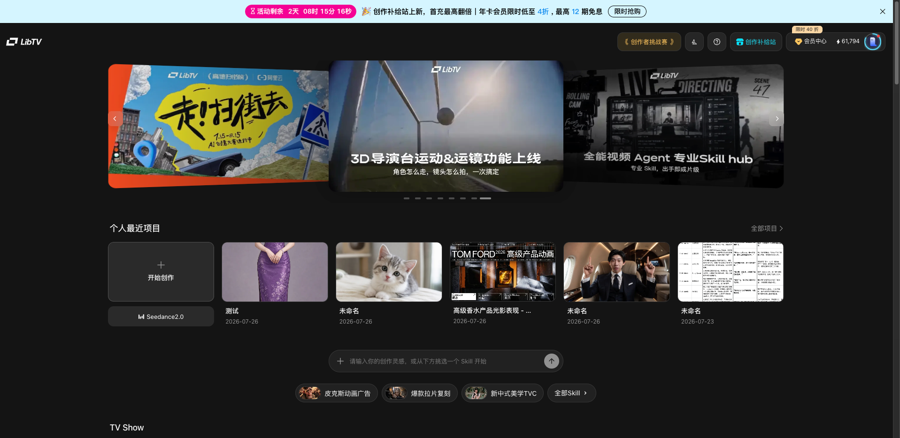
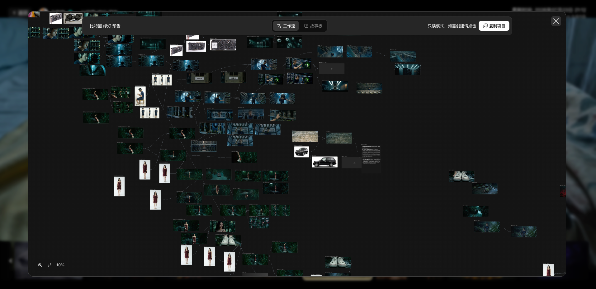
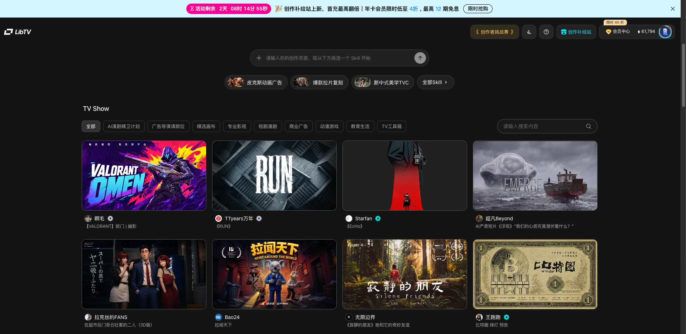
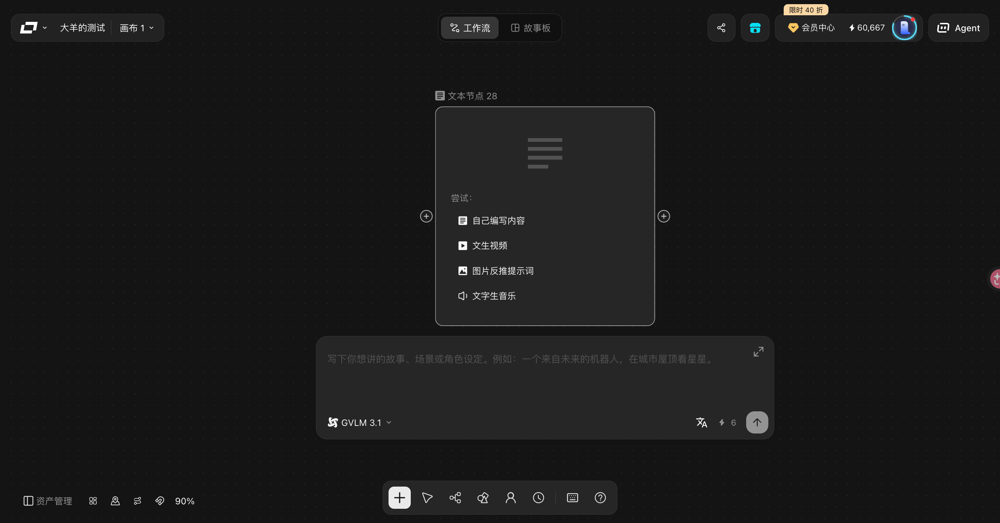
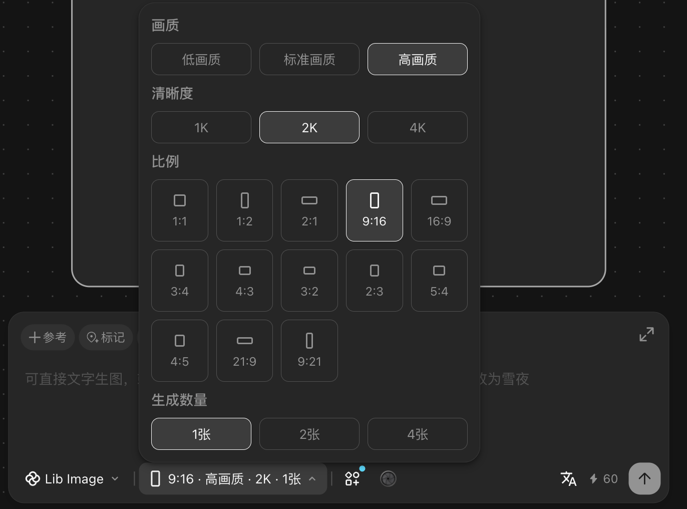
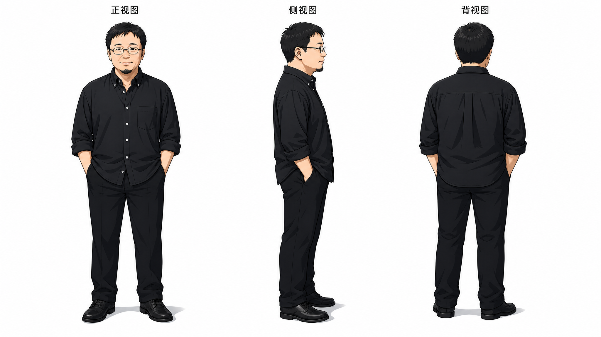
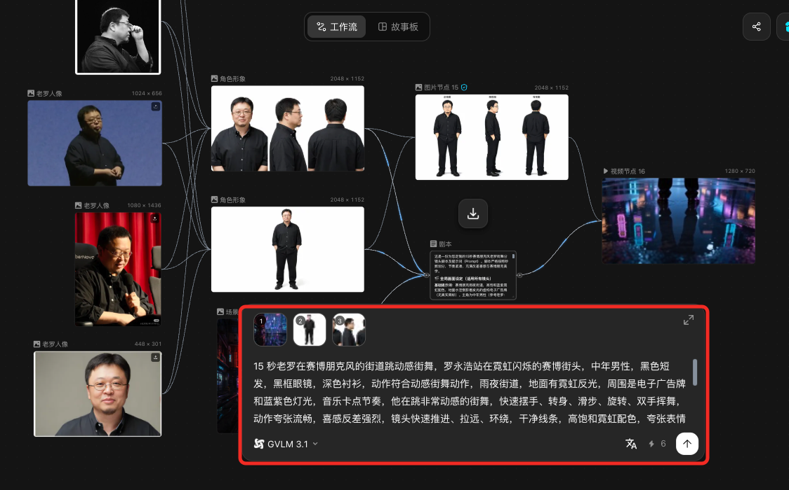

> 来源：[飞书原文](https://hcnbsg6ttb3t.feishu.cn/wiki/LmJbwjiMLiVAWCkQRhecYSLKnyc)  
> 同步时间：2026-08-16T09:01:04.604Z  
> 文档标识：GRprdp8BloHo0PxFl7qcOBg9nQg

# 第二节：LibTV 基础：画布与节点

> **提示**
>
**引入｜这节课会讲什么**
本节介绍 LibTV 的画布、节点和基本操作，并完成一条基础工作流。
- **核心内容：**LibTV 基础界面、项目创建，以及文字、图片、视频三个节点的基础讲解和案例演示。
- **学完你会：**在画布上完成罗永浩老师三视图和街舞短片，并掌握版本查看与导出。

<table><colgroup><col/><col/><col/><col/><col/></colgroup><thead><tr><th vertical-align="top"><b>阶段</b></th><th vertical-align="top">大纲</th><th vertical-align="top">内容</th><th vertical-align="top">截图</th><th vertical-align="top">备注</th></tr></thead><tbody><tr><td vertical-align="top">课程开始</td><td vertical-align="top">引入</td><td vertical-align="top">刚进入 LibTV，画布、节点和各种按钮可能看起来有点多。这一节我们只做一件事：从文字节点开始，依次完成图片和视频节点，先把最基础的一条工作流跑通。</td><td vertical-align="top">课程标题与最终工作流预览</td><td vertical-align="top">简单说明本节要完成什么，不提前展开节点细节。</td></tr><tr><td vertical-align="top">准备</td><td vertical-align="top">打开项目并认识画布</td><td vertical-align="top"><ul><li><b>进入项目</b><ul><li>从首页搜索或浏览创作者项目。</li><li>点击“查看制作过程”，进入项目画布。</li></ul></li><li><b>认识画布</b><ul><li>查看画布区域、节点、连接线和基础工具。</li><li>了解如何新建项目、移动画布和查看节点关系。</li></ul></li></ul></td><td vertical-align="top">LibTV 首页、查看制作过程和画布界面

</td><td vertical-align="top">可沿用现有首页与画布截图。</td></tr><tr><td rowspan="6" vertical-align="top">核心步骤</td><td rowspan="2" vertical-align="top">步骤一｜文字节点</td><td vertical-align="top"><ul><li><b>基础讲解</b><ul><li><b>输入与编辑：</b>手动输入、修改和整理文字内容。</li><li><b>AI 辅助：</b>根据任务生成或补充提示词、故事和剧本。</li><li><b>图片反推提示词：</b>上传参考图，提取画面元素并生成文字描述。</li><li><b>文字生音乐：</b>通过提示词生成基础音乐素材。</li></ul></li></ul></td><td vertical-align="top">文字节点功能界面</td><td vertical-align="top">先讲清楚文字节点能输入什么、能生成什么。</td></tr><tr><td vertical-align="top"><ul><li><b>案例演示</b><ul><li>创建文字节点，输入“罗永浩老师三视图”的基础要求。</li><li>补充正面、侧面、背面、服装一致和简洁背景等信息。</li><li>现场生成并确认一版可直接交给图片节点使用的提示词。</li></ul></li></ul></td><td vertical-align="top">罗永浩老师三视图提示词生成过程</td><td vertical-align="top">生成结果直接进入下一步，不单独放到课程末尾。</td></tr><tr><td rowspan="2" vertical-align="top">步骤二｜图片节点</td><td vertical-align="top"><ul><li><b>基础讲解</b><ul><li><b>生成方式：</b>文生图、图生图和添加参考图。</li><li><b>模型选择：</b>在这里可以选择图片模型；具体的模型类型会在下一节详细讲解。</li><li><b>基础参数：</b>设置画面比例、画质和生成数量。</li><li><b>常用设置：</b>比例可选 3:4、16:9、9:16；画质可选标准或 2K；数量可选 1 张、2 张、4 张。</li></ul></li></ul></td><td vertical-align="top">图片节点与参数设置界面

</td><td vertical-align="top">本节只说明模型入口和基本设置，不展开模型对比。</td></tr><tr><td vertical-align="top"><ul><li><b>案例演示</b><ul><li>连接上一步的文字节点，并添加罗永浩老师参考图。</li><li>选择图片模型、比例、画质和生成数量。</li><li>生成罗永浩老师正面、侧面、背面三视图。</li><li>检查人物外观和服装是否一致，选出一组结果供视频节点使用。</li></ul></li></ul></td><td vertical-align="top">罗永浩老师三视图生成结果</td><td vertical-align="top">图片结果在本步骤直接展示并确认。</td></tr><tr><td rowspan="2" vertical-align="top">步骤三｜视频节点</td><td vertical-align="top"><ul><li><b>基础讲解</b><ul><li><b>文生视频：</b>根据文字描述生成视频。</li><li><b>图生视频：</b>使用首帧或首尾帧生成视频。</li><li><b>全能参考：</b>使用图片、视频等素材控制人物、动作或镜头。</li><li><b>模型选择：</b>在这里可以选择视频模型；具体的视频模型类型会在第四节详细讲解。</li></ul></li></ul></td><td vertical-align="top">视频节点功能界面</td><td vertical-align="top">先说明三种生成方式及其适用素材。</td></tr><tr><td vertical-align="top"><ul><li><b>案例演示</b><ul><li>引用上一步选定的罗永浩老师角色图。</li><li>输入街舞动作和镜头要求，生成一段 10–15 秒视频。</li><li>画面包含站定、街舞动作和收尾定格。</li><li>生成后立即查看版本并选择结果。</li></ul></li></ul></td><td vertical-align="top">街舞短片生成结果</td><td vertical-align="top">视频结果在本步骤直接展示并确认。</td></tr><tr><td vertical-align="top">收尾</td><td vertical-align="top">查看版本与导出</td><td vertical-align="top"><ul><li><b>版本查看</b><ul><li>查看图片和视频节点的历史结果。</li><li>在不同版本之间切换并确认最终结果。</li></ul></li><li><b>导出</b><ul><li>检查节点连接和最终画面。</li><li>下载或导出视频文件。</li></ul></li></ul></td><td vertical-align="top">版本查看与导出界面</td><td vertical-align="top">只做版本确认和导出。</td></tr></tbody></table>

## 需要的案例

以下案例待提供

| 案例名称 | 数量 | 具体要求 | 交付内容 |
|-|-|-|-|
| 罗永浩老师三视图 | 1 套 | 使用同一张人物参考图，生成正面、侧面和背面三视图；人物面部、发型、服装和身形保持一致，背景简洁，便于后续视频生成使用。 | 人物参考图；文字节点提示词；图片模型与参数记录；三视图合成图；正面、侧面、背面单图；可复制的 LibTV 项目或工程链接。 |
| 罗永浩老师街舞短片 | 1 条 | 引用三视图中的角色图生成 10–15 秒视频，包含站定、街舞动作和收尾定格；人物外观保持一致，节点连接清楚，可演示版本查看和导出。 | 统一视频提示词与参数记录；原始生成版本；最终 MP4 成片；完整节点结构截图；可复制的 LibTV 项目或工程链接。 |

### 配套动画（暂定）

| 动画名称 | 数量 | 具体要求 | 交付内容 |
|-|-|-|-|
| 画布与节点连接原理动画 | 1 段 | 时长约 8—12 秒；用简洁动画演示文字、图片、视频节点的创建、连接、生成与结果传递关系。 | 16:9、1080P 成片；可编辑工程文件；节点图标与连线素材；无字幕版。 |

## 本地素材清单

- [image.png](./assets/HwNbb3lAcofffUxzYXtcxroenkf.png)（media，802881 字节）
- [image.png](./assets/Ie0EbB2Fuod9wwxe6kUc06kKnRg.png)（media，900524 字节）
- [image.png](./assets/SSYlbecutojHLMxtW71cuWidn5e.png)（media，1113624 字节）
- [image.png](./assets/ZK47b5UneowEoHxLPjycgkhqnZC.png)（media，241115 字节）
- [image.png](./assets/LiykbU1NlojZh2xpPtTciRGgnv1.png)（media，42702 字节）
- [image.png](./assets/KBm3bPVMIoQPFFxXAsCcAGH2ndh.png)（media，36613 字节）
- [image.png](./assets/Q2d5bAo2woUPG4xA5nKck9swnNe.png)（media，104260 字节）
- [image.png](./assets/RObBbSzBwo7nXyxMxthclw8nnag.png)（media，2128380 字节）
- [image.png](./assets/XU9Jbdi5EoPSrpx3w2XcaqeLn3y.png)（media，281226 字节）
- [image.png](./assets/LOSybBgBVoyFoExiFGCcLjoAnCf.png)（media，360796 字节）
