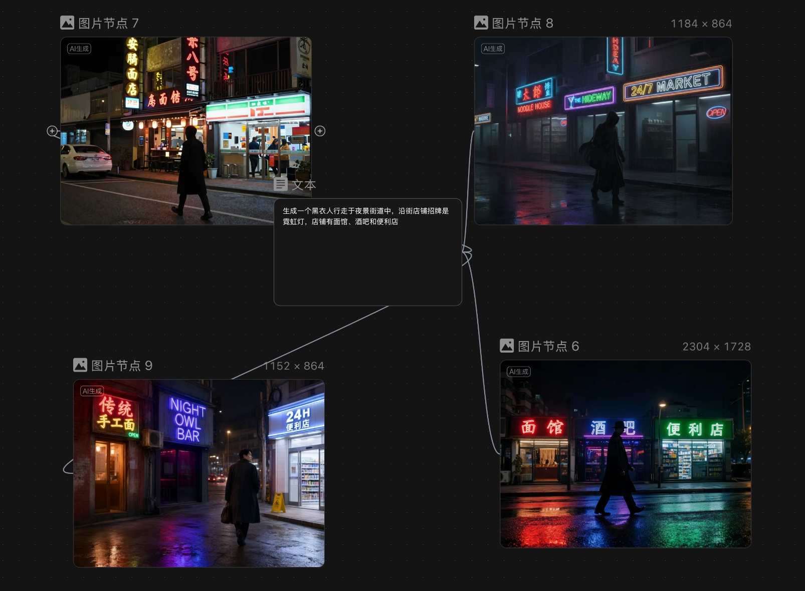
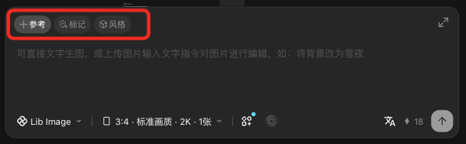
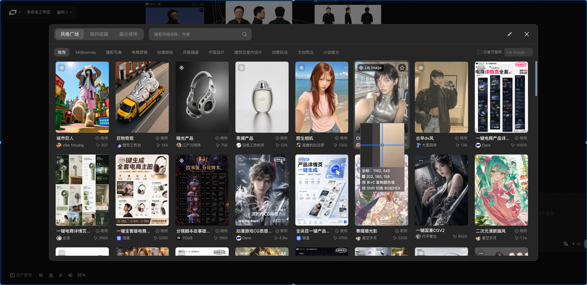

> 来源：[飞书原文](https://hcnbsg6ttb3t.feishu.cn/wiki/PPy3wdNL6iCbFckJcencmjXsnwf)  
> 同步时间：2026-08-16T09:01:04.604Z  
> 文档标识：E7QadPv2eoXT5bx4SoWcvz0gn4g

# ✅细化脚本

<table><colgroup><col/><col/><col/><col/><col/><col/><col/><col/><col/><col/><col/></colgroup><thead><tr><th vertical-align="top"><b>阶段</b></th><th vertical-align="top"><b>大纲</b></th><th vertical-align="top"><b>内容</b></th><th vertical-align="top">小节</th><th vertical-align="top">口播</th><th vertical-align="top">画面形式</th><th vertical-align="top">B-roll（录屏、解说动画、其他拍摄需求）</th><th vertical-align="top">剪辑提示</th><th vertical-align="top">屏幕字幕</th><th vertical-align="top"><b>截图</b></th><th vertical-align="top"><b>备注</b></th></tr></thead><tbody><tr><td rowspan="8" vertical-align="top">课程开始</td><td rowspan="8" vertical-align="top"><b>对比引入</b></td><td rowspan="8" vertical-align="top">以四幅图做开场，2*2的形式直观体现提示词和模型对生成结果的影响，自然引入本节课核心内容：模型与提示词</td><td rowspan="8" vertical-align="top"><b>01｜结果先行：先看四张图，两组提示词*两个模型</b></td><td vertical-align="top">【片头】</td><td vertical-align="top">动画</td><td vertical-align="top">片头动画</td><td vertical-align="top"></td><td vertical-align="top"></td><td vertical-align="top"></td><td vertical-align="top"></td></tr><tr><td vertical-align="top">AI 图片生成，说起来也挺简单的， 很多人都已经尝试过，生成过自己满意的图片；</td><td vertical-align="top">实拍</td><td vertical-align="top">实拍：手持手机输入提示词并生成图片</td><td vertical-align="top"></td><td vertical-align="top"></td><td vertical-align="top"></td><td vertical-align="top"></td></tr><tr><td vertical-align="top">现在的AI模型大多数都还是很听话的， 大白话经常也能完成你的要求。</td><td vertical-align="top">图片展示</td><td vertical-align="top">展示多张 AI 生成图片</td><td vertical-align="top"></td><td vertical-align="top"></td><td vertical-align="top"></td><td vertical-align="top"></td></tr><tr><td vertical-align="top">但是如果想要做出各种专业质感的图片，还有两个要素你需要注意：分别是模型的选择，和提示词的写法。</td><td vertical-align="top">动画＋图片展示</td><td vertical-align="top">展示专业质感图片，并突出“模型”和“提示词”</td><td vertical-align="top"></td><td vertical-align="top"></td><td vertical-align="top"></td><td vertical-align="top"></td></tr><tr><td vertical-align="top">同样的输入，不同的模型之间生成的结果也可能天差地别。</td><td vertical-align="top">录屏</td><td vertical-align="top">录屏：同一提示词连接不同模型并展示结果</td><td vertical-align="top"></td><td vertical-align="top"></td><td vertical-align="top"></td><td vertical-align="top"></td></tr><tr><td vertical-align="top">而对于同一个模型，不同的提示词产生的结果，也会大有不同。 有的看起来像随手拍摄，也有的能生成出电影级的质感。</td><td vertical-align="top">图片展示</td><td vertical-align="top">展示同一模型下不同提示词的结果对比</td><td vertical-align="top">高亮下方两张图</td><td vertical-align="top"></td><td vertical-align="top"></td><td vertical-align="top"></td></tr><tr><td vertical-align="top">大家好，我是罗永浩。</td><td vertical-align="top">口播</td><td vertical-align="top">口播</td><td vertical-align="top"></td><td vertical-align="top"></td><td vertical-align="top"></td><td vertical-align="top"></td></tr><tr><td vertical-align="top">今天这节课，我们就从图片模型选择和提示词写法开始， 一并了解各种图片玩法， 学习如何在 LibTV 里完成一张你想要的图片。</td><td vertical-align="top">口播＋动画</td><td vertical-align="top">动画：课程目录依次出现</td><td vertical-align="top"></td><td vertical-align="top"></td><td vertical-align="top"></td><td vertical-align="top"></td></tr><tr><td rowspan="13" vertical-align="top">步骤一</td><td rowspan="6" vertical-align="top"><b>选择图片模型｜基础讲解</b></td><td rowspan="6" vertical-align="top"><ul><li><b>明确任务</b><ul><li>先判断人物图、场景图、产品图或分镜参考图等任务类型。</li></ul></li><li><b>模型范围</b><ul><li>LibTV 提供多种图片模型，名单会随版本更新；本节只介绍常用模型和选择思路。</li></ul></li><li><b>主要模型</b><ul><li>Lib Image：综合能力与长文本。</li><li>Seedream 5.0 Lite：电商设计、信息图和结构布局。</li><li>Z-image Turbo：写实、快速、成本低。</li></ul></li><li><b>选择方法</b><ul><li>不排固定优劣，按任务要求选择合适模型。</li></ul></li></ul></td><td rowspan="2" vertical-align="top"><b>02｜先定任务：我们到底要生成哪一种图片</b></td><td vertical-align="top">正式生成以前，先别急着选模型。第一件事，是把任务类型想清楚。因为“我要一张图”几乎没有信息：图片用途不同，评价标准也不同。</td><td vertical-align="top">口播</td><td vertical-align="top">口播</td><td vertical-align="top"></td><td vertical-align="top"> </td><td vertical-align="top"></td><td vertical-align="top"></td></tr><tr><td vertical-align="top">例如，人物图注重面部、服装和动作的一致性；场景图看空间、光影和氛围；产品图强调外形、材质和角度；分镜参考图则看动作、景别和机位。</td><td vertical-align="top">图片展示</td><td vertical-align="top">展示人物图、场景图、产品图和分镜参考图</td><td vertical-align="top">四类任务卡横向对比：人物图、场景图、产品图、分镜参考图，并分别附上一张示例图</td><td vertical-align="top"></td><td vertical-align="top"></td><td vertical-align="top"></td></tr><tr><td rowspan="4" vertical-align="top"><b>03｜模型介绍：模型不是排名，而是不同工具</b></td><td vertical-align="top">任务基本明确以后，第二步才是选模型。LibTV 提供多种图片模型，名单会随版本更新。今天不遍历所有模型，只培养一种选择思路。</td><td vertical-align="top">口播</td><td vertical-align="top">口播</td><td vertical-align="top"></td><td vertical-align="top"></td><td vertical-align="top"></td><td vertical-align="top"></td></tr><tr><td vertical-align="top">例如，Lib Image 能力较为综合，长文本能力突出；Seedream 5.0 Lite 适合电商设计、信息图等对结构布局有要求的任务；Z-image Turbo 写实感强、速度快、成本低，适合快速落地。</td><td vertical-align="top">口播</td><td vertical-align="top">口播</td><td vertical-align="top"></td><td vertical-align="top"></td><td vertical-align="top"></td><td vertical-align="top"></td></tr><tr><td vertical-align="top">还有很多模型没有介绍。你可以查看菜单简介、模型知识库，也可以直接在画布实操中体验模型能力。</td><td vertical-align="top">录屏</td><td vertical-align="top">录屏：浏览模型菜单与模型知识库入口</td><td vertical-align="top"></td><td vertical-align="top"></td><td vertical-align="top"></td><td vertical-align="top"></td></tr><tr><td vertical-align="top">注意，目的不是粗暴划分模型优劣，而是根据任务要求选择合适的模型。</td><td vertical-align="top">口播</td><td vertical-align="top">口播</td><td vertical-align="top"></td><td vertical-align="top"></td><td vertical-align="top"></td><td vertical-align="top"></td></tr><tr><td rowspan="7" vertical-align="top"><b>选择图片模型｜案例演示</b></td><td rowspan="7" vertical-align="top"><ul><li>以“黑衣人穿行夜景街道”为目标。</li><li>直接用Z-image Turbo，General image，Qwen image 3.0，Seedream 5.0 Lite四个模型生成。</li><li>比较风格、文字、人物呈现等。</li></ul></td><td rowspan="7" vertical-align="top"><b>04｜案例对比：同一任务测试四个主要模型</b></td><td vertical-align="top">让我们来实操做一个简单的对比。</td><td vertical-align="top">口播</td><td vertical-align="top">口播</td><td vertical-align="top"></td><td vertical-align="top"></td><td vertical-align="top"></td><td vertical-align="top"></td></tr><tr><td vertical-align="top">先写一条简单的提示词：“一个黑衣人行走于夜景街道中，沿街店铺招牌是霓虹灯，店铺有面馆、酒吧和便利店。”</td><td vertical-align="top">录屏</td><td vertical-align="top">录屏：在文本节点输入夜景街道提示词</td><td vertical-align="top"></td><td vertical-align="top"></td><td vertical-align="top"></td><td vertical-align="top"></td></tr><tr><td vertical-align="top">输入后，连接四个图片节点，分别选择 Z-image Turbo、General image、Qwen image 3.0 和 Seedream 5.0 Lite。比例选 16:9，画质 2K，数量 1 张，点击生成。</td><td vertical-align="top">录屏</td><td vertical-align="top">录屏：连接四个图片节点，设置模型、比例、画质和数量后生成</td><td vertical-align="top"></td><td vertical-align="top"></td><td vertical-align="top"></td><td vertical-align="top"></td></tr><tr><td vertical-align="top">先看整体风格：左上角的 Z-image 更写实，像实拍照片；其他三幅图的高饱和霓虹色更偏赛博朋克。</td><td vertical-align="top">图片展示</td><td vertical-align="top">对比四张结果图的写实感与赛博朋克风格</td><td vertical-align="top"></td><td vertical-align="top"></td><td vertical-align="top"></td><td vertical-align="top"></td></tr><tr><td vertical-align="top">再看文字招牌：Z-image 依旧更写实；General image 和 Qwen image 3.0 中英文混杂；Seedream 5.0 Lite 更忠于提示词，招牌直接呈现店铺类型。</td><td vertical-align="top">图片展示</td><td vertical-align="top">放大对比四张图中的店铺招牌文字</td><td vertical-align="top"></td><td vertical-align="top"></td><td vertical-align="top"></td><td vertical-align="top"></td></tr><tr><td vertical-align="top">黑衣人的呈现也不同：有的戴兜帽、隐在暗处，有的戴礼帽，还有的露出面貌。</td><td vertical-align="top">图片展示</td><td vertical-align="top">对比四张图中黑衣人的造型与面貌</td><td vertical-align="top"></td><td vertical-align="top"></td><td vertical-align="top"></td><td vertical-align="top"></td></tr><tr><td vertical-align="top">模型各有侧重，判断也因人而异。最可靠的办法还是在画布上试一试，选择最适合需求的模型。</td><td vertical-align="top">口播</td><td vertical-align="top">口播</td><td vertical-align="top"></td><td vertical-align="top"></td><td vertical-align="top"></td><td vertical-align="top"></td></tr><tr><td rowspan="52" vertical-align="top">步骤二</td><td rowspan="12" vertical-align="top"><b>写图片提示词｜基础讲解</b></td><td rowspan="12" vertical-align="top"><ul><li><b>七层结构</b><ul><li>主体：人物、产品或物体。</li><li>动作：姿势、表情和互动关系。</li><li>场景：地点、时间、环境和关键道具。</li><li>构图：景别、机位、主体位置和镜头感。</li><li>风格：写实、电影感、插画或其他视觉方向。</li><li>光影：光线方向、明暗关系和主色调。</li><li>限制：需要保留或避免的内容。</li></ul></li><li>根据任务选择重点，不必机械写满七层。</li></ul>

<b>人物图</b>

人物特征、服装、动作、构图。

<b>场景图</b>

地点、空间、光影；可不写主体。

<b>产品／道具图</b>

外观、材质、角度；背景可省略。

<b>分镜参考图</b>

人物、动作、景别、机位。

</td><td rowspan="12" vertical-align="top"><b>05｜提示词公式：先写骨架，再补质感，可图可文</b></td><td vertical-align="top">模型定下来以后，进入今天的核心一步：写提示词。</td><td vertical-align="top">口播</td><td vertical-align="top">口播</td><td vertical-align="top"></td><td vertical-align="top"></td><td vertical-align="top"></td><td vertical-align="top"></td></tr><tr><td vertical-align="top">按照内容，图片提示词大致可以拆成七层：主体、动作、场景、构图、风格、光影和限制。</td><td vertical-align="top">动画</td><td vertical-align="top">动画：主体、动作、场景、构图、风格、光影、限制依次出现</td><td vertical-align="top">七块积木从左到右出现：主体→动作→场景→构图→风格→光影→限制。</td><td vertical-align="top"></td><td vertical-align="top"></td><td vertical-align="top"></td></tr><tr><td vertical-align="top">前四层是骨架，决定画面里有什么、在做什么、发生在哪里、观众从什么角度看；后三层是质感，决定作品风格、光影效果，以及要避免的错误。</td><td vertical-align="top">动画</td><td vertical-align="top">动画：前四层归入“画面骨架”，后三层归入“视觉质感”</td><td vertical-align="top">前四块标“画面骨架”，后三块标“视觉质感”。</td><td vertical-align="top"></td><td vertical-align="top"></td><td vertical-align="top"></td></tr><tr><td vertical-align="top">提示词虽然叫“词”，但不限于文字，图片也能作为输入。</td><td vertical-align="top">动画</td><td vertical-align="top">动画：文字提示与图片提示并列出现</td><td vertical-align="top"></td><td vertical-align="top"></td><td vertical-align="top"></td><td vertical-align="top"></td></tr><tr><td vertical-align="top">例如，主体可以输入角色设定图，动作可以输入自己绘制的火柴人姿势图。</td><td vertical-align="top">图片展示</td><td vertical-align="top">展示角色设定图与火柴人姿势图</td><td vertical-align="top"></td><td vertical-align="top"></td><td vertical-align="top"></td><td vertical-align="top"></td></tr><tr><td vertical-align="top">但这不是一张必须全部填满的表格。不同类型的图片，描述重点也不同。</td><td vertical-align="top">口播</td><td vertical-align="top">口播</td><td vertical-align="top"></td><td vertical-align="top"></td><td vertical-align="top"></td><td vertical-align="top"></td></tr><tr><td vertical-align="top">例如，分镜图重点写人物、动作、景别和机位；海报封面重点写文字内容、画面主体和构图布局；PPT 还要明确内容层级、版式结构和元素位置。</td><td vertical-align="top">动画</td><td vertical-align="top">动画：分镜图、海报封面和 PPT 的描述重点对比</td><td vertical-align="top">树状图展示</td><td vertical-align="top"></td><td vertical-align="top"></td><td vertical-align="top"></td></tr><tr><td vertical-align="top">每次都机械堆满七层，提示词只会越来越长，重点反而被淹没。</td><td vertical-align="top">口播</td><td vertical-align="top">口播</td><td vertical-align="top"></td><td vertical-align="top"></td><td vertical-align="top"></td><td vertical-align="top"></td></tr><tr><td vertical-align="top">所以接下来我们不背公式，而是拿今天的案例，一层一层看：每增加一个要求，画面究竟发生了什么变化。</td><td vertical-align="top">口播</td><td vertical-align="top">口播</td><td vertical-align="top"></td><td vertical-align="top"></td><td vertical-align="top"></td><td vertical-align="top"></td></tr><tr><td vertical-align="top">以芭蕾舞演员的舞蹈场景为例，我们先输入一句最简单的描述：“一个芭蕾舞演员在剧场的舞台上表演。”</td><td vertical-align="top">录屏</td><td vertical-align="top">录屏：新建图片节点，输入基础提示词并生成</td><td vertical-align="top"></td><td vertical-align="top"></td><td vertical-align="top"></td><td vertical-align="top"></td></tr><tr><td vertical-align="top">生成结果基本符合要求：演员、芭蕾、剧院和舞台都有，还有模型自由发挥的观众、聚光灯等。</td><td vertical-align="top">图片展示</td><td vertical-align="top">展示基础提示词生成结果，并标出模型自由发挥的内容</td><td vertical-align="top"></td><td vertical-align="top"></td><td vertical-align="top"></td><td vertical-align="top"></td></tr><tr><td vertical-align="top">如果要更具体地控制画面，就需要继续发挥提示词的作用。</td><td vertical-align="top">口播</td><td vertical-align="top">口播</td><td vertical-align="top"></td><td vertical-align="top"></td><td vertical-align="top"></td><td vertical-align="top"></td></tr><tr><td rowspan="29" vertical-align="top"><b>写图片提示词｜案例演示</b></td><td rowspan="29" vertical-align="top"><ul><li>以芭蕾舞场景为例，按“主体—动作—场景—道具—构图—镜头—风格、光影与限制”的演示顺序逐步完善提示词。</li><li>前六步每一步只新增一类要求；最后一步依次补充风格、光影和限制，并分别展示画面变化。</li><li>道具属于场景信息，镜头属于构图信息；为了教学清楚，在案例演示中分别成步。</li></ul></td><td rowspan="7" vertical-align="top"><b>06｜主体：把“谁”写成可识别（自然引入“参考”功能）</b></td><td vertical-align="top">我们先写主体。只写“芭蕾舞演员表演”，你的脑海中或许已有清晰画面，但模型不会读心，这句话对它来说还有很多空白。</td><td vertical-align="top">口播</td><td vertical-align="top">口播</td><td vertical-align="top"></td><td vertical-align="top"></td><td vertical-align="top"></td><td vertical-align="top"></td></tr><tr><td vertical-align="top">先改变演员的面貌。提示词也可以包含图片，这里以 LibTV 的预设角色为例，点击正式画布下方工具栏中的角色库即可添加。</td><td vertical-align="top">录屏</td><td vertical-align="top">录屏：打开角色库并添加预设角色</td><td vertical-align="top"></td><td vertical-align="top"></td><td vertical-align="top"></td><td vertical-align="top"></td></tr><tr><td vertical-align="top">将角色图和原图一起连接到新的图片节点，输入主体要求：“芭蕾舞剧演员，参考图片 1。”</td><td vertical-align="top">录屏</td><td vertical-align="top">录屏：连接角色图、原图和新图片节点，输入主体要求</td><td vertical-align="top"></td><td vertical-align="top"></td><td vertical-align="top"></td><td vertical-align="top"></td></tr><tr><td vertical-align="top">这时会弹出提示，这就是 LibTV 的参考功能。点击提示或按 Tab 键，即可填入参考引用。也可以输入 @，或把图片拖到对应位置，精准指定提示词和参考图的关系。</td><td vertical-align="top">录屏</td><td vertical-align="top">录屏：演示自动提示、Tab、@ 和拖入图片的引用方式</td><td vertical-align="top"></td><td vertical-align="top"></td><td vertical-align="top"></td><td vertical-align="top"></td></tr><tr><td vertical-align="top">引用的前提是节点之间存在参考关系。你可以手动连接节点，点击“+参考”选择内容，或在 @ 的下拉菜单里选择参考节点。这种方式后续也可以用于动作、场景、构图和风格。</td><td vertical-align="top">录屏</td><td vertical-align="top">录屏：演示手动连线、“+参考”和 @ 下拉菜单</td><td vertical-align="top"></td><td vertical-align="top"></td><td vertical-align="top"></td><td vertical-align="top"></td></tr><tr><td vertical-align="top">接着补充服饰，让主体更具体。服饰可以写：“她穿着一套具有戏剧感的深酒红色芭蕾舞演出服，上身为紧身无袖舞衣，下身由多层深红色薄纱组成……”</td><td vertical-align="top">录屏</td><td vertical-align="top">录屏：输入人物服饰描述</td><td vertical-align="top"></td><td vertical-align="top"></td><td vertical-align="top"></td><td vertical-align="top"></td></tr><tr><td vertical-align="top">完善主体描述后，加上“其他内容不变，只改变人物外貌和服饰”，检查提示词、模型和参数并生成。可以看到，人物已经变成参考人设的样貌，服饰也按要求改变。</td><td vertical-align="top">录屏＋图片展示</td><td vertical-align="top">录屏：加入主体控制语句并生成；展示人物与服饰变化结果</td><td vertical-align="top"></td><td vertical-align="top"></td><td vertical-align="top"></td><td vertical-align="top"></td></tr><tr><td rowspan="4" vertical-align="top"><b>07｜动作：把“动”写成可执行</b></td><td vertical-align="top">下面单独处理动作。动作有一个技巧：写出静态结果，不要只写抽象动词。</td><td vertical-align="top">口播</td><td vertical-align="top">口播</td><td vertical-align="top"></td><td vertical-align="top"></td><td vertical-align="top"></td><td vertical-align="top"></td></tr><tr><td vertical-align="top">例如，“正在表演”很宽泛；“右腿完全伸直，左腿从身体左侧抬起后向内收，左脚脚尖贴靠在右腿膝盖上方”更容易执行。</td><td vertical-align="top">录屏</td><td vertical-align="top">录屏：对比抽象动作词与可执行的静态动作描述</td><td vertical-align="top"></td><td vertical-align="top"></td><td vertical-align="top"></td><td vertical-align="top"></td></tr><tr><td vertical-align="top">如果动作难以用语言说清，可以上传动作参考图，并写明“其他内容不变，只改变动作”，然后生成。</td><td vertical-align="top">录屏</td><td vertical-align="top">录屏：上传动作参考图，输入动作控制语句并生成</td><td vertical-align="top"></td><td vertical-align="top"></td><td vertical-align="top"></td><td vertical-align="top"></td></tr><tr><td vertical-align="top">可以看到，人物身份和服饰保持不变，动作已经按要求调整。</td><td vertical-align="top">图片展示</td><td vertical-align="top">展示动作调整前后的结果对比</td><td vertical-align="top"></td><td vertical-align="top"></td><td vertical-align="top"></td><td vertical-align="top"></td></tr><tr><td rowspan="2" vertical-align="top"><b>08｜场景：让环境参与画面表达</b></td><td vertical-align="top">下面单独调整场景。目前的剧院比较普通，我们可以这样写：现代先锋风格的黑盒剧场舞台，开阔而极简。地面铺设深灰色哑光地板，背景是一整面高耸的半透明磨砂玻璃墙，墙后设有数道垂直排列的冷白色灯带……</td><td vertical-align="top">录屏</td><td vertical-align="top">录屏：输入黑盒剧场的场景描述</td><td vertical-align="top"></td><td vertical-align="top"></td><td vertical-align="top"></td><td vertical-align="top"></td></tr><tr><td vertical-align="top">场景细节不是越多越好，只保留最需要突出、最能回应人物的部分。加入场景描述并生成，可以看到剧场环境已经按要求改变。</td><td vertical-align="top">图片展示</td><td vertical-align="top">展示加入场景描述后的生成结果</td><td vertical-align="top"></td><td vertical-align="top"></td><td vertical-align="top"></td><td vertical-align="top"></td></tr><tr><td rowspan="2" vertical-align="top"><b>09｜道具：用关键物件补充叙事</b></td><td vertical-align="top">接着单独加入道具。可以写：“舞台右侧放一把复古木椅，上面放着一双白色芭蕾舞鞋。”</td><td vertical-align="top">录屏</td><td vertical-align="top">录屏：输入木椅与芭蕾舞鞋的道具描述</td><td vertical-align="top"></td><td vertical-align="top"></td><td vertical-align="top"></td><td vertical-align="top"></td></tr><tr><td vertical-align="top">道具同样只保留对画面有作用的细节。加入道具描述并生成，可以看到木椅和芭蕾舞鞋已经出现在指定位置。</td><td vertical-align="top">图片展示</td><td vertical-align="top">展示加入道具后的生成结果及位置</td><td vertical-align="top"></td><td vertical-align="top"></td><td vertical-align="top"></td><td vertical-align="top"></td></tr><tr><td rowspan="3" vertical-align="top"><b>10｜构图：决定观众先看谁、再看什么</b></td><td vertical-align="top">接着调整构图。同一个舞者和舞台，构图一变，视觉重点和空间秩序也会不同。</td><td vertical-align="top">口播</td><td vertical-align="top">口播</td><td vertical-align="top"></td><td vertical-align="top"></td><td vertical-align="top"></td><td vertical-align="top"></td></tr><tr><td vertical-align="top">常规正面构图虽然能看清舞者动作，但舞台和观众席的空间层次比较有限。</td><td vertical-align="top">图片展示</td><td vertical-align="top">展示常规正面构图下的画面空间层次</td><td vertical-align="top"></td><td vertical-align="top"></td><td vertical-align="top"></td><td vertical-align="top"></td></tr><tr><td vertical-align="top">我们让舞台位于画面中央，舞者处在几何中心，观众席从四周向中央围合。输入后生成，人物成为视觉焦点，画面的几何秩序也更强。</td><td vertical-align="top">录屏＋图片展示</td><td vertical-align="top">录屏：输入居中构图关系并生成；展示构图调整结果</td><td vertical-align="top"></td><td vertical-align="top"></td><td vertical-align="top"></td><td vertical-align="top"></td></tr><tr><td rowspan="2" vertical-align="top"><b>11｜镜头：改变观看角度与空间关系</b></td><td vertical-align="top">构图确定后，再单独调整镜头。为了增强舞台感，可以采用接近垂直向下的顶部俯拍。</td><td vertical-align="top">录屏</td><td vertical-align="top">录屏：在提示词中加入顶部俯拍镜头</td><td vertical-align="top"></td><td vertical-align="top"></td><td vertical-align="top"></td><td vertical-align="top"></td></tr><tr><td vertical-align="top">再次生成，可以看到观看角度改变，舞台与观众席的空间关系也更鲜明。</td><td vertical-align="top">图片展示</td><td vertical-align="top">展示镜头调整前后的空间关系变化</td><td vertical-align="top"></td><td vertical-align="top"></td><td vertical-align="top"></td><td vertical-align="top"></td></tr><tr><td rowspan="6" vertical-align="top"><b>12｜风格、光影与限制：决定画面的质感与边界</b></td><td vertical-align="top">画面骨架清楚以后，先补风格，明确画面的视觉方向。</td><td vertical-align="top">口播</td><td vertical-align="top">口播</td><td vertical-align="top"></td><td vertical-align="top"></td><td vertical-align="top"></td><td vertical-align="top"></td></tr><tr><td vertical-align="top">本案例采用写实电影风格，强调真实的剧场空间和人物质感，避免过度艺术化和夸张表达。加入风格描述并生成，画面的写实电影感会更明确。</td><td vertical-align="top">录屏＋图片展示</td><td vertical-align="top">录屏：输入写实电影风格并生成；展示风格变化</td><td vertical-align="top"></td><td vertical-align="top"></td><td vertical-align="top"></td><td vertical-align="top"></td></tr><tr><td vertical-align="top">接着补光影：顶部聚光灯从正上方照下，形成清晰的圆形光区；舞者位于中央，身体和纱裙保持丰富的明暗层次，整体采用低饱和冷白光。加入后再次生成，画面的明暗层次和氛围会更完整。</td><td vertical-align="top">录屏＋图片展示</td><td vertical-align="top">录屏：输入聚光灯和冷白光描述并生成；展示光影变化</td><td vertical-align="top"></td><td vertical-align="top"></td><td vertical-align="top"></td><td vertical-align="top"></td></tr><tr><td vertical-align="top">最后，限制词用来告诉 AI 不要生成什么，比如多余人物、不恰当的遮挡和错误结构，不必列出所有可能的错误。</td><td vertical-align="top">口播</td><td vertical-align="top">口播</td><td vertical-align="top"></td><td vertical-align="top"></td><td vertical-align="top"></td><td vertical-align="top"></td></tr><tr><td vertical-align="top">限制词也不是越多越好。如果结果没有不可接受的问题，就不必反复强调。</td><td vertical-align="top">口播</td><td vertical-align="top">口播</td><td vertical-align="top"></td><td vertical-align="top"></td><td vertical-align="top"></td><td vertical-align="top"></td></tr><tr><td vertical-align="top">加入必要的限制词并生成。可以看到，前面确定的主体、动作、场景、道具、构图、镜头、风格和光影都保持连贯，画面也避开了不可接受的问题。</td><td vertical-align="top">图片展示</td><td vertical-align="top">展示加入限制词后的最终画面，并检查各阶段的连续性</td><td vertical-align="top"></td><td vertical-align="top"></td><td vertical-align="top"></td><td vertical-align="top"></td></tr><tr><td rowspan="3" vertical-align="top"><b>13｜提示词部分小总结</b></td><td vertical-align="top">到此，我们已经拆解了图片提示词常见的七个层次——主体、动作、场景、构图、风格、光影和限制。</td><td vertical-align="top">动画</td><td vertical-align="top">动画：再次呈现七层提示词结构</td><td vertical-align="top">树状图展示</td><td vertical-align="top"></td><td vertical-align="top"></td><td vertical-align="top"></td></tr><tr><td vertical-align="top">每一层都有各自的画面职责，创作时可以按需求自由搭配。</td><td vertical-align="top">动画</td><td vertical-align="top">动画：七层结构按不同任务自由组合</td><td vertical-align="top"></td><td vertical-align="top"></td><td vertical-align="top"></td><td vertical-align="top"></td></tr><tr><td vertical-align="top">看似复杂，核心只有一句话：“把需求拆解到 AI 能够理解的程度。”</td><td vertical-align="top">动画</td><td vertical-align="top">动画：需求拆解后转化为 AI 可理解的信息</td><td vertical-align="top"></td><td vertical-align="top"></td><td vertical-align="top"></td><td vertical-align="top"></td></tr><tr><td rowspan="11" vertical-align="top"><b>写图片提示词｜进阶思路补充</b></td><td rowspan="11" vertical-align="top"><ul><li>做好备份与迭代修改；每次只解决一个主要问题。</li><li>用分层的段落式文本保持结构清晰。</li><li>善用大语言模型或 LibTV agent 辅助梳理提示词。</li></ul></td><td rowspan="7" vertical-align="top"><b>14｜迭代修改思路</b></td><td vertical-align="top">当然，生图、生视频都像“抽卡”，很难一次满足需求。</td><td vertical-align="top">口播</td><td vertical-align="top">口播</td><td vertical-align="top"></td><td vertical-align="top"></td><td vertical-align="top"></td><td vertical-align="top"></td></tr><tr><td vertical-align="top">因此，需要通过反复修改和完善，才能拿到满意结果。</td><td vertical-align="top">口播</td><td vertical-align="top">口播</td><td vertical-align="top"></td><td vertical-align="top"></td><td vertical-align="top"></td><td vertical-align="top"></td></tr><tr><td vertical-align="top">刚才逐层增加提示词的过程，本身就是一次次迭代。</td><td vertical-align="top">口播</td><td vertical-align="top">口播</td><td vertical-align="top"></td><td vertical-align="top"></td><td vertical-align="top"></td><td vertical-align="top"></td></tr><tr><td vertical-align="top">这里有一个重要原则：每次只解决一个主要问题，并做好复制留存。</td><td vertical-align="top">口播</td><td vertical-align="top">口播</td><td vertical-align="top"></td><td vertical-align="top"></td><td vertical-align="top"></td><td vertical-align="top"></td></tr><tr><td vertical-align="top">如果每轮同时换模型、换参考图、改提示词和画幅，结果变好时不知道原因，变差时也不知道该退回哪里。</td><td vertical-align="top">录屏</td><td vertical-align="top">录屏：依次演示换模型、换参考图、改提示词和改画幅</td><td vertical-align="top"></td><td vertical-align="top"></td><td vertical-align="top"></td><td vertical-align="top"></td></tr><tr><td vertical-align="top">因此，建议用分层的段落式文本写提示词，结构更清晰，也方便后续调整。</td><td vertical-align="top">口播</td><td vertical-align="top">口播</td><td vertical-align="top"></td><td vertical-align="top"></td><td vertical-align="top"></td><td vertical-align="top"></td></tr><tr><td vertical-align="top">如果忘记留存，修改后的结果又更差，可以通过画布下方的历史记录回档。</td><td vertical-align="top">录屏</td><td vertical-align="top">录屏：打开历史记录并演示回档</td><td vertical-align="top"></td><td vertical-align="top"></td><td vertical-align="top"></td><td vertical-align="top"></td></tr><tr><td rowspan="4" vertical-align="top"><b>15｜agent 辅助提示词</b></td><td vertical-align="top">到这里，提示词核心已经讲完。如果觉得复杂，不想自己手搓“小作文”，</td><td vertical-align="top">口播</td><td vertical-align="top">口播</td><td vertical-align="top"></td><td vertical-align="top"></td><td vertical-align="top"></td><td vertical-align="top"></td></tr><tr><td vertical-align="top">可以借助外部大语言模型或 LibTV 的 Agent 功能，快速梳理、润色需求。</td><td vertical-align="top">口播</td><td vertical-align="top">口播</td><td vertical-align="top"></td><td vertical-align="top"></td><td vertical-align="top"></td><td vertical-align="top"></td></tr><tr><td vertical-align="top">你可以自由输入需求，语音输入也可以，即使表达得有些混乱也没关系。</td><td vertical-align="top">录屏</td><td vertical-align="top">录屏：向 agent 输入一段较零散的需求</td><td vertical-align="top"></td><td vertical-align="top"></td><td vertical-align="top"></td><td vertical-align="top"></td></tr><tr><td vertical-align="top">你可以让 agent 按照主体、动作、场景、构图、风格、光影、限制这七层结构整理。它会基于你的想法生成一个完整版本，供你参考修改。</td><td vertical-align="top">录屏</td><td vertical-align="top">录屏：让 agent 按七层结构整理并展示结果</td><td vertical-align="top"></td><td vertical-align="top"></td><td vertical-align="top"></td><td vertical-align="top"></td></tr><tr><td rowspan="10" vertical-align="top">步骤三</td><td rowspan="10" vertical-align="top"><b>图片生成前丨预设功能讲解</b></td><td rowspan="10" vertical-align="top"><ul><li><b>生成前功能</b><ul><li>参考：引用具体节点来限制模型输入，素材可提前上传，也可随时选用。</li><li>标记：识别并引用图片中的具体主体，让参考更准确。</li><li>风格：通过现成模板明确视觉方向，生成后仍需按结果调整。</li></ul></li></ul></td><td rowspan="10" vertical-align="top"><b>16｜预设功能讲解：图片生成前</b></td><td vertical-align="top">本节课最后，我们按照图片生成前和生成后的顺序，了解一下 LibTV 的预设功能。</td><td vertical-align="top">口播</td><td vertical-align="top">口播</td><td vertical-align="top"></td><td vertical-align="top"></td><td vertical-align="top"></td><td vertical-align="top"></td></tr><tr><td vertical-align="top">生成图片前，提示词输入框上方有参考、标记和风格三个选项。</td><td vertical-align="top">录屏</td><td vertical-align="top">录屏：框选提示词输入框上方的参考、标记和风格</td><td vertical-align="top"></td><td vertical-align="top"></td><td vertical-align="top"></td><td vertical-align="top"></td></tr><tr><td vertical-align="top">参考功能前面已经讲过：通过引用具体节点来限制模型输入。参考内容可以提前上传，也可以在创作过程中随时选用。</td><td vertical-align="top">录屏</td><td vertical-align="top">录屏：连接参考节点并用 @ 引用</td><td vertical-align="top"></td><td vertical-align="top"></td><td vertical-align="top"></td><td vertical-align="top"></td></tr><tr><td vertical-align="top">标记是一种更精细的参考方式。点击“标记”，再点击图片中的具体内容，模型会自动识别主体，并引用到提示词框中。</td><td vertical-align="top">录屏</td><td vertical-align="top">录屏：点击标记并点选图片中的人物或道具</td><td vertical-align="top"></td><td vertical-align="top"></td><td vertical-align="top"></td><td vertical-align="top"></td></tr><tr><td vertical-align="top">点击标记引用的下拉菜单，还可以切换识别出的不同主体。</td><td vertical-align="top">录屏</td><td vertical-align="top">录屏：展开标记下拉菜单并切换不同主体</td><td vertical-align="top"></td><td vertical-align="top"></td><td vertical-align="top"></td><td vertical-align="top"></td></tr><tr><td vertical-align="top">这样能进一步提升参考信息的准确性。</td><td vertical-align="top">录屏</td><td vertical-align="top">录屏：对比切换主体前后的引用结果</td><td vertical-align="top"></td><td vertical-align="top"></td><td vertical-align="top"></td><td vertical-align="top"></td></tr><tr><td vertical-align="top">风格功能类似模板，为模型提供明确的学习对象和视觉规范。</td><td vertical-align="top">录屏</td><td vertical-align="top">录屏：打开风格功能</td><td vertical-align="top"></td><td vertical-align="top"></td><td vertical-align="top"></td><td vertical-align="top"></td></tr><tr><td vertical-align="top">这里可以看到用户上传的成熟模板，例如电商详情页、动漫游戏角色和产品商业渲染等。</td><td vertical-align="top">录屏</td><td vertical-align="top">录屏：上下滑动展示不同风格模板</td><td vertical-align="top"></td><td vertical-align="top"></td><td vertical-align="top"></td><td vertical-align="top"></td></tr><tr><td vertical-align="top">它能把抽象需求具体化、可视化，方便你带着预期寻找合适的风格。</td><td vertical-align="top">录屏</td><td vertical-align="top">录屏：展示不同模板的预览图与效果差异</td><td vertical-align="top"></td><td vertical-align="top"></td><td vertical-align="top"></td><td vertical-align="top"></td></tr><tr><td vertical-align="top">不过这些模板都是用户预设好的，内部思路和提示词不可见，通常还要根据结果继续调整，不能指望一步到位。</td><td vertical-align="top">录屏</td><td vertical-align="top">录屏：打开风格详情，展示结果图与可见信息</td><td vertical-align="top"></td><td vertical-align="top"></td><td vertical-align="top"></td><td vertical-align="top"></td></tr><tr><td rowspan="9" vertical-align="top">步骤四</td><td rowspan="9" vertical-align="top"><b>图片生成后｜预设功能讲解</b></td><td rowspan="9" vertical-align="top"><ul><li>人像调节：调整人物质感和情绪，后续课程详解。</li><li>全景：扩展当前场景，并截取不同角度。</li><li>多角度：调整镜头位置和预设视角。</li><li>打光：调整光源亮度、颜色和位置。</li><li>九宫格：生成多机位、剧情推演和连贯分镜。</li><li>高清与基础编辑：提升画质，并进行扩图、重绘、擦除、抠图和裁剪。</li><li>标注：圈选修改区域，或用箭头指示方向。</li></ul></td><td rowspan="9" vertical-align="top"><b>17｜预设功能讲解：图片生成后</b></td><td vertical-align="top">图片生成后，LibTV 也提供了一些很好用的快捷功能来对图片进行进一步处理。</td><td vertical-align="top">口播</td><td vertical-align="top">口播</td><td vertical-align="top"></td><td vertical-align="top"></td><td vertical-align="top"></td><td vertical-align="top"></td></tr><tr><td vertical-align="top">点击生成后的图片节点，可以看到上方的功能选项，我们依次来看。</td><td vertical-align="top">录屏</td><td vertical-align="top">录屏：点击生成结果并展示上方完整工具栏</td><td vertical-align="top"></td><td vertical-align="top"></td><td vertical-align="top"></td><td vertical-align="top"></td></tr><tr><td vertical-align="top">最左边的人像调节，可以调整人物的质感和情绪，我们会在第五节进阶功能中详细介绍。</td><td vertical-align="top">录屏</td><td vertical-align="top">录屏：展开人像调节的下拉选项</td><td vertical-align="top"></td><td vertical-align="top"></td><td vertical-align="top"></td><td vertical-align="top"></td></tr><tr><td vertical-align="top">全景功能会根据当前图片的场景信息生成全景图，并支持从不同角度截取画面，方便获得同一场景的多角度参考。</td><td vertical-align="top">录屏</td><td vertical-align="top">录屏：生成全景图并从不同角度截取</td><td vertical-align="top"></td><td vertical-align="top"></td><td vertical-align="top"></td><td vertical-align="top"></td></tr><tr><td vertical-align="top">多角度功能可以快速调整镜头视角。点击后会出现包裹图片的球体，你可以移动摄像头位置，也可以直接选择预设角度。</td><td vertical-align="top">录屏</td><td vertical-align="top">录屏：拖动球体上的摄像头并切换预设角度</td><td vertical-align="top"></td><td vertical-align="top"></td><td vertical-align="top"></td><td vertical-align="top"></td></tr><tr><td vertical-align="top">打光功能可以为图片增加光源，并调整亮度、颜色和位置，进一步改善光影质感。</td><td vertical-align="top">录屏</td><td vertical-align="top">录屏：新增光源并调整亮度、颜色和位置</td><td vertical-align="top"></td><td vertical-align="top"></td><td vertical-align="top"></td><td vertical-align="top"></td></tr><tr><td vertical-align="top">九宫格可以生成多机位、剧情推演和连贯分镜等多宫格图片；搭配宫格切分，还能批量得到不同机位和分镜参考。</td><td vertical-align="top">录屏</td><td vertical-align="top">录屏：生成一种九宫格并演示宫格切分</td><td vertical-align="top"></td><td vertical-align="top"></td><td vertical-align="top"></td><td vertical-align="top"></td></tr><tr><td vertical-align="top">高清用于提升画质；下拉菜单里还有扩图、重绘、擦除、抠图和裁剪等基础编辑工具。</td><td vertical-align="top">录屏</td><td vertical-align="top">录屏：打开高清与基础编辑工具菜单</td><td vertical-align="top"></td><td vertical-align="top"></td><td vertical-align="top"></td><td vertical-align="top"></td></tr><tr><td vertical-align="top">标注可以提高你和 AI 的沟通效率，例如圈出要修改的内容，或者用箭头指出需要的视角方向。</td><td vertical-align="top">录屏</td><td vertical-align="top">录屏：圈选舞者鞋子并标注改色，再用箭头指示方向</td><td vertical-align="top"></td><td vertical-align="top"></td><td vertical-align="top"></td><td vertical-align="top"></td></tr><tr><td rowspan="3" vertical-align="top">步骤五</td><td rowspan="3" vertical-align="top">总结</td><td rowspan="3" vertical-align="top"><ul><li>定任务类型。</li><li>按任务选模型。</li><li>按主体、动作、场景、构图、风格、光影、限制组织提示词。</li><li>一次解决一个主要问题，分层迭代并保留版本。</li><li>按需使用预设功能。</li></ul></td><td rowspan="3" vertical-align="top"><b>18｜总结</b></td><td vertical-align="top">以上就是主要的图片预设功能。功能不必全部使用，按需选择就好。</td><td vertical-align="top">口播</td><td vertical-align="top">口播</td><td vertical-align="top"></td><td vertical-align="top"></td><td vertical-align="top"></td><td vertical-align="top"></td></tr><tr><td vertical-align="top">最后，把今天图片生成的核心收成一条完整流程。第一，先定任务类型，明确图片用途和侧重点。第二，按任务选择模型，不排固定优劣，只看是否适合。第三，按照主体、动作、场景、构图、风格、光影和限制组织提示词；不必全部写满，只保留关键要求。 除此之外，你也可以按需使用 LibTV 的预设功能辅助创作。</td><td vertical-align="top">动画</td><td vertical-align="top">动画：定任务类型→选模型→写提示词→分层迭代→使用预设功能</td><td vertical-align="top"></td><td vertical-align="top"></td><td vertical-align="top"></td><td vertical-align="top"></td></tr><tr><td vertical-align="top">AI 创作提升了生产效率，但好作品依然需要创造力和投入。不要追求一次出神图，保持清晰的思路，愿意反复试错，让 AI 真正服务于你的创作。 我是罗永浩，我们下一节课见。</td><td vertical-align="top">口播</td><td vertical-align="top">口播</td><td vertical-align="top"></td><td vertical-align="top"></td><td vertical-align="top"></td><td vertical-align="top"></td></tr></tbody></table>

## 需要的案例

以下案例待提供

<table><colgroup><col/><col/><col/><col/></colgroup><thead><tr><th vertical-align="top"><b>案例名称</b></th><th vertical-align="top"><b>数量</b></th><th vertical-align="top"><b>具体要求</b></th><th vertical-align="top"><b>交付内容</b></th></tr></thead><tbody><tr><td vertical-align="top">罗永浩老师搞笑武打场景图</td><td vertical-align="top">1 张</td><td vertical-align="top"><ul><li>以罗永浩老师为主体，生成一张单独的场景图，不制作三张定妆照或一组图片。</li><li>场景为带有搞笑元素的武打画面，人物、动作、环境、构图和风格需要明确。</li><li>建议采用中远景、略低机位和写实电影风格；具体画面与课程提示词保持一致。</li><li>人物面部清晰，动作自然，画面可继续用于后续视频生成。</li><li>使用同一提示词测试两个主要图片模型，并确定最终使用的模型。</li></ul></td><td vertical-align="top"><ul><li>人物参考照。</li><li>完整提示词。</li><li>模型与参数记录。</li><li>两个模型的原始对比图。</li><li>1 张选定的最终场景图。</li><li>可继续编辑的项目链接。</li></ul></td></tr></tbody></table>

### 配套动画（暂定）

| 动画名称 | 数量 | 具体要求 | 交付内容 |
|-|-|-|-|
| 图片提示词结构动画 | 1 段 | 时长约 10—15 秒；依次呈现主体、动作、场景、构图、风格、光影和限制条件，并展示各部分如何共同形成最终画面。 | 16:9、1080P 成片；可编辑工程文件；分层文字与图形素材；无字幕版和文字示意版。 |

## 本地素材清单

- [img_v3_0214i_82da7d68-60d0-41da-918f-061f455f53ag.jpg](./assets/VpuVbRAZ9oxRdkxibiYcna74nOe.jpg)（media，687546 字节）
- [image.png](./assets/W92gboNdPot9h5xGKhFc9MLonis.png)（media，20188 字节）
- [image.png](./assets/HU0YbHhjPopYVcxDM0scNa0pnjb.png)（media，2040251 字节）
