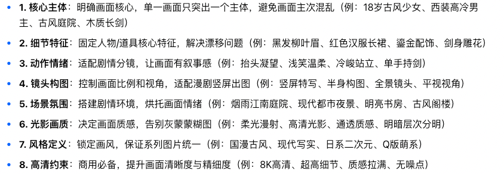

> 来源：[飞书原文](https://hcnbsg6ttb3t.feishu.cn/wiki/Qi2cw7eIbi3YlhkXooQceokinJd)  
> 同步时间：2026-08-16T09:01:04.604Z  
> 文档标识：ExtGdFOJCoItnDxhhWgcDuCynoh

# 第三节：图片生成与提示词写法

> **提示**
>
**引入｜这节课会讲什么**
本节介绍图片模型、提示词写法、图片生成和生成后调整，并完成一张指定场景图。
- **核心内容：**从 LibTV 的多种图片模型中选择主要模型讲解；拆解完整提示词结构；演示参考图、生成前功能和生成后调整。
- **学完你会：**根据任务选择模型，写出结构完整的提示词，并完成一张构图和风格明确的图片。

<table><colgroup><col/><col/><col/><col/><col/></colgroup><thead><tr><th vertical-align="top"><b>阶段</b></th><th vertical-align="top"><b>大纲</b></th><th vertical-align="top"><b>内容</b></th><th vertical-align="top"><b>截图</b></th><th vertical-align="top"><b>备注</b></th></tr></thead><tbody><tr><td vertical-align="top">课程开始</td><td vertical-align="top"><b>引入</b></td><td vertical-align="top">很多人第一次生图时，会发现人物、场景和构图经常和要求不一致，换了模型也不知道差别在哪里。这一节，我们会从模型选择和提示词写法开始，完成一张要求明确的场景图。</td><td vertical-align="top"></td><td vertical-align="top"></td></tr><tr><td rowspan="2" vertical-align="top">步骤一</td><td vertical-align="top"><b>选择图片模型｜基础讲解</b></td><td vertical-align="top"><ul><li><b>模型范围</b><ul><li>LibTV 提供多种图片生成与编辑模型，完整清单见附录“可用模型”。</li><li>本节挑选常用模型介绍，不逐一展开全部模型。</li></ul></li><li><b>主要模型</b><ul><li>Lib Image：综合生成、编辑、中文文字与一致性。</li><li>General image：通用图片生成入口。</li><li>Seedream 5.0 Lite：角色一致性、电商设计、空间布局与信息图。</li><li>悠船：画面审美与艺术风格探索。</li><li>Qwen Image：中英文文字、海报与封面。</li></ul></li><li><b>选择方法</b><ul><li>先判断任务类型，再选择对应模型。</li><li>重要画面可用同一提示词测试两个主要模型。</li></ul></li></ul></td><td vertical-align="top"></td><td vertical-align="top"></td></tr><tr><td vertical-align="top"><b>选择图片模型｜案例演示</b></td><td vertical-align="top"><ul><li>以“罗永浩老师的搞笑武打场景图”为目标。</li><li>先用 Lib Image 生成，再选择另一主要模型进行对比。</li><li>比较人物准确性、场景理解、构图和风格完成度。</li><li>确定本次案例使用的模型。</li></ul></td><td vertical-align="top"></td><td vertical-align="top"></td></tr><tr><td rowspan="2" vertical-align="top">步骤二</td><td vertical-align="top"><b>写图片提示词｜基础讲解</b></td><td vertical-align="top"><ul><li><b>通用公式</b><ul><li><b>主体：人物、产品或物体。</b></li><li><b>动作与状态：姿势、表情、互动关系。</b></li><li><b>场景：地点、时间、环境和关键道具。</b></li><li><b>构图与镜头：景别、机位、主体位置和镜头感。</b></li></ul></li><li><b>补充细节（附知识库）</b><ul><li>风格：写实、电影感、插画或其他视觉方向。</li><li>光影与色彩：光线方向、明暗关系和主色调。</li><li>细节与限制：清晰度、需要保留或避免的内容。</li></ul></li><li><b>注意事项</b></li></ul> 根据素材目标选择写法，不必套用全部公式。

<b>人物图</b>

人物特征、服装、动作、构图。

<b>场景图</b>

地点、空间、光影；可不写主体。

<b>产品／道具图</b>

外观、材质、角度；背景可省略。

<b>分镜参考图</b>

人物、动作、景别、机位。

</td><td vertical-align="top"></td><td vertical-align="top"></td></tr><tr><td vertical-align="top"><b>写图片提示词｜案例演示</b></td><td vertical-align="top"><ul><li>按照“主体—动作—场景—构图—风格—光影—限制”的顺序完成案例提示词。</li><li><b>参考提示词：</b>罗永浩老师穿黑色西装，在古风客栈中央摆出夸张的武打起手式，木凳被气浪掀起，周围食客惊讶躲闪；中远景、略低机位、主体居中、35mm 镜头；写实电影风格，暖色侧光，动作喜感，人物面部清晰，画面无文字、无多余手指。</li><li>说明每一部分如何影响最终画面。</li></ul></td><td vertical-align="top"></td><td vertical-align="top"></td></tr><tr><td rowspan="2" vertical-align="top">步骤三</td><td vertical-align="top"><b>生成图片｜基础讲解</b></td><td vertical-align="top"><ul><li><b>基础设置</b><ul><li>创建图片节点，选择模型、画幅和清晰度。</li><li>需要人物一致性时，上传罗永浩老师参考照。</li></ul></li><li><b>生成前功能</b><ul><li>参考：引用画布图片，参考人物、构图、物体位置和镜头透视。</li><li>标记：标出多张参考图中的人物、场景和道具。</li><li>风格：选择画面风格。</li><li>预设：分镜叙事、空间与机位、质感调节、设定图。</li><li>摄像机：设置景别和机位。</li><li>翻译提示词：转换提示词语言。</li></ul></li></ul></td><td vertical-align="top"></td><td vertical-align="top"></td></tr><tr><td vertical-align="top"><b>生成图片｜案例演示</b></td><td vertical-align="top"><ul><li>使用步骤二完成的提示词生成图片。</li><li>只生成一张最终场景图，不制作三张定妆照或一组图片。</li><li>检查人物、动作、场景、构图和风格是否符合提示词。</li><li>必要时调整一项关键信息后重新生成，选出最终画面。</li></ul></td><td vertical-align="top"></td><td vertical-align="top"></td></tr><tr><td vertical-align="top">步骤四</td><td vertical-align="top"><b>生成后调整｜基础讲解</b></td><td vertical-align="top"><ul><li>人像质感调节：优化真实感、皮肤质感、人物与环境融合；调整人物表情。</li><li>全景：扩展场景空间并截取不同机位。</li><li>多角度：生成不同水平、俯仰和景别视角。</li><li>打光：调整光线方向、颜色、亮度和轮廓光。</li><li>九宫格：生成分镜、剧情推演或设定图。</li><li>高清与基础编辑：放大、扩图、重绘、擦除、抠图和裁剪。</li><li>宫格切分：拆分多宫格画面。</li><li>标注：圈选需要修改的区域并添加说明。</li><li>旋转与镜像：调整画面方向。</li></ul></td><td vertical-align="top"></td><td vertical-align="top"></td></tr></tbody></table>

## 需要的案例

以下案例待提供

<table><colgroup><col/><col/><col/><col/></colgroup><thead><tr><th vertical-align="top"><b>案例名称</b></th><th vertical-align="top"><b>数量</b></th><th vertical-align="top"><b>具体要求</b></th><th vertical-align="top"><b>交付内容</b></th></tr></thead><tbody><tr><td vertical-align="top">罗永浩老师搞笑武打场景图</td><td vertical-align="top">1 张</td><td vertical-align="top"><ul><li>以罗永浩老师为主体，生成一张单独的场景图，不制作三张定妆照或一组图片。</li><li>场景为带有搞笑元素的武打画面，人物、动作、环境、构图和风格需要明确。</li><li>建议采用中远景、略低机位和写实电影风格；具体画面与课程提示词保持一致。</li><li>人物面部清晰，动作自然，画面可继续用于后续视频生成。</li><li>使用同一提示词测试两个主要图片模型，并确定最终使用的模型。</li></ul></td><td vertical-align="top"><ul><li>人物参考照。</li><li>完整提示词。</li><li>模型与参数记录。</li><li>两个模型的原始对比图。</li><li>1 张选定的最终场景图。</li><li>可继续编辑的项目链接。</li></ul></td></tr></tbody></table>

### 配套动画（暂定）

| 动画名称 | 数量 | 具体要求 | 交付内容 |
|-|-|-|-|
| 图片提示词结构动画 | 1 段 | 时长约 10—15 秒；依次呈现主体、动作、场景、构图、风格、光影和限制条件，并展示各部分如何共同形成最终画面。 | 16:9、1080P 成片；可编辑工程文件；分层文字与图形素材；无字幕版和文字示意版。 |

## 本地素材清单

- [image.png](./assets/IailbcJPfo71VoxnvfYc4F2Xnmf.png)（media，177980 字节）
- [image.png](./assets/OcHabGKF3ogmYJxxVDIcFNIanDc.png)（media，20188 字节）
- [image.png](./assets/IGe6bPDXNoGYPbx62fOc1Eyinfe.png)（media，2040251 字节）
