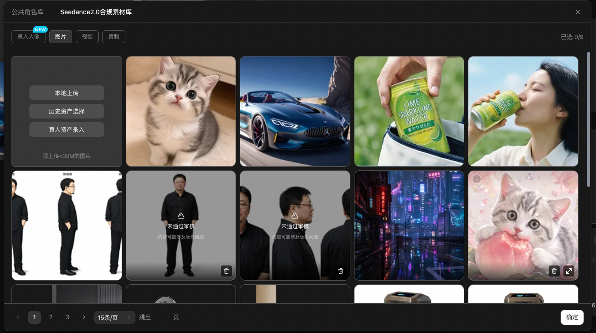
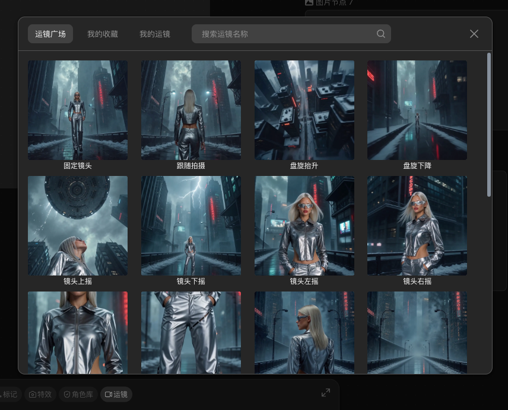

> 来源：[飞书原文](https://hcnbsg6ttb3t.feishu.cn/wiki/EkwkwiP8Iitg6okbf00cgnTOnze)  
> 同步时间：2026-08-16T09:01:04.604Z  
> 文档标识：Os84dV1I4ox01ExPRPAcylbgnBN

# ✅细化脚本

> **提示**
>
**引入｜这节课会讲什么**
本节介绍视频模型、视频提示词、运镜写法、生成路径和生成后调整，并完成一条指定场景视频。
- **核心内容：**从 LibTV 的多种视频模型中选择主要模型讲解；拆解动作、环境动态、运镜和节奏写法；演示视频生成前后的功能。
- **学完你会：**根据任务选择视频模型，写出动作与运镜明确的提示词，并完成一条动态稳定的短视频。

<table><colgroup><col/><col/><col/><col/><col/><col/><col/><col/><col/><col/><col/></colgroup><thead><tr><th vertical-align="top"><b>阶段</b></th><th vertical-align="top"><b>大纲</b></th><th vertical-align="top"><b>内容</b></th><th vertical-align="top"><b>小节</b></th><th vertical-align="top"><b>口播</b></th><th vertical-align="top"><b>画面形式</b></th><th vertical-align="top"><b>B-roll（录屏、解说动画、其他拍摄需求）</b></th><th vertical-align="top"><b>屏幕字幕</b></th><th vertical-align="top"><b>剪辑提示</b></th><th vertical-align="top"><b>截图</b></th><th vertical-align="top"><b>备注</b></th></tr></thead><tbody><tr><td rowspan="5" vertical-align="top">课程开始</td><td rowspan="5" vertical-align="top"><b>引入</b></td><td rowspan="5" vertical-align="top"><ul><li>用同一张芭蕾舞演员首帧完成一条 5 秒舞蹈视频。</li><li>讲清 LibTV 的画布准备、生成路径、模型选择、提示词、生成、检查和导出。</li></ul></td><td rowspan="5" vertical-align="top"><b>01｜结果先行：这节课要做成什么</b></td><td vertical-align="top">上节课，我们讲了图片的生成方法。</td><td vertical-align="top">A-roll + 上节回顾</td><td vertical-align="top">讲师出镜，穿插上一节的芭蕾舞演员图片和提示词画面。</td><td vertical-align="top">上节课：图片生成 + 图片提示词</td><td vertical-align="top">用上一节最终图片承接本节内容。</td><td vertical-align="top"></td><td vertical-align="top"></td></tr><tr><td vertical-align="top">那么这节课，我们就来聊聊视频生成，例如把上一节生成的芭蕾舞演员图片动起来，做成一段丝滑、流畅的舞蹈视频。</td><td vertical-align="top">A-roll + B-roll</td><td vertical-align="top">上一节的芭蕾舞演员图片切换为本节最终舞蹈视频。</td><td vertical-align="top">让图片动起来：丝滑、流畅的舞蹈视频</td><td vertical-align="top">用生成前后的画面对照完成转场。</td><td vertical-align="top"></td><td vertical-align="top"></td></tr><tr><td vertical-align="top">和图片生成一样，想要生成你满意的效果，最重要的无外乎两点：</td><td vertical-align="top">A-roll + 结果展示</td><td vertical-align="top">播放一版只用简短描述生成的可用结果。</td><td vertical-align="top">简单描述，也能得到不错的画面</td><td vertical-align="top">完整播放 3—5 秒，避免只展示单帧。</td><td vertical-align="top"></td><td vertical-align="top"></td></tr><tr><td vertical-align="top">就是视频模型的选择和提示词写法。</td><td vertical-align="top">A-roll + 动画</td><td vertical-align="top">“模型选择”和“提示词写法”两张卡片并排出现。</td><td vertical-align="top">做好视频的两个关键：模型选择｜提示词写法</td><td vertical-align="top">两张卡片依次高亮。</td><td vertical-align="top"></td><td vertical-align="top"></td></tr><tr><td vertical-align="top">围绕这两点，我们会分别讲清具体方法，并在 LibTV 里完成整套的生成流程。</td><td vertical-align="top">A-roll + 录屏</td><td vertical-align="top">讲师出镜，画面切入 LibTV 操作界面。</td><td vertical-align="top">模型怎么选｜提示词怎么写｜LibTV 完整演示</td><td vertical-align="top">字幕停留 3 秒后进入步骤一。</td><td vertical-align="top"></td><td vertical-align="top"></td></tr><tr><td rowspan="25" vertical-align="top">步骤一</td><td rowspan="25" vertical-align="top"><b>选择视频生成方式和模型</b></td><td rowspan="25" vertical-align="top"><ul><li>常见方式包括文生视频、图生视频、首尾帧和全能参考。</li><li>根据已有素材、控制要求和模型支持情况选择生成方式。</li><li>主要介绍 Seedance 2.5、Seedance 2.0、Minimax H3、Kling 3.0、Kling O3 和 Wan 系列。</li><li>用同一张芭蕾首帧和同一条提示词比较 Seedance 2.0 与 Minimax H3。</li></ul></td><td rowspan="4" vertical-align="top"><b>02｜四种视频生成方式有什么区别</b></td><td vertical-align="top">对于AI 视频来说，常见的视频生成方式有三种：文生视频、首尾帧和全能参考。</td><td vertical-align="top">A-roll + 动画</td><td vertical-align="top">四种视频生成方式卡片依次出现。</td><td vertical-align="top">文生｜图生｜首尾帧｜全能参考</td><td vertical-align="top">四种方式各停留约 2 秒。</td><td vertical-align="top"></td><td vertical-align="top"></td></tr><tr><td vertical-align="top">文生视频只需要输入文字，生成的内容完全由文字控制</td><td vertical-align="top">解说动画</td><td vertical-align="top">Text → Video。</td><td vertical-align="top">文生视频：只有文字</td><td vertical-align="top">文字输入出现后，直接生成视频。</td><td vertical-align="top"></td><td vertical-align="top"></td></tr><tr><td>全能参考可以链接任何素材，图片视频音频等等，是最全能的生成模式，一般用于高要求或者复杂的生成任务</td><td></td><td></td><td></td><td></td><td></td><td></td></tr><tr><td vertical-align="top">首尾帧会同时固定开头和结尾，也可以只上传首帧或尾帧</td><td vertical-align="top">解说动画</td><td vertical-align="top">首尾帧与全能参考的输入端并排展示。</td><td vertical-align="top">首尾帧：锁定两端｜全能参考：混合素材</td><td vertical-align="top">用输入图标说明差别。</td><td vertical-align="top"></td><td vertical-align="top"></td></tr><tr><td></td><td>每种模型的生成模式都在这个地方进行选择</td><td></td><td>高亮选择栏，展示展开的选项</td><td></td><td></td><td></td><td></td></tr><tr><td rowspan="5" vertical-align="top"><b>03｜根据手里的素材选生成方式</b></td><td vertical-align="top">这四种方式没有谁一定更好，主要看你现在手里有什么素材，以及画面要控制到什么程度。</td><td vertical-align="top">A-roll + 动画</td><td vertical-align="top">四种方式放在同一张选择卡里。</td><td vertical-align="top">看现有素材，也看控制要求</td><td vertical-align="top">选择卡停留 3 秒。</td><td vertical-align="top"></td><td vertical-align="top"></td></tr><tr><td vertical-align="top">如果你只有文字，就从文生视频开始。</td><td vertical-align="top">解说动画</td><td vertical-align="top">Text → Video。</td><td vertical-align="top">文生视频：只有文字</td><td vertical-align="top"></td><td vertical-align="top"></td><td vertical-align="top"></td></tr><tr><td vertical-align="top">有场景图人物设定图或者参考的视频和图片，就选全能参考</td><td vertical-align="top">解说动画</td><td vertical-align="top">Image + Video + Audio → Video。</td><td vertical-align="top">混合参考：多种素材一起用</td><td vertical-align="top"></td><td vertical-align="top"></td><td vertical-align="top"></td></tr><tr><td vertical-align="top">人物和构图已经做好，就选图生视频。开头和结尾都确定下来了，就用首尾帧。</td><td vertical-align="top">解说动画</td><td vertical-align="top">First Frame + Last Frame → Video。</td><td vertical-align="top">首尾帧：起点和终点都明确</td><td vertical-align="top"></td><td vertical-align="top"></td><td vertical-align="top"></td></tr><tr><td vertical-align="top">每个模型支持的方式不一样，选模型时顺手看一下它能接哪些素材。</td><td vertical-align="top">录屏</td><td vertical-align="top">切换两个模型，展示模式选项随模型变化。</td><td vertical-align="top">模型不同，可用模式也不同</td><td vertical-align="top"></td><td vertical-align="top"></td><td vertical-align="top">界面名称以录课当天为准。</td></tr><tr><td></td><td>第一点：模型的选择，俗话说选择大于努力，选对了模型生成的效果也更让人满意</td><td></td><td></td><td></td><td></td><td></td><td></td></tr><tr><td rowspan="8" vertical-align="top"><b>04｜常用模型分别适合什么任务</b></td><td vertical-align="top">模型的生成方式确定以后，我们来看一下常用模型，它们更新很快，所以这里主要讲当前差别，不给模型排一个长期不变的名次。</td><td vertical-align="top">A-roll</td><td vertical-align="top">模型菜单滚动，右下角标注核对日期。</td><td vertical-align="top">模型会更新，按任务选择</td><td vertical-align="top"></td><td vertical-align="top"></td><td vertical-align="top"></td></tr><tr><td vertical-align="top">这次主要看五组：Seedance 2.5、Seedance 2.0、Minimax H3、Kling 3.0 和O3，以及Wan 3.0。</td><td vertical-align="top">录屏</td><td vertical-align="top">依次显示五组模型入口，Wan 按当前界面展示 2.7。</td><td vertical-align="top">Seedance 2.5｜Seedance 2.0｜Minimax H3｜Kling 3.0/O3｜Wan 2.7</td><td vertical-align="top">字幕标注“以当前界面为准”。</td><td vertical-align="top"></td><td vertical-align="top">大纲写 Wan 3.0；当前 CLI 列表为 Wan 2.7，录制前复核。</td></tr><tr><td vertical-align="top">如果参考素材比较多，或者还要编辑已有视频，可以优先看 Seedance 2.5，它支持上述生成方式并且还有音频驱动和视频编辑，全能参考最多可以混合 50 个素材，单条最长 30 秒，生成的效果是最好的但是也是最贵的。</td><td vertical-align="top">能力卡</td><td vertical-align="top">Seedance 2.5 能力项逐个点亮。</td><td vertical-align="top">Seedance 2.5：50 个混合素材｜30 秒｜视频编辑</td><td vertical-align="top"></td><td vertical-align="top"></td><td vertical-align="top"></td></tr><tr><td>Seedance 2.0 的生成效果也比较稳，是生成的主力军，单条最长 15 秒，全能参考最多支持 15 个素材，还可以直接选择 4K，适合不需要视频编辑的常规生成。</td><td>能力卡</td><td>芭蕾舞视频生成结果</td><td>Seedance 2.0：15 个混合素材｜15 秒｜4K</td><td></td><td></td><td></td></tr><tr><td>Minimax H3 支持单图、首尾帧和全能参考，超高性价比，最长 15 秒，可以选择 2K，比较适合想兼顾画质和多素材参考的任务。</td><td>能力卡</td><td>芭蕾舞视频生成结果，Minimax H3 的模式、时长和 2K 选项依次出现。</td><td>Minimax H3：全能参考｜15 秒｜2K</td><td></td><td></td><td></td></tr><tr><td vertical-align="top">Kling 3.0 更适合直接生成，支持文生、单图和首尾帧，最长 15 秒，也可以开智能分镜和 4K。kling O3 则是用来编辑视频</td><td vertical-align="top">能力卡</td><td vertical-align="top">芭蕾舞视频生成结果，Kling 3.0 的智能分镜和 4K 选项依次出现。</td><td vertical-align="top">Kling 3.0：智能分镜｜4K｜最长 15 秒</td><td vertical-align="top"></td><td vertical-align="top"></td><td vertical-align="top"></td></tr><tr><td vertical-align="top">wan3.0 适合生成稳定可控的画面，并且也支持 30s 的单次生成</td><td vertical-align="top">能力卡</td><td vertical-align="top">芭蕾舞视频生成结果，Kling O3 的视频编辑入口与 Wan 2.7 的参考模式并排展示。</td><td vertical-align="top">Kling O3：视频编辑｜Wan 2.7：视频/混合参考</td><td vertical-align="top"></td><td vertical-align="top"></td><td vertical-align="top"></td></tr><tr><td vertical-align="top">怎么选其实就看五件事：你手里有什么素材、要做多长、想要多高的分辨率，以及后面还要不要编辑。</td><td vertical-align="top">判断卡</td><td vertical-align="top">五项判断卡整屏出现。</td><td vertical-align="top">路径｜时长｜画质｜声音｜素材数量</td><td vertical-align="top">可截图判断卡停留 5 秒。</td><td vertical-align="top"></td><td vertical-align="top"></td></tr><tr><td rowspan="6" vertical-align="top"><b>05｜</b><b>同条件 A/B 测试：保留共同条件</b></td><td vertical-align="top">模型特点讲完了，我们在课堂跟练画布中用同一张图和同一条提示词给两个模型生成，看看差别到底在哪里。</td><td vertical-align="top">A-roll</td><td vertical-align="top">两个视频节点从同一张首帧分叉。</td><td vertical-align="top">同一首帧，测试两个模型</td><td vertical-align="top"></td><td vertical-align="top"></td><td vertical-align="top"></td></tr><tr><td vertical-align="top">两个视频节点都接“芭蕾首帧”，提示词和时长也保持一样。</td><td vertical-align="top">录屏</td><td vertical-align="top">复制视频节点，核对首帧、提示词和时长。</td><td vertical-align="top">首帧相同｜提示词相同｜5 秒</td><td vertical-align="top"></td><td vertical-align="top"></td><td vertical-align="top"></td></tr><tr><td vertical-align="top">A 节点用 Seedance 2.0，B 节点用 Minimax H3。</td><td vertical-align="top">录屏</td><td vertical-align="top">两个节点分别选择模型。</td><td vertical-align="top">A：Seedance 2.0｜B：Minimax H3</td><td vertical-align="top"></td><td vertical-align="top"></td><td vertical-align="top"></td></tr><tr><td vertical-align="top">它们的参数面板不完全一样，所以共同条件一样就够了，这次只固定参考图、提示词和五秒时长。</td><td vertical-align="top">录屏 + 对照</td><td vertical-align="top">并排展示两套参数面板，差异项用灰色标出。</td><td vertical-align="top">只对齐共同参数</td><td vertical-align="top">避免用同一字段名覆盖两个模型。</td><td vertical-align="top"></td><td vertical-align="top"></td></tr><tr><td vertical-align="top">生成完把两段视频放在一起看，人物动作、镜头运动、背景稳定和细节差异会比较明显。</td><td vertical-align="top">对比播放</td><td vertical-align="top">两版结果并排，五项检查逐行出现。</td><td vertical-align="top">人物｜动作｜手脚｜背景｜镜头</td><td vertical-align="top"></td><td vertical-align="top"></td><td vertical-align="top"></td></tr><tr><td vertical-align="top">这样比一次，我们就能看到每个模型更擅长什么，下次选模型也会更有把握。</td><td vertical-align="top">A-roll + 对比</td><td vertical-align="top">两版完整播放后再打勾。</td><td vertical-align="top">完整播放后再判断</td><td vertical-align="top">留 2 秒给观众自行比较。</td><td vertical-align="top"></td><td vertical-align="top"></td></tr><tr><td rowspan="26" vertical-align="top">步骤二</td><td rowspan="26" vertical-align="top"><b>写视频提示词</b></td><td rowspan="26" vertical-align="top"><ul><li>提示词结构：主体、风格、动作、效果、限制，声音</li><li>案例动作：双脚前后站好 → 抬起右腿向右转一圈 → 右脚落下并打开双臂。</li><li>镜头保持中远景和平视，只做极慢推进。</li></ul></td><td rowspan="9" vertical-align="top"><b>06｜视频提示词写时间里的变化</b></td><td vertical-align="top">第二点：提示词写法，网上关于提示词的写法各种各样，这个也是视频生成中变数最大的部分</td><td vertical-align="top">A-roll + 动画</td><td vertical-align="top">静止图片变成 0—5 秒时间轴。</td><td vertical-align="top">视频提示词要写“变化”</td><td vertical-align="top"></td><td vertical-align="top"></td><td vertical-align="top"></td></tr><tr><td>图片提示词写的是某一个瞬间，视频提示词要说明这几秒里人物和镜头是怎么变化的。</td><td></td><td></td><td></td><td></td><td></td><td></td></tr><tr><td vertical-align="top">为了方便理解，我们可以把一条短视频提示词分成六部分：主体、风格、动作，效果，限制，声音</td><td vertical-align="top">公式卡</td><td vertical-align="top">六块积木依次出现。</td><td vertical-align="top">主体、风格、动作，效果，限制，声音</td><td vertical-align="top">公式卡整屏停留 6 秒。</td><td vertical-align="top"></td><td vertical-align="top"></td></tr><tr><td vertical-align="top">开头需要先和模型说清楚你要一段什么样的视频，视频中出现的人物和场景内容有什么</td><td vertical-align="top">解说动画</td><td vertical-align="top">人物、服装、场景、光线四个锁定图标。</td><td vertical-align="top">连续性：哪些内容必须保持</td><td vertical-align="top"></td><td vertical-align="top"></td><td vertical-align="top"></td></tr><tr><td vertical-align="top">然后告诉模型视频生成中需要参考的画面风格。</td><td vertical-align="top">解说动画</td><td vertical-align="top">三段动作时间轴。</td><td vertical-align="top">动作：起点 → 过程 → 终点</td><td vertical-align="top"></td><td vertical-align="top"></td><td vertical-align="top"></td></tr><tr><td vertical-align="top">接下来就是描述人物的动作和神态</td><td vertical-align="top">B-roll</td><td vertical-align="top">慢放裙摆与鞋带的惯性。</td><td vertical-align="top">环境反应要有因果</td><td vertical-align="top"></td><td vertical-align="top"></td><td vertical-align="top"></td></tr><tr><td>接着描述你要的效果，包括特效效果，运镜效果或镜头效果</td><td></td><td></td><td></td><td></td><td></td><td></td></tr><tr><td vertical-align="top">最后加上限制，告诉模型你不想什么内容出现</td><td vertical-align="top">运镜动画</td><td vertical-align="top">中远景、平视、推进、慢速、焦点五个标签。</td><td vertical-align="top">景别｜机位｜方向｜速度｜焦点</td><td vertical-align="top"></td><td vertical-align="top"></td><td vertical-align="top"></td></tr><tr><td vertical-align="top">如果你对音乐或者音效有控制要求，也需要在对应位置加上对声音的描述</td><td vertical-align="top">判断卡</td><td vertical-align="top">多余动作和多余运镜卡片逐一消失。</td><td vertical-align="top">5 秒：1 个主动作 + 1 种主运镜</td><td vertical-align="top">作为可截图结论停留 4 秒。</td><td vertical-align="top"></td><td vertical-align="top"></td></tr><tr><td rowspan="8" vertical-align="top"><b>07｜把芭蕾动作写成起点、过程和终点</b></td><td vertical-align="top">接下来就是正式写提示词了，如果只写“芭蕾舞演员优雅地跳舞”，那生成的结果随机性会非常高，模型不知道你想要什么</td><td vertical-align="top">A-roll + 录屏</td><td vertical-align="top">提示词框显示抽象写法，旁边出现三个问号。</td><td vertical-align="top">“优雅地跳舞”还不够具体</td><td vertical-align="top"></td><td vertical-align="top"></td><td vertical-align="top"></td></tr><tr><td>所以我们先来描述人物动作</td><td></td><td></td><td></td><td></td><td></td><td></td></tr><tr><td vertical-align="top">一开始，她双脚一前一后站好，双手自然放在身前，手臂弯成圆弧。</td><td vertical-align="top">动作示意</td><td vertical-align="top">首帧上标出双脚和手臂的位置。</td><td vertical-align="top">起点：双脚前后站好，双手放低</td><td vertical-align="top"></td><td vertical-align="top"></td><td vertical-align="top"></td></tr><tr><td vertical-align="top">一到四秒，她踮起脚尖，抬起右腿，把脚放到左膝旁边，向右转一圈。</td><td vertical-align="top">动作示意</td><td vertical-align="top">用轮廓动画展示抬腿和转身方向。</td><td vertical-align="top">1—4 秒：抬右腿，向右转一圈</td><td vertical-align="top"></td><td vertical-align="top"></td><td vertical-align="top"></td></tr><tr><td vertical-align="top">转身时身体尽量稳住，双臂自然收拢，转头时看回镜头。</td><td vertical-align="top">动作示意</td><td vertical-align="top">逐个标出身体、手臂和头部的动作。</td><td vertical-align="top">身体稳住｜手臂收拢｜看回镜头</td><td vertical-align="top"></td><td vertical-align="top"></td><td vertical-align="top"></td></tr><tr><td vertical-align="top">四到五秒，她把右脚放回左脚前面，双臂向两边打开，然后停住。</td><td vertical-align="top">动作示意</td><td vertical-align="top">结束姿态定格。</td><td vertical-align="top">4—5 秒：落地并停住</td><td vertical-align="top"></td><td vertical-align="top"></td><td vertical-align="top"></td></tr><tr><td vertical-align="top">这里就不要再加跳跃、连续多转或者大幅甩头了，五秒里塞太多动作，手脚很容易出问题。</td><td vertical-align="top">对比动画</td><td vertical-align="top">多余动作卡片打叉。</td><td vertical-align="top">删掉跳跃、连续多转和甩头</td><td vertical-align="top"></td><td vertical-align="top"></td><td vertical-align="top"></td></tr><tr><td vertical-align="top">动作写得越具体，后面判断生成结果也越容易。</td><td vertical-align="top">A-roll</td><td vertical-align="top">回到完整三段动作时间轴。</td><td vertical-align="top">可见｜可计数｜可判断</td><td vertical-align="top"></td><td vertical-align="top"></td><td vertical-align="top"></td></tr><tr><td rowspan="7" vertical-align="top"><b>08｜补环境、运镜和节奏</b></td><td vertical-align="top">人物怎么动确定以后，我们再来补环境和镜头。</td><td vertical-align="top">A-roll</td><td vertical-align="top">动作层固定，环境层和镜头层随后出现。</td><td vertical-align="top">动作确定后，补环境和镜头</td><td vertical-align="top"></td><td vertical-align="top"></td><td vertical-align="top"></td></tr><tr><td vertical-align="top">裙摆和鞋带跟着旋转轻轻摆动，窗帘只保留一点自然起伏就可以了。</td><td vertical-align="top">B-roll</td><td vertical-align="top">放大裙摆、鞋带和窗帘，标注运动幅度。</td><td vertical-align="top">环境：只保留轻微响应</td><td vertical-align="top"></td><td vertical-align="top"></td><td vertical-align="top"></td></tr><tr><td vertical-align="top">镜头用中远景和平视机位，把头顶、双手和足尖都留在画面里。</td><td vertical-align="top">构图示意</td><td vertical-align="top">安全框标出头顶、双手和足尖。</td><td vertical-align="top">中远景｜平视｜完整全身</td><td vertical-align="top"></td><td vertical-align="top"></td><td vertical-align="top"></td></tr><tr><td vertical-align="top">摄影机只做很慢的推进，焦点一直放在演员身上，不做切镜。</td><td vertical-align="top">运镜示意</td><td vertical-align="top">相机沿直线轻微推进，环绕和切镜图标打叉。</td><td vertical-align="top">极慢推进｜不环绕｜不切镜</td><td vertical-align="top"></td><td vertical-align="top">

</td><td vertical-align="top"></td></tr><tr><td vertical-align="top">时间上也分清楚：零到一秒停留在首帧，一到四秒完成旋转，四到五秒落地并停住。</td><td vertical-align="top">时间轴</td><td vertical-align="top">三段时间轴与动作一一对应。</td><td vertical-align="top">0—1 稳住｜1—4 旋转｜4—5 停住</td><td vertical-align="top"></td><td vertical-align="top"></td><td vertical-align="top"></td></tr><tr><td vertical-align="top">人物动作是这条视频的重点，所以环境和镜头都不要比她更抢眼。</td><td vertical-align="top">层级动画</td><td vertical-align="top">人物动作置顶，环境和镜头作为从属层。</td><td vertical-align="top">主次：人物动作 &gt; 环境 &gt; 镜头</td><td vertical-align="top"></td><td vertical-align="top"></td><td vertical-align="top"></td></tr><tr><td vertical-align="top">画面里的人已经在旋转了，摄影机就不要跟着绕，不然很容易显得乱。</td><td vertical-align="top">对比视频</td><td vertical-align="top">固定推进版与环绕版并排。</td><td vertical-align="top">人物在转，镜头别再绕</td><td vertical-align="top">两版同步播放 3 秒。</td><td vertical-align="top"></td><td vertical-align="top"></td></tr><tr><td rowspan="2" vertical-align="top"><b>09｜完整提示词</b></td><td vertical-align="top">这些信息整理好以后，就可以拼成一条完整提示词了。</td><td vertical-align="top">录屏</td><td vertical-align="top">展示完整版提示词</td><td vertical-align="top">完整提示词</td><td vertical-align="top"></td><td vertical-align="top"></td><td vertical-align="top"></td></tr><tr><td vertical-align="top">这段可以直接整段粘贴，如果发现生成的结果还是不受你控制，可以再强化对应部分的提示词。</td><td vertical-align="top">A-roll + 公式卡</td><td vertical-align="top">完整版与精简版提示词并排。</td><td vertical-align="top">精简时保留：动作时间轴 + 镜头限制</td><td vertical-align="top">整段提示词停留 8 秒，便于截图。</td><td vertical-align="top"></td><td vertical-align="top"></td></tr><tr><td rowspan="14" vertical-align="top">步骤三</td><td rowspan="14" vertical-align="top"><b>在 LibTV 里生成并对比</b></td><td rowspan="14" vertical-align="top"><ul><li>确认素材连线后，依次设置模型、模式、时长、画幅、清晰度和声音。</li><li>粘贴提示词并核对 @ 素材，确认无误后发起生成。</li><li>对比节点只更换模型，完整记录各自的参数字段。</li></ul></td><td rowspan="10" vertical-align="top"><b>10｜按平台顺序完成一次图生视频</b></td><td vertical-align="top">复制好提示词后，选择视频节点，先确认左侧已经连上“芭蕾首帧”。</td><td vertical-align="top">录屏</td><td vertical-align="top">镜头沿连线由图片节点移动至视频节点。</td><td vertical-align="top">检查素材连线</td><td vertical-align="top"></td><td vertical-align="top"></td><td vertical-align="top"></td></tr><tr><td vertical-align="top">这次我们选 Seedance 2.0，生成方式选图生视频。</td><td vertical-align="top">录屏</td><td vertical-align="top">展开模型和模式菜单完成选择。</td><td vertical-align="top">Seedance 2.5｜图生视频</td><td vertical-align="top"></td><td vertical-align="top"></td><td vertical-align="top"></td></tr><tr><td vertical-align="top">时长设为五秒，画幅跟随首帧的十六比九，清晰度按当前面板选择。</td><td vertical-align="top">录屏</td><td vertical-align="top">设置 5 秒、16:9 和清晰度。</td><td vertical-align="top">5 秒｜16:9｜清晰度按面板</td><td vertical-align="top"></td><td vertical-align="top"></td><td vertical-align="top"></td></tr><tr><td vertical-align="top">把完整提示词粘贴进去，再看一眼 @ 的素材是不是这张首帧。</td><td vertical-align="top">录屏</td><td vertical-align="top">粘贴提示词，点击 @ 素材查看缩略图。</td><td vertical-align="top">核对 @芭蕾首帧</td><td vertical-align="top"></td><td vertical-align="top"></td><td vertical-align="top"></td></tr><tr><td vertical-align="top">生成按钮可以点击，说明当前需要的素材和提示词都已经放好了。</td><td vertical-align="top">录屏</td><td vertical-align="top">生成按钮从不可用变为可用。</td><td vertical-align="top">素材和提示词已齐全</td><td vertical-align="top"></td><td vertical-align="top"></td><td vertical-align="top"></td></tr><tr><td vertical-align="top">点击生成以后等任务跑完就行，不要在还没结束的时候重复提交。</td><td vertical-align="top">录屏</td><td vertical-align="top">任务进度正常推进。</td><td vertical-align="top">提交一次，等待完成</td><td vertical-align="top">进度段可适当加速，不剪掉起止状态。</td><td vertical-align="top"></td><td vertical-align="top"></td></tr><tr><td vertical-align="top">结果出来先完整看一遍，别一上来就暂停挑单帧。</td><td vertical-align="top">结果播放</td><td vertical-align="top">第一版结果完整播放。</td><td vertical-align="top">完整播放一遍</td><td vertical-align="top"></td><td vertical-align="top"></td><td vertical-align="top"></td></tr><tr><td vertical-align="top">如果还想比较模型，可以复制这个节点，或者新建一个节点接同一张首帧。</td><td vertical-align="top">录屏</td><td vertical-align="top">复制节点或新建节点后复用首帧连线。</td><td vertical-align="top">复制节点，复用同一首帧</td><td vertical-align="top"></td><td vertical-align="top"></td><td vertical-align="top"></td></tr><tr><td vertical-align="top">第二个节点换成 Kling 3.0，仍用五秒和同一条提示词。</td><td vertical-align="top">录屏</td><td vertical-align="top">第二节点切换 Kling 3.0，核对时长和提示词。</td><td vertical-align="top">Kling 3.0｜5 秒｜同一提示词</td><td vertical-align="top"></td><td vertical-align="top"></td><td vertical-align="top"></td></tr><tr><td vertical-align="top">所以参数最好顺手记一下，包括模型、生成方式、时长、画质和声音设置。</td><td vertical-align="top">记录表</td><td vertical-align="top">五列表格逐项填写。</td><td vertical-align="top">记录：模型｜模式｜时长｜画质｜声音</td><td vertical-align="top">记录表停留 4 秒。</td><td vertical-align="top"></td><td vertical-align="top"></td></tr><tr><td rowspan="4" vertical-align="top"><b>11｜生成结果检查</b></td><td vertical-align="top">视频生成好之后，我们可以看看生成的效果怎么样</td><td vertical-align="top">对比播放</td><td vertical-align="top">两版同步播放，局部放大脸、盘发和服装。</td><td vertical-align="top">人物一致性</td><td vertical-align="top"></td><td vertical-align="top"></td><td vertical-align="top"></td></tr><tr><td vertical-align="top">检查视频中的内容有没有按照你的要求来</td><td vertical-align="top">对比播放</td><td vertical-align="top">用慢放检查四肢和动作连续性。</td><td vertical-align="top">四肢完整｜动作连续</td><td vertical-align="top"></td><td vertical-align="top"></td><td vertical-align="top"></td></tr><tr><td vertical-align="top">再检查人物的动作是否流畅，会不会出现肢体缺失或者闪烁的问题</td><td vertical-align="top">对比播放</td><td vertical-align="top">叠加参考线检查墙线、窗框和地板。</td><td vertical-align="top">背景稳定</td><td vertical-align="top"></td><td vertical-align="top"></td><td vertical-align="top"></td></tr><tr><td vertical-align="top">如果出现了问题，接下来就会告诉你怎么修改</td><td vertical-align="top">对比播放</td><td vertical-align="top">显示镜头位移轨迹。</td><td vertical-align="top">镜头响应</td><td vertical-align="top"></td><td vertical-align="top"></td><td vertical-align="top"></td></tr><tr><td rowspan="15" vertical-align="top">步骤四</td><td rowspan="15" vertical-align="top"><b>生成后调整与交付</b></td><td rowspan="15" vertical-align="top"><ul><li>按问题类型改提示词，每轮只改一个主要变量。</li><li>视频合成节点负责裁剪、拼接和基础节奏。</li><li>其他后处理工具按需使用，最终保留成片、对比视频、提示词、参数和画布链接。</li></ul></td><td rowspan="6" vertical-align="top"><b>12｜按问题类型修改，不推翻整条提示词</b></td><td vertical-align="top">出现了问题，不用把整条提示词全部重写，找到对应那一部分改就行。</td><td vertical-align="top">A-roll</td><td vertical-align="top">问题诊断卡出现。</td><td vertical-align="top">一次定位一个问题</td><td vertical-align="top"></td><td vertical-align="top"></td><td vertical-align="top"></td></tr><tr><td vertical-align="top">脸和服装如果不受控制，就把人物和服装写得更明确，同时删掉无关描述。</td><td vertical-align="top">对比示意</td><td vertical-align="top">连续性句前后对比。</td><td vertical-align="top">身份漂移 → 加强连续性</td><td vertical-align="top"></td><td vertical-align="top"></td><td vertical-align="top"></td></tr><tr><td vertical-align="top">动作太小，就说清楚起点、动作幅度和停下来的位置</td><td vertical-align="top">对比示意</td><td vertical-align="top">动作句前后对比。</td><td vertical-align="top">动作太小 → 补起点、幅度、终点</td><td vertical-align="top"></td><td vertical-align="top"></td><td vertical-align="top"></td></tr><tr><td vertical-align="top">手脚容易变形，就少安排几个动作</td><td vertical-align="top">对比示意</td><td vertical-align="top">全身安全框和动作删减示意。</td><td vertical-align="top">手脚变形 → 减动作、慢节奏、保全身</td><td vertical-align="top"></td><td vertical-align="top"></td><td vertical-align="top"></td></tr><tr><td vertical-align="top">背景闪动，就减少环境变化或者减少背景的提示词控制</td><td vertical-align="top">对比示意</td><td vertical-align="top">背景动态与镜头词删减。</td><td vertical-align="top">背景闪动 → 减环境、稳镜头</td><td vertical-align="top"></td><td vertical-align="top"></td><td vertical-align="top"></td></tr><tr><td vertical-align="top">这样重新生成以后，就可以看出是哪处修改起了作用。</td><td vertical-align="top">判断卡</td><td vertical-align="top">V1→改动作→V2；V2→改镜头→V3。</td><td vertical-align="top">一轮只改一个主要变量</td><td vertical-align="top">版本链路停留 4 秒。</td><td vertical-align="top"></td><td vertical-align="top"></td></tr><tr><td rowspan="9" vertical-align="top"><b>1</b><b>3｜裁剪、导出并保存参数</b></td><td vertical-align="top">视频生成好之后，节点里还有很多后处理的功能，我们挑重要的功能说一下</td><td vertical-align="top">案例导入</td><td vertical-align="top">播放已经生成好的芭蕾舞视频，选中节点后展开顶部工具栏，用光标依次划过几个主要功能。</td><td vertical-align="top">视频生成完成后，还可以继续处理</td><td vertical-align="top">从完整成片切到工具栏特写，功能名称跟随光标逐个点亮。</td><td vertical-align="top">视频节点工具栏完整截图</td><td vertical-align="top">沿用本节生成的芭蕾舞视频。</td></tr><tr><td vertical-align="top">片段重拍是选择某个片段进行重新生成</td><td vertical-align="top">案例演示 + 前后对比</td><td vertical-align="top">用旋转时手臂变形的片段做例子，框选出问题的时间范围，输入修正描述并重新生成这一小段。</td><td vertical-align="top">片段重拍：只重做出问题的一小段</td><td vertical-align="top">按“问题片段—框选范围—重拍结果”的顺序展示，最后并排对比一次。</td><td vertical-align="top">重拍时间范围和修正描述截图</td><td vertical-align="top">提前准备一版手臂明显变形的失败片段。</td></tr><tr><td vertical-align="top">高清功能可以将低分辨率的视频高清到最高 4k 分辨率</td><td vertical-align="top">清晰度对比案例</td><td vertical-align="top">用同一段芭蕾舞视频展示高清处理前后效果，分别放大演员面部、手指和裙摆边缘。</td><td vertical-align="top">高清：低分辨率视频最高可提升至 4K</td><td vertical-align="top">左右分屏同步播放，局部放大细节，避免只展示参数面板。</td><td vertical-align="top">高清处理前后同帧对比截图</td><td vertical-align="top">对比画面使用同一时间点和同一放大比例。</td></tr><tr><td>逐帧拉片是会员功能，选择视频拉片后就可以将视频拆解成一个分镜表，按照分镜表调整和生成就可以复刻你想要的效果了</td><td>分镜表案例演示</td><td>对五秒芭蕾舞视频执行逐帧拉片，展示生成的分镜表，再选其中一个镜头调整描述并重新生成。</td><td>逐帧拉片：视频 → 分镜表 → 调整复刻</td><td>从成片缩进到分镜表全景，再放大其中一格展示修改位置。</td><td>逐帧拉片生成的分镜表截图</td><td>会员标识在界面中出现时保留，不额外口播价格。</td></tr><tr><td>智能续写适合你想沿着现在的画面继续向下制作</td><td>接续案例演示</td><td>原视频在演员旋转落地后结束，智能续写里补充“继续向右迈步并抬起双臂”，展示生成后的接续片段。</td><td>智能续写：沿着当前画面继续往下生成</td><td>先播放原片最后一秒，再展示续写描述，最后连续播放原片和续写结果。</td><td>原片结尾与续写开头的衔接截图</td><td>续写动作保持简单，方便看清衔接效果。</td></tr><tr><td>画面编辑则有主体消除、修改和替换，适合针对视频中主要元素进行换脸或修改，智能抠像则可以快速去掉背景或黑白底</td><td vertical-align="top">三组案例展示</td><td>依次演示消除背景杂物、修改芭蕾舞服颜色，以及用智能抠像去掉舞蹈教室背景。</td><td>主体消除｜修改与替换｜智能抠像</td><td>三个案例用同样大小的前后对比画面排成一组，不插入口播镜头。</td><td>三种画面编辑功能的前后对比截图</td><td>换脸只在功能菜单中带到，不使用真实人物做演示。</td></tr><tr><td>这些就是生成视频后的一些后期功能，大家可以自由去探索和尝试</td><td>案例结果回顾</td><td>把片段重拍、高清、分镜表、智能续写和画面编辑的结果排在同一画面中，逐个打勾。</td><td>哪里有问题，就用对应的工具处理</td><td>用五个案例结果做快速蒙太奇，每项停留约一秒。</td><td>五项案例结果总览截图</td><td>不重复打开菜单，重点回看实际处理结果。</td></tr><tr><td vertical-align="top">最后把成片下载下来，同时保留画布链接、完整提示词和模型参数。</td><td vertical-align="top">交付演示</td><td vertical-align="top">下载最终芭蕾舞视频，随后打开交付文件夹，展示成片、模型对比视频、提示词、参数记录和画布链接。</td><td vertical-align="top">成片｜对比视频｜提示词｜模型参数｜画布链接</td><td vertical-align="top">下载完成后立刻切到文件夹核对内容，再用最终成片完整播放收尾。</td><td vertical-align="top">最终交付文件夹截图</td><td vertical-align="top">录制前统一整理文件名，避免画面里出现临时命名。</td></tr><tr><td vertical-align="top">这次案例需要提交一条优化后的五秒 MP4，再加上两种模型的对比视频。</td><td vertical-align="top">交付清单</td><td vertical-align="top">文件夹中显示成片、A/B 原片和参数文档。</td><td vertical-align="top">交付：5 秒 MP4 + 两种模型原片</td><td vertical-align="top">以最终成片完整播放收尾。</td><td vertical-align="top"></td><td vertical-align="top"></td></tr></tbody></table>

## 需要的案例

以下案例待提供

<table><colgroup><col/><col/><col/><col/></colgroup><thead><tr><th vertical-align="top"><b>案例名称</b></th><th vertical-align="top"><b>数量</b></th><th vertical-align="top"><b>具体要求</b></th><th vertical-align="top"><b>交付内容</b></th></tr></thead><tbody><tr><td vertical-align="top">芭蕾舞演员转一圈镜头</td><td vertical-align="top">1 条</td><td vertical-align="top"><ul><li>使用成年芭蕾舞演员首帧，保持面部、盘发、白色练功裙、粉色足尖鞋和浅灰舞蹈教室一致。</li><li>0—1 秒双脚前后站好；1—4 秒抬起右腿向右转一圈；4—5 秒右脚落下，双臂打开并停住。</li><li>薄纱裙摆和鞋带随动作轻轻摆动，窗帘只有小幅自然起伏。</li><li>中远景、平视机位，镜头极慢推进，不环绕、不切镜。</li><li>以同一首帧、提示词和 5 秒时长测试 Seedance 2.5 与 Kling 3.0；只对齐双方共同支持的参数。</li><li>检查人物一致性、动作连贯、手脚完整、背景稳定和镜头响应。</li></ul></td><td vertical-align="top"><ul><li>芭蕾舞演员最终首帧。</li><li>完整视频提示词。</li><li>模型、模式、时长、画质和声音参数记录。</li><li>两种模型的原始对比视频。</li><li>1 条优化后的 5 秒 MP4。</li><li>简短对比结论和可继续编辑的画布链接。</li></ul></td></tr></tbody></table>

### 配套动画（暂定）

| 动画名称 | 数量 | 具体要求 | 交付内容 |
|-|-|-|-|
| 视频生成方式对比动画 | 1 段 | 时长约 10—15 秒；对比文生视频、图生视频、首尾帧和全能参考的输入方式与适用场景。 | 16:9、1080P 成片；可编辑工程文件；流程图形素材；无字幕版和文字示意版。 |
| 常用运镜示意动画 | 1 段 | 时长约 10—15 秒；用同一主体演示固定、推进、拉远、横摇、俯仰、跟拍和环绕，清楚标出镜头运动方向。 | 16:9、1080P 成片；可编辑工程文件；各运镜独立片段；无字幕版。 |

## 参考案例

[附件：jimeng-2026-07-31-7811-场景，角色生成一支15秒、16_9、4K、超写实真人电影级食物魔法对战广告。严格....mp4](./assets/VBJGboi6SoQ2nOxCR4AclJrEnMg.mp4)

## 本地素材清单

- [公共角色库.png](./assets/X3OabEjunoJ1uTxnJ9Tc586CnHe.png)（media，777096 字节）
- [素材库.png](./assets/CDwAbQglgop5d4x6qaFcAD7anVE.png)（media，954450 字节）
- [运镜广场.png](./assets/EsaXbTWYqoZB0txNYAwc8J7qnjh.png)（media，594433 字节）
- [jimeng-2026-07-31-7811-场景，角色生成一支15秒、16_9、4K、超写实真人电影级食物魔法对战广告。严格....mp4](./assets/VBJGboi6SoQ2nOxCR4AclJrEnMg.mp4)（media，27766023 字节）
