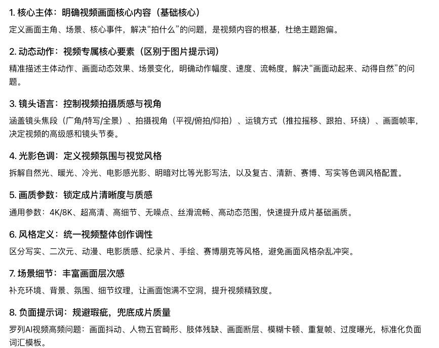
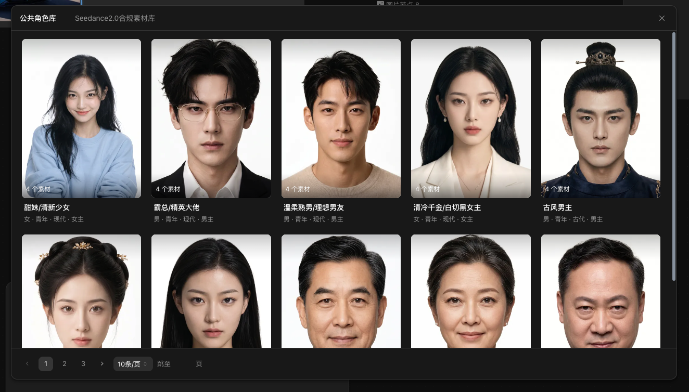

> 来源：[飞书原文](https://hcnbsg6ttb3t.feishu.cn/wiki/YAWpw98n2i61bsk8Y7UcaFKonqh)  
> 同步时间：2026-08-16T09:01:04.604Z  
> 文档标识：GVjkdnebLoIwd2xRwwQctaqPn7b

# 第四节：视频生成与提示词写法

> **提示**
>
**引入｜这节课会讲什么**
本节介绍视频模型、视频提示词、运镜写法、生成路径和生成后调整，并完成一条指定场景视频。
- **核心内容：**从 LibTV 的多种视频模型中选择主要模型讲解；拆解动作、环境动态、运镜和节奏写法；演示视频生成前后的功能。
- **学完你会：**根据任务选择视频模型，写出动作与运镜明确的提示词，并完成一条动态稳定的短视频。

<table><colgroup><col/><col/><col/><col/><col/></colgroup><thead><tr><th vertical-align="top"><b>阶段</b></th><th vertical-align="top"><b>大纲</b></th><th vertical-align="top"><b>内容</b></th><th vertical-align="top"><b>截图</b></th><th vertical-align="top"><b>备注</b></th></tr></thead><tbody><tr><td vertical-align="top">课程开始</td><td vertical-align="top"><b>引入</b></td><td vertical-align="top">这一节，我们会把上一节的场景图做成视频，重点讲清不同生成模型的区别，视频模型怎么选、提示词怎么写。</td><td vertical-align="top"></td><td vertical-align="top"></td></tr><tr><td rowspan="2" vertical-align="top">步骤一</td><td vertical-align="top"><b>选择视频模型｜基础讲解</b></td><td vertical-align="top"><ul><li><b>生成路径</b><ul><li>文生视频：只使用文字描述生成。</li><li>图生视频：使用一张首帧图控制人物和场景。</li><li>首尾帧：同时控制开始和结束画面。</li><li>全能参考：组合多个图片、视频、音频和文字素材。</li></ul></li><li><b>模型范围</b><ul><li>LibTV 提供多种视频生成与编辑模型，完整清单见附录“可用模型”。</li><li>本节挑选常用模型介绍，不逐一展开全部模型。</li></ul></li><li><b>主要模型</b><ul><li>Seedance 2.5：30s 单次生成， 50 个复合类型素材，超强画面质感和镜头编排能力</li><li>Seedance 2.0：15s 单次生成，生成主力军，画面效果稳定</li><li>Minimax H3：超高性价比生成，文字不变形。</li><li>Kling 3.0：一致性强，人物皮肤质感真实，适合做影视类效果</li><li>Wan  3.0：高性价比生成，画面稳定听话</li></ul></li><li><b>选择方法</b><ul><li>先判断输入方式、时长、音频和编辑需求，再选择模型。</li><li>重要镜头可使用同一首帧、提示词和时长测试两个或三个主要模型。</li></ul></li></ul></td><td vertical-align="top"></td><td vertical-align="top"></td></tr><tr><td vertical-align="top"><b>选择视频模型｜案例演示</b></td><td vertical-align="top"><ul><li>以“芭蕾舞演员跳舞片段”为目标。</li><li>使用上一节的最终场景图作为统一首帧。</li><li>先用 Seedance 2.0 生成，再选择 Kling 3.0 或其他主要模型对比。</li><li>比较人物一致性、动作自然度、运镜响应、背景稳定性和物理逻辑。</li></ul></td><td vertical-align="top"></td><td vertical-align="top"></td></tr><tr><td rowspan="2" vertical-align="top">步骤二</td><td vertical-align="top"><b>写视频提示词｜基础讲解</b></td><td vertical-align="top"><ul><li><b>完整结构</b><ul><li>首帧与主体：说明参考图片以及需要保持的人物、服装和场景。</li><li>主体动作：写清动作起点、过程和结束状态。</li><li>环境动态：说明道具、衣物、头发、光影或背景人物的变化。</li><li>镜头语言：景别、机位、运镜方向、速度和焦点。</li><li>时间与节奏：视频时长、动作先后和快慢变化。</li><li>风格与声音：画面风格、光影色调；需要时补充对白、音效或音乐。</li><li>限制条件：保持人物一致、背景稳定，避免变形、跳帧和无关镜头运动。</li></ul></li><li><b>常用运镜</b><ul><li>固定镜头：机位不动，突出人物动作。</li><li>推进或拉远：改变景别，强调主体或交代环境。</li><li>横摇或俯仰：镜头原地转动，跟随视线或动作方向。</li><li>跟拍：镜头随人物移动。</li><li>环绕：围绕主体移动，适合展示空间和动作。</li></ul></li><li><b>写法原则</b><ul><li>短镜头以一个主要动作和一个主要运镜为主。</li><li>先写人物怎么动，再写镜头怎么跟。</li><li>明确起点和终点，避免同时要求相反的运镜。</li></ul></li></ul></td><td vertical-align="top"></td><td vertical-align="top"></td></tr><tr><td vertical-align="top"><b>写视频提示词｜案例演示</b></td><td vertical-align="top"><ul><li>按照“首帧—主体动作—环境动态—镜头—节奏—风格—限制”的顺序完成提示词。</li><li><b>参考提示词：</b>以 @图片1 作为首帧，保持罗永浩老师的面部、黑色西装和古风客栈场景；他向前跨一步，抬手接住飞来的茶杯，停顿后看向镜头露出意外表情，衣角随动作摆动；镜头从中远景缓慢推进至中景，略微向右跟随，动作先快后慢；写实电影风格，暖色侧光，5 秒，人物不变形，背景不跳动，镜头不旋转。</li><li>逐项说明动作、运镜和限制条件如何影响结果。</li></ul></td><td vertical-align="top"></td><td vertical-align="top"></td></tr><tr><td rowspan="2" vertical-align="top">步骤三</td><td vertical-align="top"><b>生成视频｜基础讲解</b></td><td vertical-align="top"><ul><li><b>基础设置</b><ul><li>创建视频节点，选择模型、时长、画幅和清晰度。</li><li>根据模型能力选择首帧、首尾帧或全能参考入口。</li></ul></li><li><b>生成前功能</b><ul><li>特效：选择需要的动态效果。</li><li>角色库：使用公共角色或上传通过合规校验的素材。</li><li>运镜：选择运镜示例，或输入运镜提示词。</li></ul></li></ul></td><td vertical-align="top">

</td><td vertical-align="top"></td></tr><tr><td vertical-align="top"><b>生成视频｜案例演示</b></td><td vertical-align="top"><ul><li>上传上一节的搞笑武打场景图作为首帧。</li><li>使用步骤二完成的提示词生成 5 秒视频。</li><li>先检查人物和场景是否稳定，再检查动作和运镜。</li><li>使用相同条件测试主要模型，选出最符合提示词的版本。</li></ul></td><td vertical-align="top"></td><td vertical-align="top"></td></tr><tr><td vertical-align="top">步骤四</td><td vertical-align="top"><b>生成后调整｜基础讲解</b></td><td vertical-align="top"><ul><li>剪辑：调整片段起止位置和基础节奏。</li><li>裁剪：调整取景范围和画幅比例。</li><li>高清：提高分辨率和帧率，或制作自然慢动作。</li><li>解析：拆解镜头、动作、节奏和画面信息。</li><li>智能去字幕：识别并清除字幕或文字。</li><li>音频分离：分离视频音频、人声和背景音。</li><li>画面编辑：消除、修改、替换主体或进行智能抠像。</li></ul></td><td vertical-align="top"></td><td vertical-align="top"></td></tr></tbody></table>

## 需要的案例

以下案例待提供

<table><colgroup><col/><col/><col/><col/></colgroup><thead><tr><th vertical-align="top"><b>案例名称</b></th><th vertical-align="top"><b>数量</b></th><th vertical-align="top"><b>具体要求</b></th><th vertical-align="top"><b>交付内容</b></th></tr></thead><tbody><tr><td vertical-align="top">罗永浩老师搞笑武打镜头</td><td vertical-align="top">1 条</td><td vertical-align="top"><ul><li>沿用第三节选定的搞笑武打场景图，制作一条 5 秒视频。</li><li>人物向前跨一步，抬手接住飞来的茶杯，停顿后看向镜头露出意外表情。</li><li>镜头从中远景缓慢推进至中景，略微向右跟随；动作先快后慢。</li><li>保持人物面部、黑色西装和古风客栈场景一致，避免变形、背景跳动和无关镜头运动。</li><li>使用同一首帧、提示词、时长和画幅测试 Seedance 2.0 与一至两个主要模型。</li></ul></td><td vertical-align="top"><ul><li>第三节最终场景图。</li><li>完整视频提示词。</li><li>模型与参数记录。</li><li>不同模型的原始对比视频。</li><li>1 条优化后的 5 秒 MP4。</li><li>简短模型对比结论。</li><li>可继续编辑的项目链接。</li></ul></td></tr></tbody></table>

### 配套动画（暂定）

| 动画名称 | 数量 | 具体要求 | 交付内容 |
|-|-|-|-|
| 视频生成方式对比动画 | 1 段 | 时长约 10—15 秒；对比文生视频、图生视频、首尾帧和全能参考的输入方式与适用场景。 | 16:9、1080P 成片；可编辑工程文件；流程图形素材；无字幕版和文字示意版。 |
| 常用运镜示意动画 | 1 段 | 时长约 10—15 秒；用同一主体演示固定、推进、拉远、横摇、俯仰、跟拍和环绕，清楚标出镜头运动方向。 | 16:9、1080P 成片；可编辑工程文件；各运镜独立片段；无字幕版。 |

## 参考案例

[附件：jimeng-2026-07-31-7811-场景，角色生成一支15秒、16_9、4K、超写实真人电影级食物魔法对战广告。严格....mp4](./assets/OfoTb4eUBoQe57x0brZcdz0Onpb.mp4)

## 本地素材清单

- [image.png](./assets/AOI5bvZUIoAd4mxt0B1ckwlsneb.png)（media，294636 字节）
- [image.png](./assets/Qn0VbfWHIoWNCwxbkZycedVgnlc.png)（media，777096 字节）
- [image.png](./assets/HG99bBLSvoNnROxnSLhc00QWnub.png)（media，954450 字节）
- [image.png](./assets/ONI6bwbsDo1fKdxsQXocsrQyn4m.png)（media，594433 字节）
- [jimeng-2026-07-31-7811-场景，角色生成一支15秒、16_9、4K、超写实真人电影级食物魔法对战广告。严格....mp4](./assets/OfoTb4eUBoQe57x0brZcdz0Onpb.mp4)（media，27766023 字节）
