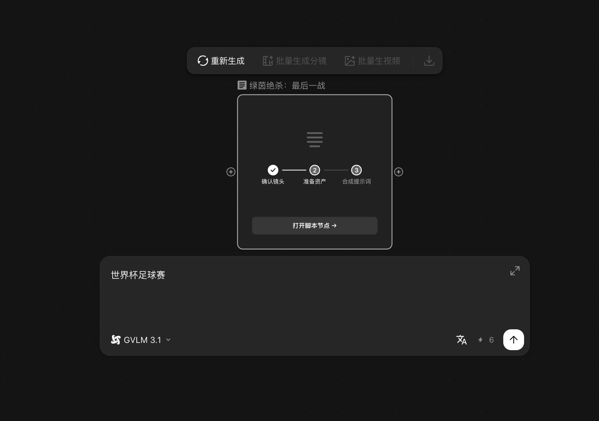
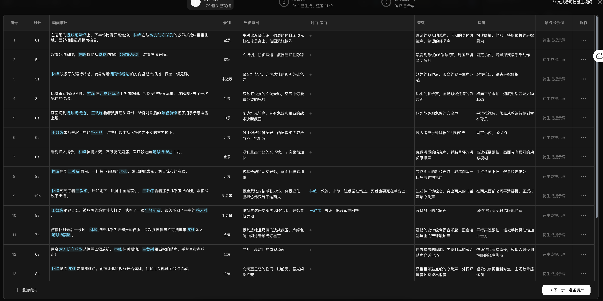
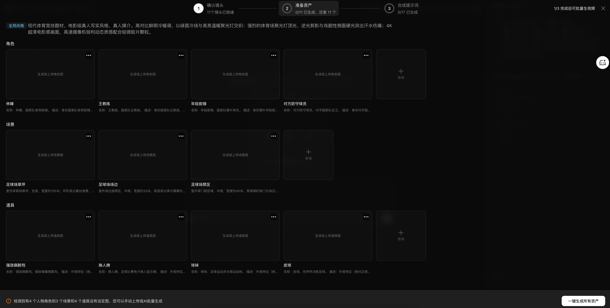
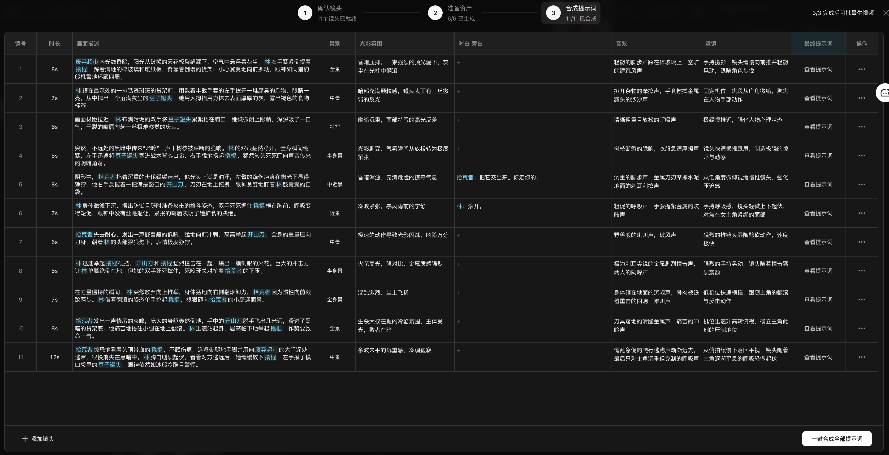

> 来源：[飞书原文](https://hcnbsg6ttb3t.feishu.cn/wiki/MrzJwb1YDiUp1WkL2MzcnJSPnJg)  
> 同步时间：2026-08-16T09:01:04.604Z  
> 文档标识：Wio7dQjHeoU6hqxspFTc8R1unbh

# 细化脚本

<table><colgroup><col/><col/><col/><col/><col/><col/><col/><col/><col/><col/><col/></colgroup><thead><tr><th vertical-align="top">阶段</th><th vertical-align="top">大纲</th><th vertical-align="top">内容</th><th vertical-align="top">小节</th><th vertical-align="top">口播</th><th vertical-align="top">画面形式</th><th vertical-align="top">B-roll（录屏、解说动画、其他拍摄需求）</th><th vertical-align="top">屏幕字幕</th><th vertical-align="top">剪辑提示</th><th vertical-align="top">截图</th><th vertical-align="top">备注</th></tr></thead><tbody><tr><td rowspan="7" vertical-align="top">课程开始</td><td rowspan="7" vertical-align="top"><b>引入</b></td><td rowspan="7" vertical-align="top"><ul><li>承接上一节的视频生成内容。</li><li>说明脚本节点、3D 导演台和智能混剪分别解决什么问题。</li><li>用同一段三人对峙剧情贯穿整节课。</li></ul></td><td rowspan="7" vertical-align="top"><b>01｜这节课要解决什么</b></td><td vertical-align="top">之前我们已经讲解了 AI 生成视频的基础操作</td><td vertical-align="top">案例回顾</td><td vertical-align="top">播放上一节芭蕾舞演员图片与舞蹈视频的前后对比。</td><td vertical-align="top">上节课：图片变成视频</td><td vertical-align="top">静态图停留一秒，再接最终舞蹈视频。</td><td vertical-align="top">上一节最终视频画面</td><td vertical-align="top">沿用上一节素材</td></tr><tr><td vertical-align="top">但也有一些朋友想说，我们是否能够再进阶一点？</td><td vertical-align="top">失败案例展示</td><td vertical-align="top">展示单个镜头效果不错，但前后拼接后动作和位置接不上的版本。</td><td vertical-align="top">单个镜头能动，还不等于能成片</td><td vertical-align="top">先播放单镜头，再切到拼接后的问题画面。</td><td vertical-align="top">镜头衔接错误画面</td><td vertical-align="top"></td></tr><tr><td>有哪些独门绝招和玩法，是我们学习之后可以变得更专业、更厉害的？</td><td></td><td></td><td></td><td></td><td></td><td></td></tr><tr><td vertical-align="top">那我认为，镜头的设计，人物和镜头的位置关系，素材的拼接，都是影响到整个视频最终效果的重要因素</td><td vertical-align="top">三分屏案例</td><td vertical-align="top">左侧展示镜头跳接，中间展示人物错位，右侧展示素材顺序混乱。</td><td vertical-align="top">镜头衔接｜空间关系｜素材拼接</td><td vertical-align="top">三个问题跟随口播依次放大。</td><td vertical-align="top">三类问题对比图</td><td vertical-align="top">统一使用本节一打二案例</td></tr><tr><td>这一节，我们以这个三人对峙的镜头片段为例子来展开说说</td><td></td><td></td><td></td><td></td><td></td><td></td></tr><tr><td vertical-align="top">我们会用脚本生成处理分镜，用 3D 导演台安排站位和机位，再用智能混剪把零散素材整理成成片。</td><td vertical-align="top">功能流程动画</td><td vertical-align="top">将三个问题分别连到脚本节点、3D 导演台和智能混剪。</td><td vertical-align="top">脚本节点｜3D 导演台｜智能混剪</td><td vertical-align="top">功能卡按使用顺序从左到右出现。</td><td vertical-align="top">三个功能入口截图</td><td vertical-align="top">功能名称以录制时界面为准</td></tr><tr><td vertical-align="top">三个功能分别解决不同阶段的问题，跟着案例做一遍就容易理解了。</td><td vertical-align="top">案例预告</td><td vertical-align="top">快速预览一打二案例的脚本节点、3D 场景和混剪成片。</td><td vertical-align="top">同一个案例，走完三个功能</td><td vertical-align="top">每个结果停留一秒，最后落到成片。</td><td vertical-align="top">一打二案例成片</td><td vertical-align="top"></td></tr><tr><td rowspan="13" vertical-align="top">步骤一</td><td rowspan="13" vertical-align="top"><b>脚本生成节点</b></td><td rowspan="6" vertical-align="top"><ul><li>把故事想法或完整剧本拆成可编辑分镜。</li><li>补充人物动作、景别、机位和镜头衔接。</li><li>生成分镜图片，并按范围批量生成图片或视频。</li></ul></td><td rowspan="6" vertical-align="top"><b>02｜脚本节点能帮我们做什么</b></td><td vertical-align="top">当你脑海中只有一个简单的想法时，不妨试试这个脚本生成的功能。</td><td vertical-align="top">案例动画</td><td vertical-align="top">一句故事想法在画面中展开成连续分镜卡片。</td><td vertical-align="top">脚本节点：把想法拆成连续镜头</td><td vertical-align="top">从一句话推开成四到六张卡片。</td><td vertical-align="top">脚本节点结果总览</td><td vertical-align="top"></td></tr><tr><td vertical-align="top">你可以简单描述在你脑海中的故事，也可以直接放进完整剧本。</td><td vertical-align="top">双输入演示</td><td vertical-align="top">同屏展示“简单描述故事”和“粘贴完整剧本”两种输入方式。</td><td vertical-align="top">简单想法或完整剧本都可以</td><td vertical-align="top">两个输入示例左右切换，不提交任务。</td><td vertical-align="top">脚本节点输入区域</td><td vertical-align="top">按钮名称以录制时界面为准</td></tr><tr><td vertical-align="top">脚本生成模型会按剧情拆出分镜并整理成表格</td><td vertical-align="top">生成结果演示</td><td vertical-align="top">提交一段短剧情，展示系统生成文字分镜表的过程和结果。</td><td vertical-align="top">剧情自动拆成分镜表</td><td vertical-align="top">生成过程加速，结果页恢复正常速度。</td><td vertical-align="top">文字分镜表全貌</td><td vertical-align="top"></td></tr><tr><td vertical-align="top">你可以详细看看脚本中的内容，如果发现不符合你想法的内容，能在表格中继续修改。</td><td vertical-align="top">案例修改</td><td vertical-align="top">选中一个不合适的分镜，现场修改人物动作、景别或机位。</td><td vertical-align="top">分镜表可以继续修改</td><td vertical-align="top">修改前后内容用颜色框对比。</td><td vertical-align="top">分镜编辑区域</td><td vertical-align="top">保留一次真实修改过程</td></tr><tr><td vertical-align="top">确认分镜后，可以生成对应图片素材，再把脚本和图片合成视频提示词，这里的智能合成和自动拼接区别就是一个花积分得到更好的效果，一个免费匹配提示词和素材。</td><td vertical-align="top">功能对比演示</td><td vertical-align="top">从分镜生成图片，分别点开智能合成和自动拼接，展示两种结果。</td><td vertical-align="top">智能合成：消耗积分｜自动拼接：免费</td><td vertical-align="top">两种入口并排标注，结果切换对比。</td><td vertical-align="top">智能合成与自动拼接入口</td><td vertical-align="top">价格和规则以录制时界面为准</td></tr><tr><td vertical-align="top">随后就可以点击这里，选择批量生成视频，单个或者整组分镜都可以生成。</td><td vertical-align="top">批量操作演示</td><td vertical-align="top">选中单个分镜和整个分镜组，分别展示批量生成视频入口。</td><td vertical-align="top">单个生成｜整组生成</td><td vertical-align="top">鼠标点击位置局部放大。</td><td vertical-align="top">批量生成视频入口</td><td vertical-align="top"></td></tr><tr><td rowspan="7" vertical-align="top"><ul><li>输入十五到三十秒三人对峙剧情。</li><li>拆成四到六个连续分镜。</li><li>调整动作和衔接后批量生成分镜图。</li></ul></td><td rowspan="7" vertical-align="top"><b>03｜案例：把三人对峙拆成连续分镜</b></td><td vertical-align="top">接下来我们用一段一打二的剧情做演示。</td><td vertical-align="top">案例成片导入</td><td vertical-align="top">先播放一打二案例的目标片段，再回到脚本节点输入页。</td><td vertical-align="top">案例：一打二剧情</td><td vertical-align="top">成片停留两秒后定格到第一帧。</td><td vertical-align="top">一打二目标成片</td><td vertical-align="top">后续案例统一使用这一组人物</td></tr><tr><td vertical-align="top">把剧情控制在三十秒左右，写清楚人物关系和冲突。</td><td vertical-align="top">案例输入演示</td><td vertical-align="top">输入约三十秒的场景、三人关系和冲突目标。</td><td vertical-align="top">约 30 秒｜人物关系｜冲突</td><td vertical-align="top">三项要求逐项高亮。</td><td vertical-align="top">案例原始剧情</td><td vertical-align="top"></td></tr><tr><td vertical-align="top">生成脚本以后，可以看到文字版的四到六个连续分镜。</td><td vertical-align="top">案例结果展示</td><td vertical-align="top">完整展示生成的四到六个文字分镜，并按顺序编号。</td><td vertical-align="top">四到六个连续分镜</td><td vertical-align="top">镜头卡片从上到下依次出现。</td><td vertical-align="top">文字脚本节点全貌</td><td vertical-align="top"></td></tr><tr><td vertical-align="top">第一个镜头我们交代三个人的位置和矛盾，第二个镜头切到主角的越肩视角，第三个镜头给主角准备行动的动作。</td><td vertical-align="top">分镜卡演示</td><td vertical-align="top">依次展示全景交代位置、主角越肩和准备行动三个镜头。</td><td vertical-align="top">全景交代关系｜越肩制造对峙｜动作推进冲突</td><td vertical-align="top">三张分镜卡按口播顺序放大。</td><td vertical-align="top">前三个分镜截图</td><td vertical-align="top"></td></tr><tr><td vertical-align="top">确定好文字版分镜后，就来到人物设定生成和场景内容道具的素材生成了。</td><td vertical-align="top">素材流程演示</td><td vertical-align="top">从文字分镜切换到人物设定、场景和道具三个素材区域。</td><td vertical-align="top">文字分镜 → 人物 → 场景与道具</td><td vertical-align="top">用连线说明三类素材对应哪些镜头。</td><td vertical-align="top">人物、场景、道具生成入口</td><td vertical-align="top"></td></tr><tr><td vertical-align="top">如果你有自己喜欢的或者准备好的角色，也可以在这里上传，如果没有的话就直接点击一键生成，选择好生图模型，结果很快就出来了</td><td vertical-align="top">双路径案例</td><td vertical-align="top">左侧上传准备好的角色图，右侧点击一键生成并选择生图模型。</td><td vertical-align="top">上传角色｜一键生成</td><td vertical-align="top">两条路径并排演示，最后展示生成结果。</td><td vertical-align="top">角色上传与一键生成入口</td><td vertical-align="top">人物外观保持一致</td></tr><tr><td vertical-align="top">接下来就是提示词和图片素材的合成，我们直接用免费的拼接来完成</td><td vertical-align="top">免费拼接演示</td><td vertical-align="top">选中脚本和图片素材，点击自动拼接，展示素材自动匹配结果。</td><td vertical-align="top">脚本 + 图片素材 → 自动拼接</td><td vertical-align="top">重点放大连接关系和拼接按钮。</td><td vertical-align="top">自动拼接入口</td><td vertical-align="top">本段使用免费拼接</td></tr><tr><td vertical-align="top"></td><td vertical-align="top"></td><td vertical-align="top"></td><td vertical-align="top"></td><td vertical-align="top">然后他就会出现这个脚本节点，我们点击一下就可以看到视频批量生成了，选择视频模型和分辨率，每个镜头就会按照分镜表单独生成</td><td vertical-align="top">脚本节点实操</td><td vertical-align="top">点开生成的脚本节点，展示批量生成面板，并选择视频模型和分辨率。</td><td vertical-align="top">选择模型和分辨率｜逐镜头生成</td><td vertical-align="top">模型、分辨率和分镜列表依次框选。</td><td vertical-align="top">视频批量生成面板</td><td vertical-align="top">按钮名称以录制时界面为准</td></tr><tr><td vertical-align="top"></td><td vertical-align="top"></td><td vertical-align="top"></td><td vertical-align="top"></td><td vertical-align="top">我们第一次生成可以选一个便宜一点的模型，确定好大致效果无误后再选择更好的模型</td><td vertical-align="top">成本对比案例</td><td vertical-align="top">用同一分镜分别展示低成本模型测试画面和高质量模型最终画面。</td><td vertical-align="top">低成本模型试效果｜高质量模型出成片</td><td vertical-align="top">左右对比时保持同一首帧和提示词。</td><td vertical-align="top">两种模型结果对比</td><td vertical-align="top">具体模型按录制时可用列表选择</td></tr><tr><td vertical-align="top"></td><td vertical-align="top"></td><td vertical-align="top"></td><td vertical-align="top"></td><td vertical-align="top">点击这里的整组执行，所有视频任务就会同时开始运行了</td><td vertical-align="top">整组执行实操</td><td vertical-align="top">点击整组执行，展示多个视频任务同时进入生成状态。</td><td vertical-align="top">整组执行：同时生成全部镜头</td><td vertical-align="top">点击后拉远展示整组任务状态。</td><td vertical-align="top">整组执行按钮</td><td vertical-align="top">确认积分消耗后再录制</td></tr><tr><td vertical-align="top"></td><td vertical-align="top"></td><td vertical-align="top"></td><td vertical-align="top"></td><td vertical-align="top">现在结果出来了，但是都是零散的镜头，让点击一下整个视频组，在右侧的输入框中和 agent 说，将这个视频组中所有的分镜合成为一个完整视频</td><td vertical-align="top">Agent 合成演示</td><td vertical-align="top">选中整个视频组，在右侧输入框要求 Agent 合并全部分镜。</td><td vertical-align="top">把视频组中的分镜合成为完整视频</td><td vertical-align="top">输入要求后展示 Agent 开始处理和时间线生成。</td><td vertical-align="top">Agent 输入框与合成结果</td><td vertical-align="top">统一使用当前视频组</td></tr><tr><td></td><td></td><td></td><td></td><td>经过这套脚本生成的工作流，一个简单的想法就在这短短的时间内，变成了一段完整的视频了，这个功能很好的解决了创作初期难起步的问题</td><td></td><td></td><td></td><td></td><td></td><td></td></tr><tr><td vertical-align="top"></td><td vertical-align="top"></td><td vertical-align="top"></td><td vertical-align="top"></td><td vertical-align="top">过一段时间后就可以看到成片了，根据成片中不满意的部分我们可以回到视频组中单独修改对应镜头</td><td vertical-align="top">成片检查案例</td><td vertical-align="top">播放合成结果，在不满意的镜头处暂停，再回到视频组打开对应分镜修改。</td><td vertical-align="top">成片检查 → 定位镜头 → 单独修改</td><td vertical-align="top">成片与对应分镜用编号连线。</td><td vertical-align="top">成片问题帧与对应分镜</td><td vertical-align="top"></td></tr><tr><td rowspan="14" vertical-align="top">步骤二</td><td rowspan="14" vertical-align="top"><b>3D 导演台</b></td><td rowspan="8" vertical-align="top"><ul><li>控制人物、道具和场景的空间关系。</li><li>分别调整导演视角和最终机位。</li><li>将机位截图送回画布，作为生成参考。</li></ul></td><td rowspan="8" vertical-align="top"><b>04｜3D 导演台解决什么问题</b></td><td vertical-align="top">如果说脚本生成解决的是初期创作的问题，那3D 导演台主要处理空间关系。</td><td vertical-align="top">功能对比动画</td><td vertical-align="top">左侧展示脚本节点时间顺序，右侧展示三维场景中的人物站位。</td><td vertical-align="top">脚本节点管顺序｜3D 导演台管空间</td><td vertical-align="top">时间线与三维空间左右对照。</td><td vertical-align="top">脚本节点与导演台界面对比</td><td vertical-align="top"></td></tr><tr><td vertical-align="top">多人场景很容易出现人物位置错位，前后位置对不上的情况，镜头移动快了人物位置可能又变了</td><td vertical-align="top">错误案例对比</td><td vertical-align="top">连续展示人物错位、前后站位不一致和运镜后位置变化。</td><td vertical-align="top">人物错位｜站位跳变｜运镜后位置变化</td><td vertical-align="top">错误位置用人物轮廓和箭头标出。</td><td vertical-align="top">多人场景错误画面</td><td vertical-align="top"></td></tr><tr><td vertical-align="top">进入导演台后，可以添加各种体型的人物，简单的几何模型或者自己上传的模型</td><td vertical-align="top">素材菜单实操</td><td vertical-align="top">打开导演台素材菜单，加入不同体型人物、几何模型和本地模型。</td><td vertical-align="top">人物｜几何模型｜本地模型</td><td vertical-align="top">每添加一种素材就标出名称。</td><td vertical-align="top">导演台素材菜单</td><td vertical-align="top"></td></tr><tr><td vertical-align="top">这个视图 ai 导入功能还可以上传你生成好的分镜图，就转换成对应的场景和人物位置关系图</td><td vertical-align="top">AI 导入案例</td><td vertical-align="top">上传前面生成的分镜图，展示系统还原出的场景、人物位置和摄像机。</td><td vertical-align="top">分镜图 → 3D 场景与人物位置</td><td vertical-align="top">分镜原图和导入结果并排对比。</td><td vertical-align="top">视图 AI 导入入口</td><td vertical-align="top">检查导入后的站位是否需要微调</td></tr><tr><td vertical-align="top">角色和道具都能移动、旋转和缩放，用来确定准确位置。</td><td vertical-align="top">三维操作演示</td><td vertical-align="top">选中角色和道具，依次演示移动、旋转和缩放。</td><td vertical-align="top">移动｜旋转｜缩放</td><td vertical-align="top">操作手柄局部放大，数值变化同步显示。</td><td vertical-align="top">三维变换手柄</td><td vertical-align="top"></td></tr><tr><td vertical-align="top">这个是镜头摄像机，按空格或者在画面上方选择就可以进入到摄像机视角</td><td vertical-align="top">摄像机视角演示</td><td vertical-align="top">框选场景中的摄像机，按空格并点击顶部入口进入相机视角。</td><td vertical-align="top">空格或顶部入口进入相机视角</td><td vertical-align="top">导演视角切换到最终取景画面。</td><td vertical-align="top">摄像机与视角入口</td><td vertical-align="top">保留一次完整切换</td></tr><tr><td vertical-align="top">在这里点开时间轴，就可以做镜头运镜效果了</td><td vertical-align="top">时间轴入口演示</td><td vertical-align="top">点开画面下方时间轴，展示摄像机动画轨道。</td><td vertical-align="top">打开时间轴，制作镜头运动</td><td vertical-align="top">点击位置加高亮框，时间轴从下方展开。</td><td vertical-align="top">动画时间轴入口</td><td vertical-align="top"></td></tr><tr><td vertical-align="top">构图确认后，把截图送回画布，作为后续生图和视频的空间参考。</td><td vertical-align="top">截图回传演示</td><td vertical-align="top">调整构图后点击截图并发送到画布，展示新出现的参考图节点。</td><td vertical-align="top">机位截图 → 画布参考图</td><td vertical-align="top">从导演台拉远到画布，跟随截图落到节点。</td><td vertical-align="top">截图回传入口</td><td vertical-align="top"></td></tr><tr><td rowspan="6" vertical-align="top"><ul><li>搭建三人和关键道具的空间关系。</li><li>设置全景、越肩和低机位。</li><li>将三个机位截图用于最终画面生成。</li></ul></td><td rowspan="6" vertical-align="top"><b>05｜案例：搭建三人对峙的三个机位</b></td><td vertical-align="top">这次还是用三人对峙，三名角色和关键道具都放进同一个场景。</td><td vertical-align="top">案例搭建</td><td vertical-align="top">将三名角色和关键道具依次放入同一个空场景。</td><td vertical-align="top">案例：搭建三人对峙场景</td><td vertical-align="top">场景从空到完整，保留搭建过程。</td><td vertical-align="top">三人场景全貌</td><td vertical-align="top">沿用脚本节点中的人物关系</td></tr><tr><td vertical-align="top">先确认三个人的距离和朝向。</td><td vertical-align="top">俯视站位检查</td><td vertical-align="top">从俯视角展示三人的间距、朝向和视线关系。</td><td vertical-align="top">先确认距离和朝向</td><td vertical-align="top">用地面箭头标出三人朝向。</td><td vertical-align="top">俯视站位图</td><td vertical-align="top"></td></tr><tr><td vertical-align="top">然后移动摄像机，进入相机视角找到合适的镜头角度</td><td vertical-align="top">机位寻找演示</td><td vertical-align="top">拖动摄像机进入相机视角，现场调整到合适的越肩角度。</td><td vertical-align="top">移动摄像机，找到合适角度</td><td vertical-align="top">保留移动过程，落点画面停留两秒。</td><td vertical-align="top">最终相机视角</td><td vertical-align="top"></td></tr><tr><td vertical-align="top">可以点击画面下方这个动画时间轴，打开自动帧，接下来我会教你怎么简单的做一个镜头运镜效果</td><td vertical-align="top">自动关键帧演示</td><td vertical-align="top">打开动画时间轴并开启自动帧，摄像机轨道进入可记录状态。</td><td vertical-align="top">打开时间轴｜开启自动帧</td><td vertical-align="top">两个按钮按操作顺序高亮。</td><td vertical-align="top">自动帧开关</td><td vertical-align="top"></td></tr><tr><td vertical-align="top">镜头开始的位置时间轴在 0 秒，然后将时间轴拉到两秒，接着将摄像机向前移动一点，关键帧就自动打上了</td><td vertical-align="top">关键帧实操</td><td vertical-align="top">在 0 秒记录起始机位，把时间轴移到 2 秒，再将摄像机向前移动。</td><td vertical-align="top">0 秒起点｜2 秒终点｜自动生成关键帧</td><td vertical-align="top">时间轴和摄像机画面上下同屏。</td><td vertical-align="top">0 秒与 2 秒关键帧</td><td vertical-align="top"></td></tr><tr><td vertical-align="top">按下空格播放，就可以看到镜头推进的效果了，人物和道具也可以按照这个方法进行运动</td><td vertical-align="top">运镜结果演示</td><td vertical-align="top">按空格播放镜头推进，再用同样方法让一个人物或道具移动。</td><td vertical-align="top">摄像机、人物和道具都能做动画</td><td vertical-align="top">先播摄像机推进，再播人物移动。</td><td vertical-align="top">运镜播放画面</td><td vertical-align="top"></td></tr><tr><td vertical-align="top"></td><td vertical-align="top"></td><td vertical-align="top"></td><td vertical-align="top"></td><td vertical-align="top">将画面调整到你满意的程度之后，在左侧画幅这里选好镜头比例，点击画面下方这个截屏，就可以将这个截图上传到画布里了</td><td vertical-align="top">画幅与截图实操</td><td vertical-align="top">选择画幅比例，点击截屏，将当前机位画面上传回画布。</td><td vertical-align="top">选择画幅 → 截屏 → 上传画布</td><td vertical-align="top">画幅菜单、截屏按钮和画布节点连续展示。</td><td vertical-align="top">画幅与截屏入口</td><td vertical-align="top">比例按课程成片规格选择</td></tr><tr><td rowspan="8">附加功能</td><td rowspan="8"><b>精准运镜</b></td><td rowspan="8"><ul><li>用标注功能画出红色运镜路径。</li><li>让生成模型沿红线完成贴身无人机视角运镜。</li><li>轨迹只控制摄影机，红线和标记不得出现在成片中。</li></ul></td><td rowspan="8"><b>附加功能｜精准运镜</b></td><td>在提示词中引用这个导演台的截图，并说明参考导演台中的人物关系和场景道具内容，生成的视频就可以达到你想控制的人物关系效果了 前面导演台让我们能够精准地摆放人物、道具和机位，而精准运镜则可以帮我们精准地掌握镜头怎么走。 这个功能也可以理解成线控运镜。 还是接着前面三人对峙的案例。 先用导演台导出的机位截图作为起始画面，点击标注，在画面上画一条红色路线，规划镜头从主角身后贴地起飞，绕过两名对手，最后回到主角正面特写。 画好以后，把原图和标注图一起作为参考，并说明红线只表示摄影机路径，成片里不要出现红线、箭头或者标记。 最后提交生成，就能得到一条按照红线飞行的无人机视角镜头。 人物站位沿用导演台结果，但镜头运动会更有冲击力。</td><td>功能衔接 + 标注实操 + 生成结果对比</td><td><ul><li>从导演台机位截图回到画布，打开标注功能。</li><li>在三人对峙截图上画红色轨迹：主角身后低机位起飞 → 绕过两名对手 → 回到主角正面特写。</li><li>引用原图和标注图，输入轨迹说明并提交生成。</li><li>播放最终无人机视角镜头，与红线轨迹进行对照。</li></ul></td><td>导演台定位置｜精准运镜定路线 标注轨迹 → 引用原图和标注图 → 生成 红线只控制镜头，不出现在成片中</td><td>先用导演台三人站位截图做衔接；画红线时局部放大；生成结果与标注图同屏对照，移动点沿红线同步推进；最终成片完整播放并停留三秒。</td><td>三人对峙机位图、红线标注图、精准运镜生成结果</td><td>沿用前面同一组三人、服装、道具和场景；红线、箭头或其他标记不得出现在成片中；避免人物数量变化、站位跳变和镜头穿模。</td></tr><tr><td></td><td></td><td></td><td></td><td></td><td></td><td></td></tr><tr><td></td><td></td><td></td><td></td><td></td><td></td><td></td></tr><tr><td></td><td></td><td></td><td></td><td></td><td></td><td></td></tr><tr><td></td><td></td><td></td><td></td><td></td><td></td><td></td></tr><tr><td></td><td></td><td></td><td></td><td></td><td></td><td></td></tr><tr><td></td><td></td><td></td><td></td><td></td><td></td><td></td></tr><tr><td></td><td></td><td></td><td></td><td></td><td></td><td></td></tr><tr><td rowspan="15" vertical-align="top">步骤三</td><td rowspan="15" vertical-align="top"><b>智能混剪</b></td><td rowspan="8" vertical-align="top"><ul><li>适合杂乱素材整理和快节奏切镜。</li><li>向 Agent 说明时长、画幅、节奏和保留内容。</li><li>生成音乐并按照节拍安排切点。</li></ul></td><td rowspan="8" vertical-align="top"><b>06｜素材很多时，怎么让 A</b><b>I</b><b> 帮你剪</b></td><td vertical-align="top">解决了空间关系，接下来解决多段素材处理的问题，这里的智能剪辑功能可以帮你素材初步剪辑好，并且搭配上卡点的音乐，能帮你省去不少剪辑工作</td><td vertical-align="top">素材案例转场</td><td vertical-align="top">展示多段一打二素材散落在画布上，再切到 Agent 处理后的成片。</td><td vertical-align="top">多段素材，交给 Agent 混剪</td><td vertical-align="top">从素材墙快速收拢到混剪节点。</td><td vertical-align="top">混剪前后对比</td><td vertical-align="top"></td></tr><tr><td vertical-align="top">左下角加号这里找到智能剪辑，然后选择这个素材混剪，混剪要求你至少准备五段素材</td><td vertical-align="top">入口操作演示</td><td vertical-align="top">点击左下角加号，进入智能剪辑并选择素材混剪，同时展示五段素材。</td><td vertical-align="top">智能剪辑 → 素材混剪｜至少 5 段素材</td><td vertical-align="top">入口逐级放大，五段素材同步编号。</td><td vertical-align="top">素材混剪入口</td><td vertical-align="top">功能名称以录制时界面为准</td></tr><tr><td vertical-align="top">将你想混剪的素材都连接到这个节点中，选择好视频时长</td><td vertical-align="top">节点连接实操</td><td vertical-align="top">把五段素材依次连接到混剪节点，并在面板中选择成片时长。</td><td vertical-align="top">连接素材｜选择视频时长</td><td vertical-align="top">连线完成一条亮起一条，最后放大时长选项。</td><td vertical-align="top">素材连接与时长设置</td><td vertical-align="top"></td></tr><tr><td vertical-align="top">然后在这里描述你想要的镜头效果，需要保留的内容和不想出现的内容</td><td vertical-align="top">要求填写案例</td><td vertical-align="top">在输入框写明镜头效果、必须保留的动作和需要排除的内容。</td><td vertical-align="top">镜头效果｜必须保留｜不要出现</td><td vertical-align="top">三类要求用不同颜色框标出。</td><td vertical-align="top">混剪要求输入框</td><td vertical-align="top">使用具体描述，不写“剪得好看”</td></tr><tr><td vertical-align="top">然后就可以将任务提交给 agent 了</td><td vertical-align="top">提交任务实操</td><td vertical-align="top">点击提交，展示 Agent 接收任务并开始分析五段素材。</td><td vertical-align="top">提交给 Agent</td><td vertical-align="top">点击后保留任务状态变化。</td><td vertical-align="top">任务提交按钮</td><td vertical-align="top">确认设置无误后提交</td></tr><tr><td vertical-align="top">Agent 会帮你整理素材、安排顺序、选择切点，并给出一版初始结果。</td><td vertical-align="top">处理流程动画</td><td vertical-align="top">素材缩略图自动排序、落入时间线并形成第一版成片。</td><td vertical-align="top">整理素材 → 安排顺序 → 选择切点</td><td vertical-align="top">流程与真实初版结果交替展示。</td><td vertical-align="top">初版时间线</td><td vertical-align="top"></td></tr><tr><td vertical-align="top">然后还能生成卡点音乐，agent 会先选好视频片段，再对着卡点生成音乐，最后进行片段和音乐的合成</td><td vertical-align="top">音乐合成案例</td><td vertical-align="top">展示 Agent 选片段、生成卡点音乐，再把视频与音乐合成。</td><td vertical-align="top">选片段 → 生成卡点音乐 → 合成</td><td vertical-align="top">视频轨和音乐波形上下对齐。</td><td vertical-align="top">音乐生成与合成结果</td><td vertical-align="top"></td></tr><tr><td vertical-align="top">初版出来后，重点检查镜头顺序、节奏和音乐卡点，再告诉 Agent 哪一段要改。</td><td vertical-align="top">初版检查案例</td><td vertical-align="top">播放初版，在镜头顺序、节奏和卡点有问题的位置落标记。</td><td vertical-align="top">检查顺序｜节奏｜音乐卡点</td><td vertical-align="top">每发现一个问题就在时间线上加一个标记。</td><td vertical-align="top">初版问题标记图</td><td vertical-align="top"></td></tr><tr><td rowspan="7" vertical-align="top"><ul><li>选择五段顺序混乱的对峙素材。</li><li>确定十五秒快节奏预告片目标。</li><li>生成音乐、校准卡点并完成修改。</li></ul></td><td rowspan="7" vertical-align="top"><b>07｜案例：五段素材剪成十五秒预告片</b></td><td vertical-align="top">这里准备五段顺序混乱的素材，内容都来自前面的三人对峙案例。</td><td vertical-align="top">案例素材展示</td><td vertical-align="top">五段一打二素材随机摆放并编号，每段播放约一秒。</td><td vertical-align="top">案例素材：5 段顺序混乱的镜头</td><td vertical-align="top">保持素材编号，方便后面核对顺序。</td><td vertical-align="top">五段案例素材</td><td vertical-align="top"></td></tr><tr><td vertical-align="top">目标是一条十五秒的快节奏预告片，开头交代场景和人物关系，中间加强冲突，最后停在主角特写。</td><td vertical-align="top">目标结构演示</td><td vertical-align="top">把十五秒时间线分成场景与关系、冲突升级、主角特写三段。</td><td vertical-align="top">0—4 秒交代关系｜4—12 秒加强冲突｜结尾主角特写</td><td vertical-align="top">三段随口播依次填充画面。</td><td vertical-align="top">十五秒结构图</td><td vertical-align="top">具体秒数可按素材调整</td></tr><tr><td vertical-align="top">把时长、内容结构、节奏和必须保留的镜头一起告诉 Agent。</td><td vertical-align="top">Agent 输入案例</td><td vertical-align="top">在任务框输入十五秒、内容结构、快节奏和必须保留主角特写。</td><td vertical-align="top">15 秒｜内容结构｜快节奏｜保留主角特写</td><td vertical-align="top">输入时逐项高亮关键词。</td><td vertical-align="top">完整任务描述</td><td vertical-align="top"></td></tr><tr><td vertical-align="top">音乐选择紧张、节拍清楚的风格，再让切点对齐主要鼓点。</td><td vertical-align="top">卡点对齐演示</td><td vertical-align="top">把音乐波形和视频切点叠在一起，在主要鼓点处落下切点。</td><td vertical-align="top">切点对齐主要鼓点</td><td vertical-align="top">鼓点位置加标记，成片同步播放。</td><td vertical-align="top">音乐波形与切点</td><td vertical-align="top"></td></tr><tr><td vertical-align="top">生成初版后，检查它有没有把关键动作剪掉。</td><td vertical-align="top">错误案例定格</td><td vertical-align="top">播放初版，在关键动作被剪断的位置暂停并框出前后两帧。</td><td vertical-align="top">先检查关键动作是否完整</td><td vertical-align="top">问题帧定格，前后动作并排。</td><td vertical-align="top">关键动作被剪断的画面</td><td vertical-align="top"></td></tr><tr><td vertical-align="top">如果中间太赶，就延长对峙镜头，把重复画面删掉。</td><td vertical-align="top">修改前后对比</td><td vertical-align="top">在时间线上延长对峙镜头、删除重复片段，并对比修改前后成片。</td><td vertical-align="top">延长关键镜头｜删除重复画面</td><td vertical-align="top">时间线局部放大，对应成片同步更新。</td><td vertical-align="top">修改前后时间线</td><td vertical-align="top"></td></tr><tr><td vertical-align="top">修改满意后就可以导出成片了</td><td vertical-align="top">成片播放</td><td vertical-align="top">点击导出后播放十五秒最终成片，并展示导出文件。</td><td vertical-align="top">导出最终成片</td><td vertical-align="top">完整播放成片，片尾停在导出文件缩略图。</td><td vertical-align="top">最终成片与导出文件</td><td vertical-align="top"></td></tr><tr><td rowspan="4" vertical-align="top">课程结束</td><td rowspan="4" vertical-align="top"><b>总结与作业</b></td><td rowspan="4" vertical-align="top"><ul><li>按分镜、空间和剪辑三个阶段选择功能。</li><li>布置同一案例的脚本节点、机位和混剪作业。</li></ul></td><td rowspan="4" vertical-align="top"><b>08｜三个功能怎么选</b></td><td vertical-align="top">用脚本节点解决了分镜设计，用 3D 导演台解决了人物站位的问题，智能混剪负责把素材整理成最终成片。</td><td vertical-align="top">案例总结动画</td><td vertical-align="top">用一打二案例的脚本节点、3D 场景和混剪成片对应三个功能。</td><td vertical-align="top">脚本节点：分镜｜3D 导演台：空间与机位｜智能混剪：成片</td><td vertical-align="top">三张案例结果卡依次归位。</td><td vertical-align="top">三个阶段结果拼图</td><td vertical-align="top"></td></tr><tr><td>利用这三个功能，我们完成了这个三人对峙镜头的制作，省下了不少的时间和成本</td><td></td><td></td><td></td><td></td><td></td><td></td></tr><tr><td vertical-align="top">并且当你遇到问题时，可以直接判断它发生在分镜、空间还是剪辑阶段，然后做出针对修改，大大提升了修改效率。</td><td vertical-align="top">问题选择演示</td><td vertical-align="top">将“镜头接不上”“人物站位错”“素材太乱”拖到对应功能卡。</td><td vertical-align="top">分镜问题｜空间问题｜剪辑问题</td><td vertical-align="top">每个问题停留一秒后进入对应工具。</td><td vertical-align="top">功能选择对照图</td><td vertical-align="top"></td></tr><tr><td vertical-align="top">这节课的作业，是用同一段三人对峙素材，完成脚本节点、三个机位截图和一条十五秒混剪视频。</td><td vertical-align="top">作业清单</td><td vertical-align="top">依次展示完整脚本节点、三个机位截图和十五秒混剪视频的交付示例。</td><td vertical-align="top">作业：脚本节点 + 3 张机位图 + 15 秒混剪视频</td><td vertical-align="top">三个交付物逐项勾选，最后停留五秒。</td><td vertical-align="top">作业交付示意图</td><td vertical-align="top">继续使用本节一打二素材</td></tr></tbody></table>

## 本地素材清单

- [image.png](./assets/QkoBbKmBYoSDewxAYMQc9QTjnvf.png)（media，145715 字节）
- [image.png](./assets/HnDMbMcfvo65HLxhmgUclBuHnEf.png)（media，1050699 字节）
- [image.png](./assets/XWNdbjH8foQOBNxrBYlc2lPqnHh.png)（media，514840 字节）
- [image.png](./assets/KpwlbtAFEoXMhyxOSj6cBWiJnX1.png)（media，1126102 字节）
