> 来源：[飞书原文](https://hcnbsg6ttb3t.feishu.cn/wiki/QduPwcehoihi3Gk6zHDcfPrinWg)  
> 同步时间：2026-08-16T09:01:04.604Z  
> 文档标识：ATBodKeSHoeBnqxdVmBcNypZntd

# 细化脚本

<table><colgroup><col/><col/><col/><col/><col/><col/><col/><col/><col/></colgroup><thead><tr><th><b>阶段</b></th><th><b>大纲</b></th><th><b>内容</b></th><th><b>小节</b></th><th><b>口播</b></th><th><b>画面形式</b></th><th><b>B-roll（录屏、解说动画、其他拍摄需求）</b></th><th><b>剪辑提示</b></th><th><b>备注</b></th></tr></thead><tbody><tr><td rowspan="5" vertical-align="top">课程开始</td><td rowspan="5" vertical-align="top">引入</td><td rowspan="5" vertical-align="top">掌握图片和视频节点以后，可以进一步使用 Agent 推进完整任务。这一节，我们先把 Agent 是什么、怎么用讲清楚，再学习如何通过 Skill 复用固定规则。</td><td rowspan="5"><b>01 引入</b></td><td>【片头】</td><td>片头动画</td><td vertical-align="top"></td><td></td><td></td></tr><tr><td>大家好，我是罗永浩。</td><td>口播</td><td></td><td></td><td></td></tr><tr><td>在前几节课程中，我们已经熟悉了画布和节点的基本操作，图片、视频生成的关键要素，以及一些AI创作的进阶功能。</td><td>口播+动画</td><td></td><td></td><td></td></tr><tr><td>屏幕前的你或许会有功能太多、无从下手的顾虑，但不用担心，LibTV的Agent功能可以极大地提升效率，以智能且清晰的工作流，辅助你的创作过程。</td><td>口播+动画</td><td></td><td></td><td></td></tr><tr><td>这一节，我们先把 Agent 是什么、怎么用讲清楚，再学习如何通过 Skill 直接开始零基础创作，一键产出效果不错的成片。</td><td>口播+动画</td><td></td><td></td><td></td></tr><tr><td rowspan="14" vertical-align="top">步骤一</td><td rowspan="14" vertical-align="top">基础讲解｜认识并使用 Agent</td><td rowspan="14" vertical-align="top"><ul><li>Agent</li><li>基础概念与能力对比</li><li>如何开始使用：<ul><li>入口在画布右上角，介绍基础设置</li><li>直接输入创作需求，或选择 skill，支持添加参考文件（图、视频、文件）</li><li>在右侧Agent 中输入创作需求，或选择 skill，支持添加参考文件（图、视频、文件）</li><li>根据创作需求执行各种操作。</li><li>把多个制作步骤串联起来，并根据对话继续调整。</li><li>画布形式呈现，便于修改完善。</li></ul></li></ul></td><td rowspan="9"><b>02 Agent定位解释</b></td><td>在这个人工智能的时代，你或许在很多地方听到过Agent的名字，不了解也没关系。</td><td>口播</td><td vertical-align="top"></td><td></td><td></td></tr><tr><td>在LibTV中，你可以把它理解为你的智能管家，可以帮你代理画布上的各种操作。</td><td>口播+动画</td><td></td><td></td><td></td></tr><tr><td>文本、图片、视频节点的生成都依托AI模型能力，但这些模型被拴在了节点中，它们无法影响到其他节点和画布，只能执行要求明确的单次指令。</td><td>动画</td><td></td><td></td><td></td></tr><tr><td>但Agent不同，它可以根据你的需求进行思考，理解和策划能力更强，还会主动向你确认细节，并自主操作画布节点。</td><td>实拍</td><td></td><td></td><td></td></tr><tr><td>举个例子，你对一张图片不满意。如果你由此拉出一个节点，输入提示词“我不满意”，点击生成。</td><td>录屏</td><td rowspan="2">演示对图片节点输入“我不满意”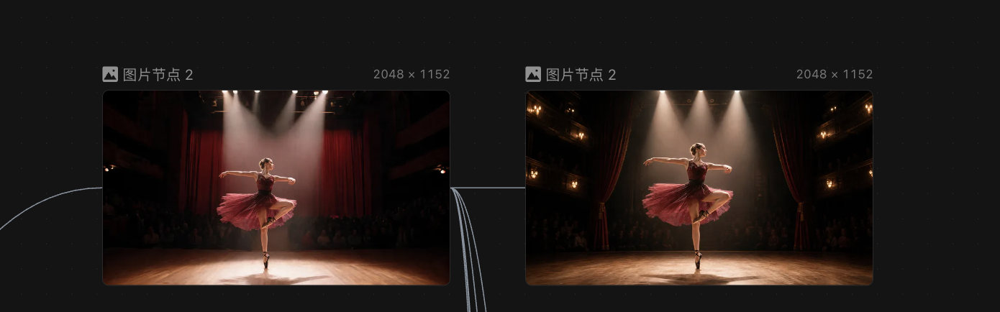</td><td></td><td></td></tr><tr><td>模型也确实会对图片进行一些更改，但它不会开口问你哪里不满意，你也不会知道模型进行这些更改的依据是什么。</td><td>录屏</td><td></td><td></td></tr><tr><td>但是agent的聪明和自主程度就高出许多，同样对Agent 输入“我不满意”，它会主动询问你不满意的原因，并给出对应的优化方案供你挑选。</td><td>录屏</td><td>演示输入，Agent回复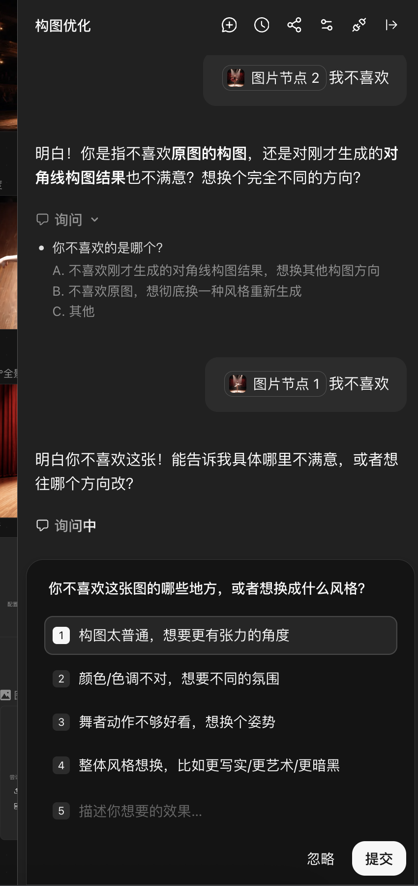</td><td></td><td></td></tr><tr><td>可以说，单个节点只是机械执行你的指令的零散工具。</td><td>动画</td><td></td><td></td><td></td></tr><tr><td>而Agent则长出了可以思考、与你交流沟通的头脑，以及协调使用各种工具的双手。</td><td>动画</td><td></td><td></td><td></td></tr><tr><td rowspan="5"><b>03 Agent使用入口</b></td><td>要使用Agent功能也非常简单，只需点击画布上方的Agent图标即可进入对话。</td><td>录屏+动画</td><td></td><td></td><td></td></tr><tr><td>和你平时和豆包、DeepSeek等大语言模型聊天的形式没有什么区别。</td><td>录屏+动画</td><td></td><td></td><td></td></tr><tr><td>聊天框上方有一些选项，我们来简单了解一下。</td><td>录屏</td><td></td><td></td><td></td></tr><tr><td>新建对话、历史对话、分享功能就不多说了，相信大家也能理解。</td><td>录屏+动画</td><td></td><td></td><td></td></tr><tr><td>Agent设置中有涉及协作模式和通知权限的选项。如果你希望每一次涉及到积分消耗的生成都需要你的同意把关，就记得把“自动生成图片/视频选项”关掉。</td><td>录屏</td><td>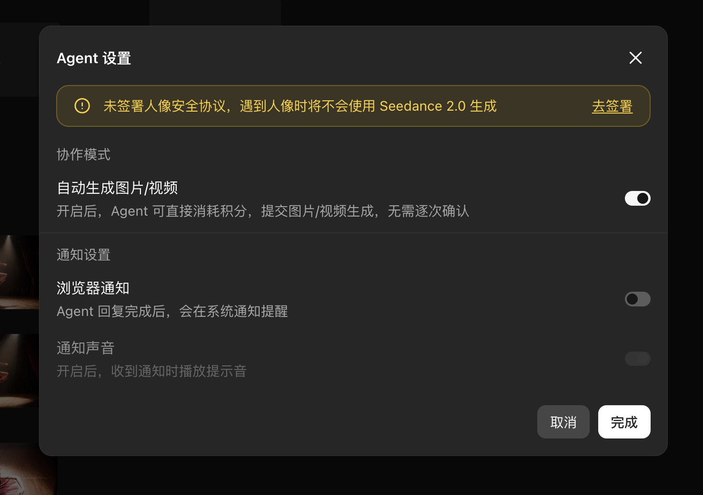</td><td></td><td></td></tr><tr><td rowspan="16">步骤二</td><td rowspan="16">案例演示丨演示如何使用agent对已有的画布和节点进行调优</td><td rowspan="16"><ul><li>简单图片：<ul><li>直接更改单个节点，例如，对图片构图进行修改</li></ul></li><li>稍复杂：<ul><li>对已有视频进行字幕添加和内容延长</li></ul></li><li>体现：<ul><li>agent的强大沟通与操作能力</li><li>基于画布操作的可视化、可操作化优势</li></ul></li></ul></td><td rowspan="16"><b>04 实操丨Agent完成图片修改</b></td><td>下面我们先以一个简单的操作着手，看看Agent的能力表现如何。</td><td>口播</td><td></td><td></td><td></td></tr><tr><td>这里有一张已经生成好的图片节点，我感觉画面缺点意思，构图不太出彩，但又不懂得怎么用各种专业术语精确表达修改方向。</td><td>录屏+动画</td><td></td><td></td><td></td></tr><tr><td>这时我们打开Agent，选中这个图片节点，可以看到聊天框里已经弹出灰色的引用，我们点击确认一下。</td><td>录屏</td><td>按口播顺序演示</td><td></td><td></td></tr><tr><td>注意，Agent中的参考引用的逻辑，和前几节课中，图片、视频节点的参考逻辑是一致的，你可以点击“+”号上传各种补充参考信息给Agent。</td><td>录屏+动画</td><td>按口播顺序演示</td><td></td><td></td></tr><tr><td>这里我们只涉及一张图片，所以就继续输入想法：“我觉得这个构图太普通了。”</td><td>录屏</td><td>演示输入提示词</td><td></td><td></td></tr><tr><td>可以看到，Agent思考后，下方弹出了一个选项框，给出了许多可选的构图方向，我们选择一个合适的。</td><td>录屏</td><td>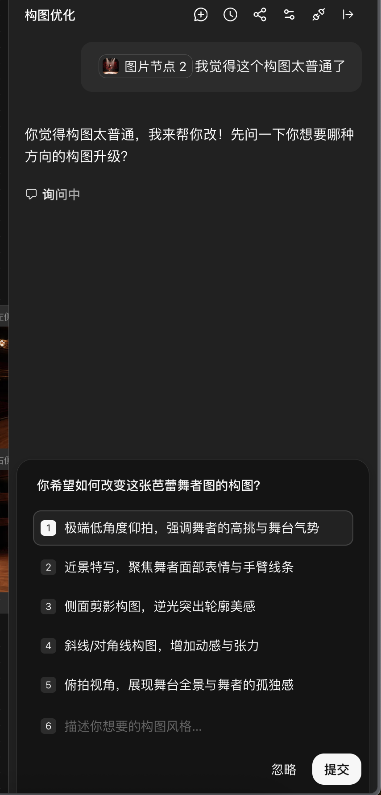</td><td></td><td></td></tr><tr><td>画布上便出现了一个新的图片节点。如果你之前已经关掉了“自动生成图片/视频”的选项，它就不会直接执行生成过程。</td><td>录屏+动画</td><td>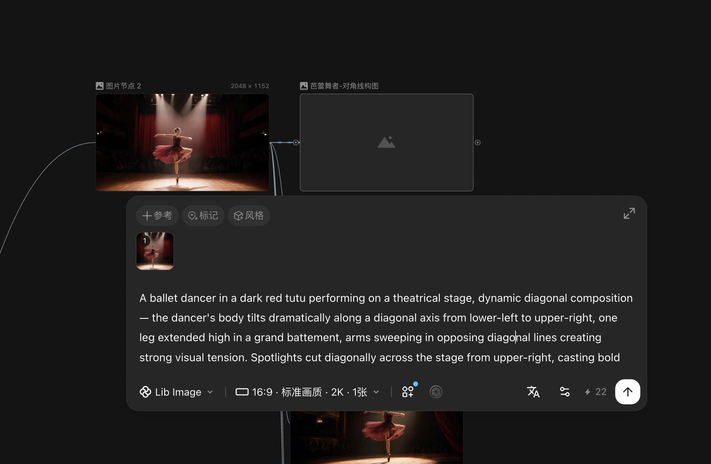 高亮出新的图片节点</td><td></td><td></td></tr><tr><td>点开节点的详细信息，可以在Agent提供的基础上继续修改提示词和参数。</td><td>录屏</td><td>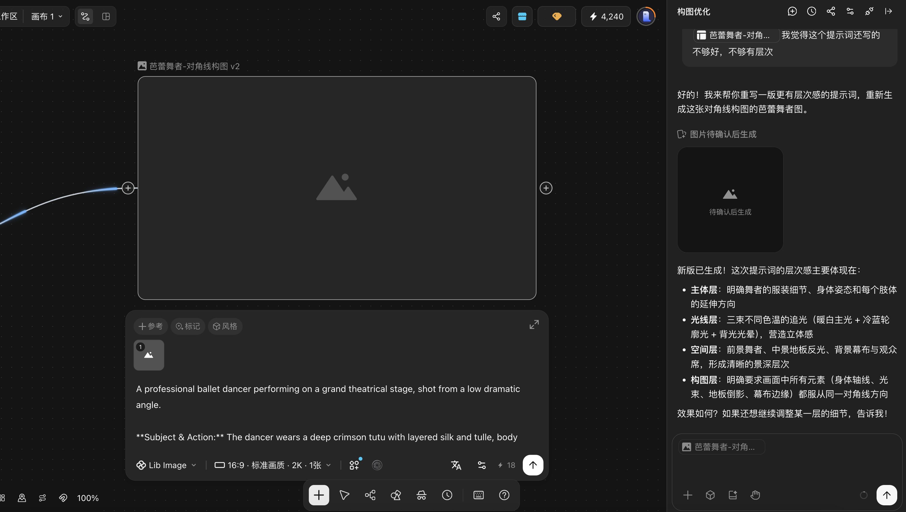 按口播顺序演示</td><td></td><td></td></tr><tr><td>再省事一些，你可以直接点击这个节点，再把你对提示词的修改需求发送过去，让Agent自行迭代完善。</td><td>录屏</td><td>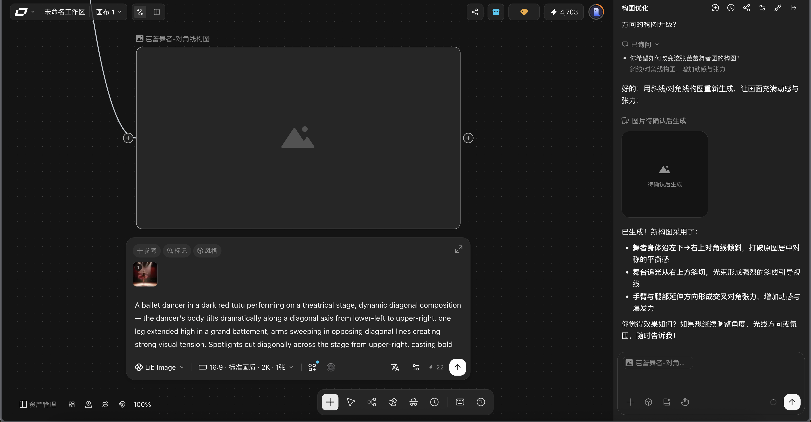 按口播顺序演示</td><td></td><td></td></tr><tr><td>最终确认提示词、参数无误后，点击生成。我们就在Agent的帮助下，便携且专业地进行了一次图片的构图优化。</td><td>录屏</td><td>按口播顺序演示</td><td></td><td></td></tr><tr><td>整个过程中，你甚至都不需要一字一字地敲提示词，只需要告诉Agent，你对构图或者提示词不满意即可。</td><td>实拍</td><td>一个人头上写着“用户”，停下打字的动作，指着头上写着“Agent”的人，让他来操作电脑</td><td></td><td></td></tr><tr><td>虽然最终结果的质量还需要你来把关，但思考和修改提示词的过程已经提效不少。</td><td>口播</td><td></td><td></td><td></td></tr><tr><td>细心的你肯定也发现了，Agent和别的大语言模型聊天还是有区别的。</td><td>口播</td><td></td><td></td><td></td></tr><tr><td>它的输出结果不仅会在聊天界面中呈现，更会直接以节点的形式同步在画布上。</td><td>录屏+动画</td><td>高亮出聊天界面的内容呈现和画布中的对应新增节点</td><td></td><td></td></tr><tr><td>因为创作不是一个一次性的过程，在画布上可以保存参考图、上下游依赖、失败节点等诸多过程信息。</td><td>口播+动画</td><td></td><td></td><td></td></tr><tr><td>便于你随时进行精细调整、追踪和复用，把创作的自由度和主动权牢牢掌握在自己手中。</td><td>口播+动画</td><td></td><td></td><td></td></tr><tr><td rowspan="8"></td><td rowspan="8"></td><td rowspan="8"></td><td rowspan="8"><b>05 实操丨Agent完成视频修改</b></td><td>举完了图片的例子，Agent的视频处理能力也同样强大，我们再看一个实例。</td><td>口播</td><td></td><td></td><td></td></tr><tr><td>这里已经有一个成片，我想给视频加上人物对话和字幕，并且延长5s的剧情。</td><td>录屏+动画</td><td></td><td></td><td></td></tr><tr><td>不借助Agent能力的话，我需要构思人物对话、再添加字幕，再去构思剧情、生成并剪辑。</td><td>录屏+动画</td><td></td><td></td><td></td></tr><tr><td>而借助Agent，你将极大提升思考和梳理思路的效率。选中节点，输入需求：“我想给这个视频加上人物对话和字幕，同时往后延长5秒的剧情内容。”</td><td>录屏</td><td>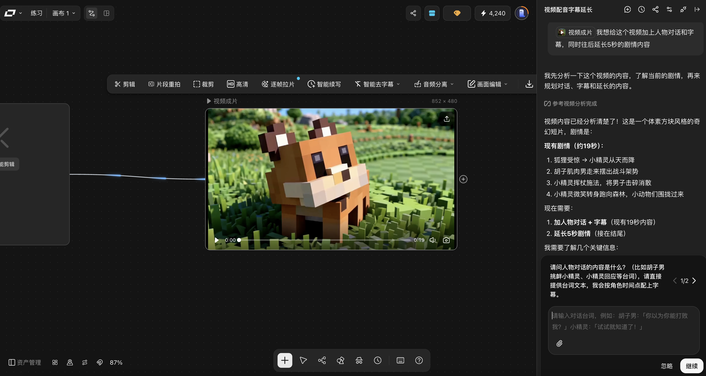 按口播顺序演示</td><td></td><td></td></tr><tr><td>Agent思考后会自动向你询问需要进一步确认的内容和备选项，你可以在Agent的引导下有条理地完善你的想法。</td><td>录屏</td><td>按口播顺序演示，高光Agent返回的反问和备选项</td><td></td><td></td></tr><tr><td>比如这里的人物对话台词，即使你没有给明文字内容，它也会询问你风格偏好，并给出方案供你判断。</td><td>录屏+动画</td><td>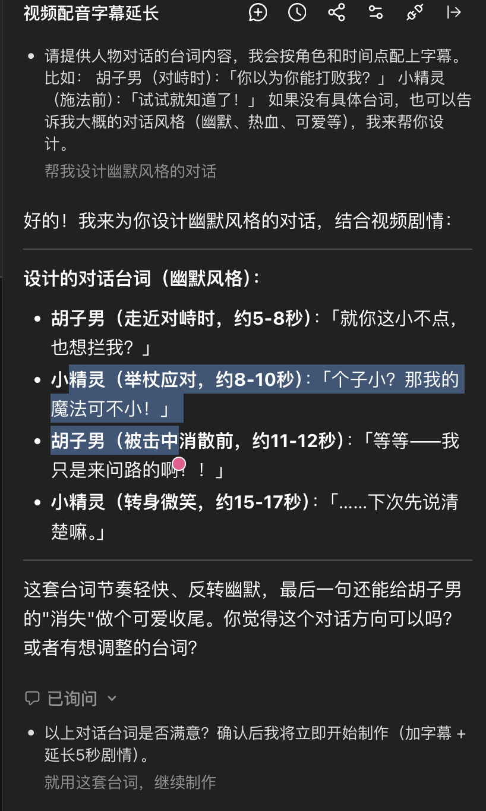 高光和口播对应的段落</td><td></td><td></td></tr><tr><td>再来看生成过程，又出现了一个新问题，参考视频的长度过长，无法生成。</td><td>录屏</td><td>点开视频节点，展示错误</td><td></td><td></td></tr><tr><td>你不需要手动剪辑视频长度，将这个问题转述给Agent，它会自动调整工作流，先对视频做剪辑处理再作为参考引用。</td><td>录屏</td><td> 按口播顺序演示</td><td></td><td></td></tr><tr><td rowspan="6" vertical-align="top">步骤三</td><td rowspan="13" vertical-align="top">基础讲解｜组合使用 Agent 与 Skill</td><td rowspan="13" vertical-align="top"><ul><li><b>组合方式</b><ul><li>进入 Agent，选择需要使用的 Skill。</li><li>添加人物图、产品图等参考素材。</li><li>输入创作需求，让 Agent 按 Skill 中的规则执行。</li></ul></li><li><b>检查重点</b><ul><li>确认人物、产品、风格和输出格式是否符合 Skill 设置。</li><li>检查中间结果和最终成片，必要时继续对话调整。</li></ul></li></ul></td><td rowspan="13"><b>06 skill及hub基础介绍</b></td><td>以上便是Agent在已有图片、视频节点上的基础能力介绍。</td><td>口播</td><td vertical-align="top"></td><td></td><td></td></tr><tr><td>相信你也感受到了，Agent的能力确实很“全”。下面，我们来学习如何使用skill，来让它变得更“专”。</td><td>口播+动画</td><td></td><td></td><td></td></tr><tr><td>Skill并不难理解，其实就是给 AI 封装好的一套专项操作流程，你可以把它理解为为Agent量身定制的，服务于一个特定功能或场景的改装组件。</td><td>实拍</td><td></td><td></td><td></td></tr><tr><td>直接使用Agent时，它的确知识全面，大部分场景也能跑通，但做专业工作主要靠临场发挥。</td><td>口播+动画</td><td></td><td></td><td></td></tr><tr><td>而借助 Skill，Agent便可复现成熟的创作模板和流程，结果更加专业、可控、稳定。</td><td>口播+动画</td><td></td><td></td><td></td></tr><tr><td>那么如何获取和使用skill呢？在LibTV中的操作是非常简单的。</td><td>口播</td><td></td><td></td><td></td></tr><tr><td></td><td>在Agent聊天框的下方，你可以直接找到skill的图标，点击全部即可查看所有skill。</td><td>录屏</td><td>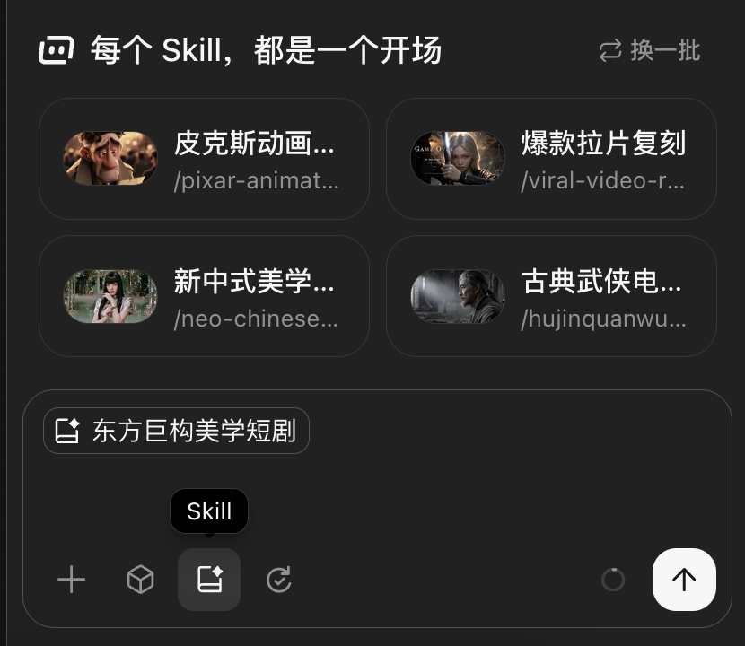 按口播顺序演示</td><td></td><td></td></tr><tr><td></td><td>或者直接在LibTV主页下划，也可以找到全部skill的入口</td><td>录屏</td><td>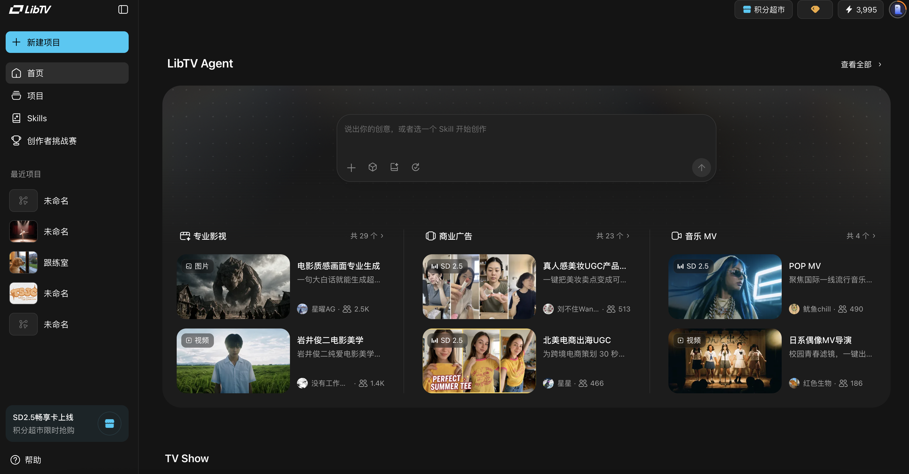</td><td></td><td></td></tr><tr><td></td><td>这些skill都是大量有能力的创作者将已经跑通的创作链路优化、沉淀下来的优质成果。你可以带着需求去找寻合适的skill。</td><td>实拍</td><td></td><td></td><td></td></tr><tr><td></td><td>在skill列表中，点击查看详情，可以进一步了解skill的基本介绍、使用场景、如何使用和输出内容。</td><td>录屏</td><td>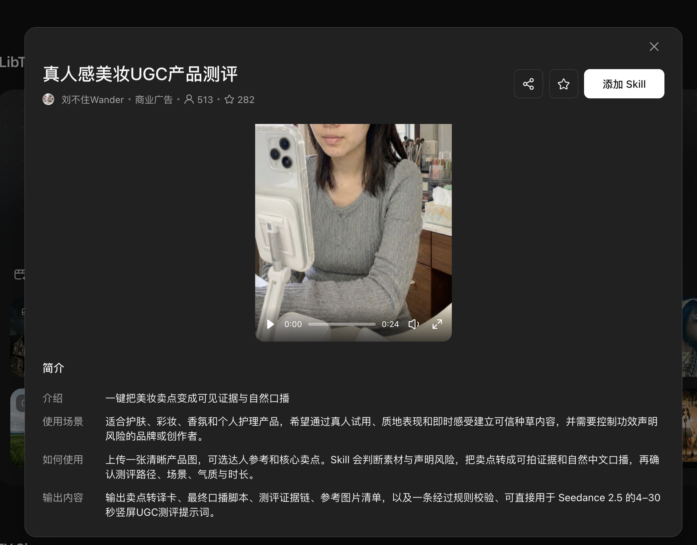</td><td></td><td></td></tr><tr><td></td><td>有心仪的skill要调用时，只需点击使用，在Agent聊天框中添加引用即可。</td><td>录屏</td><td>按口播顺序演示</td><td></td><td></td></tr><tr><td></td><td>这里需要注意，skill的内部结构也不是完全可见的，所以最终的生成过程和结果还是需要你来把控。</td><td>实拍</td><td>一个人用放大镜对着写着“agent”的箱子来回打量</td><td></td><td></td></tr><tr><td></td><td>LibTV的Agent skill hub是一个共创平台。每位创作者，包括屏幕前的你，都可以将工作流、审美、提示词、财产规范等各种创作思路沉淀为专属 Skill，搭建你的独家 AI Studio。</td><td>口播</td><td></td><td></td><td></td></tr><tr><td rowspan="2" vertical-align="top">步骤四</td><td vertical-align="top">案例演示｜组合运行 Agent 与 Skill</td><td vertical-align="top">（该步骤待奇泽补充完整，预计今晚十一点完成）</td><td><b>07 skill 实操丨从零到一广告创作案例</b></td><td>我们可以看到libtv的skill hub里提供了丰富的skill，下面我们以“古典武侠电影全流程导演”为例，完整体验一下agent辅助下从零到一生成一个广告片的流程 假设我们已有的素材是一个虚拟品牌“快咖”咖啡的视觉设计，为他定制一个非常适配且具有反差的武侠风格广告。</td><td></td><td>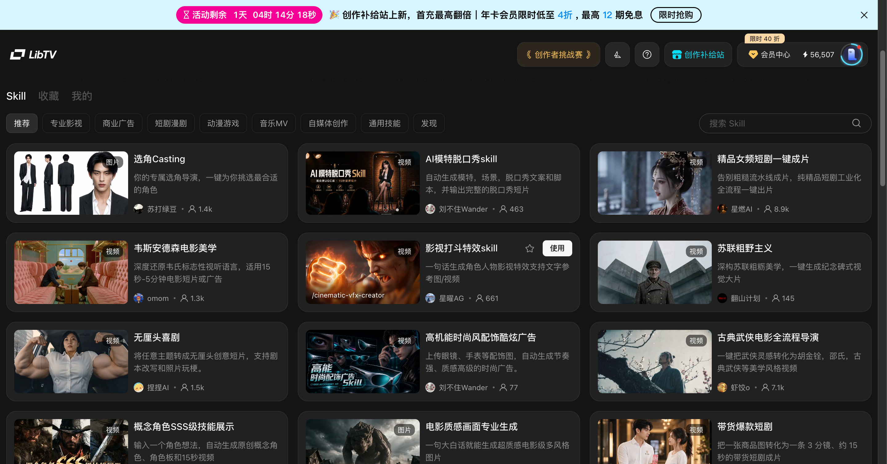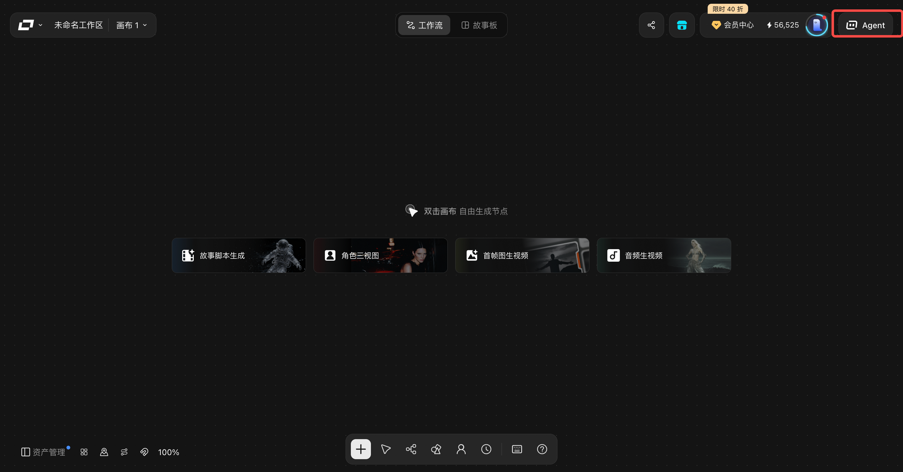</td><td></td><td></td></tr><tr><td vertical-align="top"></td><td vertical-align="top"></td><td></td><td>在向Agent提出现有素材和需求后，我们可以看到Agent导演会向我确认细节，如成片画幅和总时长，我一一进行对话回应即可。 Agent的一个便利之处就在于它会以多个选项的形式提供具体的创意灵感供用户选择，相当于帮助我们丰富了创意可行的路径，并能发现一些被忽视的细节需求。</td><td></td><td vertical-align="top">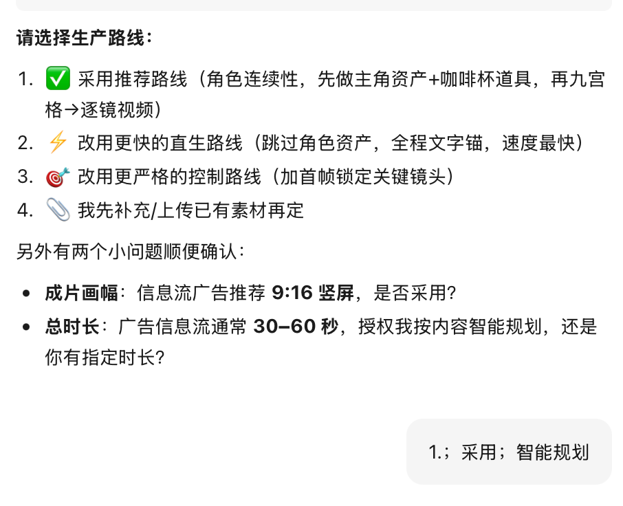</td><td></td><td></td></tr><tr><td rowspan="2" vertical-align="top"></td><td vertical-align="top">基础讲解｜对话调优</td><td vertical-align="top"><ul><li>先检查人物一致性、产品特写、镜头数量和结尾信息。</li><li>一次只提出一组明确的修改要求。</li><li>说明需要保留的内容和需要改变的内容。</li><li>修改后再次对比，不重复调整已经正确的部分。</li></ul></td><td></td><td>生成完以后，第一件事先核对：人物形象、产品画面、整体风格还有视频画幅格式，是否完全符合Skill里面设定好的标准。再从头检查一遍初稿和最终成片，如果哪里不对，我们就针对哪里微调修改，除了在agent对话框提出要求，也可以直接找到需要修改的节点做精确的调整</td><td></td><td vertical-align="top"></td><td></td><td></td></tr><tr><td vertical-align="top">案例演示｜对话调优</td><td vertical-align="top"><ul><li>对自动初稿提出一次修改：“保持人物一致，加强产品特写，简化结尾。”</li><li>生成调优版本。</li><li>对比自动初稿和调优成片。</li><li>记录本次 Skill 设置和有效的修改指令，供后续项目复用。</li></ul></td><td></td><td></td><td></td><td vertical-align="top"></td><td></td><td></td></tr><tr><td></td><td></td><td></td><td><b>08 其他agent功能丨全球化制作 &amp; 爆款复刻</b></td><td>同时，libtv也提供了其他强大的agent功能，可以为你的视频创作大大提效。</td><td></td><td></td><td></td><td></td></tr><tr><td></td><td></td><td>全球化制作（Shoot Once. Go Global.）</td><td></td><td>通过 LibTV Agent 你可以将长达 5 分钟的视频片段进行多语言字幕生成和字幕精修，你可以指挥agent根据原始音频、或对白自动完成节奏匹配、语言适配、版式调整和本土化的表达，无需重新生成，让一条视频快速适配跨国内容分发场景。</td><td></td><td></td><td></td><td></td></tr><tr><td></td><td></td><td>爆款参考一键再创作 （Watch It. Remix It.）</td><td></td><td>同时，LibTV Agent 支持基于参考视频的创作，自动理解一条爆款视频中的镜头节奏、叙事结构、画面风格、字幕样式和音乐情绪，你可以在此基础上加入替换的产品、角色等素材，快速生成新的原创视频，让你真正做到“0帧起手”。</td><td></td><td></td><td></td><td></td></tr><tr><td></td><td>小结</td><td></td><td><b>09 小结</b></td><td>视频创作从来不是一次性的工作，这一创作Agent的工作过程可以在画布上完整保存，包括原始素材、风格参考素材、视频上下游剪辑节点、作废素材和节点等所有过程数据。后续想要二次修改、复刻同款武侠风格、复用优质镜头脚本都特别方便，让我们更能掌握短视频创作的主动权，轻松批量产出优质视频。</td><td></td><td></td><td></td><td></td></tr></tbody></table>

## 本地素材清单

- [image.png](./assets/TQC4bK9S5oQ62JxySFfctxkSnmg.png)（media，444512 字节）
- [image.png](./assets/DPg2biKysoijzJxgBCucta2DnGf.png)（media，297634 字节）
- [image.png](./assets/EUrebRJGMoEHIfx2UZacDeaBn6f.png)（media，14784 字节）
- [image.png](./assets/PUmbbSKqHoXEUYxxanDcX0BKnxe.png)（media，14784 字节）
- [image.png](./assets/IgHAbpyCqokcF6x1EANcV2yWnPb.png)（media，206710 字节）
- [image.png](./assets/EPYMbCfJYo2u1Jxfb1HciJddn4d.png)（media，212001 字节）
- [image.png](./assets/QY8vb9JM3oO2Lnxxn4lczv3xnLh.png)（media，527910 字节）
- [image.png](./assets/ZDkQbEGp4ouLtgxi0skc6RGHnkf.png)（media，542463 字节）
- [image.png](./assets/GsO1byTZfoLDpAxi5OFcBv5Snfh.png)（media，602335 字节）
- [image.png](./assets/PYoVbwaqcolRDGxKzCxcz7ySngh.png)（media，1810957 字节）
- [image.png](./assets/JxODbYFI0ocs74xMnaVcIr5xnUt.png)（media，258181 字节）
- [image.png](./assets/R38AbCkJBoETltxdZvGcsPEenV8.png)（media，1918364 字节）
- [image.png](./assets/FRombEPUeoJCw0xt9VycLUpgnTd.png)（media，147617 字节）
- [image.png](./assets/HpfhbRVI0o3aEMx4AwmcSKhpnDe.png)（media，2222981 字节）
- [image.png](./assets/Out0bRVxvonCD3xo8zCcJxe9nre.png)（media，1060134 字节）
- [image.png](./assets/UzYubTfWGor1etx4bxCckJtInbc.png)（media，147617 字节）
- [创建Skill.png](./assets/NwT7bMuI2okvkUx8cE0ctWlvnpf.png)（media，2116392 字节）
- [Agent界面.png](./assets/P2cubSVxXoRGstxNnUPcwlFrnqg.png)（media，416568 字节）
- [image.png](./assets/RHeTbsR2Bou50Pxi9pxcMvZbn7e.png)（media，125211 字节）
