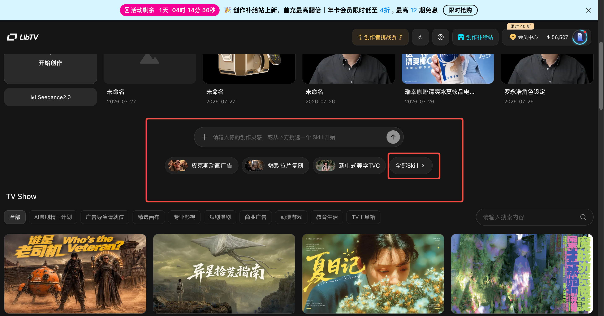
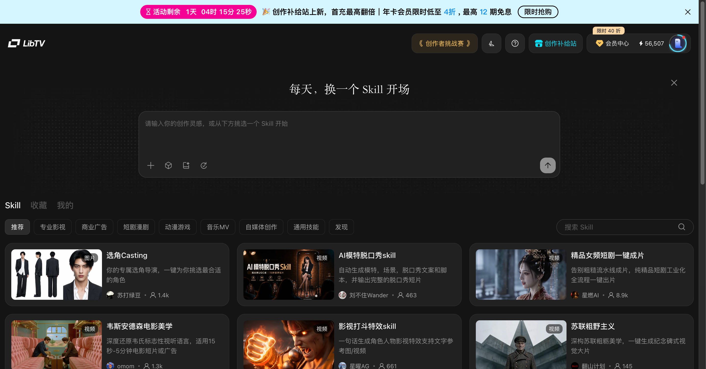
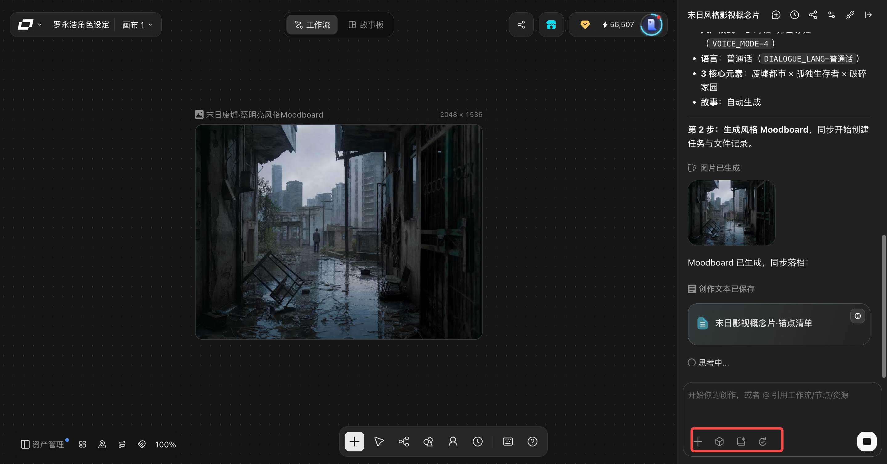

> 来源：[飞书原文](https://hcnbsg6ttb3t.feishu.cn/wiki/DzShwfN4Mi8RBTkF7oncGfi9nse)  
> 同步时间：2026-08-16T09:01:04.604Z  
> 文档标识：VUvedSEJgojSCixkVaXccITcnNh

# 第六节：Agent 智能辅助

> **提示**
>
**引入｜这节课会讲什么**
本节先讲 Agent 的作用和使用方法，再讲 Skill 的设置与复用，最后完成二者的组合应用。
- **核心内容：**Agent 的作用和使用方法、Skill 的设置与复用，以及二者结合完成项目的过程。
- **学完你会：**先使用 Agent 完成任务，再通过 Skill 复用固定规则，并完成二者的组合应用。

<table><colgroup><col/><col/><col/><col/><col/></colgroup><thead><tr><th vertical-align="top"><b>阶段</b></th><th vertical-align="top"><b>大纲</b></th><th vertical-align="top"><b>内容</b></th><th vertical-align="top"><b>截图</b></th><th vertical-align="top"><b>备注</b></th></tr></thead><tbody><tr><td vertical-align="top">课程开始</td><td vertical-align="top"><b>引入</b></td><td vertical-align="top">掌握图片和视频节点以后，可以进一步使用 Agent 推进完整任务。这一节，我们先把 Agent 是什么、怎么用讲清楚，再学习如何通过 Skill 复用固定规则。</td><td vertical-align="top"></td><td vertical-align="top">教师口播，约 20—30 秒。</td></tr><tr><td rowspan="2" vertical-align="top">步骤一</td><td vertical-align="top"><b>基础讲解｜认识并使用 Agent</b></td><td vertical-align="top"><ul><li><b>Agent</b><ul><li>根据创作需求执行脚本、分镜、画面生成、配音配乐和剪辑合成。</li><li>把多个制作步骤串联起来，并根据对话继续调整。</li><li>使用时先添加参考素材，再选择模型和生成模式，输入明确的创作需求。</li><li>生成后检查中间结果和最终成片，必要时继续修改。</li></ul></li></ul></td><td vertical-align="top"></td><td vertical-align="top"></td></tr><tr><td vertical-align="top"><b>案例演示｜用 Agent 生成自动初稿</b></td><td vertical-align="top"><ul><li>目标：生成一条 15 秒罗老师咖啡概念片。</li><li>上传罗老师角色图和咖啡产品图。</li><li>输入时长、场景、产品特写和结尾要求。</li><li>让 Agent 自动完成脚本、分镜、画面、声音和合成。</li><li>保存第一次生成的自动初稿。</li></ul></td><td vertical-align="top"></td><td vertical-align="top"></td></tr><tr><td rowspan="2" vertical-align="top">步骤二</td><td vertical-align="top"><b>基础讲解｜在 Agent 基础上使用 Skill</b></td><td vertical-align="top"><ul><li><b>使用现有 Skill</b><ul><li>Skill 需要基于 Agent 使用，是在 Agent 基础上保存并复用固定规则和方法的进阶用法。</li><li>进入 Skill 商店，根据短剧、广告、科普、好物或口播等任务选择模板。</li><li>在 Agent 中选择 Skill，再输入创作要求并执行。</li></ul></li><li><b>创建 Skill</b><ul><li>进入“我的”，选择“创建 Skill”。</li><li>填写名称、介绍和适用场景。</li><li>写入人物、产品、风格和输出细则。</li><li>优化内容，选择类型并上传封面。</li></ul></li></ul></td><td vertical-align="top"></td><td vertical-align="top"></td></tr><tr><td vertical-align="top"><b>案例演示｜设置 Skill</b></td><td vertical-align="top"><ul><li>创建“罗老师咖啡概念片”Skill。</li><li>固定人物面部、服装和说话方式。</li><li>固定咖啡杯外观、品牌信息和产品特写要求。</li><li>固定未来片场的画面风格、色调和时长。</li><li>保存后检查规则是否清楚、可重复调用。</li></ul></td><td vertical-align="top"></td><td vertical-align="top"></td></tr><tr><td rowspan="2" vertical-align="top">步骤三</td><td vertical-align="top"><b>基础讲解｜组合使用 Agent 与 Skill</b></td><td vertical-align="top"><ul><li><b>组合方式</b><ul><li>进入 Agent，选择需要使用的 Skill。</li><li>添加人物图、产品图等参考素材。</li><li>输入创作需求，让 Agent 按 Skill 中的规则执行。</li></ul></li><li><b>检查重点</b><ul><li>确认人物、产品、风格和输出格式是否符合 Skill 设置。</li><li>检查中间结果和最终成片，必要时继续对话调整。</li></ul></li></ul></td><td vertical-align="top"></td><td vertical-align="top">全自动执行仍需要检查结果。</td></tr><tr><td vertical-align="top"><b>案例演示｜组合运行 Agent 与 Skill</b></td><td vertical-align="top"><ul><li>上传罗老师角色图和咖啡产品图。</li><li>选择本节创建的 Skill。</li><li>输入 15 秒概念片需求：工作室、咖啡、未来片场和结尾口号。</li><li>让 Agent 按 Skill 中的人物、产品和风格规则重新执行。</li><li>对比自动初稿和使用 Skill 后的版本，检查规则是否生效。</li></ul></td><td vertical-align="top"></td><td vertical-align="top"></td></tr><tr><td rowspan="2" vertical-align="top">步骤四</td><td vertical-align="top"><b>基础讲解｜对话调优</b></td><td vertical-align="top"><ul><li>先检查人物一致性、产品特写、镜头数量和结尾信息。</li><li>一次只提出一组明确的修改要求。</li><li>说明需要保留的内容和需要改变的内容。</li><li>修改后再次对比，不重复调整已经正确的部分。</li></ul></td><td vertical-align="top"></td><td vertical-align="top"></td></tr><tr><td vertical-align="top"><b>案例演示｜对话调优</b></td><td vertical-align="top"><ul><li>对自动初稿提出一次修改：“保持人物一致，加强产品特写，简化结尾。”</li><li>生成调优版本。</li><li>对比自动初稿和调优成片。</li><li>记录本次 Skill 设置和有效的修改指令，供后续项目复用。</li></ul></td><td vertical-align="top"></td><td vertical-align="top"></td></tr></tbody></table>

## 需要的案例

以下案例待提供

| 案例名称 | 数量 | 具体要求 | 交付内容 |
|-|-|-|-|
|  |  |  |  |
|  |  |  |  |

### 配套动画（暂定）

| 动画名称 | 数量 | 具体要求 | 交付内容 |
|-|-|-|-|
| Agent 与 Skill 分工动画 | 1 段 | 时长约 10—15 秒；说明 Agent 负责理解目标、串联步骤和推进任务，Skill 负责保存固定规则与专门方法，并展示二者组合完成项目的关系。 | 16:9、1080P 成片；可编辑工程文件；流程与角色图形素材；无字幕版和文字示意版。 |

## 本地素材清单

- [Skill入口.png](./assets/KGkhbvaGZoi6obx1HpucFKAAnwh.png)（media，2663152 字节）
- [Skill模板.png](./assets/T1pxbZ8mGo6s9ixhB06cC8dOnAf.png)（media，1392535 字节）
- [创建Skill.png](./assets/SZSVbm6kNoYylcxaaJTc5AMYnAe.png)（media，2116392 字节）
- [Agent界面.png](./assets/GWk0btSJWoxaIExIvi2csnAFnEf.png)（media，416568 字节）
- [Agent生成.png](./assets/KdJebDS4to6KZVxE4PacuvTonRg.png)（media，1403208 字节）
