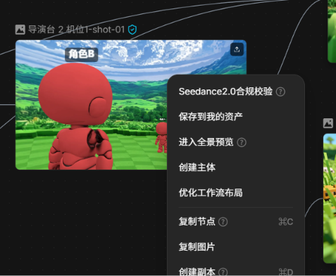
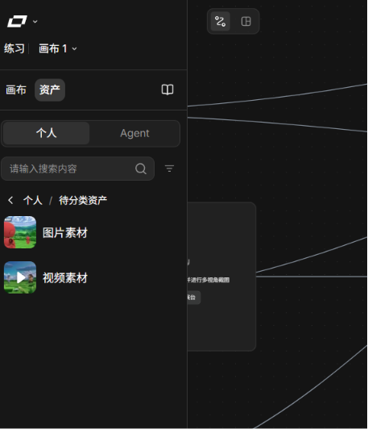

> 来源：[飞书原文](https://hcnbsg6ttb3t.feishu.cn/wiki/VhChwD6wiinSAkkmXLGcSR71nfb)  
> 同步时间：2026-08-16T09:01:04.604Z  
> 文档标识：IMPddthQVouWgrxTF65cXHmqnpd

# 7 细化脚本（修改中）

本节以产品广告为例，讲解从素材准备、脚本和分镜到生成、配乐和剪辑的制作过程。

| **授课人** | 罗永浩 |
|-|-|
| **目标时长** | 约 分钟（正常语速，含录屏操作与结果停留） |
| **适合人群** | 第一次接触 LibTV 的零基础学习者 |
| **案例主线** |  |
| **文档用途** | 讲师逐句口播、导演分镜、录屏与后期制作执行稿 |

<table><colgroup><col/><col/><col/><col/><col/><col/><col/></colgroup><thead><tr><th vertical-align="top"><b>阶段</b></th><th vertical-align="top">大纲</th><th vertical-align="top">内容</th><th vertical-align="top">口播</th><th>草威修改</th><th vertical-align="top">Broll（录屏、解说动画、其他拍摄需求）</th><th vertical-align="top">备注</th></tr></thead><tbody><tr><td rowspan="5">课程开始</td><td rowspan="5">引入</td><td></td><td></td><td></td><td>播放广告成片，广告尾帧定格产品，用AI生成转场或剪辑软件的转场效果，自然过渡到老师出镜</td><td></td></tr><tr><td vertical-align="top">核心内容是产品资产精修、创意脚本、分镜与关键帧、视频生成、配乐剪辑及产品一致性控制。</td><td vertical-align="top">大经熟悉了 LibTV 的各项基础功能。</td><td></td><td vertical-align="top">讲师出镜 MG 动画闪现此前章节涉及的主要操作功能</td><td vertical-align="top"></td></tr><tr><td></td><td>接下来，我们将结合具体案例，进一步探索如何利用 AI 完成更具创意和表现力的视频创作。这一节课，我们将尝试制作一支 AI 产品广告。</td><td></td><td></td><td></td></tr><tr><td></td><td>优秀的产品广告，并不只是简单展示产品外观和功能。真正打动用户的，往往是一个故事带来的共鸣，一种情绪引发的触动，或者一次独特视觉表达带来的记忆。</td><td></td><td></td><td></td></tr><tr><td></td><td>接下来，我们也将跳出传统的产品展示，通过以下五个步骤，也即明确广告任务、整理产品资产、设计分镜脚本、分镜头视频生成和配乐剪辑，完整制作一支兼具产品表达、情感共鸣和品牌价值的 AI 产品广告。</td><td>所以这节课我们不做产品展示，做一支有起承转合的广告片。 五步：整理产品资产、策划广告脚本、设计脚本与分镜、视频生成、配乐剪辑。看着多，但做完你会发现，真正费脑子的是前两步，后面基本都是执行。这也是 AI 时代做视频最大的变化——决策的比重变大了，体力活的比重变小了。</td><td>屏幕字幕： 本节目标：产品资产→故事策划→脚本分镜→视频生成→配乐剪辑</td><td></td></tr><tr><td></td><td></td><td></td><td>开场动画</td><td></td><td>同前几节课的开场动画</td><td></td></tr><tr><td vertical-align="top">步骤一</td><td vertical-align="top">基础讲解｜确定广告任务</td><td vertical-align="top"><ul><li><b>广告任务</b><ul><li>明确产品、核心卖点、目标人群和广告时长。</li></ul></li><li><b>参考设置</b><ul><li>确定参考风格、画幅和发布平台。</li></ul></li><li><b>时长控制</b><ul><li>控制产品广告在 20 秒以内，镜头数量与卖点匹配。</li></ul></li></ul></td><td vertical-align="top">首先，在开始制作前，我们需要明确广告任务，先梳理清楚产品定位、核心卖点。它解决了什么问题？承载着怎样的价值？又希望与用户建立怎样的情感连接？</td><td></td><td vertical-align="top">讲师出镜，MG动画演示“产品、卖点、价值、情感连接、受众、风格、视觉风格”等广告任务关键要素</td><td vertical-align="top"></td></tr><tr><td></td><td></td><td></td><td>我们可以从产品的名称、品类、功能及目标用户等基础信息入手，理清产品定位与核心卖点。</td><td></td><td></td><td></td></tr><tr><td></td><td></td><td></td><td>这里需要注意，广告中的卖点并不是简单罗列产品参数，而是需要进一步挖掘参数背后的用户价值。</td><td></td><td></td><td></td></tr><tr><td></td><td>案例演示｜确定广告任务</td><td vertical-align="top"><ul><li>案例：罗老师与咖啡产品的 15 秒广告。</li><li>核心卖点：工作状态恢复与咖啡产品特写。</li><li>三个镜头：工作疲惫、咖啡特写、状态恢复与结尾文案。</li><li>准备罗老师角色图、咖啡杯白底图和广告参考。</li><li>好，广告任务已经明确。接下来整理产品资产，先把产品外观和后续要反复使用的素材固定</li></ul></td><td>例如，“主动降噪”属于耳机的产品功能，但对用户而言，真正有价值的是在嘈杂环境中，能够拥有属于自己的安静空间，去关注自己更看重的内容。因此，产品与用户建立连接的锚点也可以落在“摒弃嘈杂，专注重要信息”上。</td><td></td><td></td><td></td></tr><tr><td></td><td></td><td vertical-align="top"></td><td>基于这些信息，我们进一步明确广告时长、整体视觉风格等制作方向。这节课，我们先以一支较短时长的广告为例，采用贴近真实生活场景、强调情绪共鸣的故事风格。</td><td></td><td></td><td></td></tr><tr><td></td><td></td><td></td><td>20秒左右的时长难以完整铺陈一个长故事，因此，我们需要在有限的时间内快速建立明确的情境，让每一帧画面不仅承担产品展示的功能，也服务于故事推进和情绪表达。</td><td></td><td></td><td></td></tr><tr><td></td><td></td><td></td><td>最后，围绕产品的用户价值，我们可以构思一个大致的故事框架。降噪耳机让你在嘈杂环境中也不会错过重要的信息和情感连接，因此我们构思了一个亲情故事：</td><td></td><td></td><td></td></tr><tr><td></td><td></td><td></td><td>一位年轻母亲在通勤途中接到视频电话，得知孩子第一次学会叫妈妈，但地铁嘈杂的环境让她难以听清，戴上耳机开启降噪后，周围的喧嚣逐渐消失，终于听见孩子人生中的第一声呼唤。</td><td></td><td></td><td></td></tr><tr><td></td><td></td><td></td><td>这里，耳机并不是故事要展示的主角，而是帮助用户守护重要瞬间的工具。</td><td></td><td></td><td></td></tr><tr><td></td><td></td><td></td><td>这一步，你可以对镜头的数量和内容呈现有一个大致概念，例如，地铁通勤群像、视频通话特写、戴耳机的动作、母亲面部特写......当然，你也并不需要对每一个画面的呈现都有无比清晰的认识，在后续制作过程中可以继续反复打磨迭代。</td><td></td><td></td><td></td></tr><tr><td rowspan="7" vertical-align="top">步骤二</td><td vertical-align="top">基础讲解｜整理产品资产</td><td vertical-align="top"><ul><li><b>产品视图</b><ul><li>使用产品白底图生成三视图和细节图。</li></ul></li><li><b>视觉规范</b><ul><li>固定产品比例、材质、颜色、文字和标识。</li></ul></li><li><b>资产复用</b><ul><li>将产品、人物、场景和道具保存为可复用资产。</li></ul></li><li><b>生成顺序</b><ul><li>产品镜头先生成高清图片，再进入视频生成。</li></ul></li></ul></td><td vertical-align="top">那么大致明确了产品任务，进入下一个步骤，我们不用急着马上构思具体分镜就开始生成，而可以先整理好一部分产品资产。</td><td></td><td vertical-align="top"></td><td vertical-align="top"></td></tr><tr><td></td><td></td><td>你可以把产品信息、核心卖点等也归类为产品资产做以记录，不过这里我们所指的主要是产品的视觉资产。</td><td></td><td></td><td></td></tr><tr><td></td><td></td><td>首先最重要的当然是产品自身的视觉，包括产品设定、各个角度的展示图、使用效果图、品牌 logo 等。这些素材能很好地提升后续 AI 生成的稳定性，减少产品外观变化、细节错误等问题的发生。</td><td></td><td></td><td></td></tr><tr><td></td><td></td><td>除此之外，辅助确定视觉方向的信息，比如场景物品设定图、人物设定三视图、光影氛围参考、运镜构图参考等，一切你觉得后续需要参考和复用的素材，都可以保存为资产，便于清晰地管理和调用。</td><td></td><td></td><td></td></tr><tr><td></td><td></td><td>在画布底部的加号处、右键菜单中选择“上传”可以手动上传资产，也可以使用LibTV图片节点右下角“预设”中的“人物、产品、场景设定图”来辅助生成。画布单个节点也可以保存为素材资产，对目标节点右键，选择“保存到我的资产”即可。</td><td></td><td></td><td></td></tr><tr><td></td><td></td><td><b>（后续口播待完善）</b></td><td></td><td></td><td></td></tr><tr><td vertical-align="top">案例演示｜整理产品资产</td><td vertical-align="top"><ul><li>生成咖啡杯正面、侧面和细节图。</li><li>检查杯型、杯盖、标识和液体颜色。</li><li>选定一张标准产品图，作为所有镜头的统一参考。</li><li>产品资产准备好以后，下一步把卖点写进脚本，并拆成可以直接生成的分镜。</li></ul></td><td vertical-align="top">运用libtv的生图功能，我们可以生成各个角度、各种细节度的咖啡产品图，重点检查杯型、杯盖、标识和液体颜色等。确认无误后，右键选择保存到我的资产，即可便携地进行资产的管理和复用。</td><td></td><td vertical-align="top"><ul><li>演示咖啡产品图生成过程，直接展示画布工作流</li><li>演示资产管理过程，放大展示菜单、资产保存界面、资产栏等</li></ul></td><td vertical-align="top"></td></tr><tr><td rowspan="2" vertical-align="top">步骤三</td><td vertical-align="top">基础讲解｜脚本与分镜</td><td vertical-align="top"><ul><li><b>信息输入</b><ul><li>输入产品、卖点、人群和参考风格。</li></ul></li><li><b>分镜输出</b><ul><li>输出每个镜头的场景、景别、动作、运镜、时长和音效。</li></ul></li><li><b>关键帧</b><ul><li>生成九宫格或二十五宫格，筛选并切分关键帧。</li></ul></li><li><b>同步调整</b><ul><li>调整镜头顺序后，同步修改提示词。</li></ul></li></ul></td><td vertical-align="top"><b>很多人有了想法，便一股脑给 ai 怎么怎么，其实 xxxx </b> 接下来要做的是脚本与分镜，重点是将卖点拆解成可执行的镜头语言。每个镜头都要说清楚场景、景别、动作、运镜、时长等，这样后面生成才不会跑偏。如果你已经有清晰的想法当然更好，如果没有的话也可以借助各种大模型工具，或者libtv内置的脚本功能，来完善分镜表</td><td></td><td vertical-align="top"><ul><li>展示libtv里的脚本功能，体现根据思路一键生成分镜的便携性</li></ul></td><td vertical-align="top"></td></tr><tr><td vertical-align="top">案例演示｜脚本与分镜</td><td vertical-align="top"><ul><li>完成三镜头脚本。</li><li>镜头一：罗老师伏案工作，状态疲惫。</li><li>镜头二：咖啡杯和咖啡液特写。</li><li>镜头三：罗老师恢复状态，出现简短结尾文案。</li><li>为三个镜头生成并选定关键帧。</li><li>好，脚本和关键帧已经确定。接下来进入视频生成，重点处理构图、机位和产品一致性。</li></ul></td><td vertical-align="top">这里我们把广告拆成三个镜头：先交代疲惫，再给产品特写，最后完成状态反转和结尾文案。关键帧选好以后，视频生成就会更稳。</td><td></td><td vertical-align="top"></td><td vertical-align="top"></td></tr><tr><td rowspan="2" vertical-align="top">步骤四</td><td vertical-align="top">基础讲解｜构图与视频生成</td><td vertical-align="top"><ul><li><b>导演台</b><ul><li>需要明确空间关系时，用导演台摆放人物、产品和机位。</li></ul></li><li><b>视频参考</b><ul><li>将机位截图或关键帧作为视频参考。</li></ul></li><li><b>模型选择</b><ul><li>选择 Seedance 2.0、Kling 等模型生成镜头。</li></ul></li><li><b>一致性控制</b><ul><li>使用首尾帧或多帧参考提高产品一致性。</li></ul></li><li><b>局部动效</b><ul><li>局部动效镜头可保留产品原图，只生成光影、液体或粒子变化。</li></ul></li></ul></td><td vertical-align="top">到了视频生成阶段，最重要的是构图和一致性。人物、产品和机位都先摆清楚，再拿参考图去生成，能显著减少产品变形和镜头跑偏。</td><td></td><td vertical-align="top"></td><td vertical-align="top"></td></tr><tr><td vertical-align="top">案例演示｜构图与视频生成</td><td vertical-align="top"><ul><li>为人物与咖啡杯设置位置和镜头角度。</li><li>分别生成三个视频镜头。</li><li>检查人物、咖啡杯和品牌标识是否稳定。</li><li>问题镜头只调整对应提示词或参考图，不重新制作全部内容。</li><li>镜头生成完成后，最后补上音乐、音效、字幕和剪辑，再做一次整体检查。</li></ul></td><td vertical-align="top">这一段我们把三个镜头分别生成出来，重点看人物、咖啡杯和品牌标识是否稳定。若有问题，只改对应镜头，不要整支重做。</td><td></td><td vertical-align="top"></td><td vertical-align="top"></td></tr><tr><td rowspan="2" vertical-align="top">步骤五</td><td vertical-align="top">基础讲解｜配乐、剪辑与检查</td><td vertical-align="top"><ul><li><b>音乐选择</b><ul><li>根据镜头节奏生成或选择音乐。</li></ul></li><li><b>剪辑合成</b><ul><li>在合成节点或剪辑软件中完成镜头排列、音效和字幕。</li></ul></li><li><b>卖点与一致性</b><ul><li>检查卖点是否清楚，产品外观是否一致。</li></ul></li><li><b>完整性检查</b><ul><li>确认开头、产品特写和结尾信息完整。</li></ul></li></ul></td><td vertical-align="top">最后一步是配乐、剪辑和检查。音乐要跟镜头节奏一致，字幕和音效要服务卖点，最终再核对一遍产品外观和结尾信息。</td><td></td><td vertical-align="top"></td><td vertical-align="top"></td></tr><tr><td vertical-align="top">案例演示｜配乐、剪辑与检查</td><td vertical-align="top"><ul><li>将三个镜头剪成 15 秒广告。</li><li>加入咖啡液、环境和转场音效。</li><li>调整音乐节拍与产品特写出现时间。</li><li>导出成片，并复盘可复用的产品广告工作流。</li><li>好，一支 15 秒产品广告已经完成。最后，我们一起回顾一下这节课的完整制作流程。</li></ul></td><td vertical-align="top">到这里，一支 15 秒产品广告就完成了。最后把镜头、音乐、字幕和转场一起检查一遍，确认它可以复用到其他产品广告里。</td><td></td><td vertical-align="top"></td><td vertical-align="top"></td></tr></tbody></table>

## 本地素材清单

- [image.png](./assets/UZCcbhBNsoZndLxmVV7co2eMnTf.png)（media，148377 字节）
- [image.png](./assets/TXJib0EzPoSHLSxiWPKczxjdnOy.png)（media，48953 字节）
