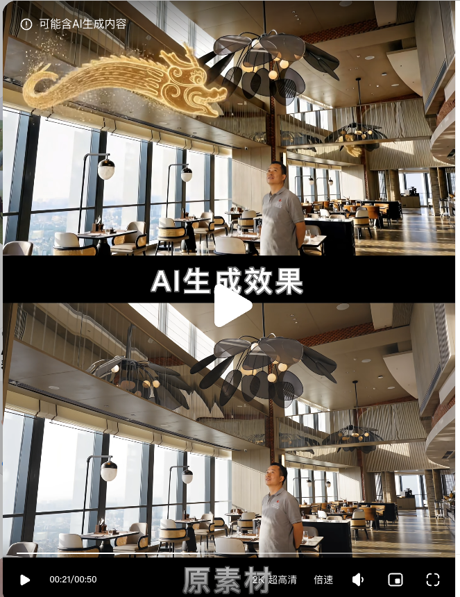

> 来源：[飞书原文](https://hcnbsg6ttb3t.feishu.cn/wiki/I8MAwr5Fqik5MPkpIUPcJsKEn2d)  
> 同步时间：2026-08-16T09:01:04.604Z  
> 文档标识：R3vMd3PM6opYcfxvfiWcyOvpn74

# 第十二节：AI 特效后期

> **提示**
>
**引入｜这节课会讲什么**
在前面完成基础生成和案例创作后，本节学习实拍素材的 AI 后期处理，包括背景替换、场景特效和穿梭转场。
- **核心内容：**实拍素材整理、AI 换背景、场景特效、穿梭转场和成片合成。
- **学完你会：**使用同一段实拍素材串联三种特效，完成一条约 20 秒的后期短片。

<table><colgroup><col/><col/><col/><col/><col/></colgroup><thead><tr><th vertical-align="top"><b>阶段</b></th><th vertical-align="top"><b>大纲</b></th><th vertical-align="top"><b>内容</b></th><th vertical-align="top"><b>截图</b></th><th vertical-align="top"><b>备注</b></th></tr></thead><tbody><tr><td vertical-align="top">课程开始</td><td vertical-align="top">引入</td><td vertical-align="top">在传统影视制作中，我们通常先完成拍摄，再进入后期。如果已经拍好一段人物或产品视频，可以在原素材上替换背景、添加场景特效和制作转场，不需要重新拍摄。这一节，我们会把三个功能串成一条约 20 秒的小片。</td><td vertical-align="top"></td><td vertical-align="top">教师口播，约 20—30 秒。</td></tr><tr><td vertical-align="top">案例演示</td><td vertical-align="top">20 秒 AI 特效后期短片</td><td vertical-align="top"><ul><li><b>原始素材</b><ul><li>一段约 20 秒的人物实拍视频，包含抬手起势和向前挥动的连续动作。</li></ul></li><li><b>片段一｜背景替换</b><ul><li>将普通拍摄场景替换为武侠竹林。</li></ul></li><li><b>片段二｜场景特效</b><ul><li>在人物动作周围加入金色剑气和粒子特效。</li></ul></li><li><b>片段三｜穿梭转场</b><ul><li>镜头跟随剑气穿梭到古城屋顶，以人物定格和标题收尾。</li></ul></li></ul></td><td vertical-align="top"></td><td vertical-align="top">三个片段使用同一人物和连续动作。</td></tr><tr><td rowspan="2" vertical-align="top">步骤一</td><td vertical-align="top">基础讲解｜AI 换背景</td><td vertical-align="top"><ul><li><b>素材准备</b><ul><li>准备人物实拍视频和目标背景。</li></ul></li><li><b>背景替换</b><ul><li>保留人物动作和镜头运动，替换原背景。</li></ul></li><li><b>边缘处理</b><ul><li>检查人物边缘、遮挡和画面连续性。</li></ul></li><li><b>效果对比</b><ul><li>对照原片与生成结果。</li></ul></li></ul></td><td vertical-align="top"></td><td vertical-align="top"><a href="https://www.xiaohongshu.com/explore/69c7af8a0000000022024e5a">案例参考</a></td></tr><tr><td vertical-align="top">案例演示｜片段一：替换武侠竹林背景</td><td vertical-align="top"><ul><li><b>原始画面</b><ul><li>人物在普通拍摄场景中抬手起势。</li></ul></li><li><b>目标画面</b><ul><li>将背景替换为武侠竹林，保留人物动作。</li></ul></li><li><b>画面检查</b><ul><li>确认人物边缘、光影方向和镜头运动自然。</li></ul></li></ul></td><td vertical-align="top"></td><td vertical-align="top">对应成片前 6 秒。</td></tr><tr><td rowspan="2" vertical-align="top">步骤二</td><td vertical-align="top">基础讲解｜场景特效</td><td vertical-align="top"><ul><li><b>特效类型</b><ul><li>建模、粒子和角色特效。</li></ul></li><li><b>主体关系</b><ul><li>让特效与人物或产品的位置匹配。</li></ul></li><li><b>画面融合</b><ul><li>统一光影、遮挡和运动方向。</li></ul></li><li><b>结果检查</b><ul><li>比较原片与特效成片的差异。</li></ul></li></ul></td><td vertical-align="top"></td><td vertical-align="top"><a href="https://www.xiaohongshu.com/explore/69d8b29d000000002302508f">案例参考</a></td></tr><tr><td vertical-align="top">案例演示｜片段二：加入武侠场景特效</td><td vertical-align="top"><ul><li><b>动作节点</b><ul><li>在人物挥手或转身的位置加入特效。</li></ul></li><li><b>特效内容</b><ul><li>加入金色剑气和粒子，并匹配人物动作方向。</li></ul></li><li><b>画面检查</b><ul><li>确认特效的光影、遮挡和运动速度自然。</li></ul></li></ul></td><td vertical-align="top"></td><td vertical-align="top">对应成片第 6—14 秒。</td></tr><tr><td rowspan="2" vertical-align="top">步骤三</td><td vertical-align="top">基础讲解｜穿梭转场</td><td vertical-align="top"><ul><li><b>起止画面</b><ul><li>明确转场前后的主体和空间。</li></ul></li><li><b>运动设计</b><ul><li>让镜头方向和主体运动保持连续。</li></ul></li><li><b>生成调整</b><ul><li>测试穿梭速度和画面变化。</li></ul></li><li><b>衔接检查</b><ul><li>检查转场前后的动作和空间连接。</li></ul></li></ul></td><td vertical-align="top"></td><td vertical-align="top"><a href="https://www.xiaohongshu.com/explore/6a24373b000000001603dc20">案例参考</a></td></tr><tr><td vertical-align="top">案例演示｜片段三：穿梭到古城屋顶</td><td vertical-align="top"><ul><li><b>转场起点</b><ul><li>镜头跟随剑气快速向前运动。</li></ul></li><li><b>转场终点</b><ul><li>穿梭到古城屋顶，人物保持连续姿态。</li></ul></li><li><b>成片合成</b><ul><li>串联三个片段，加入音乐、音效和标题，完成约 20 秒成片。</li></ul></li></ul></td><td vertical-align="top"></td><td vertical-align="top">对应成片第 14—20 秒。</td></tr></tbody></table>

## 需要的案例

以下案例待提供

| **案例名称** | **数量** | **具体要求** | **交付内容** |
|-|-|-|-|
| 20 秒 AI 特效后期短片 | 1 套 | 使用同一段约 20 秒的人物实拍素材，依次完成背景替换、场景特效和穿梭转场。三个片段需要使用同一人物和连续动作，光影、运动方向与空间衔接自然，最终合成为一条完整小片。 | 原始实拍视频、背景替换片段、场景特效片段、穿梭转场片段、完整成片、前后对比图、提示词、音乐音效及可查看的画布或项目文件。 |

## 案例参考

[附件：高清jimeng-2026-08-03-1829-使用这位帅哥的形象，生成11秒、横屏16_9、1920×1080、30帧的电影感..._1_iris3.mp4](./assets/YdUPbFhLmoqDeExZrIMcZ4man7b.mp4)

1. AI苹果发布会转场 https://v.douyin.com/TXL-Q5qpuIc/ 
2. [6种AI热门玩法！一分钟学会（附提示词） - 小红书](https://www.xiaohongshu.com/explore/6a6c7e7500000000050336dd?xsec_token=AB8pQwQ_plCcyHXZv5mRed6_Mfx6BCKoEtB83uFwBnko4=&xsec_source=pc_search)

## 本地素材清单

- [test.jpg](./assets/GWp0bRScBoqS8Wxm9UKcpiwhnCc.png)（media，942255 字节）
- [高清jimeng-2026-08-03-1829-使用这位帅哥的形象，生成11秒、横屏16_9、1920×1080、30帧的电影感..._1_iris3.mp4](./assets/YdUPbFhLmoqDeExZrIMcZ4man7b.mp4)（media，79997565 字节）
