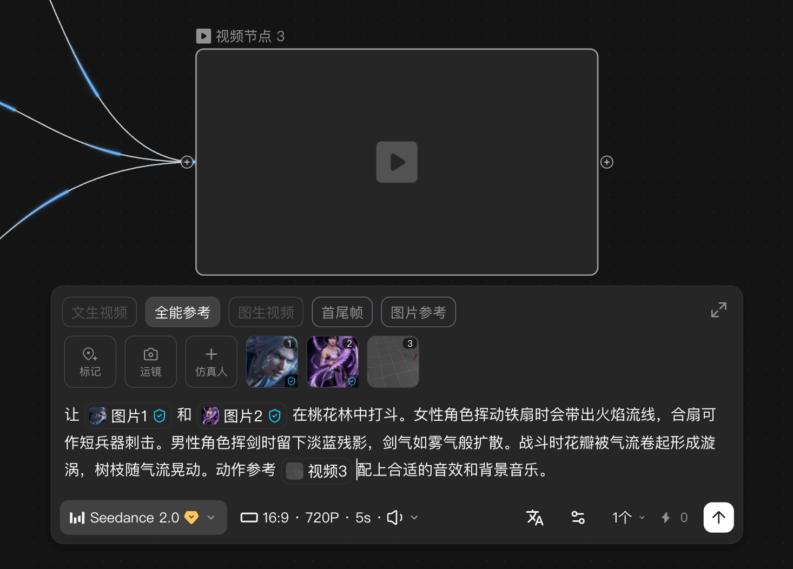
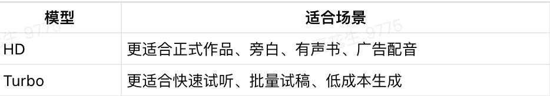

> 来源：[飞书原文](https://hcnbsg6ttb3t.feishu.cn/wiki/W9dRwCoeFioFydkcZVNc1t76nRK)  
> 同步时间：2026-08-16T09:01:04.604Z  
> 文档标识：Hw3gdHOYFoHrZGx7FsbcRdDCnvd

# 附录：LibTV 可用模型清单

## LibTV 可用模型清单（分类整理）

按图像、视频、音频和其他四类整理；原表字段、模型名称、能力说明、图片及文档引用均完整保留。来源：[LibTV使用指南](https://resonate.feishu.cn/wiki/Loxfw6XHziYRk0kKzdjcFfp9nhb)

### 图像模型

<table><colgroup><col/><col/></colgroup><thead><tr><th>模型名称</th><th>功能简述</th></tr></thead><tbody><tr><td>Lib Image 🔥</td><td><ul><li>最新最强的图像生成/编辑模型，整体能力远超 LibNavo Pro</li></ul> ✅ 跨时代的图像模型能力，真实感、物理逻辑、提示词理解、一致性保持能力全面跃升 ✅  顶级中文字符渲染能力，超长文本、超小字体稳定渲染 ✅ 版式设计 TOP 1，专业级海报、表格、PPT、 详情页轻松出 ✅ 支持4张参考图，超强一致性</td></tr><tr><td>LibNavo 2🍌</td><td><ul><li>全球顶尖的图像生成、编辑模型</li><li>与 LibNavo Pro 相比<ul><li>生成速度更快</li><li>支持 1:4 / 4:1 /  1:8 /  8:1 等极端画幅比</li><li>文本（中文）渲染更准确稳定</li><li>对物理空间信息理解更准确</li></ul></li></ul></td></tr><tr><td>LibNavo Pro 🍌</td><td><ul><li>全球顶尖的图像生成、编辑模型</li><li>支持自然语言指令，可精准完成图像增/改/删、主体/风格/场景/多角度一致性保持、细节修复、多图融合等复杂编辑任务</li><li>支持 2K/4K 高清图像直出，支持单个指令生成多张组图；支持复杂逻辑理解</li><li>画面质感自然逼真，极少出现人体细节扭曲崩坏</li></ul></td></tr><tr><td>Seedream 5.0 Lite</td><td><ul><li>与 Seedream 4.5 相比<ul><li>角色一致性更稳定</li><li>在电商、设计领域生成效果有显著优化</li><li>在空间布局推理、物理规律模拟、逻辑推演、领域知识上表现更优秀</li><li>信息可视化增强：PPT风格幻灯片、图表、菜单、数据可视化表现更好</li></ul></li></ul></td></tr><tr><td>Seedream 4.5</td><td rowspan="2"><ul><li>国产模型，对<b>中国本土</b>文化、审美、人文内容相应准确</li><li>支持自然语言指令，可精准完成图像增/改/删、<b>中文文字编辑</b>、主体/风格一致性保持、细节修复、多图融合等复杂编辑任务</li><li>支持<b>中/英文文本渲染&amp;编辑</b>，可直出海报/封面等带文字版式的图像，可响应多种艺术风格</li><li>支持 2K/4K 高清图像直出，支持单个指令生成多张组图；支持复杂逻辑理解</li><li><b>注意</b>：Seedream 4.0 有单图/组图2种模式，在出系列套图（多个表情包/Logo延展/多尺寸套图）时推荐使用组图模型，<b>其他时候推荐使用单图模式</b>。</li></ul></td></tr><tr><td>Seedream 4.0</td></tr><tr><td>Midjourney V7</td><td><ul><li>全球顶尖综合美学风格模型，海量优质艺术风格随意探索</li><li>支持 --serf 风格代码</li></ul></td></tr><tr><td>Midjourney Niji 7</td><td><ul><li>动漫/日系/东亚插画美学模型</li></ul></td></tr><tr><td>Z Image Turbo</td><td><ul><li>摄影级真实感： 擅长处理逼真的光影纹理细节，人像皮肤、光影、材质细节非常优秀，亚洲人审美特别友好</li><li>对复杂中文、文化元素、成语、诗意描述理解极强；中英文混排、复杂排版、海报文字准确率极高</li><li>智能图像编辑：能理解并精确执行复杂的语言指令，能在指定位置修改文本，并在图像大范围变换时保持字符一致性</li></ul></td></tr><tr><td>LibNavo </td><td><ul><li>支持自然语言指令，可精准完成图像增/改/删、中文文字编辑、主体/风格一致性保持、细节修复、多图融合等复杂编辑任务</li><li>支持英文文本渲染&amp;编辑，可直出海报/封面等带文字版式的图像，可响应多种艺术风格</li></ul></td></tr><tr><td>Qwen lmage</td><td><ul><li>能精准渲染<b>超长中/英文文本</b>，支持文本版式设计，可直出海报/封面等</li><li><b>Lib 独家风格库</b>，优质<u>文本渲染效果</u>稳定复现（适用范围运营海报/字体/Logo设计等）</li></ul></td></tr><tr><td>Qwen lmage Edit</td><td><ul><li>支持自然语言指令，可精准完成图像增/改/删、主体一致性保持、细节修复等任务</li><li><b>Lib 独家风格库</b></li></ul></td></tr><tr><td colspan="2">更多模型即将上线……</td></tr></tbody></table>

### 视频模型

<table><colgroup><col/><col/></colgroup><thead><tr><th>模型名称</th><th>能力简介</th></tr></thead><tbody><tr><td>Seedance 2.0🔥</td><td><b>1.模型优势</b><ul><li><b>多模态全能参考</b>：文本、图像、视频、音频<b>混合输入</b>单次最多 12 个参考文件（图像≤9 张、视频≤3 段、音频≤3 段）</li></ul><ul><li><b>智能分镜与影视级运镜</b>：可像专业导演一样自动调度画面,完成景别规划、视角切换与镜头运动设计，同步匹配音效与音乐，直出专业级视听效果</li><li><b>视频智能复刻:</b>还原参考视频或音频中的 人物动作、角色走位、分镜运镜、视觉特效与音乐风格，无论是大片级镜头语言，还是爆款运镜节奏，都能高效复现。</li><li><b>视频编辑：</b>支持元素增删改换、背景替换，以及风格、天气、颜色、材质、景别视角调整，</li><li><b>视频延展：</b>无限延展续拍与多段智能衔接</li><li>角色、场景、产品画面稳定统一，细小文字清晰呈现</li><li>物理更合理、动作更自然、理解更精准，复杂场景稳定输出</li></ul>
 <b>2.使用方法</b> Lib视频生成器： 使用方法：进入后，再做左下角切换模型能力<ul><li>Seedance 2.0 支持<u>「首尾帧」</u>和<u>「全能参考」</u>入口，智能多帧和主体参考无法选中。若你只上传首帧图 + prompt，可走首尾帧入口；<b>如需多模态（图、视频、音频、文本）组合输入，则需进入全能参考入口</b></li><li>当前支持的交互方式是通过“<b>@素材名</b>”来指定每个图片、视频、音频的用途，例如：<b>@图片1 作为首帧，@视频1 参考镜头语言，@音频1 用于配乐</b></li></ul><ol><li seq="3"><b>合规须知</b></li></ol> 目前Seedance 2.0的人像素材需要进行合规校验，审核方式见<a href="https://hcnbsg6ttb3t.feishu.cn/docx/TAfqdvYsvo1gF5x4sUDcXoYlnqc?contentTheme=DARK&amp;last_doc_message_id=7623398663818333145&amp;preview_comment_id=7623399264634276804&amp;sourceType=feed&amp;theme=light#doxcntQ6hb5aAhBCWVahcdwFGtf"><b>这里</b></a><b>。</b><ol><li><b>上传参考须知</b></li><li seq="1">图生视频-首帧、图生视频-首尾帧、多模态参考生视频(包括参考图、视频、音频)为3种互斥场景,不可混用。</li><li><b>多模态参考生视频，</b>可通过提示词指定参考图片作为首帧/尾帧,间接实现"首尾帧+多模态参考"效果。若需严格保障首尾帧和指定图片一致,优先使用图生视频-首尾帧功能</li></ol></td></tr><tr><td>HappyHorse 1.0 </td><td><b>模型能力：</b><ol><li seq="1"><b>4大模式</b>：文生、图生、参考图生成视频；视频编辑<ol><li seq="1">参考图生成视频：支持最多9张图像参考</li><li>视频编辑：包括局部编辑、风格转换等。除了文本指令，另外支持上传 1-5 张图像作为参考</li></ol></li><li><b>时长：</b>3-15s；<b>分辨率：</b>720｜1080P</li><li><b>电影级画面质感</b>：接近实拍电影级效果，尤其擅长大光圈、浅景深、强氛围感的中近景镜头，适配广告、短视频、社媒营销等专业场景。</li><li><b>智能叙事与分镜</b>：具备出色的语义理解和指令遵循能力，自动完成多镜头调度与分镜编排，切镜时机与运镜方式符合叙事逻辑。</li><li><b>强人物表现力</b>：在动作自然度、微表情刻画、对白真实感三方面显著提升。情绪递进细腻，多角色对话衔接流畅。</li><li><b>音画同步生成</b>：支持台词交锋、环境音效等音频环节前置到生成阶段，实现音画同步。</li><li><b>多风格轻松还原</b>：覆盖港风电影、复古胶片、水墨工笔、折纸、粘土定格动画等多种风格</li></ol></td></tr><tr><td>Kling O3 🔥</td><td><ul><li>支持<b>全能参考生成</b>、视频编辑任务</li><li>视频编辑：元素或背景的增加、删除和修改，以及修改视频的风格、天气、颜色、材质、景别视角等</li><li>支持视频、音频、图像混合参考生成</li></ul></td></tr><tr><td>Kling 3.0 🔥</td><td><ul><li>适用于文生、图生和首尾帧生视频任务</li><li>原生音画同步、自定义多分镜叙</li><li>提示词控制<b>说话、音效、BGM</b>等不同类型的音频效果</li></ul></td></tr><tr><td>Kling 3.0 动作迁移 🔥</td><td><ul><li>一键复刻参考图像/视频中的人物表情、口型、动作、姿势</li></ul></td></tr><tr><td>Kling O1</td><td><ul><li>多图参考生成，最多7张</li><li>视频编辑：元素或背景的增加、删除和修改，以及修改视频的风格、天气、颜色、材质、景别视角等</li></ul></td></tr><tr><td>Kling 2.6</td><td><ul><li>支持文生、图生视频、音画同步</li></ul></td></tr><tr><td>Kling 2.5</td><td><ul><li>支持文生、图生、首尾帧生视频</li></ul></td></tr><tr><td>Kling 2.1</td><td><ul><li>支持文生、图生、首尾帧生视频</li></ul></td></tr><tr><td>Shot V2 ☁️</td><td><ul><li>支持文生、图生、参考生视频；</li><li>支持上传参考图、可音画同步、智能多分镜</li><li>分辨率 720p，最长 12s</li></ul></td></tr><tr><td>Shot V2 Pro ☁️ </td><td><ul><li>分辨率 1080p，更逼真的物理运动效果</li></ul></td></tr><tr><td>Video 3.1 🍌</td><td><ul><li>支持文生、图生、首尾帧生视频；</li><li>音画同步，原生音效</li><li>智能多镜头叙事</li></ul></td></tr><tr><td>Video 3.1 Fast 🍌</td><td><ul><li>生成速度更快，成本更低</li></ul></td></tr><tr><td>Video 3 🍌</td><td><ul><li>支持文生、图生视频；基础原生音频同步</li></ul></td></tr><tr><td>Video 3 Fast 🍌</td><td><ul><li>生成速度更快，成本更低</li></ul></td></tr><tr><td>Wan 2.6</td><td><ul><li>支持文生、图生视频</li><li>支持智能多镜头、支持上传视频参考（角色&amp;语音）、音画同步、多角色对话</li></ul></td></tr><tr><td>Wan 2.5</td><td><ul><li>支持文生、图生视频</li><li>引入原生音频生成能力，支持自动配音</li></ul></td></tr><tr><td>Wan 2.2</td><td><ul><li>支持文生、图生视频</li></ul></td></tr><tr><td>Seedance1.5 Pro</td><td><ul><li>支持文生、图生、首尾帧生视频</li><li>支持音画高精同步、多人多语言对白、影视级叙事节奏</li></ul></td></tr><tr><td>Seedance 1.0 Pro</td><td><ul><li>支持文生、图生、首尾帧生视频</li></ul></td></tr><tr><td>Seedance 1.0 Lite</td><td><ul><li>生成速度快</li></ul></td></tr><tr><td>Hailuo 2.3</td><td><ul><li>支持文生、图生视频</li><li>支持动漫、插画、水墨等风格化效果</li></ul></td></tr><tr><td>Hailuo 2.3 Fast</td><td><ul><li>生成速度更快，成本更低</li></ul></td></tr><tr><td>Hailuo 02</td><td><ul><li>支持文生、图生、尾帧生视频</li></ul></td></tr><tr><td>Vidu Q3 Pro</td><td><ul><li>支持文生、图生视频，时长1-16s</li><li>支持多图参考生视频</li></ul></td></tr><tr><td>Vidu Q2 Pro</td><td><ul><li>支持文生、图生、首尾帧生视频，时长2-8s</li></ul></td></tr><tr><td>Vidu Q2 Turbo</td><td><ul><li>速度快，成本低，适合迭代测试</li></ul></td></tr><tr><td>Vidu Q2</td><td><ul><li>极速生成，最低成本</li></ul></td></tr><tr><td>Pixverse V5.5</td><td><ul><li>支持文生、图生、首尾帧生视频</li><li>支持音画同出、智能多镜头</li></ul></td></tr><tr><td>Pixverse V5</td><td><ul><li>支持文生、图生、首尾帧生视频</li></ul></td></tr><tr><td>OmniHuman 1.5</td><td><ul><li>数字人视频模型。支持根据音频，将静态人物图像变为动态数字人说话视频，可生成自然全身动作</li></ul></td></tr><tr><td>MJ Video ⛵️</td><td><ul><li>仅支持图生视频，支持生成循环动图</li><li>动态表现连贯</li></ul></td></tr></tbody></table>

### 音频模型

<table><colgroup><col/><col/></colgroup><thead><tr><th>模型名称</th><th>功能简介</th></tr></thead><tbody><tr><td>Eleven V3</td><td><ul><li>文本转语音</li></ul></td></tr><tr><td>Mureka V8 </td><td><ul><li>通过文本生成歌曲或纯音乐</li></ul></td></tr><tr><td>Minimax 2.8</td><td>[LibTV中MiniMax-Speech 2.8使用说明](https://hcnbsg6ttb3t.feishu.cn/wiki/DyQFddWftoEoOIxNcGrcTx7HnXe) Minimax Speech 2.8 hd和2.8turbo是 MiniMax 推出的新一代高表现力语音合成模型，核心优势集中在<b>极致情感表达、海量精品音色、高保真音质、强可控</b>性四大维度，全面贴近真人语音质感 。<ol><li seq="1"><b>海量精品音色</b>：内置300+专业音色，覆盖多语种、男女老少及各类风格，还支持声音克隆，满足多元配音需求。</li><li><b>丰富情绪表达：</b>可精准还原开心、温柔、严肃等多种情绪，自带呼吸、停顿、语气起伏等人声细节，真实自然。</li><li><b>高保真与强可控：</b>音质清晰细腻，支持语速、音高等细粒度调节，适配虚拟人、智能交互、内容创作等场景。</li><li><b>支持音色克隆：</b>录制对应的声音样本，就能创建专属音色。后续输入文本，即可用这个音色持续生成新的配音内容。</li></ol></td></tr></tbody></table>

### 其他模型（语言与理解）

<table><colgroup><col/><col/></colgroup><thead><tr><th>模型名称</th><th>功能简介</th></tr></thead><tbody><tr><td> CVLM5.5</td><td><ul><li>最新最强的大语言模型</li><li>支持文本、图像的解析处理</li><li>可用于生成提示词、反推提示词、生成/完善/完善故事剧情、脚本或角色设定</li></ul></td></tr><tr><td>GVLM 3.1</td><td><ul><li>多模态语言模型，支持根据文本、图像、视频、音频指令生成文本内容，适合深度推理、复杂生成人物</li><li>可用于生成提示词、反推提示词、生成/完善/完善故事剧情、脚本或角色设定</li></ul></td></tr><tr><td>GVLM 3.1 Flash</td><td><ul><li>生成速度比 Pro 更快，成本更低，适合处理简单、轻量级任务</li></ul></td></tr><tr><td>Qwen3 VL Flash</td><td><ul><li>视觉理解模型</li><li>图像理解：物体识别、场景描述、图表解析、OCR 文字识别</li><li>视频理解：支持长达 20 分钟的视频内容理解，可精确定位到秒级时刻</li><li>2D/3D 定位：具备视觉空间感知能力，可判断物体方位、视角变化、遮挡关系</li></ul></td></tr></tbody></table>

## 本地素材清单

- [image.png](./assets/NydRbUu6toQJ2NxtS7BcRFAEnmh.png)（media，56365 字节）
- [image.png](./assets/PI17b2BisoNBTqxHLhrchXqQnjg.png)（media，245063 字节）
- [image.png](./assets/LvvlbN9U4oWZG1xEncPcea6wnKd.png)（media，29163 字节）
