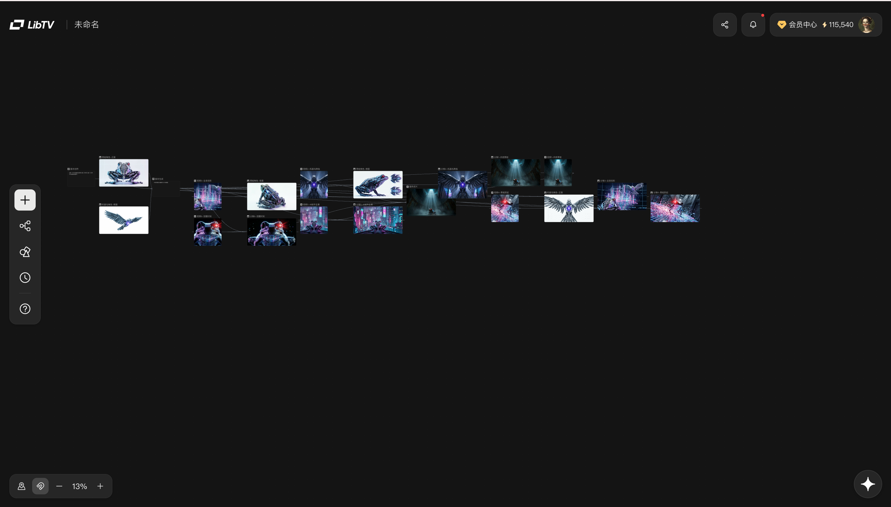
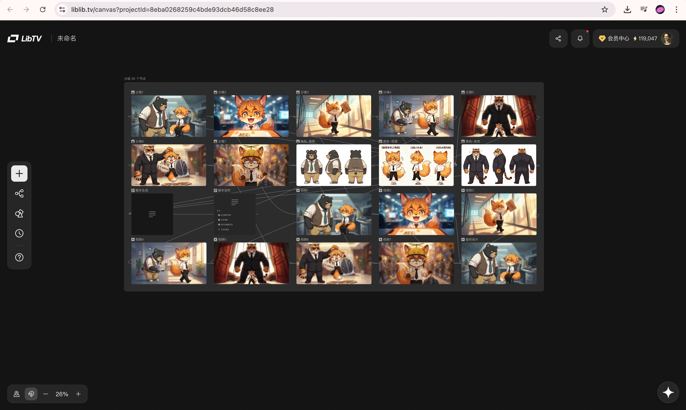
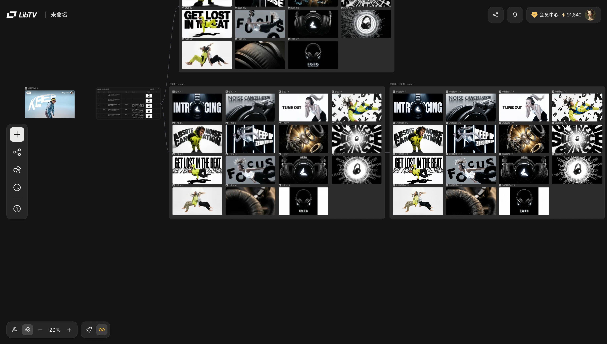
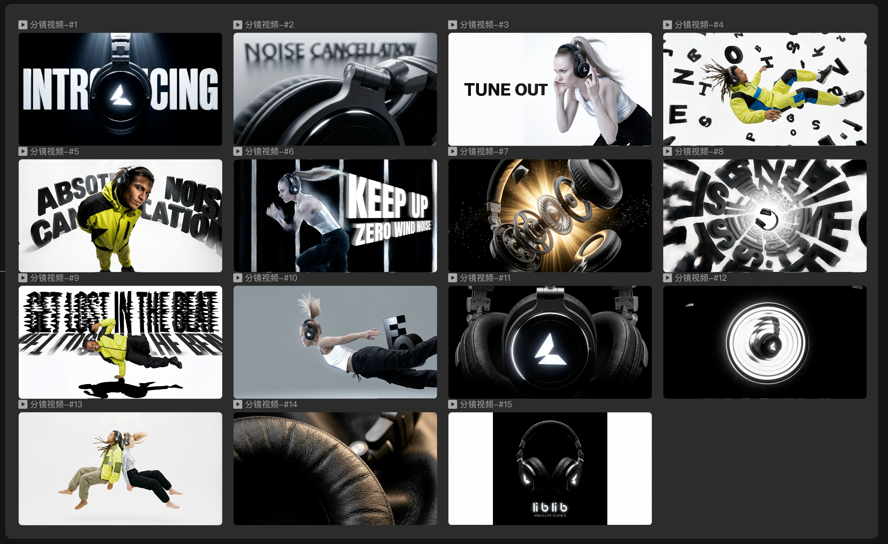
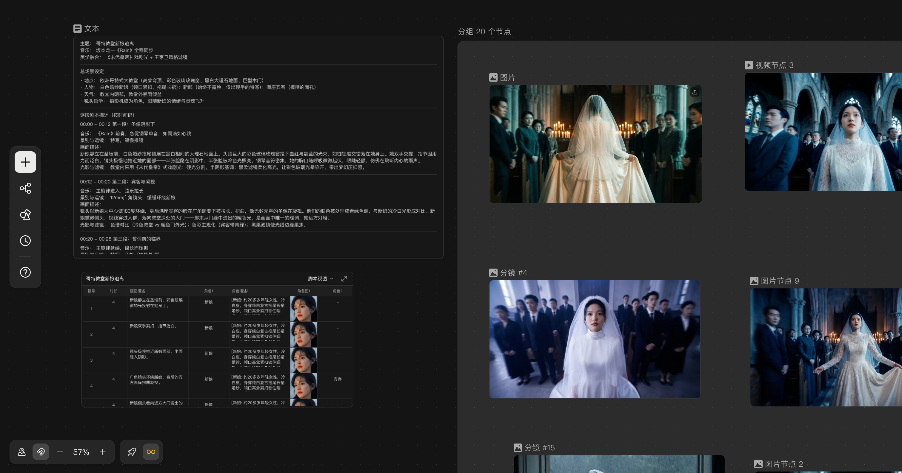

> 来源：[飞书原文](https://resonate.feishu.cn/wiki/OwYKwl4xoiywU5kklrrcAyVDn7d)  
> 同步时间：2026-08-16T09:01:04.604Z  
> 文档标识：AD5Udwlddoj4Pwx5SrGc9APtnKf

# 🔧LibTV skill  使用指南

# 新版 LibTV skill 


> **提示**
><h2>原 LibTV skill 现已升级为 LibTV CLI，请移至新页面和使用指南</h2><ul><li><a href="https://www.liblib.tv/cli">LibTV CLI 官网</a></li><li>[LibTV CLI 使用指南](https://resonate.feishu.cn/wiki/RjelwT2UoidnTMka2nCc2chGnud)</li></ul>


---

# 老版 LibTV skill

> 版本更新说明
> 
> 更新时间：**2026.4.2 00:00**
> 
> 更新信息：
> 
> - 支持skill 调用 seedance 2.0进行视频生成，支持仿真人人像生成
> - 默认视频生成为 seedance 2.0，也支持要求使用kling O3/3.0生成
> 
> ---
> 
> - 修复了无法放在画布上的问题，优化了节点放置画布的时间，支持生成中查看节点
> - 优化了无法视频编辑的问题
> - 优化了图生视频/首帧生视频不一致的问题
> 
> **更多方向skills、更稳定的能力、更惊艳的效果均在持续迭代中**  ⛽️⛽️  🫡🫡🫡🫡

## 🚀 🚀 🚀  让你的🦞开启 LibTV Skill之旅 🚀 🚀 🚀 


嗨，亲爱的创作者！欢迎加入 LibTV 的魔法世界🥳 这里有超简单的入门指南，帮你快速解锁 AI 创作新玩法！


### 🔧 第一步：搞定 OpenClaw  / 飞书插件 / KimiClaw

要开始创作，你需要先拥有以下任意一个工具：

- 本地运行的 **OpenClaw**  **【推荐】**
- 飞书官方插件版  **OpenClaw @飞书** **【推荐】**
- 或者基于 OpenClaw 规范的 **KimiClaw** 等衍生平台。

还没安装？别慌！这里有超详细的安装秘籍👇

- ✅ **飞书官方教程** ：墙裂推荐阅读《[OpenClaw 飞书官方插件上线｜一文讲清功能、安装更新教程与常见问题！](https://www.feishu.cn/content/article/7613711414611463386)》，跟着步骤一步步操作，轻松搞定 OpenClaw 本体和飞书插件安装。
- ✅ **官方安装脚本 / 文档** ：[入门指南 - OpenClaw](https://docs.openclaw.ai/zh-CN/start/getting-started)

等你完成任意一个工具的安装，就可以进入下一步的 LibTV Skill配置啦！


### 🛠️ 第二步：获取`libtv-skills`

这里有两种超便捷的安装方式，选你最爱的就好😎

1. **GitHub 直达** ：直接冲官方仓库[`libtv-labs/libtv-skills`](https://github.com/libtv-labs/libtv-skills)，里面的 README 文件有详细的`npx skills add`一键安装和手动安装教程，小白也能轻松上手！
2. **ClawHub 平台一键安装** ：打开 ClawHub Skill页[`LibTV API Skills`](https://clawhub.ai/haofanwang/libtv-skill)，跟着页面提示点一点，就能把Skill直接安装到你的 OpenClaw 环境里，简直不要太方便！


[附件：libtv-skill-v0.0.3.zip](./assets/TqSVbncFVojWVKxBldrchXJ6nac.zip)


### 📂 第三步：安装`libtv-skill`

拿到skill文件后，请解压到对应的`~/.openclaw/skills/`目录，即可调用！


### 🔑 第四步：授权登录LibTV

要让`libtv-skill`正常工作，还需要神秘密码`access_key`，跟着下面的步骤操作，轻松完成配置！


#### 🎁 获取`access_key`

- **3.18 正式发布后（全民可享）** ：直接去 [Liblib.TV](https://www.liblib.tv) 官网登录账号，把鼠标移到右上角头像，在账户 / 设置区域就能找到并复制你的`access_key`啦！


#### ⚙️ 配置`access_key`

拿到密钥后，有两种简单的配置方式任你选，配置完成则是🦞完成了LibTV的登录。

1. **对话式授权** ：直接把你的`access_key`发给 OpenClaw（比如在和 OpenClaw 的对话里按照提示操作），收到「key 已添加」的确认消息，就说明你已经完成 LibTV 登录授权。
2. **环境变量设置**：直接设置环境变量，然后重启相关进程，`libtv-skill`就会自动用这个密钥访问 LibTV 。

       输入指令 ：

```YAML
 export LIBTV_ACCESS_KEY="your-access-key"
```


*注意，创作过程使用的算力均为你的`access_key`对应的账号算力哦～ 请为skill准备充足的“口粮”*


### 🎬 第五步：开始创作【必看】

一切准备就绪，现在就可以开始创作啦！跟着下面的步骤，轻松生成精彩内容！


> **提示**
>
**重要提示❤️❤️**
- 不同的龙虾由于**部署环境**差异大，可能出现不同的情况，推荐大家尽量使用本地部署官方openclaw，或者飞书的clawbot，或其他稳定的平台
- 不同龙虾吃的**语言模型**不同**，**对skill的理解会有偏差，推荐大家使用GPT5.4、Claude 4.6、Gemini3.1、GLM5、Kimi2.5 等模型，不支持多模态理解的模型无法使用此skills。
- 一般**1分钟视频生成时长在15-30分钟**，如遇高峰时间，视频生成时间可能更长（比如1小时），建议尽量控制视频在3分钟内，因此请大家发出任务后，确认已经回答了基础问题，就可以后台等待了，待30分钟后回来验收成果。


1. **说出你的创作想法** ：在 OpenClaw 里直接发消息，比如：帮我做一个《寻秦记》的漫剧！OpenClaw 会立刻调用 LibTV 创建会话，把你的创作指令传达出去！
2. **坐等成果出炉** ：LibTV 收到指令后就会开始生成图片 / 视频，**完成后在对话中返回**：*“如果老师们遇到没有把工作流过程放在画布上，那么可以询问🦞，“请确认是否把整个生成工作流创建在了画布上？”“如果没有🦞会进行重试，或者你可以要求重新创建在画布！” 对话指令复制👉`“重试创建整个工作流放在画布”`*

   - 可以直接播放的**成片视频链接**
   - 对应的 **LibTV project链接**  点击可查看整个创作过程【 整个工作流过程需要在结果完成后进行返回 】


1. **提供参考图片/视频**

   - 如果是本地的openclaw，请把需要参考的视频/图片的路径发给openclaw
   - 如果是飞书的clawbot，请打开你的`飞书🦞`对应的应用设置，开发上传权限后，发送参考图片/视频即可

   
2. **随时追踪创作进度** ：想知道任务做到哪一步了？可以直接在对话里问：现在进度怎么样啦？或用具体的`sessionId/project ID`精准查询。Tips：要是不想干等，还可以说：「每隔 20 秒跟我汇报一次进度！」，让 Agent 实时给你反馈状。
3. **开启新的创作画布** ：默认情况下，所有任务都会在同一个 LibTV 画布项目里进行。可以直接说“开启新项目”，或者输入指令 `create_session `，新开项目将不会保留之前项目的上下文。


1. **问题排查：** 如果出现了生成任务卡住或者失败，请询问你的龙虾，给我这次生成任务的`sessionId`，拿到后可以向官方联 系和反馈。


### 🤩 效果showcase 

<table><colgroup><col/><col/><col/><col/></colgroup><thead><tr><th><b>类别</b></th><th>Case </th><th>输入信息</th><th>结果展示</th></tr></thead><tbody><tr><td>短漫剧Skill </td><td>动画短片<br/>《赛博青蛙》</td><td>给我一个30秒的漫剧，讲述《井底之蛙》ai版</td><td>项目链接：<br/>https://www.liblib.tv/detail/8be596b0f6d34fffa3a6fcd77bce006c<br/>成片展示
[附件：最终成片.mp4](./assets/KX52blrcko0VGAxNMHFcw1XxnRb.mp4)
</td></tr><tr><td>短漫剧Skill </td><td>动画短片<br/>《狐假虎威》</td><td>给我一个30秒的漫剧，讲述《狐假虎威》打工人版</td><td>项目链接<br/>https://www.liblib.tv/detail/3cfcb3b26df74b8a920886bd52641452<br/>成片展示
[附件：最终成片 (2).mp4](./assets/Yzm8bhKBRoU0hhx3NWScCzwRn3e.mp4)
</td></tr><tr><td>爆款视频复刻Skill </td><td>产品广告片复刻</td><td>Prompt ：能复刻这个视频,给我的产品Lib耳机做一个宣传片吗?
[附件：01e6a744039bde420103760390fd8558b1_4610.mp4video.MP4](./assets/VJ4Vb4EI3omm9Jx3pbLcXMqJnQY.mp4)

[附件：图片节点 4.png](./assets/GpVmbea29oMF1uxqIn3cqScbnTg.png)
</td><td>项目链接：https://www.liblib.tv/projectDetail/739f9a645b51415ab5fbeeb7c39a4a19<br/><b>视频成片：</b>
[附件：3月16日.mp4](./assets/YZCbbKVNqoDQgOxYcafcYxJZnGe.mp4)
</td></tr><tr><td>音乐MV生成<br/><em>（还未完全稳定，调试中）</em></td><td>音乐MV</td><td>Prompt ：根据坂本龙一《Rain》音乐，做一个MV视频</td><td>项目链接：https://www.liblib.tv/projectDetail/2c2f0d125c594fad9ae6eca538861bdb<br/>视频成片：
[附件：81e9a1f74b4bce5f316df352264bfe6fc0eb960a.MP4](./assets/E1qSbFhOjoizq9xM4M9cEwScnOe.mp4)
<br/><em>「case来源@作者：Fine」</em></td></tr><tr><td><em>More（coming soon）</em></td><td></td><td></td><td></td></tr></tbody></table>


### ❓ 常见问题大揭秘！

1. **模型调用失败了怎么办？**

   - 有些模型只对 LibTV 会员开放，建议优先使用会员账号绑定的`access_key`；
   - 也有可能是模型厂商那边不稳定，LibTV 会自动重试；如果多次失败，别急，过一会儿再试试说不定就好了！
2. **算力怎么扣？失败了会浪费吗？**

   - 调用模型用的是你提供的`access_key`对应 LibTV 账号的算力；
   - 失败的任务不会扣除算力，要是出现误扣，系统也会自动返还给你，完全不用担心！
3. **生成结果出来了，但是没有放在画布上怎么办？**

   - 直接和龙虾说“把全部工作流和结果都放在画布上”
   - 由于不同模型能力差异，也建议自查龙虾的基础模型。推荐使用更强的模型见上方模型推荐。
4. 放在画布上了，但是只有空节点怎么办

   - 直接和龙虾说“你的节点是空的，重新创建工作流，要把结果也放到节点里”


### 💬 联系我们

**更多问题，前往liblib.TV 联系我们，或加入用户交流群**


## 本地素材清单

- [image.png](./assets/Rtlubht5SoQMbbxpMExcCovQnCd.png)（media，2257447 字节）
- [image.png](./assets/LOjubQxzZom1Tjxg3IQcXzg8n4c.png)（media，368330 字节）
- [img_v3_02vs_f3d425ee-53a5-405a-8945-70ac7f68f8bg.jpg](./assets/Ql8ybiuxJoshZcxWqTSchjQUnEe.jpg)（media，329788 字节）
- [image.png](./assets/EIrObuil4o11P2x6QX7cppDlnrf.png)（media，790428 字节）
- [image.png](./assets/QdAFbfR81oZVa7xCx7TcAFQfnVh.png)（media，2418858 字节）
- [image.png](./assets/DKkzbSRhBoRP6DxHmn3cxHFGnEh.png)（media，2074908 字节）
- [image.png](./assets/S4r2bJ3nMoQ1SjxgX2BcHnbanDg.png)（media，3147795 字节）
- [image.png](./assets/IsSAbiHtSoYxr5x8iDOcNuqZnQj.png)（media，2202692 字节）
- [image.png](./assets/PUYnbl7hxoqz6ix0hr2cOnaCnwf.png)（media，23848 字节）
- [libtv-skill-v0.0.3.zip](./assets/TqSVbncFVojWVKxBldrchXJ6nac.zip)（media，13958 字节）
- [最终成片.mp4](./assets/KX52blrcko0VGAxNMHFcw1XxnRb.mp4)（media，37230036 字节）
- [最终成片 (2).mp4](./assets/Yzm8bhKBRoU0hhx3NWScCzwRn3e.mp4)（media，11534066 字节）
- [01e6a744039bde420103760390fd8558b1_4610.mp4video.MP4](./assets/VJ4Vb4EI3omm9Jx3pbLcXMqJnQY.mp4)（media，5823176 字节）
- [图片节点 4.png](./assets/GpVmbea29oMF1uxqIn3cqScbnTg.png)（media，3642853 字节）
- [3月16日.mp4](./assets/YZCbbKVNqoDQgOxYcafcYxJZnGe.mp4)（media，63697134 字节）
- [81e9a1f74b4bce5f316df352264bfe6fc0eb960a.MP4](./assets/E1qSbFhOjoizq9xM4M9cEwScnOe.mp4)（media，143923394 字节）
